> **الهدف من الـ Section ده:**
> تفهم الـ fundamentals قبل ما تأمّن أي system — تبدأ رحلتك في Cybersecurity، وتستوعب إن الـ Security مش بس technology بل mindset وثقافة وسياسة.
---

## Table of Contents

- [1. The Big Picture — How Everything Connects](#1-the-big-picture--how-everything-connects)
- [2. CIA Triad](#2-cia-triad)
  - [2.1 Confidentiality](#21-confidentiality)
  - [2.2 Integrity](#22-integrity)
  - [2.3 Availability](#23-availability)
  - [2.4 CIA في الواقع — مش كل عنصر بنفس الأهمية](#24-cia-في-الواقع--مش-كل-عنصر-بنفس-الأهمية)
- [3. AAA Framework](#3-aaa-framework)
  - [3.1 Authentication](#31-authentication)
  - [3.2 Authorization](#32-authorization)
  - [3.3 Accounting](#33-accounting)
- [4. PPT — Policy, Procedure & Training](#4-ppt--policy-procedure--training)
- [5. كيف الـ CIA و AAA و PPT بيكملوا بعض](#5-كيف-الـ-cia-و-aaa-و-ppt-بيكملوا-بعض)
- [6. Least Privilege Principle](#6-least-privilege-principle)
- [7. Authentication — التفاصيل](#7-authentication--التفاصيل)
  - [7.1 Authentication Factors](#71-authentication-factors)
  - [7.2 Strong Passwords](#72-strong-passwords)
  - [7.3 Account Lockout](#73-account-lockout)
- [8. Authorization — التفاصيل](#8-authorization--التفاصيل)
  - [8.1 Discretionary Access Control (DAC)](#81-discretionary-access-control-dac)
  - [8.2 Role-Based Access Control (RBAC)](#82-role-based-access-control-rbac)
  - [8.3 DAC vs RBAC — مقارنة](#83-dac-vs-rbac--مقارنة)
- [9. Accounting — Logging & Auditing](#9-accounting--logging--auditing)
- [10. Exercises — تدريبات عملية](#10-exercises--تدريبات-عملية)

---

## 1. The Big Picture — How Everything Connects

قبل ما تغوص في التفاصيل، لازم تفهم إن الـ Cybersecurity مش مجرد أدوات أو أوامر — ده **طريقة تفكير**. كل حاجة بتتعلمها في التك ممكن تساعدك هنا.

الـ Framework العام اللي هنشتغل بيه النهارده بيتكون من 3 طبقات:

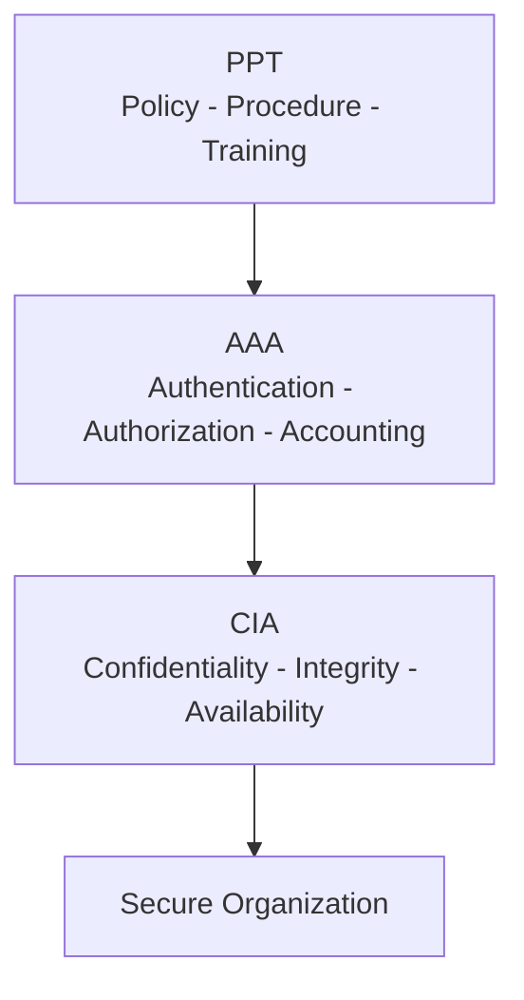

> [!IMPORTANT]
> الـ PPT هو الأساس — من غيره الـ AAA مش هيتطبق صح، ومن غير AAA الـ CIA هتبقى مجرد أهداف على ورق.

---

## 2. CIA Triad

الـ **CIA Triad** هو الإطار الأساسي في الـ Information Security. كل قرار أمني بتاخده المفروض يخدم واحد أو أكتر من العناصر دي.

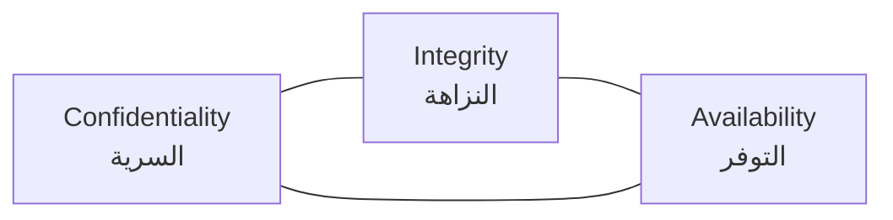

---

### 2.1 Confidentiality

**التعريف:** إن المعلومة متوصلش إلا للناس المصرح ليهم يشوفوها.

**السؤال البسيط:** مين يقدر يقرأ الملف ده؟

**مثال عملي:**
- شركة أدوية عندها فورمولا دواء بمليارات — لو حد تاني حصل عليه، خلص.
- الحل: **Encryption** — بتحول البيانات لشكل مش مقروء إلا بالـ Key الصح.

**التقنيات اللي بتدعم الـ Confidentiality:**

| التقنية | وظيفتها |
|---|---|
| Encryption (AES, RSA) | تشفير البيانات أثناء التخزين أو النقل |
| Access Control Lists (ACL) | تحديد مين يقدر يوصل لإيه |
| VPN | تشفير الاتصال على الشبكة |
| Data Classification | تصنيف البيانات حسب درجة سريتها |

> [!NOTE]
> في 2017، شركة AbbVie حققت **18.43 مليار دولار** من بيع دواء Humira وحده. لو الـ Formula اتسرقت، الخسارة كانت هتبقى كارثية — ده معناه إن الـ Confidentiality أهم حاجة ليهم.

---

### 2.2 Integrity

**التعريف:** إن البيانات دقيقة وما تمش تعديلها إلا من الأشخاص المصرح ليهم.

**السؤال البسيط:** مين يقدر يكتب على الملف ده ويعدله؟

**مثال عملي:**
- تخيل إن رصيدك في البنك اتبقى **1.27 دولار** بدل **1,000,000 دولار** — حتى لو حصل مرة واحدة، الثقة في النظام كلها بتانهار.

**التقنيات اللي بتدعم الـ Integrity:**

| التقنية | وظيفتها |
|---|---|
| Checksums & Hashing (MD5, SHA-256) | كشف أي تعديل غير مصرح |
| Digital Signatures | التحقق من هوية المرسل وسلامة البيانات |
| Version Control | تتبع التغييرات على الملفات |
| Write Protection | منع التعديل على ملفات معينة |

> [!WARNING]
> الـ Integrity مش بس عن منع الـ Hackers — أحياناً الخطر بييجي من داخل الشركة (Insider Threat). موظف بيعدّل رواتب مثلاً.

---

### 2.3 Availability

**التعريف:** إن الأنظمة والبيانات متاحة وشغالة وقت ما تحتاجها.

**السؤال البسيط:** هل الملف موجود ومتاح وقت ما حد يحتاجه؟

**مثال عملي:**
- شركة خسرت **232 مليار دولار** في 2018 بسبب downtime. ده بيوضح إن الـ Availability مش رفاهية.
- هجمات الـ **Ransomware** بتهاجم الـ Availability — بتشفر ملفاتك وتمنعك من الوصول ليها.

**التقنيات اللي بتدعم الـ Availability:**

| التقنية | وظيفتها |
|---|---|
| Backups & DR Sites | استرجاع البيانات بعد الكوارث |
| Load Balancing | توزيع الحمل على أكتر من Server |
| Redundancy | تكرار الأنظمة الحيوية |
| Anti-DDoS Solutions | صد هجمات التعطيل الموزعة |
| Anti-Ransomware | منع تشفير الملفات من المهاجمين |

---

### 2.4 CIA في الواقع — مش كل عنصر بنفس الأهمية

> [!IMPORTANT]
> الـ CIA Triad مش معناه إن الثلاثة بنفس الأولوية لكل شركة — بيختلف حسب طبيعة الأعمال.

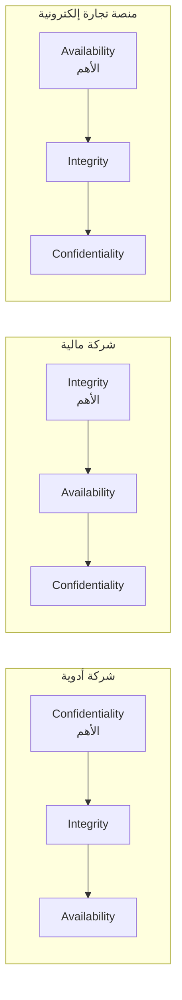

| القطاع | العنصر الأهم | السبب |
|---|---|---|
| صناعة الأدوية | Confidentiality | براءات الاختراع والفورميولات السرية |
| البنوك والمال | Integrity | دقة الأرقام المالية فوق كل اعتبار |
| التجارة الإلكترونية | Availability | توقف الموقع = خسارة مباشرة في المبيعات |

---

## 3. AAA Framework

الـ **AAA** هو الآلية العملية اللي بتحقق الـ CIA. ببساطة: إزاي بنتأكد مين اللي بيوصل للسيستم وإيه اللي بيعمله؟

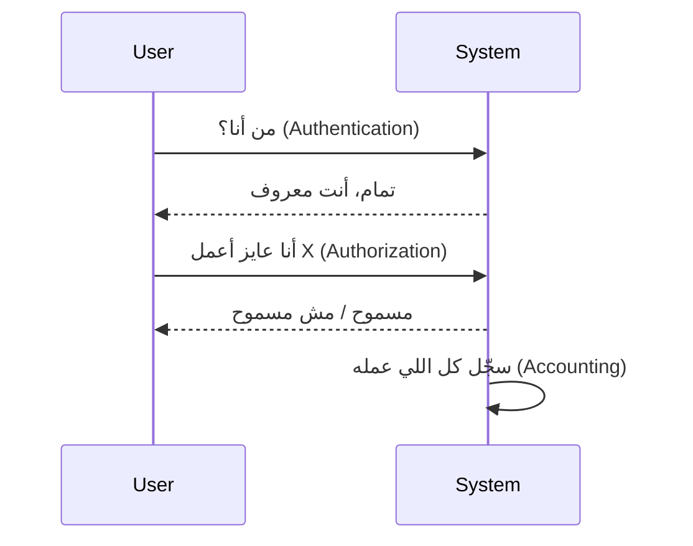

---

### 3.1 Authentication

**السؤال:** من أنت؟ وهل أنت فعلاً اللي بتقول إنك عليه؟

الـ Authentication هو أول خط دفاع — بيتأكد من هوية المستخدم قبل ما يدخل أي حاجة.

**مثال:** Username + Password عند الـ Login، أو الـ MFA (Multi-Factor Authentication).

---

### 3.2 Authorization

**السؤال:** إيه اللي مسموح ليك تعمله؟

بعد ما اتأكدنا منك، بنحدد صلاحياتك — إيه اللي تقدر تقراه، تعدله، تحذفه.

**مثال:** موظف يقدر يقرأ الملفات بس مش يحذفها. المحاسب يوصل لأنظمة المحاسبة بس مش لأنظمة الـ HR.

---

### 3.3 Accounting

**السؤال:** إيه اللي عمله بالظبط بعد ما دخل؟

الـ Accounting هو تسجيل ومتابعة كل نشاط — مش بس للأمن، لكن كمان للـ Troubleshooting والـ Compliance.

**مثال:** تسجيل وقت الـ Login، الملفات اللي اتفتحت، الأوامر اللي اتنفذت.

---

## 4. PPT — Policy, Procedure & Training

الـ PPT هو الأساس الإداري اللي بيخلي الـ AAA يتطبق صح. من غير PPT، الـ Security بيبقى عشوائي.

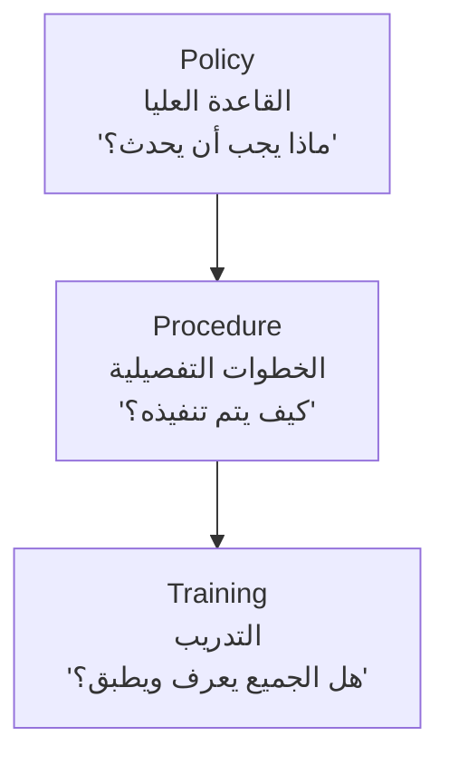

| العنصر | التعريف | مثال |
|---|---|---|
| **Policy** | القواعد العامة على المستوى العالي | "يجب على المستخدمين استخدام كلمات مرور قوية وتغييرها كل 90 يوم" |
| **Procedure** | الخطوات التفصيلية لتطبيق الـ Policy | "خطوات إعادة تعيين كلمة المرور بشكل آمن عبر IT Helpdesk" |
| **Training** | تأكيد إن الناس فاهمة وعارفة تطبق | "دورة توعية شهرية عن الـ Phishing وكيفية اكتشافه" |

> [!IMPORTANT]
> ممكن تكتب أحسن Policy في العالم — لو محدش عارف بيها، مش هتفيد بحاجة. الـ Training هو اللي بيحول الـ Policy من ورق لواقع.

> [!TIP]
> الـ Training مش بس محاضرات — Simulated Phishing Campaigns من أفضل طرق التدريب العملي. بتبعت إيميلات وهمية وبتشوف مين هيوقع فيها.

---

## 5. كيف الـ CIA و AAA و PPT بيكملوا بعض

ده مش ثلاث حاجات مستقلة — ده نظام واحد متكامل.

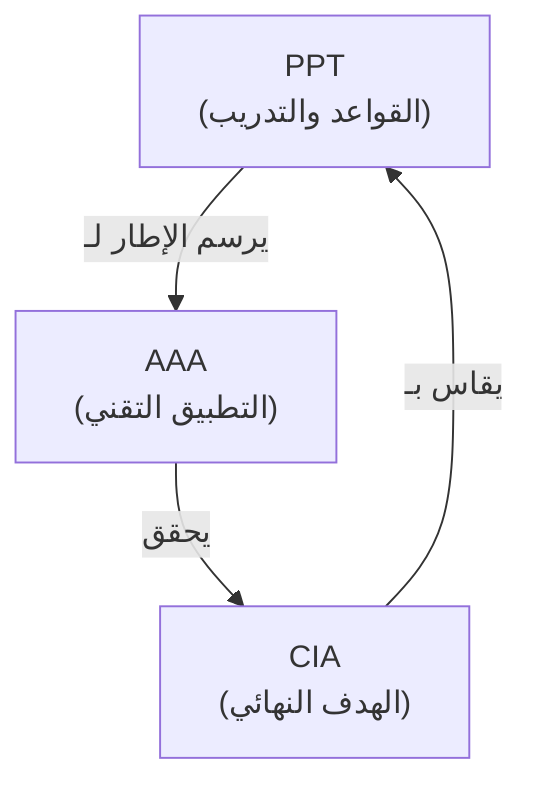

**المعادلة:**
- **PPT** بيرسم الإطار: "إيه القواعد؟"
- **AAA** بيطبق: "مين يدخل وبيعمل إيه وبنسجل إيه؟"
- **CIA** هو الهدف: "البيانات سرية، صحيحة، ومتاحة"

> [!NOTE]
> الـ Cybersecurity مش بتخص مهارة واحدة — كل حاجة بتتعلمها في التك (Networking, Programming, Systems Admin) ممكن تتحول لسلاح في يدك كـ Security Engineer.

---

## 6. Least Privilege Principle

**التعريف:** كل شخص يأخد **بس** الصلاحيات اللي محتاجها لشغله — ولا حاجة زيادة.

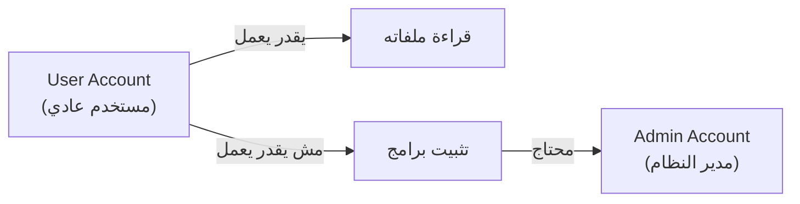

**ليه مهم؟**

| السيناريو | بدون Least Privilege | مع Least Privilege |
|---|---|---|
| موظف اتهاكت أكانته | المهاجم يوصل لكل السيستم | المهاجم يوصل لملفات الموظف بس |
| موظف غلط | ممكن يحذف بيانات حساسة بالغلط | مش عنده صلاحية الحذف أصلاً |
| Developer في Production | ممكن يعمل تغييرات غير مقصودة | عنده access على بيئة الـ Testing بس |

> [!WARNING]
> الـ Admin Accounts هي الأهم والأخطر — لازم تكون محدودة ومحمية بشدة. Admin عنده صلاحية يعمل أي حاجة على السيستم.

> [!TIP]
> الـ Best Practice: حتى الـ Admins مش المفروض يشتغلوا بـ Admin Account طول الوقت. يشتغلوا بـ User Account عادي، وبس لما يحتاجوا يعملوا حاجة Admin يرفعوا الصلاحيات مؤقتاً (Privilege Escalation بشكل مؤمّن).

---

## 7. Authentication — التفاصيل

### 7.1 Authentication Factors

الـ Authentication بيعتمد على عوامل مختلفة — وكل عامل بيمثل **نوع مختلف من الدليل** على هويتك.

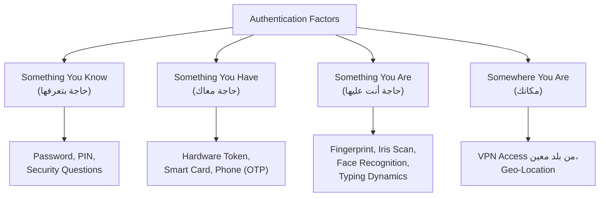

| الـ Factor | أمثلة | نقطة الضعف |
|---|---|---|
| Something You Know | Password, PIN | ممكن يتسرق أو يتنسى |
| Something You Have | OTP على الموبايل، Hardware Key | ممكن يتسرق أو يتفقد |
| Something You Are | Fingerprint, Face ID | صعب يتزور، لكن مش مستحيل |
| Somewhere You Are | IP/Location Restriction | ممكن يتضلل بـ VPN |

> [!IMPORTANT]
> الـ **Multi-Factor Authentication (MFA)** هو الجمع بين أكتر من Factor — مثلاً Password (Know) + OTP على الموبايل (Have). ده بيزود الأمان بشكل كبير جداً لأن المهاجم لازم يكسر أكتر من حاجة.

> [!NOTE]
> الـ **Typing Dynamics** و **Gait Analysis** (طريقة مشيتك) هم أمثلة على Behavioral Biometrics — السيستم بيتعرف عليك من طريقة تصرفك حتى لو مش عارف. ده اللي الـ Lecture بيشير ليه بـ "Important Note".

---

### 7.2 Strong Passwords

الهدف: تخلي عملية الـ **Brute Force** مكلفة جداً من ناحية الوقت.

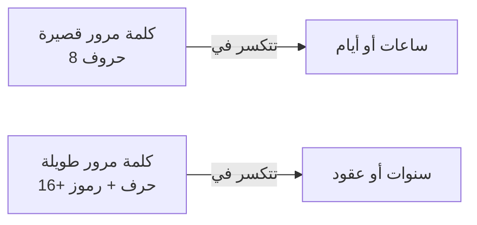

**قواعد الـ Strong Password:**

- ✅ طويلة (16+ حرف)
- ✅ تحتوي على Uppercase, Lowercase, Numbers, Special Characters
- ✅ مش فيها معلومات شخصية (اسمك، تاريخ ميلادك)
- ✅ مختلفة لكل حساب
- ❌ متشارهاش مع حد (حتى مع IT!)

> [!WARNING]
> الـ **Quantum Computing** هو التهديد القادم — الكمبيوترات الكمومية ممكن تكسر التشفير الحالي بشكل أسرع بكتير. ده بيخلي المجال كله بيفكر في **Post-Quantum Cryptography**.

> [!TIP]
> استخدم **Password Manager** موثوق (مثل Bitwarden أو 1Password) بدل ما تكتب كلمات المرور في ملف نص أو على ورقة. الـ Password Manager بيشفر كل حاجة وبيولدلك كلمات مرور قوية.

---

### 7.3 Account Lockout

الـ **Account Lockout** هو آلية بتقفل الأكانت تلقائياً لو في محاولات دخول فاشلة كتير — بيحمي من هجمات الـ **Brute Force**.

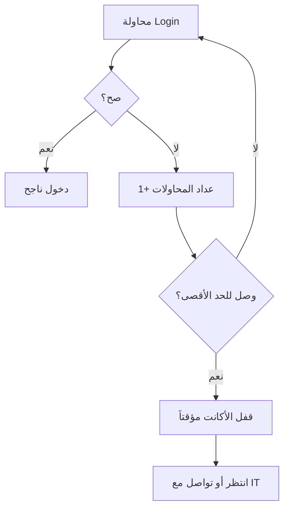

**التوازن المطلوب:**

| إعداد | الخطر |
|---|---|
| عدد محاولات قليل جداً (مثلاً 3) | موظفين بيتقفلوا بسهولة — Denial of Service على نفسك |
| عدد محاولات كتير جداً (مثلاً 100) | بيسمح لـ Brute Force يشتغل |
| وقت قفل طويل جداً | المستخدم يتعطل عن شغله |

> [!NOTE]
> رؤية **40 محاولة دخول فاشلة في دقيقة واحدة** في الـ Logs هي مؤشر واضح إن فيه **Online Brute Force Tool** بيشتغل ضد الأكانت.

---

## 8. Authorization — التفاصيل

بعد الـ Authentication، السؤال بيبقى: إيه اللي مسموح ليه يعمله؟

### 8.1 Discretionary Access Control (DAC)

**التعريف:** صاحب الـ Resource (ملف، مجلد، بيانات) هو اللي بيقرر مين يقدر يوصله وبيعمل إيه.

**ليه اسمه "Discretionary"؟** لأن قرار الـ Permission بيبقى في يد صاحب الـ Resource — مش في يد الـ Admin المركزي.

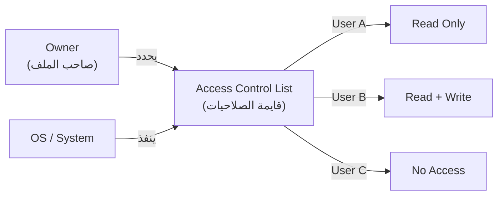

**مثال عملي (Windows/Linux):**
- لما بتعمل ملف على ويندوز أو لينكس، أنت تلقائياً بتبقى الـ Owner.
- تقدر تديه للآخرين صلاحية Read, Write, Execute أو تمنعهم خالص.

> [!NOTE]
> الـ DAC هو الـ Default في أغلب أنظمة التشغيل — Windows و Linux بيشتغلوا بيه بشكل أساسي.

---

### 8.2 Role-Based Access Control (RBAC)

**التعريف:** الصلاحيات بتتحدد حسب **الوظيفة (Role)** مش حسب الشخص — الـ Admin بيعمل Roles ويحط فيها Permissions، وبعدين بيحط المستخدمين في الـ Roles دي.

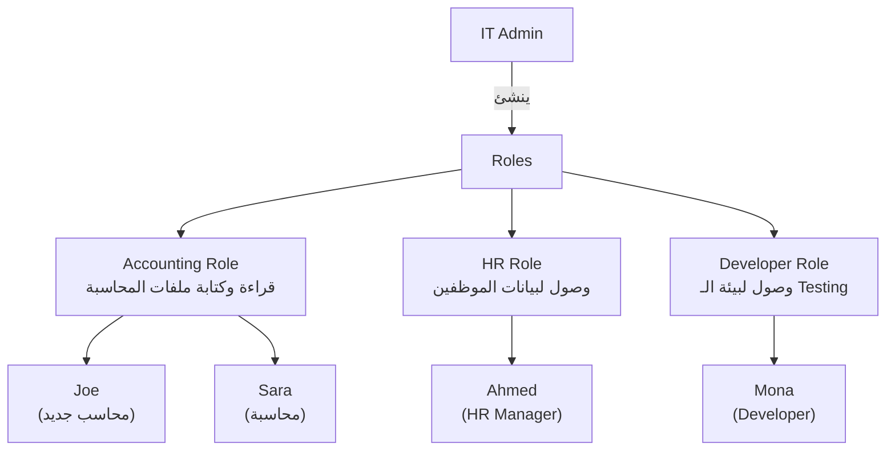

**مثال من الـ Lecture:**
> Joe بييجي يشتغل في الشركة في قسم المحاسبة → الـ Admin بيعمل أكانت باسم `joe` → بيحطه في الـ `Accounting Group` → تلقائياً Joe بيورّث كل صلاحيات الـ Group دي.

**إيه المميزات؟**
- لما موظف بيجي جديد: بس تحطه في الـ Role المناسبة.
- لما موظف بيمشي: بس تشيله من الـ Role — كل الصلاحيات بتتلغي.
- مفيد جداً في الشركات اللي فيها **turnover عالي**.

---

### 8.3 DAC vs RBAC — مقارنة

| المعيار | DAC | RBAC |
|---|---|---|
| **مين بيتحكم في الصلاحيات** | صاحب الـ Resource | الـ Admin المركزي |
| **مناسب لـ** | بيئات صغيرة، ملفات شخصية | شركات كبيرة، فرق عمل |
| **سهولة الإدارة** | صعب في الحجم الكبير | سهل وقابل للتوسع |
| **Least Privilege** | صعب تطبيقه بدقة | أسهل، لكن مش مضمون |
| **مثال** | Windows File Permissions | Active Directory Groups |

> [!WARNING]
> **عيب الـ RBAC:** لو Role فيها صلاحيات واسعة أكتر من اللازم، كل موظف في الـ Role دي هيورّث الصلاحيات الزيادة دي — ده بيخالف مبدأ الـ **Least Privilege**. مجرد إن Joe في الـ Accounting Group، ده مش معناه إنه المفروض يوصل لكل ملفات المحاسبة.

---

## 9. Accounting — Logging & Auditing

الـ **Accounting** في الـ Cybersecurity هو تسجيل كل النشاطات المهمة على السيستم — مش بس للأمن، لكن للـ Troubleshooting والـ Compliance كمان.

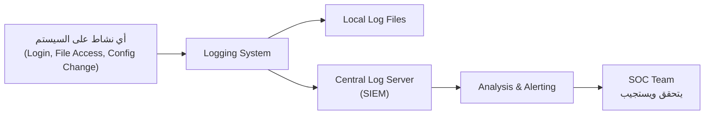

**إيه اللي المفروض تسجله؟**

| نوع النشاط | أهميته |
|---|---|
| Admin Activity | عالية جداً — التغييرات الحساسة |
| Login / Logout Events | عالية — رصد الدخول غير المصرح |
| Failed Login Attempts | عالية — كشف الـ Brute Force |
| File Access & Modification | متوسطة-عالية — Data Leakage |
| System Configuration Changes | عالية جداً — كشف الـ Tampering |

> [!IMPORTANT]
> **"You can't define the abnormal if you don't know the normal."**
> لازم تعرف السلوك الطبيعي على شبكتك وأنظمتك عشان تقدر تكتشف الشاذ. لو مش عارف إن موظف عادةً بيلوج إن الساعة 9 الصبح، هتعرف تكشف إنه لوّج إن الساعة 3 الصبح؟

**SIEM Solutions:**

الـ **SIEM (Security Information and Event Management)** هو منصة بتجمع كل الـ Logs من كل الأجهزة وبتحللها وبتطلع Alerts.

- **Splunk** — من أشهر الـ SIEM Solutions
- **LogRhythm** — بديل شائع في المؤسسات الكبيرة
- **Microsoft Sentinel** — Cloud-based SIEM

**تحديات الـ Logging:**

| التحدي | التفاصيل |
|---|---|
| التخزين | الشركات الكبيرة بتولد Logs بمئات الـ GB يومياً |
| فترة الاحتفاظ | قانونياً ممكن تكون محتاج تحتفظ بـ Logs لسنوات |
| Local vs Central | الـ Local Logs سهل يتعبث فيها — الـ Centralized أأمن |

> [!TIP]
> الـ Logs اللي على نفس الجهاز ممكن يمسحها المهاجم بعد ما يدخل. عشان كده، الـ Best Practice هو إرسال الـ Logs فوراً لـ **Central Log Server** أو **SIEM** بعيد عن الجهاز المخترق.

---

## 10. Exercises — تدريبات عملية

### Exercise 1 — VPN & AAA Framework

> **السيناريو:** شركتك بتستخدم VPN للموظفين اللي بيشتغلوا من البيت. اشرح إزاي الـ AAA بيشتغل لما موظف يلوج إن من البيت.

**الأسئلة:**
1. إيه أفضل Authentication Module هنا؟
2. إيه البيانات اللي المفروض تظهر في الـ Accounting Logs للـ Session دي؟

---

**الإجابة المقترحة:**

**Authentication — من أنت؟**

أفضل Authentication Module هو **MFA (Multi-Factor Authentication)** يجمع:
- **Username + Password** — Something You Know
- **OTP على الموبايل أو Hardware Token** — Something You Have
- **(اختياري) Certificate-Based Authentication** للـ Devices

بمجرد ما الـ VPN Client بيتصل، بيبعت الـ Credentials للـ VPN Server اللي بيتحقق منها مع الـ Identity Provider (مثل Active Directory).

**Authorization — مسموح بإيه؟**

بعد الـ Authentication، الـ VPN بيحدد:
- الموظف ده يقدر يوصل لأنهي Resources؟
- مثلاً: الـ Developer يوصل لـ Dev Servers بس، مش لـ HR Systems.
- بيتم ده عن طريق **RBAC Groups** على الـ VPN.

**Accounting — بنسجل إيه؟**

```
[2025-01-15 09:03:22] USER: john.doe | ACTION: VPN_CONNECT | IP: 197.x.x.x | LOCATION: Cairo, EG
[2025-01-15 09:03:22] USER: john.doe | MFA: SUCCESS | METHOD: TOTP
[2025-01-15 09:03:23] USER: john.doe | ASSIGNED_IP: 10.10.5.42 | ROLE: Developer
[2025-01-15 09:15:44] USER: john.doe | RESOURCE_ACCESS: dev-server-01 | ACTION: SSH_LOGIN
[2025-01-15 17:30:11] USER: john.doe | ACTION: VPN_DISCONNECT | SESSION_DURATION: 8h27m
```

---

### Exercise 2 — Password Sharing Incident

> **السيناريو:** اكتشف الـ Team إن موظفين بيشاركوا كلمات مرورهم عن طريق الإيميل.

**الأسئلة:**
1. إيه الـ Policy المناسبة؟
2. إيه الـ Procedure اللي المفروض يتاتبع؟
3. إزاي هتدرب الموظفين؟
4. امتى مش هتبقى مسؤولية الموظف؟

---

**الإجابة المقترحة:**

**Policy:**
- يُحظر تماماً مشاركة كلمات المرور بأي وسيلة (إيميل، واتساب، ورقة).
- كل مستخدم مسؤول مسؤولية كاملة عن أي نشاط يحصل تحت أكانته.
- المخالفة ليها عواقب إدارية واضحة ومكتوبة.

**Procedure:**
1. الـ IT يعمل **Mandatory Password Reset** لكل الأكانتات المتأثرة فوراً.
2. يتم **Audit** لكل الـ Logs خلال الفترة الماضية لكشف أي وصول غير مصرح.
3. يتم تفعيل **MFA** على كل الأكانتات لمنع الاعتماد على الـ Password وحده.
4. يتم توثيق الإنذار في ملف الموظف.

**Training:**
- ورشة عمل قصيرة عن مخاطر مشاركة كلمات المرور مع أمثلة حقيقية.
- تدريب على استخدام **Password Manager** مؤسسي.
- **Simulated Phishing** لكشف مين لسه بيشارك بيانات حساسة.
- تأكيد إن فيه **Secure Channel** (مثل Password Manager) لو محتاج تشارك Access بشكل رسمي.

**امتى مش مسؤولية الموظف؟**

> [!NOTE]
> لو الشركة نفسها مش مشترطة الـ MFA، ومش معملتش Training، ومش وضعت Policy واضحة — وقتها الموظف مش المفروض يتحاسب بشكل كامل. المسؤولية هنا بترجع للـ Management والـ IT Department اللي مخدتش الإجراءات الوقائية المطلوبة.

