# 🔐 The Foundation of Cyber Security: CIA, AAA & PPT

---
> **الهدف من الـ Section ده:**
> تفهم الـ fundamentals قبل ما تأمّن أي system — تبدأ رحلتك في Cybersecurity، وتستوعب إن الـ Security مش بس technology بل mindset وثقافة وسياسة.
---

## 📑 Table of Contents

- [CIA Triad — ثالوث الأمن المعلوماتي](#-cia-triad)
  - [Confidentiality](#1-confidentiality-السرية)
  - [Integrity](#2-integrity-النزاهة)
  - [Availability](#3-availability-التوافر)
  - [CIA في الواقع — أولويات تختلف من مؤسسة لأخرى](#-cia-في-الواقع)
- [AAA Framework](#-aaa-framework)
  - [Authentication](#1-authentication-التحقق-من-الهوية)
  - [Authorization](#2-authorization-التفويض)
  - [Accounting](#3-accounting-المحاسبة-والمراقبة)
- [PPT — Policy, Procedure & Training](#-ppt--policy-procedure--training)
- [العلاقة بين CIA و AAA و PPT معاً](#-العلاقة-بين-cia-و-aaa-و-ppt)
- [Least Privilege Principle](#-least-privilege-principle)
- [Authentication — بالتفصيل](#-authentication--بالتفصيل)
  - [Authentication Factors](#authentication-factors)
  - [Password Security](#-password-security)
  - [Account Lockout](#-account-lockout)
- [Authorization — بالتفصيل](#-authorization--بالتفصيل)
  - [DAC — Discretionary Access Control](#1-dac--discretionary-access-control)
  - [RBAC — Role-Based Access Control](#2-rbac--role-based-access-control)
  - [مقارنة بين DAC و RBAC](#-مقارنة-بين-dac-و-rbac)
- [Accounting — Logging & Audit](#-accounting--logging--audit)
- [Exercises](#-exercises)

---

## 🔵 CIA Triad

الـ **CIA Triad** هي الركيزة الأساسية في أي منظومة أمن معلومات. كل قرار أمني بتاتخده بيرجع في النهاية لواحدة أو أكتر من هذه المبادئ الثلاثة.

```
Confidentiality  +  Integrity  +  Availability  =  CIA Triad
```

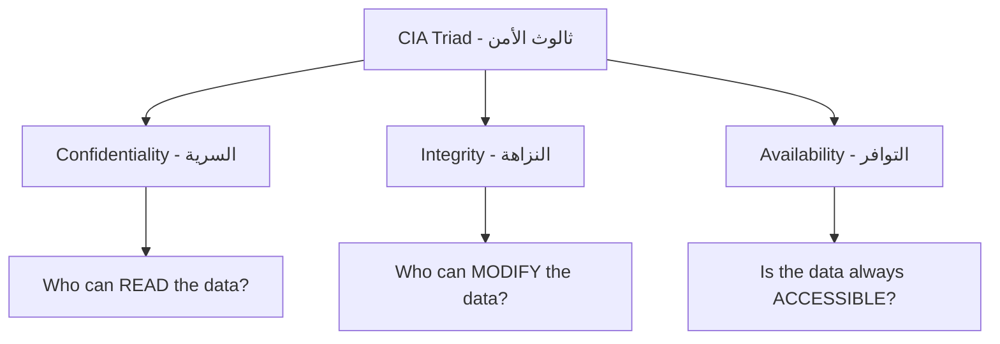

---

### 1. Confidentiality — السرية

**السرية** بتعني إن المعلومات تكون متاحة فقط للناس اللي مسموحلهم يشوفوها.

**السؤال الجوهري:** _من المسموح له يقرأ هذا الملف؟_

**مثال عملي:**
شركة دوائية عندها formula سرية لعقار بيجيب مليارات. لو هذه الـ formula اتسربت، الشركة خسرت كل ميزتها التنافسية. الحل: **Encryption** — يعني حتى لو هاكر وصل للملف، مش هيقدر يقرأه.

**أدوات وتقنيات:**

- **Encryption** — تشفير البيانات أثناء التخزين (at rest) وأثناء الإرسال (in transit)
- **Access Control Lists (ACL)** — تحديد من يقدر يوصل لإيه
- **Data Classification** — تصنيف البيانات حسب درجة حساسيتها

> **💡 مثال واقعي:** في 2017، عقار **Humira®** من شركة **AbbVie** حقق مبيعات بلغت **$18.43 مليار دولار** في سنة واحدة فقط — وده بسبب السرية التامة للـ formula. الـ Confidentiality هنا بتساوي بالحرفي مليارات.

---

### 2. Integrity — النزاهة

**النزاهة** بتعني إن البيانات دقيقة وما اتغيرتش من غير إذن. التعديل لازم يتم فقط من الأشخاص الصح وبالطريقة الصح.

**السؤال الجوهري:** _من المسموح له يعدّل على هذا الملف؟_

**مثال عملي:**
تخيل إنك بتراجع رصيدك في البنك ولاقيته `$1.27` بدل `$1,000,000`. حتى لو حصل ده مرة واحدة بس، الثقة في النظام كله بتنهار على الفور.

**أدوات وتقنيات:**

- **Checksums & Hashing** — التحقق من إن الملف ما اتغيرش (مثلاً MD5, SHA-256)
- **Digital Signatures** — توقيع رقمي بيضمن إن البيانات جت من المصدر الصح وما اتعدل عليها
- **Version Control** — تتبع كل تغيير مين عمله وامتى

---

### 3. Availability — التوافر

**التوافر** بتعني إن الأنظمة والبيانات تكون متاحة دايماً وقت الحاجة إليها.

**السؤال الجوهري:** _هل الملف متاح دايماً للقراءة والكتابة؟_

**مثال واقعي:**
في 2018، شركة فقدت **$232 مليار دولار** بسبب انقطاع خدمة لفترة وجيزة. ده بيوضح إن الـ Availability مش مجرد راحة — ده فلوس حرفياً.

**التهديدات الرئيسية:**

- **Ransomware** — يشفّر بياناتك ويطلب فدية
- **DDoS Attacks** — يغرق الخوادم بطلبات وهمية عشان تتوقف عن الاستجابة
- **Hardware Failure** — أعطال الأجهزة

**الحلول:**

- **Backups** — نسخ احتياطية منتظمة
- **Redundancy** — تكرار البنية التحتية
- **DR Sites (Disaster Recovery)** — مواقع احتياطية جاهزة للعمل فور حدوث أي طارئ
- **Anti-Ransomware Solutions** — حلول متخصصة للحماية من برامج الفدية

---

### 📊 CIA في الواقع

مبادئ الـ CIA مش كلها بنفس الأهمية لكل مؤسسة — الأولوية بتختلف حسب طبيعة العمل:

| القطاع                  | الأولوية الأولى                 | السبب                      |
| ----------------------- | ------------------------------- | -------------------------- |
| الصناعات الدوائية       | **Confidentiality**             | أسرار الفورميولا = مليارات |
| القطاع المالي والبنوك   | **Integrity**                   | دقة الأرقام = ثقة العملاء  |
| الرعاية الصحية والطوارئ | **Availability**                | الأنظمة لازم تشتغل 24/7    |
| الحكومة والدفاع         | **Confidentiality + Integrity** | معلومات حساسة ودقيقة       |

> **📌 ملاحظة مهمة:** في الواقع، المؤسسات بتحاول تحقق الثلاثة معاً، لكن التوازن بيختلف. مهمتك كـ Security Engineer إنك تفهم طبيعة المؤسسة وتحدد الأولويات الصح.

---

## 🟠 AAA Framework

بعد ما فهمنا الـ CIA، السؤال الجوهري: **كيف نطبق هذه المبادئ؟** الإجابة في الـ **AAA Framework**.

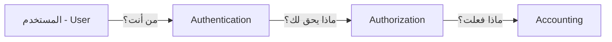

---

### 1. Authentication — التحقق من الهوية

**السؤال:** _من أنت؟ وهل أنت فعلاً من تدّعي أنك إياه؟_

Authentication هو الخطوة الأولى قبل أي وصول. النظام بيتحقق من هويتك قبل ما يسمحلك بأي حاجة.

**أمثلة:**

- إدخال Username + Password
- استخدام **MFA (Multi-Factor Authentication)** — طبقة أمان إضافية

---

### 2. Authorization — التفويض

**السؤال:** _ماذا يُسمح لك بالقيام به؟_

بعد ما النظام عرف مين أنت، بيحدد إيه اللي تقدر تعمله.

**مثال:**
موظف عنده صلاحية يقرأ الملفات، لكن مش عنده صلاحية يحذفها.

---

### 3. Accounting — المحاسبة والمراقبة

**السؤال:** _ماذا فعلت بالضبط وامتى؟_

الـ Accounting بيتتبع ويسجل كل الأنشطة عشان نقدر نكشف الإساءة أو نحقق في الحوادث.

**مثال:**
تسجيل وقت الدخول، الملفات اللي اتوصلتلها، والأوامر اللي اتنفذت.

---

## 🟡 PPT — Policy, Procedure & Training

الـ AAA محتاج بيئة تشتغل فيها — وده دور الـ **PPT**.

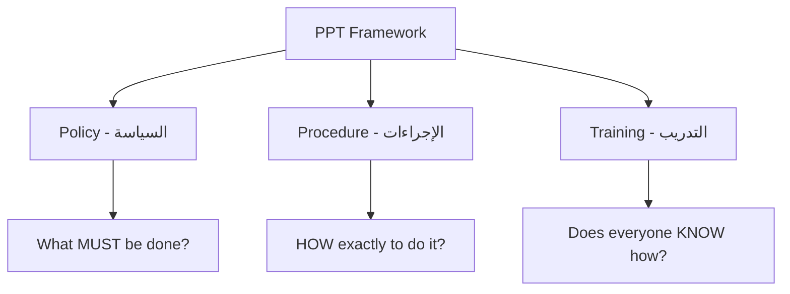

---

### Policy — السياسة

الـ **Policy** هي القواعد والتوقعات العالية المستوى اللي بتحدد كيفية إدارة الأمن في المؤسسة.

**مثال:** _"كل المستخدمين لازم يستخدموا passwords قوية ويغيروها كل 90 يوم."_

السياسة بتجاوب على سؤال: **ماذا يجب أن يُفعل؟**

---

### Procedure — الإجراءات

الـ **Procedure** هي التعليمات التفصيلية خطوة بخطوة لتطبيق هذه السياسات.

**مثال:** _"لإعادة تعيين كلمة مرور المستخدم: 1- التحقق من هويته عبر الهاتف، 2- إرسال رابط إعادة تعيين للبريد الرسمي فقط، 3- تسجيل العملية في نظام الـ Ticketing."_

الإجراء بيجاوب على سؤال: **كيف يُطبَّق هذا بالضبط؟**

---

### Training — التدريب

الـ **Training** بيضمن إن كل موظف فاهم السياسات والإجراءات وعارف يطبقها.

**مثال:** _تدريبات منتظمة على التعرف على هجمات الـ Phishing._

> **⚠️ ملاحظة بالغة الأهمية:**
> يمكنك أن تكتب أفضل السياسات والإجراءات في العالم، لكن إذا لم يعلم بها أحد، فهي لا تساوي شيئاً.
> **Security is a people problem as much as it is a technology problem.**

---

## 🔗 العلاقة بين CIA و AAA و PPT

المبادئ الثلاثة مش معزولة عن بعض — هي منظومة متكاملة:

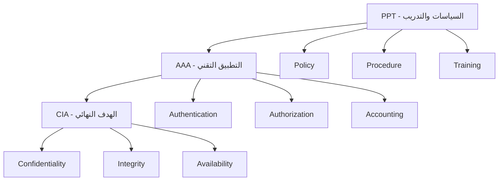

**المعادلة الذهبية:**

| المستوى | الدور                                   |
| ------- | --------------------------------------- |
| **PPT** | الأساس — بيحدد القواعد والثقافة الأمنية |
| **AAA** | التطبيق — بينفّذ القواعد تقنياً         |
| **CIA** | الهدف — ما نسعى لتحقيقه                 |

> تحقيق الـ **CIA** يتطلب تطبيق ممتاز للـ **AAA**، وتطبيق الـ **AAA** بيتطلب أساس متين من الـ **PPT**.

---

## 🛡️ Least Privilege Principle

مبدأ **أقل صلاحية ضرورية** هو واحد من أهم المبادئ في الأمن السيبراني.

**التعريف:** أعطِ المستخدم فقط الصلاحيات التي يحتاجها لإنجاز عمله — لا أكثر ولا أقل.

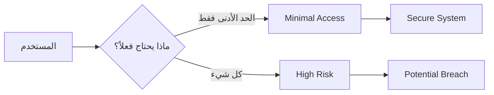

**لماذا هذا المبدأ مهم جداً؟**

- يمنع **إساءة استخدام الصلاحيات الزائدة** — سواء بشكل مقصود أو غير مقصود
- يحدّ من **الأضرار** في حالة اختراق حساب
- يطبّق **مبدأ الحاجة للمعرفة (Need-to-Know)**

**أمثلة عملية:**

| المستخدم      | يملك                               | لا يملك                             |
| ------------- | ---------------------------------- | ----------------------------------- |
| موظف عادي     | قراءة الملفات الخاصة بعمله         | تثبيت برامج أو الوصول لملفات الـ HR |
| مطوّر برمجيات | صلاحيات كاملة على بيئة الـ Testing | أي وصول لبيئة الـ Production        |
| مسؤول IT      | إدارة المستخدمين                   | تعديل السجلات المالية               |

> **🚨 تنبيه:** حسابات الـ **Admin** هي الأكثر استهدافاً من المهاجمين — لذا يجب مراقبتها باستمرار وتطبيق مبدأ أقل صلاحية عليها بشكل صارم.

---

## 🔑 Authentication — بالتفصيل

### Authentication Factors

عوامل التحقق من الهوية بتنقسم لخمسة أنواع رئيسية:

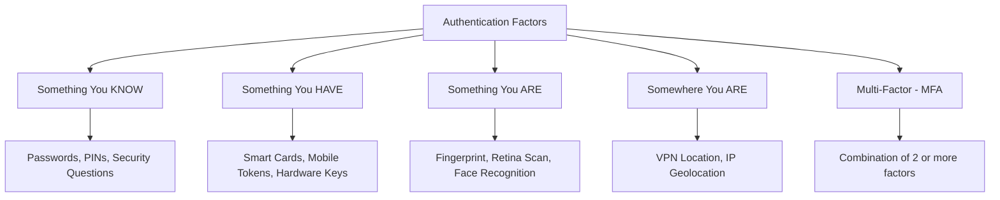

---

#### 1. Something You Know — شيء تعرفه

الأكثر شيوعاً والأقل أماناً إذا استُخدم وحده.

**أمثلة:**

- **Passwords** — كلمة المرور التقليدية
- **PIN Numbers** — أرقام سرية مختصرة
- **Cognitive Passwords (Security Questions)** — "ما اسم كلبك المفضل؟" — وده الـ factor الأضعف لأن المعلومة أحياناً تكون متاحة على وسائل التواصل الاجتماعي

**نقطة ضعف:** يمكن تخمينه أو سرقته أو اختراقه.

---

#### 2. Something You Have — شيء تملكه

جهاز مادي بتستخدمه للتحقق.

**أمثلة:**

- **Smart Cards** — بطاقات ذكية
- **Hardware Security Keys** — مثل YubiKey
- **Mobile Authenticator Apps** — مثل Google Authenticator أو Microsoft Authenticator

**نقطة ضعف:** يمكن سرقته أو فقدانه.

---

#### 3. Something You Are — شيء أنت عليه (Biometrics)

الـ **Biometrics** هي الأكثر تطوراً والأصعب تزويراً.

**أمثلة:**

- **Fingerprint** — بصمة الإصبع
- **Retina & Iris Scan** — مسح الشبكية وقزحية العين
- **Facial Recognition** — التعرف على الوجه
- **Typing Dynamics** — طريقة وسرعة الكتابة على لوحة المفاتيح (سلوكية)
- **Gait Analysis** — طريقة المشي (سلوكية)
- **Signature Dynamics** — كيفية التوقيع (سلوكية)

> **⚠️ ملاحظة مهمة جداً:** البيانات البيومترية لا يمكن تغييرها إذا سُرقت — بخلاف كلمات المرور. لو حد سرق بصمتك، مش هتقدر "تغير" إصبعك!

---

#### 4. Somewhere You Are — مكان وجودك

التحقق بناءً على الموقع الجغرافي.

**مثال:**

- السماح بالوصول فقط من خلال **VPN** من دول معينة
- رفض الطلبات الآتية من مناطق جغرافية مشبوهة

---

#### 5. Multi-Factor Authentication (MFA)

في الواقع، الاعتماد على factor واحد مش كافي. **MFA** بيجمع اثنين أو أكتر من هذه العوامل.

**مثال:**

```
Password (Something You Know)
    +
OTP on Mobile (Something You Have)
    =
Strong MFA
```

> **أفضل ممارسة:** استخدم دايماً MFA — خصوصاً على حسابات الـ Admin وأي نظام حساس.

---

### 🔒 Password Security

كلمات المرور هي خط الدفاع الأول — وغالباً الأضعف.

**قواعد كلمة المرور القوية:**

| المعيار      | التوضيح                                            |
| ------------ | -------------------------------------------------- |
| **الطول**    | 12 حرف على الأقل — كلما طالت، كلما كانت أقوى       |
| **التعقيد**  | استخدم حروف كبيرة + حروف صغيرة + أرقام + رموز خاصة |
| **الفردية**  | لا تستخدم نفس كلمة المرور في أكثر من موقع          |
| **الخصوصية** | لا تستخدم معلومات شخصية (اسمك، تاريخ ميلادك...)    |
| **التجديد**  | غيّرها بانتظام — خصوصاً بعد أي اشتباه بالاختراق    |

**لماذا كلمات المرور الطويلة أهم من المعقدة؟**

الـ Hardware بيتطور بسرعة مذهلة. الـ **GPU** الحديثة تقدر تجرب مليارات المحاولات في الثانية. معادلة بسيطة: **كل حرف إضافي = وقت أضعاف مضاعفة للاختراق.**

> **⚡ تحدي مستقبلي:** الـ **Quantum Computing** تهديد حقيقي قادم — القدرة الحسابية الكمومية قد تجعل تشفير اليوم عديم الفائدة غداً. لذا الـ Post-Quantum Cryptography أصبح مجالاً بحثياً مهماً.

**نصائح عملية:**

- ❌ لا تكتب كلمة مرورك في ملف نصي عادي
- ✅ استخدم **Password Manager** موثوق (مثل Bitwarden أو 1Password)
- ❌ لا تشارك كلمة مرورك مع أي شخص

---

### 🔐 Account Lockout

**Account Lockout** هو آلية أمان بتقفل الحساب تلقائياً بعد عدد معين من محاولات الدخول الفاشلة.

**الهدف:** منع هجمات الـ **Brute Force** — محاولة جميع التوليفات الممكنة حتى الوصول للكلمة الصحيحة.

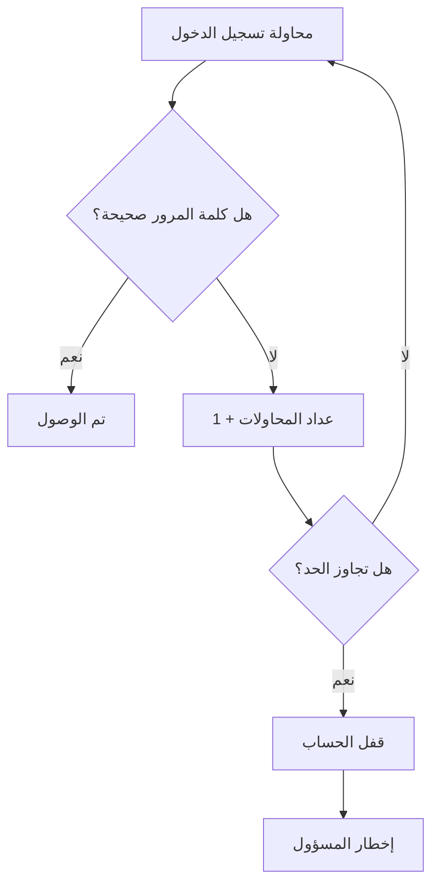

**التوازن الحرج:**

| معلمة         | قيمة منخفضة جداً          | قيمة عالية جداً         |
| ------------- | ------------------------- | ----------------------- |
| عدد المحاولات | يُغضب المستخدمين الشرعيين | يسمح بهجمات Brute Force |
| مدة القفل     | لا تفيد كثيراً            | تُعطّل العمل            |

> **أفضل ممارسة:** 5 محاولات → قفل لمدة 15-30 دقيقة، مع إخطار المسؤول عند تكرار القفل.

---

## 🛂 Authorization — بالتفصيل

بعد التحقق من الهوية، النظام بيسأل: **ماذا يحق لهذا الشخص أن يفعل؟**

هناك نموذجان رئيسيان للتحكم في الوصول:

---

### 1. DAC — Discretionary Access Control

**التحكم في الوصول التقديري** — يعني صاحب المورد هو من يقرر من يصل إليه.

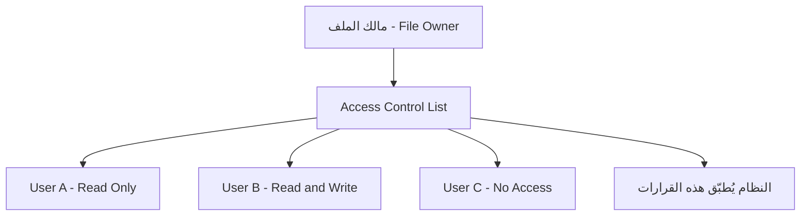

**كيف يعمل؟**

- كل ملف أو مجلد أو مورد له **مالك (Owner)**
- المالك يضع قائمة صلاحيات تسمى **ACL (Access Control List)**
- النظام يُطبّق هذه الصلاحيات عند كل محاولة وصول

**لماذا يُسمى Discretionary؟**
لأن قرارات الصلاحيات **متروكة لتقدير المالك** — لا توجد سياسة مركزية تتحكم فيها.

**هذا هو النموذج الافتراضي في:**

- **Windows** — عند إنشاء ملف جديد، أنت مالكه وتتحكم في صلاحياته
- **Linux** — نظام الصلاحيات التقليدي (rwx permissions)

---

### 2. RBAC — Role-Based Access Control

**التحكم في الوصول القائم على الأدوار** — الصلاحيات مرتبطة بالدور الوظيفي وليس بالشخص.

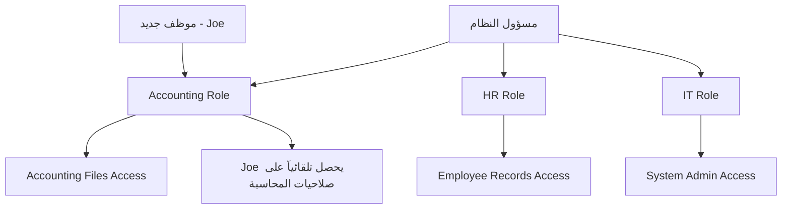

**كيف يعمل؟**

1. المسؤول يُنشئ **أدواراً (Roles)** مسبقاً مرتبطة بالوظائف
2. كل دور له صلاحيات محددة
3. عند توظيف موظف جديد، يُضاف لـ Role المناسب — فيحصل تلقائياً على الصلاحيات

**مثال عملي:**

> Joe انضم للشركة في قسم المحاسبة. المسؤول أنشأ حساباً له وأضافه لـ Group اسمه "Accounting". تلقائياً، Joe يحصل على كل صلاحيات قسم المحاسبة — دون الحاجة لضبط كل ملف على حدة.

---

### 📊 مقارنة بين DAC و RBAC

| المعيار                    | DAC                        | RBAC                                 |
| -------------------------- | -------------------------- | ------------------------------------ |
| **من يتحكم في الصلاحيات؟** | مالك المورد                | المسؤول مركزياً                      |
| **الفائدة الرئيسية**       | مرونة وسهولة للأفراد       | سهولة الإدارة في المؤسسات            |
| **مناسب لـ**               | بيئات صغيرة ومرنة          | مؤسسات كبيرة بها موظفين كثيرين       |
| **العيب الرئيسي**          | يصعب التحكم فيه بشكل مركزي | قد يُخل بمبدأ أقل صلاحية             |
| **عند تعيين موظف جديد**    | يحتاج ضبط يدوي لكل ملف     | يُضاف للدور ويأخذ الصلاحيات تلقائياً |
| **عند ترك موظف**           | يحتاج مراجعة يدوية         | يُزال من الدور فتُلغى كل صلاحياته    |

**إيجابيات وسلبيات RBAC:**

**الإيجابيات ✅**

- سهل الإدارة
- مثالي في بيئات كثيرة التغيير الوظيفي (High Turnover)
- تطبيق فعّال للسياسات الأمنية مركزياً

**السلبيات ❌**

- قد يُخل بـ **Least Privilege Principle** — هل كل محاسب يحتاج فعلاً الوصول لكل ملفات المحاسبة؟
- الأدوار الضخمة قد تمنح صلاحيات زائدة

---

## 📋 Accounting — Logging & Audit

الـ **Accounting** هو العين الثالثة في منظومة الأمن — يراقب ويسجل كل ما يحدث.

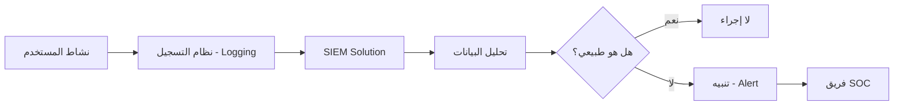

**ما الذي يجب تسجيله؟**

- محاولات تسجيل الدخول (الناجحة والفاشلة)
- نشاطات الـ Admin
- الملفات التي تم الوصول إليها
- التغييرات في إعدادات النظام
- نقل البيانات الكبيرة

**لماذا الـ Logging مهم جداً؟**

> **"لا يمكنك تعريف الشاذ إذا لم تعرف ما هو الطبيعي."**

**مثال على كشف الاختراق:**
رؤية **40 محاولة تسجيل دخول فاشلة في أقل من دقيقة** = مؤشر واضح على استخدام **Brute Force Tool** آلي. بدون Logging، ما كنت هتكتشف ده!

---

**SIEM Solutions — حل المركزة والتحليل**

| الأداة         | الاستخدام                              |
| -------------- | -------------------------------------- |
| **Splunk**     | تجميع وتحليل وتصور البيانات الضخمة     |
| **LogRhythm**  | SIEM متكامل مع قدرات الاستجابة للحوادث |
| **IBM QRadar** | تحليل التهديدات في الوقت الفعلي        |

---

**تحديات الـ Logging:**

| التحدي                        | التوضيح                                                  |
| ----------------------------- | -------------------------------------------------------- |
| **حجم التخزين**               | المؤسسات الكبيرة تولّد ملايين الأحداث يومياً             |
| **مدة الاحتفاظ**              | لازم تحدد: تخزن اللوجز كام يوم؟ كام شهر؟                 |
| **التخزين المحلي vs المركزي** | Local Logging عرضة للتلاعب — Central Logging أكثر أماناً |
| **فهم اللوجز**                | البيانات بدون تحليل لا تساوي شيئاً                       |

> **⚠️ تنبيه:** فهم الـ Logs هو مهارة أساسية لكل **SOC Analyst** و **System Administrator** — لا تستهن بها.

---

## 💪 Exercises

### Exercise 1 — VPN & AAA

> **السيناريو:** شركتك تستخدم VPN للموظفين العاملين عن بُعد.

**المطلوب:**

**أ) كيف تعمل الـ AAA معاً عند تسجيل دخول موظف من البيت؟**

| الخطوة             | العملية                    | المثال                                                       |
| ------------------ | -------------------------- | ------------------------------------------------------------ |
| **Authentication** | التحقق من هوية الموظف      | إدخال Username + Password + OTP من تطبيق                     |
| **Authorization**  | تحديد ما يمكنه الوصول إليه | صلاحية الوصول لـ Internal Network فقط، بدون نظام HR          |
| **Accounting**     | تسجيل جلسة العمل كاملة     | وقت الاتصال، الـ IP، الأنظمة التي وصل إليها، وقت قطع الاتصال |

**ب) أفضل نموذج Authentication؟**

الـ **MFA (Multi-Factor Authentication)** هو الأفضل:

- Factor 1: Password (Something You Know)
- Factor 2: OTP من تطبيق Authenticator (Something You Have)
- اختياري: Certificate على الجهاز (Something You Have)

**ج) ما البيانات التي ستظهر في سجلات الـ Accounting؟**

```
[2024-01-15 09:02:34] USER: john.doe | ACTION: VPN Login SUCCESS
[2024-01-15 09:02:34] IP: 197.45.23.11 | LOCATION: Cairo, Egypt
[2024-01-15 09:05:12] USER: john.doe | ACCESSED: \\fileserver\projects\Q1
[2024-01-15 09:45:00] USER: john.doe | ACCESSED: Internal CRM System
[2024-01-15 12:30:00] USER: john.doe | ACTION: VPN Logout
[2024-01-15 12:30:00] SESSION DURATION: 3h 27m 26s
```

---

### Exercise 2 — Password Sharing Incident

> **السيناريو:** فريقك اكتشف أن موظفين يتشاركون كلمات المرور عبر البريد الإلكتروني.

**أ) ما السياسة (Policy) المناسبة؟**

```
Password Security Policy:
- يُحظر مشاركة كلمات المرور بأي وسيلة (بريد إلكتروني، واتساب، ورق...)
- كلمة المرور شخصية وسرية ولا تُكشف لأي شخص بما في ذلك قسم الـ IT
- يجب أن تتكون من 12 حرف على الأقل وتحتوي على تعقيد كافٍ
- تُغيَّر كل 90 يوماً وعند أي اشتباه بتسريبها
- أي مخالفة تخضع لإجراء تأديبي
```

**ب) ما الإجراء (Procedure) المناسب؟**

1. إعادة تعيين كلمات المرور لجميع الحسابات المتضررة فوراً
2. تسجيل الحادثة في نظام الـ Incident Management
3. مراجعة الـ Logs لتحديد ما تم الوصول إليه
4. إخطار مدير الأمن (CISO) بالحادثة
5. تطبيق فلترة على بريد المؤسسة لمنع إرسال كلمات المرور

**ج) كيف تُدرّب (Training) الموظفين؟**

- **Awareness Sessions** — جلسات توعية دورية عن مخاطر مشاركة كلمات المرور
- **Phishing Simulations** — محاكاة هجمات الهندسة الاجتماعية
- **E-Learning Modules** — وحدات تعليمية إلكترونية مع اختبار في النهاية
- **Reminder Emails** — تذكيرات دورية بالسياسة الأمنية

**د) متى تنتهي مسؤولية الموظف؟**

> مسؤولية الموظف تنتهي عندما:
>
> - **لم يتلقَّ تدريباً واضحاً** على هذه السياسة
> - **لم يتم إبلاغه** بوجود سياسة password sharing مقبل المؤسسة
> - **أُجبر على المشاركة** من قبل مديره أو شخص ذي سلطة
> - المؤسسة **لم تُوفّر أدوات بديلة** (مثل Password Manager مؤسسي) تتيح الوصول المشترك بشكل آمن

---

## 📌 ملخص سريع للمفاهيم الأساسية

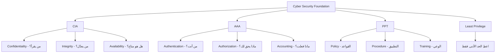


