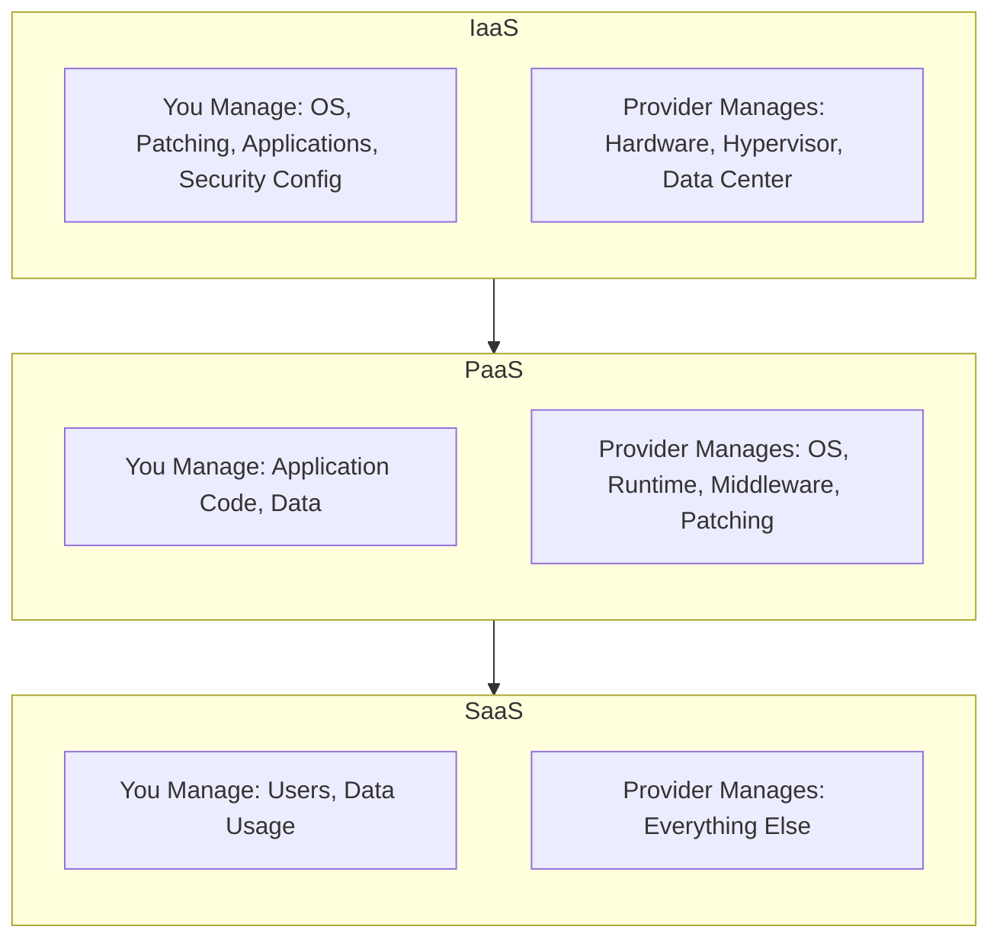
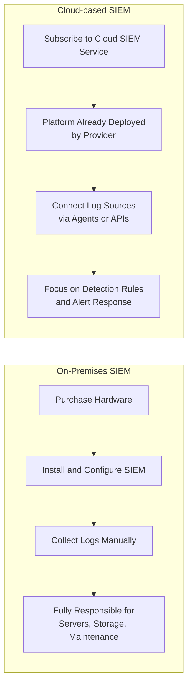

| Topic | Level | Reading Time | Prerequisites |
|---|---|---|---|
| Cloud Computing and Cloud-based Cybersecurity | Intermediate | ~20 min | Basic understanding of virtualization and the role of a hypervisor |

> **الهدف من الـ Section ده:**  
> هتفهم إيه هو الـ Cloud Computing فعليًا وإزاي بُني على مفهوم الـ Virtualization اللي درسناه قبل كده، وهتتعرف على الفرق بين موديلات الخدمة الثلاثة (IaaS, PaaS, SaaS)، وهتشوف مثال عملي حقيقي بيقارن نشر أداة أمنية زي SIEM بشكل تقليدي مقابل نشرها على الكلاود.

## Learning Objectives

By the end of this section, you will be able to:

- Define **Cloud Computing** and explain how it relates to the virtualization concepts covered earlier.
- Distinguish between the three cloud service models: **IaaS**, **PaaS**, and **SaaS**.
- Explain, for each model, exactly what the customer manages versus what the provider manages.
- Compare an **on-premises SIEM deployment** with a **cloud-based SIEM deployment** in terms of responsibility and overhead.
- Explain how the division of responsibility shifts as you move from IaaS toward SaaS.

## Table of Contents

- [What Is Cloud Computing](#what-is-cloud-computing)
- [The Core Idea: Rent Exactly What You Need](#the-core-idea-rent-exactly-what-you-need)
- [Cloud Service Models: IaaS, PaaS, SaaS](#cloud-service-models-iaas-paas-saas)
- [IaaS: Infrastructure as a Service](#iaas-infrastructure-as-a-service)
- [PaaS: Platform as a Service](#paas-platform-as-a-service)
- [SaaS: Software as a Service](#saas-software-as-a-service)
- [The Responsibility Spectrum](#the-responsibility-spectrum)
- [Cloud-based Cybersecurity: The SIEM Example](#cloud-based-cybersecurity-the-siem-example)
  - [On-Premises SIEM Deployment](#on-premises-siem-deployment)
  - [Cloud-based SIEM Deployment](#cloud-based-siem-deployment)
  - [Division of Responsibility](#division-of-responsibility)
- [Service Models and Responsibility Diagram](#service-models-and-responsibility-diagram)
- [Career Connection](#career-connection)
- [Key Terms Glossary](#key-terms-glossary)
- [Summary](#summary)

## What Is Cloud Computing

**Cloud Computing** هو تسليم موارد حوسبة (**computing resources**) عبر الإنترنت، بما فيها السيرفرات، التخزين، الشبكات، قواعد البيانات، والسوفتوير، بتكون متاحة عند الطلب (**on demand**) وبمقياس كبير (**at scale**)، من غير ما العميل يحتاج يمتلك أو يدير البنية التحتية اللي وراها بشكل فيزيائي.

في الممارسة العملية: مزوّد كلاود (زي **AWS**، **Microsoft Azure**، أو **Google Cloud**) بيشغّل مراكز بيانات ضخمة مليانة سيرفرات فيزيائية. بدل ما تشتري وتصون هاردوير خاص بيك، إنت بتأجّر إما موارد حوسبة خام (وصول شبيه بـ **bare-metal**) أو خدمات أعلى مستوى مبنية فوق الهاردوير ده.

> [!TIP]
> فتكر موضوع الـ **Virtualization** اللي درسناه قبل كده؟ الـ Cloud Computing فعليًا هو تطبيق عملي واسع النطاق لنفس المفهوم ده: مزوّد الكلاود بيستخدم الـ hypervisors عشان يقسّم مراكز بياناته الضخمة لملايين الـ VMs، وبعدين يأجّرها للعملاء.

## The Core Idea: Rent Exactly What You Need

> [!IMPORTANT]
> **الفكرة الجوهرية**: إنت بتأجّر بالظبط اللي محتاجه، وتقدر تكبّر أو تصغّر ده بناءً على الطلب، بدل ما تكون مقيّد ببنية تحتية فيزيائية ثابتة إنت اشتريتها مقدمًا.

## Cloud Service Models: IaaS, PaaS, SaaS

لما تأجّر موارد من مزوّد كلاود، فيه ثلاث موديلات خدمة أساسية لازم تفهمها، مبنية على قد إيه إنت بتدير بنفسك مقابل قد إيه المزوّد بيدير بدالك.

## IaaS: Infrastructure as a Service

| المسؤولية | مين المسؤول |
|---|---|
| نظام التشغيل (تثبيت، إعداد، اختيار النظام) | **إنت** |
| الـ Patching (تطبيق التحديثات بنفسك) | **إنت** |
| التطبيقات (تثبيت وصيانة أي سوفتوير بتشغّله) | **إنت** |
| إعدادات الأمان (فايروولات، ضوابط الوصول، إلخ) | **إنت** |
| الهاردوير الفيزيائي | **المزوّد** |
| الـ Hypervisor (طبقة الـ Virtualization) | **المزوّد** |
| مركز البيانات الفيزيائي (طاقة، تبريد، أمان فيزيائي) | **المزوّد** |

باختصار: المزوّد بيدّيك جهاز افتراضي خام (**raw virtual machine**)، وكل حاجة من نظام التشغيل لفوق بقت مسؤوليتك إنت. ده بيدّيك أقصى مرونة وتحكم، لكنه كمان بيتطلب أكبر مجهود إداري تقني.

> [!NOTE]
> **مثال**: تأجير سيرفر افتراضي على **AWS EC2**.

## PaaS: Platform as a Service

| المسؤولية | مين المسؤول |
|---|---|
| كود التطبيق (اللي إنت بتبنيه وتنشره) | **إنت** |
| البيانات (بيانات تطبيقك) | **إنت** |
| نظام التشغيل | **المزوّد** |
| بيئة التشغيل (**runtime environment**، السوفتوير المطلوب فعليًا لتنفيذ كودك) | **المزوّد** |
| الـ Middleware (سوفتوير بيربط أجزاء مختلفة من التطبيق) | **المزوّد** |
| الـ Patching (الحفاظ على تحديث المنصة اللي تحت) | **المزوّد** |

باختصار: إنت بس بتركّز على كتابة ونشر كود تطبيقك، والمزوّد بياخد باله من المنصة (**platform**) كاملة اللي التطبيق شغال عليها. ده بيقلل كتير من عبء الإدارة مقارنة بـ IaaS، على حساب تحكم أقل على المستوى المنخفض (**low-level control**).

## SaaS: Software as a Service

| المسؤولية | مين المسؤول |
|---|---|
| المستخدمين (مين عنده وصول للسوفتوير) | **إنت** |
| استخدام البيانات (البيانات اللي بتدخلها/تولّدها جوه السوفتوير) | **إنت** |
| كل حاجة تانية، التطبيق نفسه، السيرفرات، نظام التشغيل، المنصة، الأمان، التحديثات، والبنية التحتية | **المزوّد** |

**SaaS** هو أكتر موديل "بدون تدخل" (**hands-off**) بالنسبة للعميل، إنت ببساطة بتستخدم السوفتوير النهائي كخدمة، من غير ما تقلق بخصوص أي حاجة شغالة تحته.

> [!NOTE]
> **مثال**: **Microsoft 365** (Word، Excel، Outlook، إلخ مقدّمة كخدمة كلاود).

> [!TIP]
> الـ SaaS عادةً بيكون **أغلى موديل لكل مستخدم**، بما إنك بتدفع مقابل راحة إن المزوّد بيدير حرفيًا كل حاجة بدالك.

## The Responsibility Spectrum

الموديلات دي موجودة على طيف (**spectrum**): كل ما اتحركت من **IaaS** لـ **SaaS**، المزوّد بياخد مسؤولية أكبر، وإنت بتحتفظ بتحكم مباشر أقل (لكن كمان عبء إداري أقل).

| | تحكم أكتر، إدارة أكتر | | تحكم أقل، إدارة أقل |
|---|---|---|---|
| | **IaaS** | **PaaS** | **SaaS** |

## Cloud-based Cybersecurity: The SIEM Example

هنستخدم حل **SIEM (Security Information and Event Management)** كمثال بيوضح إزاي أدوات الأمن السيبراني بتختلف بين النشر التقليدي (**on-premises**) والنشر على الكلاود.

### On-Premises SIEM Deployment

1. إنت بتشتري الهاردوير المطلوب لتشغيل سوفتوير الـ SIEM بنفسك، أو في بعض الحالات، المزوّد بيبعتلك سيرفرات bare-metal معدّة مسبقًا مع السوفتوير مثبت بالفعل.
2. بعد إعداد السيرفرات الفيزيائية، إنت بتبدأ تجمع logs من مصادر مختلفة عبر شبكتك (فايروولات، سيرفرات، endpoints، تطبيقات، إلخ).
3. إنت مسؤول بالكامل عن إدارة السيرفرات، بالإضافة لجمع الـ logs المستمر، التخزين، والصيانة.

> [!NOTE]
> الموديل ده بيدّيك تحكم كامل في بياناتك وبنيتك التحتية، لكنه بييجي مع تكاليف هاردوير مقدّمة كبيرة ومسؤولية إدارة مستمرة (الـ patching، تكبير التخزين، ضمان استمرارية التشغيل، إلخ).

### Cloud-based SIEM Deployment

1. إنت ببساطة بتشترك في خدمة SIEM على الكلاود مقدّمة من مزوّد معين، مفيش حاجة إنك تشتري، تثبّت، أو تدير أي هاردوير بنفسك.
2. منصة الـ SIEM نفسها أصلًا منشورة ومُدارة من طرف المزوّد في بيئة الكلاود بتاعته.
3. بعد كده إنت بتضبط استيعاب الـ logs (**log ingestion**) عن طريق ربط مصادر الـ logs المختلفة بتاعتك، زي خدمات الكلاود، الـ endpoints، وأجهزة الشبكة، باستخدام **agents** (قطع صغيرة من السوفتوير مثبتة على أنظمتك) أو **APIs** (اتصالات برمجية مباشرة).

### Division of Responsibility

| المسؤولية | مين المسؤول |
|---|---|
| البنية التحتية اللي تحت، توفر النظام، وتكبير المنصة كل ما حجم الـ logs يزيد | **مزوّد الكلاود** |
| إعداد مصادر الـ logs بشكل صحيح، بناء وضبط قواعد الاكتشاف، والاستجابة للتنبيهات الأمنية اللي النظام بيولّدها | **إنت** |

> [!IMPORTANT]
> الموديل ده بيقلل بشكل كبير التكلفة المقدّمة والعبء الإداري مقارنة بـ SIEM on-premises، وده بيسمح لفرق الأمان إنها تركّز أكتر على التحليل والاستجابة بدل صيانة البنية التحتية.

## Service Models and Responsibility Diagram

المخطط التالي بيوضح كيف تتوزع المسؤولية عبر موديلات الخدمة الثلاثة:

والمخطط التالي بيوضح الفرق بين نشر أداة SIEM بشكل تقليدي ونشرها على الكلاود:

## Career Connection

فهم الـ Cloud Computing وموديلاته له تطبيقات مباشرة في مسارات مهنية متعددة:

- في مجال **Cloud Security**، فهم توزيع المسؤولية بين IaaS، PaaS، وSaaS أساسي لتحديد مين مسؤول عن تأمين إيه بالظبط (مفهوم بيُعرف بـ **Shared Responsibility Model**).
- في مجال **SOC**، الانتقال لأدوات زي SIEM على الكلاود بيغيّر طبيعة الشغل اليومي من صيانة بنية تحتية لتركيز أكبر على تحليل التنبيهات والاستجابة.
- في مجال **GRC**، فهم إيه اللي المزوّد بيديره وإيه اللي المؤسسة مسؤولة عنه جزء أساسي من تقييم المخاطر والامتثال في أي بيئة كلاود.

## Key Terms Glossary

| Term | Definition |
|---|---|
| **Cloud Computing** | تسليم موارد حوسبة عبر الإنترنت عند الطلب، دون الحاجة لامتلاك البنية التحتية الفيزيائية. |
| **IaaS (Infrastructure as a Service)** | موديل خدمة يوفر بنية تحتية خام (سيرفر افتراضي)، ويترك للعميل إدارة كل شيء من نظام التشغيل فما فوق. |
| **PaaS (Platform as a Service)** | موديل خدمة يوفر منصة تشغيل كاملة، ويترك للعميل التركيز فقط على كود التطبيق وبياناته. |
| **SaaS (Software as a Service)** | موديل خدمة يوفر تطبيقًا جاهزًا للاستخدام، مع إدارة كل شيء آخر من طرف المزوّد. |
| **SIEM (Security Information and Event Management)** | نظام يجمع ويحلل سجلات الأمان من مصادر متعددة لاكتشاف التهديدات. |
| **Log Ingestion** | عملية جمع وإدخال بيانات السجلات من مصادر مختلفة إلى نظام تحليل مركزي. |
| **Shared Responsibility Model** | إطار عمل يوضح توزيع مسؤوليات الأمان بين مزود الكلاود والعميل. |

## Summary

- **Cloud Computing** هو تسليم موارد حوسبة عبر الإنترنت عند الطلب وبمقياس كبير، مبني أساسًا على مفهوم الـ **Virtualization**.
- الفكرة الجوهرية: تأجّر بالظبط اللي محتاجه، وتكبّر أو تصغّر بناءً على الطلب.
- فيه ثلاث موديلات خدمة: **IaaS** (تحكم وإدارة أكتر، المزوّد بيدير الهاردوير والـ hypervisor بس)، **PaaS** (المزوّد بيدير المنصة كاملة، إنت بس بتدير الكود والبيانات)، و **SaaS** (المزوّد بيدير كل حاجة، إنت بس بتدير المستخدمين واستخدام البيانات).
- كل ما اتحركت من IaaS لـ SaaS، تحكمك المباشر بيقل لكن عبء الإدارة بيقل كمان.
- مثال **SIEM** بيوضح الفرق العملي: النشر **on-premises** بيتطلب شراء وإدارة هاردوير وصيانة مستمرة بالكامل، بينما النشر **cloud-based** بيخلي المزوّد مسؤول عن البنية التحتية والتوفر، وإنت بتركّز على إعداد مصادر الـ logs وضبط قواعد الاكتشاف والاستجابة.

