> الهدف من الـ Section ده: هتفهم إيه هو الـ Cryptography وإزاي بيحمي بياناتك، وهتعرف الفرق بين الـ Encryption والـ Hashing والـ Steganography، وإزاي الـ Digital Signatures والـ Certificates بتحميك من الـ MITM Attacks.

## Table of Contents


- [Cryptography Fundamentals](#cryptography-fundamentals)
  - [What is Cryptography?](#what-is-cryptography)
  - [Important Terms in Cryptography](#important-terms-in-cryptography)
- [Encryption Algorithms](#encryption-algorithms)
  - [Symmetric Encryption](#symmetric-encryption)
  - [Asymmetric Encryption](#asymmetric-encryption)
  - [Hybrid Encryption](#hybrid-encryption)
- [Steganography vs Cryptography](#steganography-vs-cryptography)
- [Cryptography Algorithm Strength](#cryptography-algorithm-strength)
- [Hashing](#hashing)
  - [What is a Hash?](#what-is-a-hash)
  - [Hash vs Encryption](#hash-vs-encryption)
  - [Hash Algorithms](#hash-algorithms)
  - [Hash Collisions](#hash-collisions)
- [Digital Signatures and Certificates](#digital-signatures-and-certificates)
  - [Digital Signature](#digital-signature)
  - [Digital Certificate](#digital-certificate)
  - [Digital Signature vs Digital Certificate](#digital-signature-vs-digital-certificate)
- [Man-In-The-Middle Attack in Cryptography](#man-in-the-middle-attack-in-cryptography)
- [Summary](#summary)

---

## Cryptography Fundamentals

### What is Cryptography?

الـ **Cryptography** هي علم وفن تأمين المعلومات عن طريق تحويلها لصيغة مش مقروءة للأشخاص الغير مخولين.

الهدف منها إنها تضمن إن البيانات تكون:

| الخاصية | المعنى |
|---|---|
| **Confidential** | محدش يشوفها غير صاحبها |
| **Authentic** | البيانات فعلاً جاية من المصدر الصح |
| **Unaltered** | محدش عدّل فيها في الطريق |

> [!NOTE]
> الجملةـ: `Ygneqog vq Eadgt Ugewtkva Htkgpfu` — دي مش كلام فاضي، دي جملة متشفرة بالـ **Caesar Cipher** بـ Shift قيمته 2. لو فككت الشفرة هتلاقي: **"Welcome to Cyber Security Friends"** — ده بيوضح إن لو معرفتش الـ Algorithm أو الـ Key، مش هتقدر تفك الشفرة.

---

### Important Terms in Cryptography

دي المصطلحات الأساسية اللي لازم تحفظها وتفهمها كويس:

```
Plaintext  -->  [Encryption]  -->  Ciphertext
Ciphertext -->  [Decryption]  -->  Plaintext
```

| المصطلح | التعريف |
|---|---|
| **Plaintext** | النص الأصلي المقروء — اللي بتقرأه دلوقتي |
| **Ciphertext** | النص المشفر — مش مقروء للإنسان العادي |
| **Encryption** | عملية تحويل الـ Plaintext لـ Ciphertext |
| **Decryption** | عملية إرجاع الـ Ciphertext لـ Plaintext |
| **Algorithm** | مجموعة القواعد العلنية اللي بيتبنى عليها نظام التشفير |
| **Cryptanalysis** | علم كسر خوارزميات التشفير |
| **Key** | قيمة رقمية بطول محدد بالـ Bits — هي الجزء السري في التشفير |
| **Key Space** | عدد القيم الممكنة اللي ممكن تتكون منها الـ Key |

> [!IMPORTANT]
> الـ **Algorithm** بيكون معروف للعامة — يعني الكل عارف إن Caesar Cipher بيعمل Shift. اللي بيفرق هو الـ **Key** اللي المفروض يكون سري. لو حد عرف الـ Key وعارف الـ Algorithm، هيقدر يفك أي حاجة.

**مثال على الـ Key Space:**
- Key بـ **56-bit** = تقريباً **72 quadrillion** تركيبة ممكنة (72,000,000,000,000,000)
- Key بـ **128-bit** = عدد خيالي جداً — هنتكلم عنه في الـ Algorithm Strength

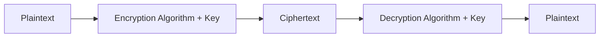

> [!TIP]
> قصة طريفة من التاريخ — الناس قديماً كانوا بيحلقوا راس العبد، يكتبوا الرسالة على راسه، يستنوا الشعر يطول، وبعدين يبعتوه للطرف التاني. الطرف التاني يحلق راسه ويقرأ الرسالة. ده مثال قديم على الـ **Steganography** مش الـ Cryptography.

---

## Encryption Algorithms

### Symmetric Encryption

في الـ **Symmetric Encryption**، نفس الـ Key بيتستخدم في التشفير وفك التشفير.

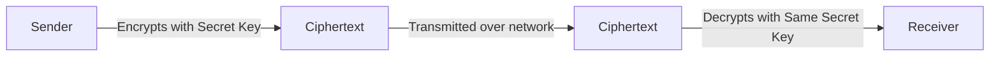

**مميزاته:**
- سريع جداً
- مناسب لتشفير كميات كبيرة من البيانات

**عيوبه:**
- المشكلة الكبيرة: إزاي تبعت الـ Key للطرف التاني بأمان؟ لو الـ Key اتسرق في الطريق، خلص كل شيء.

**أمثلة على Symmetric Algorithms:**

| Algorithm | ملاحظة |
|---|---|
| **DES** | قديم ومكسور |
| **AES** | المعيار الحالي وآمن |
| **ChaCha20** | سريع ومستخدم في الـ Mobile |

---

### Asymmetric Encryption

الـ **Asymmetric Encryption** جاء عشان يحل مشكلة نقل الـ Key في الـ Symmetric.

هنا عندنا **مفتاحين**:
- **Public Key**: معروف للجميع — مش فيه أي مشكلة إن الكل يعرفه
- **Private Key**: سري جداً — ما يخرجش من جهازك أبداً

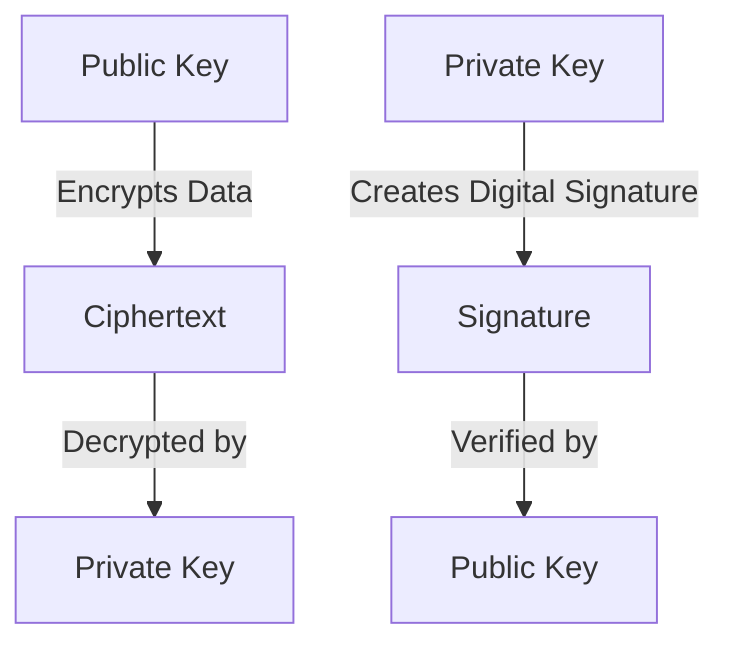

**القواعد الأربعة الذهبية:**

| الهدف | المفتاح المستخدم |
|---|---|
| إرسال رسالة مشفرة | Public Key **المستقبِل** |
| فك تشفير رسالة وصلتلك | Private Key **المستقبِل** |
| عمل Digital Signature على ملف | Private Key **المُرسِل** |
| التحقق من صحة ملف وصلك | Public Key **المُرسِل** |

> [!IMPORTANT]
> في الـ Asymmetric:
> - لو شفّرت بـ **Public Key** — الهدف هو **Confidentiality** (السرية)
> - لو شفّرت بـ **Private Key** — الهدف هو **Authenticity** (إثبات الهوية)

**أمثلة على Asymmetric Algorithms:**

| Algorithm | ملاحظة |
|---|---|
| **RSA** | الأكثر شيوعاً |
| **ECC (Elliptic Curve Cryptography)** | أسرع وأكثر كفاءة |

**مقارنة Symmetric vs Asymmetric:**

| | Symmetric | Asymmetric |
|---|---|---|
| **السرعة** | سريع جداً | بطيء |
| **نقل الـ Key** | مشكلة كبيرة | آمن وسهل |
| **الاستخدام** | كميات كبيرة من البيانات | بيانات صغيرة أو الـ Keys |

---

### Hybrid Encryption

بما إن الـ Symmetric سريع لكن فيه مشكلة في نقل الـ Key، والـ Asymmetric آمن في نقل الـ Key لكن بطيء — الحل هو **نستخدم الاتنين مع بعض**.

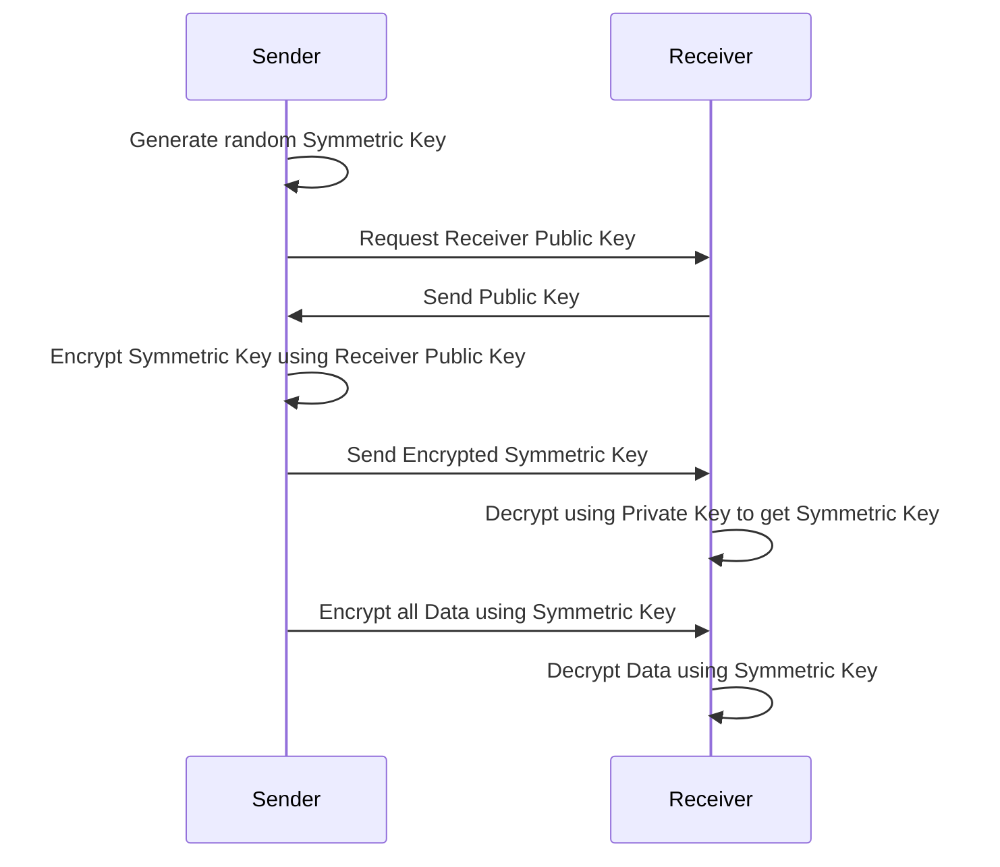

**الفكرة ببساطة:**
1. الـ **Asymmetric** بيشفّر الـ Key الصغير بأمان
2. الـ **Symmetric** بيشفّر البيانات الكبيرة بسرعة

> [!TIP]
> الـ HTTPS اللي بتشوفه في الـ Browser بيستخدم الـ Hybrid Encryption بالضبط — الـ TLS Handshake بيستخدم Asymmetric لتبادل الـ Keys، وبعدين كل الـ Data بتتشفر بـ Symmetric.

---

## Steganography vs Cryptography

### الفرق الجوهري

| | **Cryptography** | **Steganography** |
|---|---|---|
| **الهدف** | إخفاء **معنى** البيانات | إخفاء **وجود** البيانات |
| **الوضوح** | الكل عارف إن في رسالة سرية | محدش يعرف إن في رسالة أصلاً |
| **مثال** | رسالة مشفرة على الإيميل | رسالة مخبية جوه صورة |

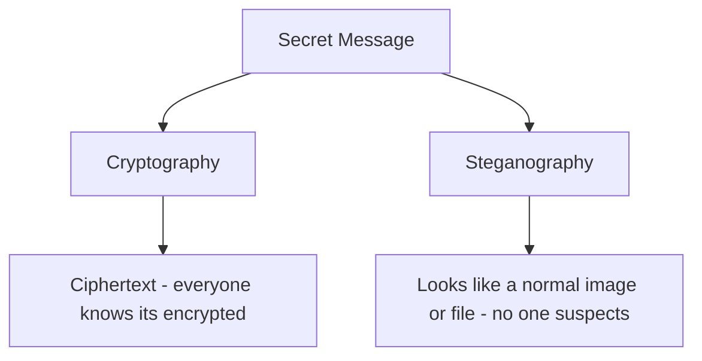

> [!NOTE]
> الـ Steganography مش بس للـ Evil Purposes. بتتستخدم في الـ **Digital Watermarking** — يعني ممكن تخبّي Watermark جوه صورة بتاعتك، ولو حد نسخها حتى لو عدّل فيها، جزء من الـ Watermark هيفضل موجود وتقدر تثبت إنها ملكك.

**طريقة الكشف عن الـ Steganography:**
- استخدم موقع **https://aperisolve.com/**
- الـ Steganography بتشتغل على الصور وملفات الصوت وأنواع تانية كمان

> [!WARNING]
> بعض الـ Attackers بيعملوا **الاتنين مع بعض** — يشفّروا البيانات بالـ Cryptography، وبعدين يخبّوها جوه صورة بالـ Steganography. ده بيخلي الكشف عنهم صعب جداً.

---

## Cryptography Algorithm Strength

### ليه حجم الـ Key مهم؟

الـ Attackers بيحاولوا يكسروا الـ Encryption عن طريق الـ **Brute Force** — يعني يجرّبوا كل تركيبة ممكنة للـ Key لحد ما يلاقوا الصح.

**قوة الـ Algorithm = الوقت اللي هياخده الـ Brute Force**

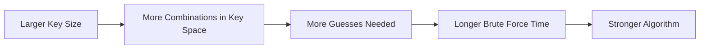

**مقارنة عملية:**

| Algorithm | Key Size | الوقت للـ Brute Force |
|---|---|---|
| **DES** | 56-bit | ساعات (مكسور تماماً) |
| **AES-128** | 128-bit | 77 septillion سنة |
| **AES-256** | 256-bit | غير قابل للكسر عملياً |

> [!IMPORTANT]
> الـ AES-128: لو كل شخص على الكوكب عنده 10 أجهزة كمبيوتر وكل جهاز بيعمل مليار تخمين في الثانية، هياخد **77,000,000,000,000,000,000,000,000 سنة** عشان يكسره. ده بيفسر ليه الـ Key Space مهم جداً.

### مشكلة عدم العشوائية في توليد الـ Keys

مش بس المهم إن الـ Key يبقى **طويل**، لازم كمان يكون **عشوائي**. المشكلة إن الكمبيوتر مش قادر يولد أرقام عشوائية حقيقية.

**مثال على Key Generation سيء:**

```
01:00 --> Key: KEY01
02:00 --> Key: KEY02
03:00 --> Key: KEY03
```

لو الـ Attacker عرف الـ Pattern ده، مش محتاج يعمل Brute Force — بس يجرّب 24 Key بس.

> [!WARNING]
> **WEP (Wired Equivalent Privacy)** — ده كان معيار تشفير الـ Wi-Fi في التسعينات. المشكلة مش كانت في الـ Algorithm نفسه (RC4)، المشكلة كانت في **طريقة توليد الـ Key** اللي كانت متوقعة وسهلة الكسر. الـ Algorithm القوي مع الـ Key Generation الضعيف = نظام ضعيف.

### قوة الكمبيوتر بتضاعف

قوة الكمبيوتر بتضاعف كل سنتين تقريباً. يعني:
- الـ DES كان بياخد **20,000 سنة** للكسر في 1975
- دلوقتي بيتكسر في **ساعات**

**الـ Algorithms الآمنة حالياً:**

| Algorithm | النوع |
|---|---|
| **AES-256** | Symmetric |
| **ChaCha20** | Symmetric |
| **RSA-2048** | Asymmetric |
| **ECC** | Asymmetric |

---

## Hashing

### What is a Hash?

الـ **Hash Function** بتاخد أي Input (نص، ملف، باسورد، بيانات) وبتنتج **Output ثابت الحجم** اسمه الـ **Hash** أو **Message Digest**.

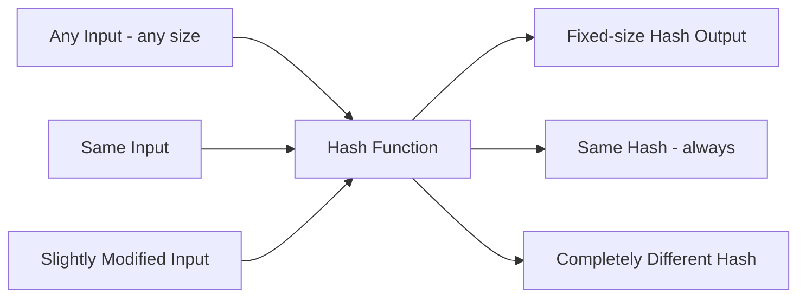

**خصائص الـ Hash:**

| الخاصية | الشرح |
|---|---|
| **Fixed Output Size** | مهما كان حجم الـ Input، الـ Output نفس الحجم دايماً |
| **One-Way** | مستحيل (نظرياً) ترجع من الـ Hash للـ Original Data |
| **Deterministic** | نفس الـ Input دايماً ينتج نفس الـ Hash |
| **Avalanche Effect** | تغيير صغير في الـ Input = تغيير كامل في الـ Hash |
| **Fast** | سريع جداً في الحساب |

> [!IMPORTANT]
> الـ Hash مش تشفير — **مش ليه مفتاح**، ومش بيرجع. هو عملية **اتجاه واحد فقط**. لو نسيت الباسورد، مفيش طريقة ترجع منه — لذلك السيستم بيطلب منك تعمل Reset مش Recovery.

**مثال عملي على File Integrity:**

لو اتحملت برنامج من الإنترنت زي VLC، الموقع الرسمي بيعرض الـ Hash بتاع الـ exe. بعد ما تحمّله، تحسب الـ Hash بنفسك وتقارنه — لو مختلف، الملف اتعدّل أو اتلاوط فيه.

```bash
# على Windows
certutil -hashfile vlc.exe SHA256

# على Linux
sha256sum vlc.exe
```

---

### Hash vs Encryption

| | **Encryption** | **Hashing** |
|---|---|---|
| **المفتاح** | لازم Key | مفيش Key |
| **الاتجاه** | ذهاباً وإياباً | اتجاه واحد فقط |
| **الهدف** | السرية | التحقق من السلامة |
| **حجم الـ Output** | بيتغير حسب الـ Input | ثابت دايماً |

**استخدامات الـ Encryption:**
- Disk Encryption
- VPNs
- Web Traffic (HTTPS)
- حماية الملفات

**استخدامات الـ Hashing:**
- تخزين الـ Passwords
- File Integrity Checks
- Digital Signatures

---

### Hash Algorithms

#### MDX Family

| Algorithm | الحجم | الحالة |
|---|---|---|
| **MD2** | 128-bit | بطيء جداً، متروك |
| **MD4** | 128-bit | أسرع، متروك |
| **MD5** | 128-bit | الأشهر، لكن **غير موصى به** |

> [!WARNING]
> الـ MDX Family كلها مش بتتستخدم في التطبيقات الأمنية الحديثة. الـ MD5 تحديداً فيه Collisions معروفة — إياك تستخدمه لأي حاجة أمنية.

#### SHA Family

بتاخد اسمها من **NIST** اللي صممها.

| Algorithm | الحجم | الحالة |
|---|---|---|
| **SHA-0** | 160-bit | فيه عيوب، متروك |
| **SHA-1** | 160-bit | مكسور، لا تستخدمه |
| **SHA-256** | 256-bit | **المعيار الحالي** |
| **SHA-512** | 512-bit | أقوى، أبطأ نسبياً |
| **SHA-3** | متغير | قوي جداً، احتياطي لو SHA-2 اتكسر |

> [!NOTE]
> الـ SHA-2 بيشمل مجموعة Algorithms، واسمها بيقولك حجم الـ Hash. مثلاً SHA-256 بينتج Hash بحجم 256-bit. الـ SHA-3 موجود كـ Backup لو حد اكتشف ضعف في الـ SHA-2 مستقبلاً.

---

### Hash Collisions

الـ **Collision** هو لما دالتين Input مختلفتين ينتجوا نفس الـ Hash.

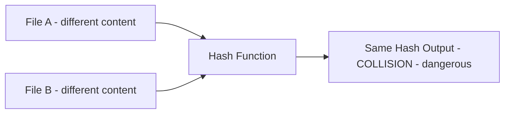

ده خطر جداً لأن:
- لو عندك File A وعملت Collision مع File B الخبيث
- الـ Hash هيبان صح رغم إن الملف اتغير

> [!WARNING]
> الـ SHA-1 والـ MDX Family فيهم Collisions موثقة ومعروفة — ده سبب رئيسي إنهم اتعملوا Deprecated.

**مثال تبسيطي:**
لو عندك Hash Function بتنتج بس 100 قيمة ممكنة، وعندك 101 ملف — بالضرورة فيه ملفين هيعطوا نفس الـ Hash. ده معروف بالـ **Birthday Paradox** في الـ Cryptography.

---

## Digital Signatures and Certificates

### Digital Signature

الـ **Digital Signature** هو توقيع إلكتروني — صاحبه بيستخدم الـ Private Key بتاعه عشان يوقّع على البيانات، وأي حد تاني يقدر يتحقق منه بالـ Public Key.

**الـ Digital Signature بيحقق:**

| الهدف | المعنى |
|---|---|
| **Authentication** | إثبات هوية المُرسِل |
| **Integrity** | البيانات ما اتعدلتش في الطريق |
| **Non-Repudiation** | المُرسِل ما يقدرش ينكر إنه بعت |

#### كيف يعمل الـ Digital Signature خطوة بخطوة؟

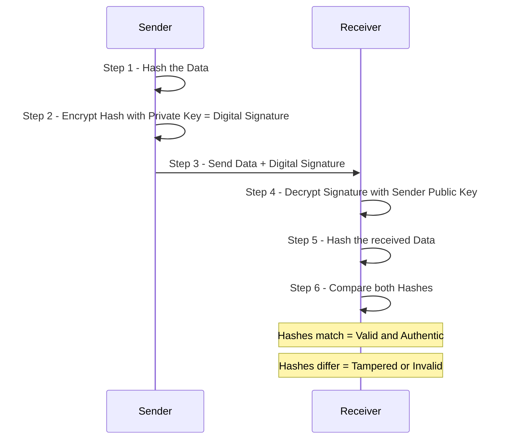

**شرح الخطوات:**

1. **Hashing the Data**: السيستم بيحسب الـ Hash للملف أو الرسالة
2. **Signing the Hash**: المُرسِل بيشفّر الـ Hash بـ Private Key بتاعه — ده الـ Digital Signature
3. **Sending Data + Signature**: البيانات الأصلية + الـ Signature بيتبعتوا مع بعض
4. **Verification**: المستقبِل بيفك تشفير الـ Signature بـ Public Key المُرسِل
5. **Re-Hashing**: المستقبِل بيحسب الـ Hash من البيانات اللي وصلتله
6. **Comparison**: لو الـ Hash اتطابقوا = كل شيء تمام

#### استخدامات الـ Digital Signature في الواقع

- **Emails**: للتأكد إن الإيميل فعلاً جاي من المُرسِل الصح
- **Software**: توقيع الـ exe والـ Installers
- **Windows Updates**: مايكروسوفت بتوقّع كل Update
- **Drivers**: Windows مش بيسمح لأي Driver يشتغل غير لو متوقّع رقمياً
- **Linux Packages, iOS Apps**: وكتير تاني

> [!WARNING]
> **قصة الـ Drivers:** الـ Drivers بتشتغل في الـ **Kernel Space** — ده أخطر مكان في الجهاز. لو Attacker حط كود خبيث في Driver، هيكون عنده وصول كامل للجهاز كله. عشان كده Windows دلوقتي رافض يشغّل أي Driver مش متوقّع رقمياً من الشركة المنتجة.

---

### Digital Certificate

الـ **Digital Certificate** وثيقة إلكترونية زي الباسبور — بتثبت إن الـ Public Key ده فعلاً بيخص الشخص أو الشركة دي.

**محتويات الـ Digital Certificate:**

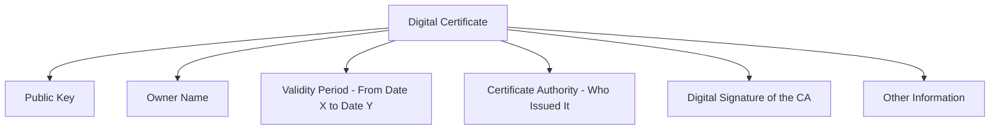

**Certificate Authority (CA)** هي جهة موثوقة بتصدر الشهادات وبتضمن صحتها — زي الحكومة اللي بتطبع الباسبور.

---

### Digital Signature vs Digital Certificate

| | **Digital Signature** | **Digital Certificate** |
|---|---|---|
| **هو إيه؟** | توقيع إلكتروني على بيانات | وثيقة إلكترونية زي الباسبور |
| **بيستخدم إيه؟** | Private Key المُرسِل | بيصدره الـ Certificate Authority |
| **الهدف** | إثبات أصالة البيانات | إثبات إن الـ Public Key بيخص مين |
| **مثال** | توقيع على إيميل أو ملف | SSL Certificate لموقع HTTPS |

> [!IMPORTANT]
> الـ Digital Signature هو **الأداة**، والـ Digital Certificate هو **الهوية**. الـ Certificate بيحمل الـ Public Key في صورة وثيقة رسمية موثّقة، عشان تتأكد إنك بتتكلم مع الشخص الصح مش مع Attacker.

---

## Man-In-The-Middle Attack in Cryptography

### كيف يحدث الهجوم؟

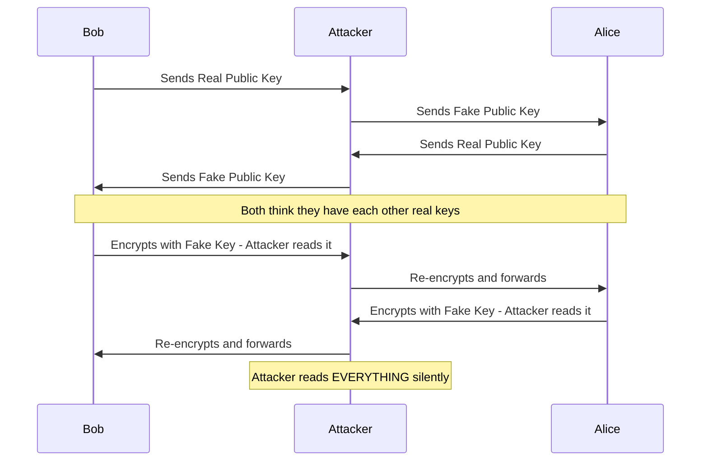

**ببساطة اللي بيحصل:**
1. Bob بيبعت الـ Public Key بتاعه لـ Alice
2. الـ Attacker بيعترض الـ Packet ويستبدل الـ Public Key بـ Fake Key بتاعه
3. Alice بتعمل نفس الحاجة — بتبعت Public Key بتاعها لـ Bob
4. الـ Attacker بيعترض ويستبدلها برضو
5. دلوقتي Bob وAlice عندهم Fake Keys وهما مش عارفين
6. كل اللي بيتبعث بيتشفر بالـ Fake Key — والـ Attacker يقدر يفكه بالـ Private Key بتاعه

### الحل: Digital Certificates

الـ **Digital Certificate** هو الحل لهجوم الـ MITM. لأن:
- الـ Certificate بيحمل الـ Public Key + اسم صاحبه + توقيع الـ CA
- المتصفح بيتحقق من الـ Certificate مع الـ CA
- لو الـ Attacker غيّر الـ Certificate، الـ CA Signature هيكون invalid

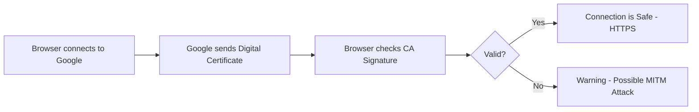

> [!TIP]
> لو يوماً ما المتصفح بتاعك قالك "Your connection is not private" أو "Certificate Error" — ده ممكن يكون علامة على هجوم MITM أو Certificate منتهي أو مزوّر. إياك تتجاهل الرسالة دي.

---

## Summary

### ملخص الـ Lecture

**Category 1 - Cryptography Fundamentals:**
- الـ Cryptography هي علم تحويل البيانات لصيغة غير مقروءة لحماية السرية والأصالة والسلامة
- المصطلحات الأساسية: Plaintext، Ciphertext، Algorithm، Key، Key Space، Cryptanalysis
- الـ Algorithm بيكون عاماً، لكن الـ Key هو السر الحقيقي

**Category 2 - Encryption Algorithms:**
- **Symmetric**: نفس الـ Key للتشفير وفك التشفير — سريع لكن مشكلة في نقل الـ Key
- **Asymmetric**: Public + Private Key — آمن في نقل الـ Key لكن أبطأ
- **Hybrid**: الأفضل من الاتنين — Asymmetric لتبادل الـ Key، Symmetric للبيانات

**Category 3 - Steganography:**
- الـ Cryptography بتخبّي **معنى** الرسالة — الكل عارف إن في رسالة
- الـ Steganography بتخبّي **وجود** الرسالة — محدش يعرف إن في رسالة أصلاً

**Category 4 - Algorithm Strength:**
- قوة الخوارزمية = صعوبة الـ Brute Force على الـ Key
- Key طويل + Key عشوائي = خوارزمية قوية
- DES مكسور. AES-256 وRSA-2048 وECC هم المعيار الحالي

**Category 5 - Hashing:**
- الـ Hash دالة اتجاه واحد — مش تشفير ومفيش مفتاح
- نفس الـ Input دايماً ينتج نفس الـ Hash، تغيير صغير ينتج Hash مختلف تماماً
- MD5 وSHA-1 فيهم Collisions، لا تستخدمهم. SHA-256 هو المعيار

**Category 6 - Digital Signatures and Certificates:**
- الـ Digital Signature بيستخدم الـ Private Key للتوقيع والـ Public Key للتحقق
- بيضمن Authentication وIntegrity وNon-Repudiation
- الـ Digital Certificate وثيقة رسمية من الـ CA بتثبت إن الـ Public Key بيخص مين

**Category 7 - MITM Attack:**
- الـ Attacker بيعترض الـ Public Keys ويستبدلها بـ Fake Keys
- الحل هو الـ Digital Certificates المعتمدة من الـ Certificate Authority

---

> [!TIP]
> **Labs عملية:**
> 1. استخدم **CyberChef** وجرّب الـ SHA-256 Hash على نصوص مختلفة وشوف الـ Avalanche Effect
> 2. حمّل صورة وتحقق من الـ Hash بـ `certutil -hashfile image.png SHA256`
> 3. جرّب **https://aperisolve.com/** على صور عشان تشوف لو فيها Steganography
> 4. اتحقق من الـ Digital Certificate لأي موقع HTTPS من المتصفح بالضغط على القفل
