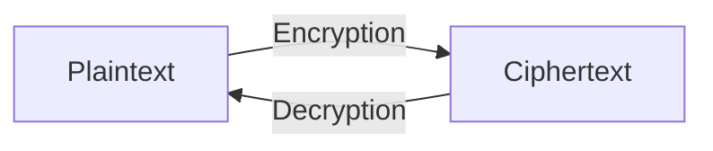

> **الهدف من الـ Section ده:**  
> هتفهم الـ Cryptography أساساً إيه، وإيه أهم المصطلحات اللي هتقابلك في كل موضوع جاي (Plaintext, Ciphertext, Key, Algorithm...)، وليه الـ Algorithm ممكن يكون معروف للعامة بينما الـ Key لازم يفضل سري. الـ Section ده هو الأساس اللي كل الـ Sections الجاية هتبني عليه.


## Table of Contents
- [What is Cryptography?](#what-is-cryptography)
- [Without Encryption vs With Encryption](#without-encryption-vs-with-encryption)
- [Important Terms in Cryptography](#important-terms-in-cryptography)
- [Algorithm vs Key — Who Stays Secret?](#algorithm-vs-key--who-stays-secret)
- [The Conceptual Formula](#the-conceptual-formula)
- [Key Space](#key-space)
- [A Historical Note: Steganography](#a-historical-note-steganography)
- [Summary](#summary)
- [SOC Analyst Perspective](#soc-analyst-perspective)

---

## What is Cryptography?

الـ **Cryptography** هي علم وفن تأمين المعلومات عن طريق تحويلها لصيغة مش مقروءة للأشخاص الغير مخولين.

الهدف منها إنها تضمن إن البيانات تكون:

| الخاصية | المعنى |
|---|---|
| **Confidential** | محدش يشوفها غير صاحبها |
| **Authentic** | البيانات فعلاً جاية من المصدر الصح |
| **Unaltered** | محدش عدّل فيها في الطريق |

> [!NOTE]
> المبادئ التلاتة دي هي جزء بسيط من مجموعة أكبر من الـ **Security Properties** (Confidentiality, Integrity, Authentication, Non-repudiation, Key Exchange) هنشرحها بالتفصيل الكامل في الـ Section الجاي، وكل موضوع تشفير هنتكلم عنه بعد كده هيتقاس عليها.

> [!NOTE]
> الجملة: `Ygneqog vq Eadgt Ugewtkva Htkgpfu` — دي مش كلام فاضي، دي جملة متشفرة بالـ **Caesar Cipher** بـ Shift قيمته 2. لو فككت الشفرة هتلاقي: **"Welcome to Cyber Security Friends"**. ده بيوضح إن لو معرفتش الـ Algorithm أو الـ Key، مش هتقدر تفك الشفرة حتى لو الجملة قدامك بالكامل.

---

## Without Encryption vs With Encryption

قبل ما ندخل في المصطلحات، خلينا نفهم ليه أصلاً محتاجين الـ Cryptography بمثال بسيط:

| الحالة | التشبيه | الوصف |
|---|---|---|
| **من غير Encryption** | زي **كارت بوستال (Postcard)** | أي حد يشيله في الطريق يقدر يقراه بسهولة — الباسوردات، الرسائل، بيانات البنك كلها بتبقى مكشوفة |
| **مع Encryption** | زي **خزنة عالية الأمان (High-Security Vault)** | حتى لو حد اعترض البيانات وهي ماشية، هتبان له كلام مالوش معنى (Gibberish)، والسرية (Confidentiality) بتفضل محفوظة |

---

## Important Terms in Cryptography

دي المصطلحات الأساسية اللي لازم تحفظها وتفهمها كويس، لأنها هتتكرر في كل موضوع جاي:



| المصطلح | التعريف |
|---|---|
| **Plaintext** | النص الأصلي المقروء — اللي بتقرأه دلوقتي |
| **Ciphertext** | النص المشفر — مش مقروء للإنسان العادي |
| **Encryption** | عملية تحويل الـ Plaintext لـ Ciphertext |
| **Decryption** | عملية إرجاع الـ Ciphertext لـ Plaintext |
| **Algorithm** | مجموعة القواعد العلنية اللي بيتبنى عليها نظام التشفير |
| **Cryptanalysis** | علم كسر خوارزميات التشفير |
| **Key** | قيمة رقمية بطول محدد بالـ Bits — هي الجزء السري في التشفير |
| **Key Space** | عدد القيم الممكنة اللي ممكن تتكون منها الـ Key |

---

## Algorithm vs Key — Who Stays Secret?

> [!IMPORTANT]
> الـ **Algorithm** بيكون معروف للعامة — يعني الكل عارف إن Caesar Cipher بيعمل Shift، وإن AES بيشتغل بطريقة معينة معروفة ومنشورة رسمياً. اللي بيفرق فعلياً هو الـ **Key** اللي المفروض يكون سري. لو حد عرف الـ Key وعارف الـ Algorithm، هيقدر يفك أي حاجة مشفرة بيهم.

> [!TIP]
> ده مبدأ أساسي في الـ Cryptography الحديثة اسمه **Kerckhoffs's Principle**: نظام التشفير المفروض يفضل آمن حتى لو كل حاجة فيه معروفة **إلا الـ Key**. عشان كده الخوارزميات القوية (زي AES) بتكون منشورة ومتاحة للجميع يفحصوها، والأمان بيعتمد بالكامل على سرية الـ Key مش على إخفاء طريقة عمل الخوارزمية.

---

## The Conceptual Formula

كل اللي اتكلمنا عنه فوق ممكن يتلخص في معادلة بسيطة:

```
Ciphertext = Encrypt(Plaintext, Key)
Plaintext  = Decrypt(Ciphertext, Key)
```

> [!TIP]
> ارجع للمعادلة دي كل ما تتلخبط في أي موضوع تشفير جاي — كل نوع تشفير هنشرحه (Symmetric, Asymmetric) هو أساساً طريقة مختلفة لتنفيذ نفس المعادلة دي، بس بيختلفوا في نوع الـ Key المستخدم وعدده.

---

## Key Space

الـ **Key Space** هو عدد القيم الممكنة اللي ممكن تتكون منها الـ Key، وده بيحدد بشكل مباشر قوة التشفير ضد هجمات زي الـ Brute Force.

| طول الـ Key | عدد التركيبات الممكنة |
|---|---|
| **56-bit** | تقريباً 72 كوادريليون تركيبة ممكنة (72,000,000,000,000,000) |
| **128-bit** | عدد خيالي جداً، أكبر بمراحل من الـ 56-bit |

> [!NOTE]
> كل ما الـ Key طال بالـ Bits، كل ما عدد التركيبات الممكنة زاد بشكل **أُسّي (Exponential)** مش خطي. هنتكلم بالتفصيل عن قوة الخوارزميات المختلفة (Algorithm Strength) في مواضيع لاحقة.

---

## A Historical Note: Steganography

قصة طريفة من التاريخ: الناس قديماً كانوا بيحلقوا راس العبد، يكتبوا الرسالة على راسه، يستنوا الشعر يطول، وبعدين يبعتوه للطرف التاني. الطرف التاني يحلق راسه ويقرأ الرسالة.

> [!WARNING]
> ده مثال قديم على **Steganography** مش **Cryptography** — والفرق مهم جداً: الـ Steganography هي فن **إخفاء وجود** الرسالة أصلاً (محدش يعرف إن فيه رسالة من الأساس)، بينما الـ Cryptography هي فن **تشفير محتوى** رسالة معروف وجودها بحيث محدش يقدر يقراها من غير الـ Key.

---

## Summary

- الـ Cryptography هي علم وفن تأمين المعلومات عن طريق تحويلها لصيغة مش مقروءة للأشخاص الغير مخولين
- بتضمن إن البيانات تكون: **Confidential, Authentic, Unaltered**
- أهم المصطلحات: **Plaintext, Ciphertext, Encryption, Decryption, Algorithm, Cryptanalysis, Key, Key Space**
- **الـ Algorithm معروف للعامة، الـ Key هو الجزء السري** — ده أساس أمان أي نظام تشفير حديث
- المعادلة المختصرة لكل حاجة: `Ciphertext = Encrypt(Plaintext, Key)` و `Plaintext = Decrypt(Ciphertext, Key)`
- كل ما الـ Key Space كبر، كل ما هجمات الـ Brute Force بقت أصعب بشكل أُسّي
- الـ Cryptography مختلفة عن الـ Steganography — الأولى بتشفّر المحتوى، والتانية بتخبي وجود الرسالة نفسها

---

## SOC Analyst Perspective

- لما تحلل أي Malware أو Traffic مشفر، أول سؤال تسأله لنفسك: **"إيه الـ Algorithm المستخدم؟"** — لأنه غالباً معروف ومنشور، والتحدي الحقيقي هو الوصول للـ Key أو كسره
- من زاوية الـ Threat Hunting: لو لقيت بيانات غريبة الشكل في ملف أو Traffic، اسأل نفسك الأول لو هي **Encrypted** (محتوى مشفر ظاهر) ولا **Steganographic** (مخبأة جوه ملف تاني زي صورة أو صوت) — الفرق ده بيغيّر طريقة التحليل بالكامل
- MITRE ATT&CK: تقنية **T1027.003 (Steganography)** بتوصف استخدام مهاجمين لإخفاء Payloads خبيثة جوه ملفات عادية (صور، مستندات) — ده تطبيق مباشر للفرق اللي شرحناه بين Cryptography وSteganography
- مبدأ Kerckhoffs's Principle مهم جداً في تقييم أي أداة أمان جديدة تستخدمها الشركة — لو أداة بتعتمد على إخفاء طريقة عملها (Security through Obscurity) بدل ما تعتمد على سرية الـ Key بس، ده علامة تحذير (Red Flag) على جودة التصميم الأمني بتاعها
