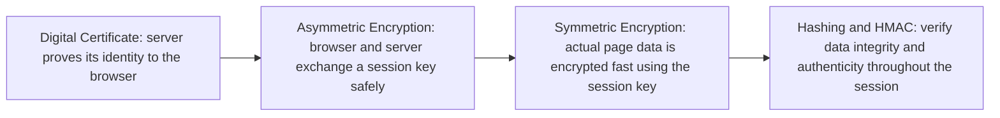

> **الهدف من الـ Section ده:**  
> تاخد نظرة سريعة (Overview) على رحلة الـ Cryptography كلها من الأول للآخر — كل موضوع شغال إزاي باختصار، بيحقق إيه من الـ Security Properties، إيه اللي مبيحققوش، وإزاي المشكلة دي اتحلت في الموضوع اللي بعده. الملف ده مش بديل عن التفاصيل الكاملة في كل Note لوحدها، هو خريطة ذهنية (Mental Map) تقرأها في دقايق وتفهم بيها الصورة الكاملة قبل ما تدخل في التفاصيل.

## Table of Contents
- [How to Read This Map](#how-to-read-this-map)
- [Security Properties — The 5 Measures](#security-properties--the-5-measures)
- [1. Symmetric Encryption](#1-symmetric-encryption)
- [2. Asymmetric Encryption](#2-asymmetric-encryption)
- [3. Hashing](#3-hashing)
- [4. HMAC](#4-hmac)
- [5. Digital Signature](#5-digital-signature)
- [6. Digital Certificate & CA](#6-digital-certificate--ca)
- [The Full Picture — Quick Reference Table](#the-full-picture--quick-reference-table)
- [Where It All Comes Together: TLS/HTTPS Handshake](#where-it-all-comes-together-tlshttps-handshake)
- [Summary](#summary)

---

## How to Read This Map

كل موضوع تحت هيتشرح بنفس الأربع نقط دايماً:

- **شغال إزاي (باختصار):** جملة أو اتنين بس، مش شرح تفصيلي
- **بيحقق إيه:** من الـ 5 Security Properties
- **مبيحققش إيه:** الفجوة أو المشكلة اللي لسه موجودة
- **اتحلت إزاي:** الموضوع اللي جاي بعده وهيسدّ الفجوة دي

> [!NOTE]
> لو محتاج التفاصيل الكاملة (الخطوات، الأمثلة، الجداول، الـ Diagrams)، ارجع للـ Note المخصصة لكل موضوع. الملف ده بس للربط والـ Big Picture.

---

## Security Properties — The 5 Measures

قبل ما نبدأ الرحلة، لازم تكون فاهم الـ 5 مقاييس اللي هنقيس بيهم كل موضوع:

| Property | بيجاوب على السؤال |
|---|---|
| **Confidentiality** | مين اللي يقدر يقرا البيانات؟ |
| **Integrity** | هل البيانات اتغيرت؟ |
| **Authentication** | مين ده فعلاً؟ |
| **Non-repudiation** | هل يقدر ينكر إنه عمل ده؟ |
| **Key Exchange** | إزاي نتفق على سر بأمان؟ |

---

## 1. Symmetric Encryption

- **شغال إزاي:** نفس الـ Key بيتستخدم للتشفير وفك التشفير بين الطرفين
- **بيحقق:** ✅ Confidentiality
- **مبيحققش:** ❌ Key Exchange (دي أصلاً مشكلته مش حله) — إزاي أوصّل الـ Key بأمان لطرف بعيد؟ ❌ Integrity, Authentication, Non-repudiation
- **اتحلت إزاي:** مشكلة الـ **Key Exchange** اتحلت في **Asymmetric Encryption** اللي جاي

---

## 2. Asymmetric Encryption

- **شغال إزاي:** كل طرف عنده زوج مفاتيح (Public + Private). تشفير بالـ Public Key، وفك تشفير بالـ Private Key المقابل
- **بيحقق:** ✅ Confidentiality, ✅ Key Exchange, ✅ Authentication (جزئياً عبر التوقيع), ✅ Non-repudiation (جزئياً عبر التوقيع)
- **مبيحققش:** ❌ Integrity لوحده (محتاج Hashing/Signature)، وفيه مشكلة جديدة: **إزاي أثق إن الـ Public Key ده فعلاً بتاع صاحبه؟** (Identity Binding Problem)
- **اتحلت إزاي:** مشكلة الـ **Integrity** اتحلت في **Hashing**، ومشكلة الـ **Identity Binding** اتحلت لاحقاً في **Digital Certificate & CA**

---

## 3. Hashing

- **شغال إزاي:** دالة اتجاه واحد بتاخد أي Input وتنتج Output ثابت الحجم (Hash)، مفيش Key ومفيش رجعة
- **بيحقق:** ✅ Integrity بس
- **مبيحققش:** ❌ Authentication — أي حد يقدر يحسب نفس الـ Hash، فمهاجم نشط يقدر يعدّل البيانات والـ Hash مع بعض من غير ما يتكشف
- **اتحلت إزاي:** مشكلة الـ **Authentication** اتحلت في **HMAC**

---

## 4. HMAC

- **شغال إزاي:** زي الـ Hashing بالظبط، بس بيدخل Secret Key مشترك جوه عملية الحساب: `HMAC = hash(key, message)`
- **بيحقق:** ✅ Integrity, ✅ Authentication
- **مبيحققش:** ❌ Non-repudiation (الطرفين عندهم نفس الـ Key فمحدش يقدر يثبت مين بعت فعلاً)، ❌ Public Verification (لازم تعرف السر عشان تتحقق)، وكمان بيعاني من Poor Scalability
- **اتحلت إزاي:** مشكلة الـ **Non-repudiation والـ Public Verification** اتحلت في **Digital Signature**

---

## 5. Digital Signature

- **شغال إزاي:** توقيع بالـ Private Key بتاع المرسل، وتحقق بالـ Public Key المتاح للجميع
- **بيحقق:** ✅ Integrity, ✅ Authentication, ✅ Non-repudiation
- **مبيحققش:** ❌ Confidentiality (الرسالة تفضل مقروءة)، وفيه نفس مشكلة الـ Asymmetric القديمة رجعت تاني: **التوقيع بيثبت الربط بالمفتاح، لكن مش بيثبت إن المفتاح ده فعلاً ملك للشخص المُدّعى**
- **اتحلت إزاي:** مشكلة الـ **Identity Binding** اتحلت نهائياً في **Digital Certificate & CA**

---

## 6. Digital Certificate & CA

- **شغال إزاي:** وثيقة موقّعة من طرف ثالث موثوق (Certificate Authority) بتربط Public Key بهوية حقيقية موثّقة
- **بيحقق:** ✅ Authentication (الهدف الأساسي)، ✅ Integrity (غير مباشر عبر توقيع الـ CA)، ✅ Non-repudiation (غير مباشر)
- **مبيحققش:** ❌ Confidentiality، والثقة نفسها **Policy-Based مش Mathematical** — يعني لو حد زرع Root CA خبيثة في جهازك، النظام كله بينهار
- **اتحلت إزاي:** دي آخر حلقة في السلسلة — كل المشاكل اللي ظهرت من الأول اتحلت لحد هنا، والباقي بقى مسؤولية إدارية/تشغيلية (حماية الـ Trust Store، مراقبة الشهادات المشبوهة)

---

## The Full Picture — Quick Reference Table

| الموضوع | بيحقق | مبيحققش (المشكلة) | حلها في |
|---|---|---|---|
| **Symmetric Encryption** | Confidentiality | Key Exchange | Asymmetric Encryption |
| **Asymmetric Encryption** | Confidentiality, Key Exchange, Authentication*, Non-repudiation* | Integrity / Identity Binding | Hashing / Digital Certificate |
| **Hashing** | Integrity | Authentication | HMAC |
| **HMAC** | Integrity, Authentication | Non-repudiation, Public Verification | Digital Signature |
| **Digital Signature** | Integrity, Authentication, Non-repudiation | Confidentiality / Identity Binding | (خارج نطاق التوقيع) / Digital Certificate |
| **Digital Certificate & CA** | Authentication, Integrity*, Non-repudiation* | Confidentiality, Policy-based trust risk | إدارة تشغيلية (Trust Store Hardening) |

*(* = بشكل جزئي أو غير مباشر)*

---

## Where It All Comes Together: TLS/HTTPS Handshake

كل المواضيع دي مش نظرية منفصلة — بتتجمع مع بعضها فعلياً في كل مرة تفتح فيها موقع بـ **HTTPS**:

1. **Certificate:** السيرفر بيقدّم شهادته عشان يثبت هويته
2. **Asymmetric Encryption:** المتصفح والسيرفر بيستخدموا الـ Public/Private Keys عشان يتفقوا على Session Key بأمان
3. **Symmetric Encryption:** باقي نقل البيانات (الصفحة، الصور، إلخ) بيتم بالـ Session Key دا بسرعة عالية
4. **Hashing/HMAC:** بيتأكدوا إن البيانات ما اتغيرتش طول الجلسة

> [!TIP]
> ده بالظبط سر قوة الـ Hybrid Design — كل موضوع من اللي درسناه بياخد دوره في اللحظة المناسبة، مش تقنية واحدة بتعمل كل حاجة.

---

## Summary

- الرحلة كلها بدأت من مشكلة واحدة: **إزاي نأمّن البيانات؟**
- كل حل جاب معاه مشكلة جديدة، وكل مشكلة جديدة جابت حل تاني بعدها
- الترتيب المنطقي الكامل: **Symmetric → Asymmetric → Hashing → HMAC → Digital Signature → Digital Certificate & CA**
- في الآخر، كل المفاهيم دي مش منفصلة — بتشتغل مع بعضها في نظام واحد متكامل زي TLS/HTTPS
- افهم كل موضوع لوحده كويس، لكن الأهم إنك تفهم **ليه** جه بعد اللي قبله، مش بس **إزاي** بيشتغل
