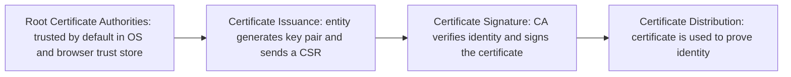

> **الهدف من الـ Section ده:**  
> هتفهم الـ Digital Certificate إيه، ومين اللي بيصدرها (Certificate Authority)، وإزاي العملية دي بتحل مشكلة الـ Identity Binding اللي ظلت معلقة من موضوعين فاتوا (Asymmetric Encryption و Digital Signature). وده آخر حلقة في السلسلة كلها اللي هتفهمك إزاي كل حاجة درسناها بتتجمع مع بعضها في اتصال HTTPS حقيقي.

## Table of Contents
- [Recap: The Identity Binding Problem](#recap-the-identity-binding-problem)
- [What is a Digital Certificate?](#what-is-a-digital-certificate)
- [What a Certificate Contains](#what-a-certificate-contains)
- [How Certificates Work — Step by Step](#how-certificates-work--step-by-step)
- [Which Security Properties Does It Achieve?](#which-security-properties-does-it-achieve)
- [Policy-Based Trust, Not Mathematical Trust](#policy-based-trust-not-mathematical-trust)
- [What Can Still Go Wrong](#what-can-still-go-wrong)
- [Summary](#summary)
- [SOC Analyst Perspective](#soc-analyst-perspective)

---

## Recap: The Identity Binding Problem

في موضوعي **Asymmetric Encryption** و **Digital Signature**، وصلنا لنفس المشكلة مرتين: التشفير والتوقيع الرقمي بيثبتوا إن حاجة معينة اتعملت بمفتاح معين، لكن **محدش منهم بيثبت إن المفتاح ده فعلاً ملك للشخص اللي بيدّعي إنه صاحبه**.

> [!IMPORTANT]
> تخيل الهجوم ده: بوب بيعمل زوج مفاتيح، وبيقول لأليس "ده الـ Public Key بتاعي" وهو بيكدب — بيقول ده Public Key بتاع حد تاني (Impersonation). بوب يبدأ يوقّع رسائل، وكل حد بيتحقق منها بيصدّق إنها من الشخص التاني، لأن التوقيع رياضياً "صحيح". **دي مش مشكلة رياضية في التشفير نفسه — دي مشكلة Identity Binding.**

السؤال اللي محتاجين نجاوب عليه: **إزاي نربط Public Key بهوية حقيقية في العالم الواقعي بطريقة موثوقة؟**

---

## What is a Digital Certificate?

الـ Digital Certificate وثيقة إلكترونية زي **الباسبور** — بتثبت إن الـ Public Key ده فعلاً بيخص الشخص أو الشركة دي.

بشكل أدق: هي **بيان موقّع رقمياً** بيقول "الـ Public Key ده بيخص الهوية دي"، وموقّع من جهة موثوقة اسمها **Certificate Authority (CA)**.

> [!NOTE]
> فكّر في الـ CA كإنها "الحكومة اللي بتطبع الباسبور". أنت مش بتثق في الباسبور نفسه كورقة، أنت بتثق فيه لأن جهة معترف بيها (الحكومة) هي اللي أصدرته وضمنت صحته.

---

## What a Certificate Contains

الشهادة مش مجرد Public Key لوحده — هي حزمة معلومات كاملة:

| العنصر | الوصف |
|---|---|
| **Subject Identity** | هوية صاحب الشهادة (زي اسم الدومين أو اسم الشركة) |
| **Subject Public Key** | الـ Public Key بتاع صاحب الشهادة |
| **Validity Period** | فترة صلاحية الشهادة (تاريخ بداية ونهاية) |
| **Issuer Identity** | هوية الجهة اللي أصدرت الشهادة (الـ CA) |
| **Metadata** | معلومات إضافية (زي السياسات والقيود على الاستخدام) |
| **Digital Signature of the Issuer** | توقيع الـ CA نفسها على كل المحتوى ده |

> [!IMPORTANT]
> العنصر الأخير هو أساس الثقة كله — الـ CA بتوقّع على كل بيانات الشهادة بمفتاحها الخاص هي، فأي تعديل في أي عنصر من العناصر دي هيكسر التوقيع فوراً ويبان إن الشهادة اتلاعب فيها أو مزوّرة.

---

## How Certificates Work — Step by Step

### Step 1: Root Certificate Authorities (CAs)

الـ Public Key بتاع الـ **Root CA** هو مفتاح **موثوق بشكل افتراضي (Trusted by Default)** من غير ما يحتاج أي تحقق إضافي — لأنه أصلاً مخزّن جوه **Trust Store** مدمج في نظام التشغيل والمتصفح.

**فين تلاقي الـ Trust Store ده عملياً:**

- **Windows Certificate Store:** اضغط `Win + R` → اكتب `certmgr.msc` → Enter → ده بيفتح Current User Certificate Store
- **Browser-specific stores:** افتح Chrome → روح لـ `chrome://settings/security` → انزل لـ **Manage certificates** → دوس عليها → غالباً هيفتحلك نفس الـ Windows Certificate Manager

### Step 2: Certificate Issuance

الكيان (Entity) اللي عايز يعمل شهادة بيعدّي بمرحلتين:

**2.1 Entity Generates a Key Pair:**
- **Private Key** (سري، مايتشاركش)
- **Public Key** (اللي هيتصدّق عليه)

**2.2 Certificate Signing Request (CSR):**
الكيان بيبعت للـ CA طلب يحتوي على:
- الـ Public Key
- معلومات الهوية (اسم الدومين، اسم الشركة، إلخ)
- **إثبات إنه فعلاً معاه الـ Private Key المقابل**

> [!NOTE]
> الـ CSR هو "بيانات هوية غير موقّعة + Public Key" — لسه ماحصلش أي توثيق، ده بس الطلب.

### Step 3: Certificate Signature

الـ CA بتتحقق من هوية الكيان (بطرق تختلف حسب نوع الشهادة — من مجرد تأكيد ملكية الدومين، لحد تحقق مستندات رسمية كاملة للشركات)، وبعدين بتوقّع الشهادة بمفتاحها الخاص.

### Step 4: Certificate Distribution

الشهادة الموقّعة دلوقتي جاهزة تتوزّع وتُستخدم — زي ما هيحصل في أي اتصال HTTPS.

---

## Which Security Properties Does It Achieve?

| Security Property | بيحققه؟ | إزاي |
|---|---|---|
| Confidentiality | ❌ | الشهادة نفسها بيانات علنية، أي حد يقدر يشوفها ويحملها |
| Integrity | ✅ (غير مباشر) | الشهادة موقّعة رقمياً من الـ CA، فأي تعديل فيها هيكسر التوقيع ويتكشف فوراً |
| **Authentication** | ✅ (الهدف الأساسي) | الشهادة بتربط الـ Public Key بهوية حقيقية موثّقة من طرف ثالث معترف بيه |
| Non-repudiation | ✅ (غير مباشر) | الـ CA وقّعت الشهادة بمفتاحها الخاص، فمقدرش تنكر إنها أصدرتها |
| Key Exchange | ❌ (غير مباشر) | مالوش علاقة مباشرة، لكنه بيمكّن عملية الـ Key Exchange تحصل **بثقة** (زي في TLS Handshake) |

> [!IMPORTANT]
> **Digital Certificate → بيحقق Authentication بشكل أساسي**، وبيبني على كل المفاهيم اللي درسناها قبل كده (Asymmetric Encryption + Digital Signature) عشان يحل مشكلة الـ **Identity Binding** اللي كانت معلقة من الأول.

---

## Policy-Based Trust, Not Mathematical Trust

> [!WARNING]
> نقطة مفاهيمية مهمة جداً: الثقة في الـ Root CA **مش إثبات رياضي إجباري** زي باقي المفاهيم اللي درسناها (Hashing, Digital Signatures). هي **"Policy-Based Trust"** — يعني إحنا بنثق في الـ CA لأن نظام التشغيل أو المتصفح "قرر" يحطها جوه الـ Trust Store الافتراضي، مش لأن فيه معادلة رياضية بتجبرنا نثق فيها.

ده معناه عملياً: لو حد قدر يخترق نظام تشغيلك ويضيف **Root CA خبيثة** جوه الـ Trust Store بتاعك، هيقدر يصدّر شهادات "موثوقة" لأي دومين يحبه، ومتصفحك هيثق فيها تلقائياً من غير أي تحذير — لأن الثقة أساسها Policy مش رياضيات.

---

## What Can Still Go Wrong

حتى مع وجود نظام الشهادات الكامل، فيه سيناريوهات لازم تكون واعي بيها:

| السيناريو | الخطر |
|---|---|
| **Self-Signed Certificates** | شهادة موقّعة من صاحبها نفسه مش من CA موثوقة — مفيش طرف ثالث بيضمن الهوية |
| **Expired Certificates** | الشهادة انتهت صلاحيتها، فمعندهاش ضمان إنها لسه ممثلة الهوية الحقيقية |
| **Compromised CA** | لو الـ CA نفسها اتخترقت، أي شهادة أصدرتها بقت مشكوك فيها |
| **Malicious Root CA Installation** | مهاجم يضيف Root CA خبيثة جوه جهاز الضحية عشان يعمل MITM من غير ما المتصفح يحذّر |

> [!TIP]
> عشان كده، أي متصفح حديث بيدّيك تحذير واضح (زي "Your connection is not private") لو قابل شهادة Self-Signed أو منتهية الصلاحية أو صادرة من CA مش موجودة في الـ Trust Store — خد التحذير ده بجدية دايماً.

---

## Summary

- الـ Digital Certificate وثيقة إلكترونية بتربط Public Key بهوية حقيقية، موقّعة من جهة موثوقة اسمها **CA (Certificate Authority)**
- محتوياتها: Subject Identity, Subject Public Key, Validity Period, Issuer Identity, Metadata, Digital Signature of the Issuer
- عملية الإصدار: Root CA موثوقة افتراضياً → الكيان يعمل Key Pair ويبعت CSR → الـ CA تتحقق وتوقّع → الشهادة تتوزّع وتُستخدم
- بيحقق **Authentication** بشكل أساسي، وبيبني فوق مفاهيم الـ Asymmetric Encryption والـ Digital Signature
- الثقة في الـ Root CA هي **Policy-Based** مش **Mathematical** — يعني معتمدة على قرار نظام التشغيل/المتصفح، مش على إثبات رياضي إجباري
- المخاطر المحتملة: Self-Signed Certificates, Expired Certificates, Compromised CA, أو Root CA خبيثة متزرّعة في جهازك
- ده الحل النهائي لمشكلة الـ **Identity Binding** اللي بدأت من موضوع الـ Asymmetric Encryption

---

## SOC Analyst Perspective

- تحقق دايماً من **Certificate Chain of Trust** الكامل أثناء أي تحليل TLS Traffic — مش بس الشهادة النهائية، لازم تتأكد إن السلسلة كلها لحد الـ Root CA سليمة وموثوقة
- MITRE ATT&CK: تقنية **T1553.004 (Install Root Certificate)** بتوصف بالظبط سيناريو المهاجم اللي بيزرع Root CA خبيثة جوه جهاز الضحية عشان يعمل **MITM Attack** على كل الاتصالات المشفرة من غير ما المتصفح يحذّر
- من أهم مؤشرات الاختراق (IOCs) في بيئة الشركات: وجود **Root Certificates غير معروفة أو غير مصرح بيها** جوه الـ Trust Store بتاع أجهزة الموظفين — ده لازم يترصد بشكل دوري كجزء من الـ Endpoint Hardening
- أدوات عملية: `openssl s_client -connect domain:443 -showcerts` بيدّيك تفاصيل كاملة عن سلسلة الشهادات لأي دومين، و`certmgr.msc` أو `chrome://settings/security` بيسمحولك تراجع الـ Trust Store المحلي بتاع أي جهاز أثناء الـ Incident Response
