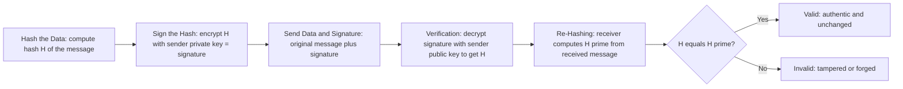

> **الهدف من الـ Section ده:**  
> هتفهم الـ Digital Signature إيه، وإزاي شغالة خطوة بخطوة، وإزاي بتضمن Integrity + Authentication + Non-repudiation مع بعض — وده بالظبط حل مشاكل HMAC اللي اتكلمنا عنها. وفي الآخر هتشوف إيه المشكلة الجديدة اللي لسه محتاجة حل.

## Table of Contents
- [Recap: What HMAC Couldn't Solve](#recap-what-hmac-couldnt-solve)
- [What is a Digital Signature?](#what-is-a-digital-signature)
- [How Digital Signatures Work — Step by Step](#how-digital-signatures-work--step-by-step)
- [Which Security Properties Does It Achieve?](#which-security-properties-does-it-achieve)
- [Why This Is Cryptographically Powerful](#why-this-is-cryptographically-powerful)
- [What Digital Signatures Do NOT Guarantee](#what-digital-signatures-do-not-guarantee)
- [Real-World Use Cases](#real-world-use-cases)
- [The Problem That's Still Not Solved](#the-problem-thats-still-not-solved)
- [Summary](#summary)
- [SOC Analyst Perspective](#soc-analyst-perspective)

---

## Recap: What HMAC Couldn't Solve

في موضوع **HMAC** وصلنا لمشكلة كبيرة: بما إن الـ Secret Key مشترك بين الطرفين، مفيش **Non-repudiation** (كل طرف يقدر ينكر أو يتهم التاني)، ومفيش **Public Verification** (لازم تعرف السر عشان تتحقق).

كنا محتاجين آلية تحقق 3 حاجات مع بعض:
- بس طرف واحد يقدر ينشئ الإثبات
- أي حد يقدر يتحقق منه من غير ما يعرف سر
- المرسل مايقدرش ينكر إنه بعتها

> [!TIP]
> ده بالظبط اللي **Digital Signature** جاي يحله، باستخدام نفس فكرة الـ Asymmetric Encryption اللي شرحناها قبل كده — بس هنا بنستخدمها بشكل معكوس (التوقيع بالـ Private، والتحقق بالـ Public).

---

## What is a Digital Signature?

الـ Digital Signature هو **توقيع إلكتروني**: صاحبه بيستخدم الـ **Private Key** بتاعه عشان يوقّع على البيانات، وأي حد تاني يقدر يتحقق من التوقيع ده باستخدام الـ **Public Key** بتاعه.

> [!IMPORTANT]
> دي دليل رياضي إن **صاحب Private Key معين وافق (approve) على رسالة معينة**، والدليل ده أي حد يقدر يتحقق منه.

---

## How Digital Signatures Work — Step by Step

1. **Hashing the Data:** السيستم بيحسب الـ Hash (H) للملف أو الرسالة
2. **Signing the Hash:** المُرسِل بيشفّر (يوقّع على) الـ Hash بالـ **Private Key** بتاعه — ده هو الـ Digital Signature نفسه
3. **Sending Data + Signature:** البيانات الأصلية + التوقيع بيتبعتوا مع بعض. مفيش سرية مطلوبة هنا، البيانات ممكن تكون مقروءة
4. **Verification:** المستقبِل بيفك تشفير التوقيع باستخدام الـ **Public Key** بتاع المرسل، فيطلعله الـ H الأصلي
5. **Re-Hashing:** المستقبِل بيحسب Hash جديد (H') من البيانات اللي وصلتله فعلياً
6. **Comparison:** لو `H == H'` يبقى كل حاجة تمام (Valid)، ولو مختلفين يبقى فيه تلاعب حصل (Invalid/Tampered)

> [!IMPORTANT]
> ملاحظة مهمة جداً في اتجاه استخدام المفاتيح هنا، لأنه **معكوس** عن الاستخدام العادي للـ Asymmetric Encryption:
> - في التشفير العادي: **نشفّر بـ Public Key**، **ونفك التشفير بـ Private Key**
> - في التوقيع الرقمي: **نوقّع (نشفّر) بـ Private Key**، **ونتحقق (نفك التشفير) بـ Public Key**

---

## Which Security Properties Does It Achieve?

| Security Property | بيحققه؟ | إزاي |
|---|---|---|
| Confidentiality | ❌ | البيانات نفسها تفضل مقروءة لأي حد، التوقيع مش بيخبيها |
| **Integrity** | ✅ | أي تعديل في البيانات هيغيّر الـ Hash، فالتوقيع هيبقى غير متطابق فوراً عند المقارنة |
| **Authentication** | ✅ | بس صاحب الـ Private Key يقدر ينتج التوقيع ده، فالتحقق بالـ Public Key بيثبت هويته |
| **Non-repudiation** | ✅ | بما إن الـ Private Key ملوش نسخة تانية عند حد، صاحبه مش هيقدر ينكر إنه وقّع بعد كده |
| Key Exchange | ❌ | مالوش علاقة، الموضوع ده مختلف تماماً |

> [!IMPORTANT]
> **Digital Signature → بيحقق Integrity + Authentication + Non-repudiation** مع بعض في نفس الوقت. ده بالظبط حل الـ 3 مشاكل اللي HMAC ما قدرش يحلها.

---

## Why This Is Cryptographically Powerful

الآلية دي قوية جداً لأربع أسباب:

| السبب | التفصيل |
|---|---|
| **Only one entity could create the signature** | بس صاحب الـ Private Key يقدر ينتج توقيع صحيح |
| **Any modification breaks the hash** | أي تعديل بسيط في البيانات هيغيّر الـ Hash بالكامل (Avalanche Effect) وهيكشف التلاعب فوراً |
| **No shared secrets** | عكس HMAC تماماً — مفيش سر مشترك بين الطرفين، الـ Private Key ملوش نسخة تانية خالص |
| **Public verification is possible** | أي حد عنده الـ Public Key يقدر يتحقق من التوقيع من غير ما يحتاج يعرف أي سر |

---

## What Digital Signatures Do NOT Guarantee

بالرغم من كل القوة دي، فيه حدود مهمة جداً لازم تعرفها:

| المشكلة | التفصيل |
|---|---|
| **Confidentiality** | الرسالة تفضل مقروءة لأي حد اعترضها — التوقيع مش بيشفّر المحتوى |
| **Trust by Themselves** | التوقيع بيثبت: "ده اتوقّع بـ Private Key بتاع أليس". لكنه **مش بيثبت**: "الـ Private Key ده فعلاً ملك لأليس الحقيقية" |

> [!WARNING]
> النقطة التانية دي هي أخطر حاجة في الموضوع كله. التوقيع بيثبت الربط بين الرسالة والمفتاح، لكن **مش بيثبت هوية صاحب المفتاح نفسه**. ده بالظبط نفس الـ Identity Binding Problem اللي اتكلمنا عنها في نهاية موضوع الـ Asymmetric Encryption.

---

## Real-World Use Cases

الـ Digital Signature منتشر جداً في حياتنا اليومية من غير ما نلاحظ:

- **Emails:** للتأكد إن الإيميل فعلاً جاي من المُرسِل الصح (زي DKIM/PGP)
- **Software:** توقيع الـ `.exe` والـ Installers قبل التوزيع
- **Windows Updates:** مايكروسوفت بتوقّع كل Update عشان تضمن إنه جاي منها فعلاً
- **Drivers:** Windows مش بيسمح لأي Driver يشتغل غير لو متوقّع رقمياً
- **Linux Packages, iOS Apps:** وكتير تطبيقات وأنظمة تانية

> [!WARNING]
> **قصة الـ Drivers:** الـ Drivers بتشتغل في الـ **Kernel Space** — ده أخطر مكان في الجهاز. لو Attacker حط كود خبيث في Driver، هيكون عنده وصول كامل للجهاز كله (Full System Compromise). عشان كده Windows دلوقتي رافض يشغّل أي Driver مش متوقّع رقمياً من الشركة المنتجة — ده تطبيق عملي مباشر لمبدأ الـ Authentication و Integrity اللي اتكلمنا عنهم.

---

## The Problem That's Still Not Solved

الـ Digital Signature حل مشاكل الـ HMAC بالكامل، بس لسه فيه فجوة واحدة أساسية.

> [!IMPORTANT]
> **المشكلة:** التوقيع بيثبت رياضياً إن رسالة معينة اتوقّعت بمفتاح خاص معين، لكن **مبيثبتش** إن المفتاح ده فعلاً ملك للشخص اللي بيدّعي إنه صاحبه. لو بوب عمل زوج مفاتيح وقال "ده بتاع أليس" وهو بيكدب، أي حد يتحقق من التوقيع هيلاقيه "صحيح" رياضياً 100%، بس هيبقى مصدّق على هوية مزوّرة بالكامل.

**الجزء اللي هيحل المشكلة دي:** **Digital Certificates + Certificate Authority (CA)** — طرف ثالث موثوق بيربط الـ Public Key بهوية حقيقية موثّقة، فمحدش يقدر يدّعي إنه صاحب مفتاح مش بتاعه من غير ما ينكشف.

---

## Summary

- الـ Digital Signature = توقيع بـ Private Key + تحقق بـ Public Key
- الخطوات: Hash → Sign بالـ Private Key → إرسال البيانات + التوقيع → التحقق بالـ Public Key → إعادة حساب الـ Hash → مقارنة
- بيحقق **Integrity + Authentication + Non-repudiation** مع بعض
- قوته الأساسية: مفيش أسرار مشتركة، وأي حد يقدر يتحقق بشكل علني
- **مش بيحقق Confidentiality**، والرسالة تفضل مقروءة لأي حد
- **الأهم:** بيثبت إن الرسالة اتوقّعت بمفتاح معين، لكن مش بيثبت إن المفتاح ده فعلاً ملك للشخص المُدّعى
- استخداماته العملية منتشرة جداً: Emails, Software Signing, Windows Updates, Drivers
- **المشكلة الجديدة:** إزاي نثق إن Public Key معين فعلاً بتاع صاحبه؟ → الحل جاي في **Digital Certificates & CA**

---

## SOC Analyst Perspective

- لو شفت Executable أو Driver **غير موقّع رقمياً (Unsigned)** بيحاول يتثبت في بيئة العمل، ده Red Flag فوري لازم يترصد — الأنظمة الحديثة (زي Windows) بترفض تشغيل Drivers غير موقّعة تحديداً عشان تمنع الوصول لـ Kernel Space
- MITRE ATT&CK: تقنية **T1553.002 (Code Signing)** بتوصف استغلال المهاجمين لشهادات توقيع مسروقة أو مزوّرة عشان يخلوا الـ Malware يبان "موثوق" ويتخطى دفاعات زي Windows SmartScreen أو Antivirus
- في تحليل الإيميلات الاحتيالية (Phishing Analysis)، غياب توقيع DKIM/PGP صحيح أو وجود توقيع فاشل في التحقق (Verification Failure) هو مؤشر قوي على محاولة انتحال هوية (Spoofing)
- أدوات عملية: `signtool` على Windows و `gpg --verify` على Linux بيستخدموا للتحقق من صحة التوقيعات الرقمية على الملفات والحزم أثناء الـ Incident Investigation
