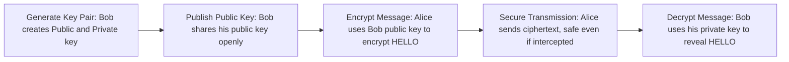

> **الهدف من الـ Section ده:**  
> هتفهم الـ Asymmetric Encryption بيشتغل إزاي بمفتاحين مختلفين، وإيه من الـ Security Properties (CIA + Non-repudiation + Key Exchange) اللي بيحققها، وليه بالرغم من إنه حل مشكلة كبيرة من مشاكل الـ Symmetric، لسه فيه مشكلة تانية محتاجة حل — وهي أساس الموضوع اللي جاي بعده.

## Table of Contents
- [What is Asymmetric Encryption?](#what-is-asymmetric-encryption)
- [The Two Keys](#the-two-keys)
- [The Four Golden Rules](#the-four-golden-rules)
- [How Asymmetric Encryption Works](#how-asymmetric-encryption-works)
- [Which Security Properties Does It Achieve?](#which-security-properties-does-it-achieve)
- [Advantages & Disadvantages](#advantages--disadvantages)
- [Common Asymmetric Algorithms](#common-asymmetric-algorithms)
- [Symmetric vs Asymmetric — Comparison](#symmetric-vs-asymmetric--comparison)
- [The Problem That's Still Not Solved](#the-problem-thats-still-not-solved)
- [Summary](#summary)
- [SOC Analyst Perspective](#soc-analyst-perspective)

---

## What is Asymmetric Encryption?

الـ Asymmetric Encryption (وبيتسمى كمان Public Key Cryptography) جاء عشان يحل **مشكلة نقل الـ Key** اللي عانى منها الـ Symmetric Encryption (زي ما شفنا في الـ Section اللي فات).

الفكرة الأساسية: بدل ما يكون فيه Key واحد مشترك بين الطرفين، كل طرف بقى عنده **زوج مفاتيح مختلف ومرتبط رياضياً ببعضه** (Mathematically Linked Key Pair).

> [!NOTE]
> ده أساس الـ Digital Signatures والـ Secure Web Browsing كله — يعني كل مرة تفتح فيها موقع بـ HTTPS، فيه Asymmetric Encryption شغالة في الخلفية.

---

## The Two Keys

| المفتاح | الوصف |
|---|---|
| **Public Key** | معروف للجميع، مفيش أي مشكلة إن أي حد يشوفه أو يوصله. بيتستخدم بس في التشفير (Encrypt) |
| **Private Key** | سري جداً، ما يخرجش من جهازك أبداً تحت أي ظرف. بيتستخدم بس في فك التشفير (Decrypt) اللي اتشفّر بالـ Public Key المقابل له |

> [!WARNING]
> لو الـ Private Key اتسرب ولو مرة واحدة، كل البيانات اللي اتشفرت بالـ Public Key المقابل له تبقى مكشوفة بالكامل، وكل عمليات التوقيع اللي هتتعمل باسمك تبقى قابلة للتزوير. حماية الـ Private Key دي أولوية أمنية قصوى.

---

## The Four Golden Rules

القاعدة الذهبية اللي المفروض تحفظها بره عن ظهر قلب:

| الهدف | المفتاح المستخدم |
|---|---|
| إرسال رسالة مشفرة | **Public Key** بتاع المستقبِل |
| فك تشفير رسالة وصلتلك | **Private Key** بتاعك إنت (المستقبِل) |
| عمل Digital Signature على ملف | **Private Key** بتاع المُرسِل |
| التحقق من صحة توقيع وصلك | **Public Key** بتاع المُرسِل |

> [!IMPORTANT]
> القاعدة الحاسمة اللي بتفرق بين الاستخدامين:
> - لو شفّرت بـ **Public Key** → الهدف هو **Confidentiality** (السرية) — بس صاحب الـ Private Key المقابل يقدر يفك التشفير
> - لو شفّرت (وقّعت) بـ **Private Key** → الهدف هو **Authenticity** (إثبات الهوية) — أي حد عنده الـ Public Key يقدر يتأكد إن صاحب الـ Private Key هو اللي وقّع

---

## How Asymmetric Encryption Works

لو أليس عايزة تبعت سر لبوب، العملية بتمشي كده:

**بالتفصيل:**

1. **Key Generation:** بوب يعمل زوج مفاتيح فريد — Public (K_pub) و Private (K_priv)
2. **Public Key Distribution:** بوب يبعت الـ K_pub بتاعه لأليس (المفتاح ده ممكن يتبعت بشكل مفتوح تماماً، مفيش خطورة)
3. **Message Encryption:** أليس تشفّر "HELLO" باستخدام K_pub بتاع بوب، فتطلع Ciphertext غير مقروء
4. **Secure Transmission:** أليس تبعت الـ Ciphertext لبوب. حتى لو مهاجم اعترضها، هتفضل Gibberish (كلام مالوش معنى)
5. **Message Decryption:** بوب يستخدم K_priv السري بتاعه عشان يفك تشفير الرسالة ويرجعها "HELLO"

> [!IMPORTANT]
> حتى لو هاكر شاف الرسالة المشفرة بالكامل، بس بوب هو اللي عنده الـ Private Key اللازم لفك تشفيرها. المهاجم مش هيقدر يعمل حاجة حتى لو الرسالة قدامه.

---

## Which Security Properties Does It Achieve?

زي ما سألنا في الـ Symmetric Encryption، خلينا نطبق نفس السؤال هنا: الـ Asymmetric Encryption بيحقق إيه من الـ 5 مبادئ (Confidentiality, Integrity, Authentication, Non-repudiation, Key Exchange)؟

| Security Property | بيحققه؟ | إزاي |
|---|---|---|
| **Confidentiality** | نعم | لما تشفّر بالـ Public Key بتاع المستقبِل |
| Integrity | لأ (لوحده) | التشفير نفسه مش بيثبت إن الرسالة ما اتغيرتش — محتاج Hashing/Signature |
| **Authentication** | نعم (جزئياً) | لما توقّع بالـ Private Key، أي حد عنده الـ Public Key يقدر يتأكد إن صاحب الـ Private Key هو اللي وقّع |
| **Non-repudiation** | نعم (جزئياً) | بما إن الـ Private Key ملوش نسخة تانية عند حد، صاحبه مش هيقدر ينكر إنه وقّع |
| **Key Exchange** | نعم | ده أساساً السبب اللي الـ Asymmetric Encryption اتعملت عشانه — حل مشكلة توصيل الـ Key بأمان |

> [!NOTE]
> لاحظ إن الـ Authentication والـ Non-repudiation هنا بييجوا من عملية **التوقيع (Signing بالـ Private Key)** مش من عملية التشفير العادي (Encrypting بالـ Public Key). الموضوع الجاي (**Digital Signatures**) هيشرح الآلية دي بالتفصيل الكامل.

مقارنة سريعة مع الـ Symmetric:

| Security Property | Symmetric | Asymmetric |
|---|---|---|
| Confidentiality | ✅ | ✅ |
| Integrity | ❌ (بدون AEAD) | ❌ (بدون Signature) |
| Authentication | ❌ | ✅ (عبر التوقيع) |
| Non-repudiation | ❌ | ✅ (عبر التوقيع) |
| Key Exchange | ❌ (مشكلته) | ✅ (حلّه) |

---

## Advantages & Disadvantages

### Advantages

- **Solves Key Distribution:** الـ Public Keys ممكن تتشارك بشكل مفتوح وآمن، مفيش خطورة من توصيلها
- **Authentication:** بتسمح بالتحقق من هوية المرسل عن طريق الـ Digital Signatures
- **Non-repudiation:** بتوفر دليل إن رسالة معينة جت من مرسل محدد وبس

### Disadvantages

- **Slower:** أبطأ بشكل ملحوظ جداً من الـ Symmetric Encryption
- **Computationally Expensive:** محتاج قوة معالجة أكبر بكتير
- **Data Size:** مش مناسب لتشفير كميات كبيرة من البيانات بشكل مباشر

> [!WARNING]
> عشان الـ Asymmetric Encryption بطيء وتكلفته الحسابية عالية، محدش بيستخدمه لتشفير بيانات ضخمة (زي ملفات أو Video streams) بشكل مباشر. بيتستخدم بس في المراحل الحرجة زي الـ Key Exchange والـ Authentication، وبعدها بيتسلّم الدور للـ Symmetric Encryption عشان ينقل البيانات الفعلية بسرعة.

### Key Applications

- **Key Exchange:** توصيل الـ Symmetric Keys بأمان
- **Digital Signatures:** ضمان الـ Integrity والـ Authenticity
- **TLS/HTTPS Handshakes:** بدء الاتصالات الآمنة عبر الويب
- **Secure Email:** تشفير وتوقيع الإيميلات (زي PGP)

---

## Common Asymmetric Algorithms

| Algorithm | ملاحظة |
|---|---|
| **RSA** | نسبة لـ Rivest, Shamir, Adleman — الأكثر شيوعاً، بيتستخدم في نقل البيانات الآمن والتوقيعات الرقمية |
| **ECC (Elliptic Curve Cryptography)** | بيوفر نفس مستوى الأمان زي RSA لكن بمفاتيح أصغر حجماً — أسرع وأكثر كفاءة، خصوصاً للأجهزة المحمولة والبيئات محدودة الطاقة |

---

## Symmetric vs Asymmetric — Comparison

| المعيار | Symmetric | Asymmetric |
|---|---|---|
| السرعة | سريع جداً | بطيء |
| نقل الـ Key | مشكلة كبيرة (Distribution Problem) | آمن وسهل (Public Key قابل للمشاركة) |
| الاستخدام المثالي | كميات كبيرة من البيانات | بيانات صغيرة، أو تبادل الـ Keys نفسها |
| عدد المفاتيح | مفتاح واحد مشترك | زوج مفاتيح (Public + Private) |

---

## The Problem That's Still Not Solved

الـ Asymmetric Encryption حل مشكلة الـ Key Distribution، بس فتح باب مشكلة جديدة تماماً.

> [!IMPORTANT]
> **المشكلة:** لو بوب عمل زوج مفاتيح، وقال لأليس "ده الـ Public Key بتاع أليس" وهو بيكدب — أليس مش هتعرف، وأي رسالة تشفّرها بالـ Public Key ده هيقدر بوب يفك تشفيرها بدل أليس الحقيقية. المشكلة دي مش مشكلة رياضية في التشفير نفسه، دي مشكلة **Identity Binding** — إزاي أتأكد إن الـ Public Key ده فعلاً بتاع الشخص اللي بيدّعي إنه بتاعه؟

**الجزء اللي هيحل المشكلة دي:** موضوع **Digital Certificates & Certificate Authority (CA)** اللي جاي بعد كده، واللي بيربط الـ Public Key بهوية حقيقية موثوقة عن طريق طرف ثالث موثوق (CA).

---

## Summary

- الـ Asymmetric Encryption بيستخدم **زوج مفاتيح مختلف**: Public Key (للتشفير) و Private Key (لفك التشفير)
- القاعدة الذهبية: تشفير بالـ Public Key = Confidentiality | توقيع بالـ Private Key = Authenticity
- بيحقق **Confidentiality, Authentication (جزئياً), Non-repudiation (جزئياً), و Key Exchange**
- عيبه الأساسي: **بطيء ومكلف حسابياً**، مش مناسب لتشفير بيانات ضخمة مباشرة
- أشهر الخوارزميات: **RSA** (الأكثر شيوعاً) و **ECC** (أسرع وأخف)
- حل مشكلة الـ Key Distribution، لكن فتح مشكلة جديدة: **إزاي نثق إن الـ Public Key فعلاً بتاع صاحبه؟** → هيتحل في موضوع الـ Digital Certificates & CA

---

## SOC Analyst Perspective

- لما تحلل Traffic فيه TLS Handshake، هتلاقي الـ Asymmetric Encryption شغال في أول الاتصال بس (Key Exchange + Authentication)، وبعد كده الاتصال بيتحول لـ Symmetric — لو شفت Handshake غريب أو Certificate غير موثوق، ده أول مكان تدوّر فيه على مشاكل
- MITRE ATT&CK: تقنيات زي **T1573.002 (Asymmetric Cryptography)** بتوصف استخدام مهاجمين للـ Asymmetric Encryption جوه قنوات الـ C2 عشان يأمّنوا الاتصال ويصعّبوا اكتشافه بالـ Deep Packet Inspection
- خطر شائع في البيئات الحقيقية: **Self-Signed Certificates** أو شهادات منتهية الصلاحية — دي علامة إن مفيش طرف ثالث موثوق (CA) بيأكد هوية السيرفر، وده بالظبط الـ Identity Binding Problem اللي اتكلمنا عنه، ولازم يتراجع فوراً كـ Suspicious Activity
- أدوات عملية: Wireshark وOpenSSL بيستخدموا لفحص تفاصيل الـ Certificate والـ Key Exchange Algorithm المستخدم في أي TLS Session أثناء الـ Incident Investigation
