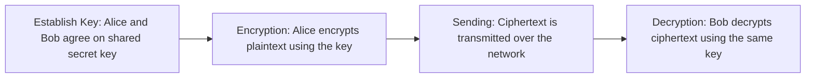

> **الهدف من الـ Section ده:**  
> هتفهم الـ Symmetric Encryption بيشتغل إزاي، وإيه من الـ Security Properties (CIA + Non-repudiation + Key Exchange) اللي بيحققها فعلاً، وليه بالرغم من سرعته وكفاءته، مش قادر يحل مشكلة الـ Key Distribution لوحده. وده أساس تفهم بعده ليه احتجنا Asymmetric Encryption و Diffie-Hellman.


## Table of Contents
- [What is Symmetric Encryption?](#what-is-symmetric-encryption)
- [How Symmetric Encryption Works](#how-symmetric-encryption-works)
- [Which Security Properties Does It Achieve?](#which-security-properties-does-it-achieve)
- [Advantages](#advantages)
- [Disadvantages — The Key Distribution Problem](#disadvantages--the-key-distribution-problem)
- [Common Symmetric Algorithms](#common-symmetric-algorithms)
- [Where Symmetric Encryption Is Used](#where-symmetric-encryption-is-used)
- [Limitations & What Comes Next](#limitations--what-comes-next)
- [Summary](#summary)
- [SOC Analyst Perspective](#soc-analyst-perspective)

---

## What is Symmetric Encryption?

الـ Symmetric Encryption هو أقدم وأبسط شكل من أشكال الـ Cryptography. الفكرة الأساسية فيه إن **نفس الـ Key** بيتستخدم في عمليتين:
- التشفير (Encryption): تحويل الـ Plaintext لـ Ciphertext
- فك التشفير (Decryption): رجوع الـ Ciphertext لـ Plaintext تاني

يعني الطرفين (المرسل والمستقبل) لازم **يكونوا عارفين نفس الـ Key من الأول** قبل ما تبدأ أي عملية اتصال آمنة.

> [!NOTE]
> فكّر فيها كإنها "قفل وباب بمفتاح واحد بس" — أي حد عنده نسخة من المفتاح ده يقدر يقفل ويفتح الباب. مفيش تفرقة بين مين اللي شفّر ومين اللي فك التشفير.

---

## How Symmetric Encryption Works

العملية بتمشي في 4 خطوات أساسية:




| الخطوة | اللي بيحصل |
|---|---|
| 1. Establish Key | أليس وبوب يتفقوا على Key سري (مثلاً Key = 123) |
| 2. Encryption | أليس تشفّر كلمة "HELLO" باستخدام الـ Key، فتطلع "XQ9#A" |
| 3. Sending | الرسالة المشفرة "XQ9#A" بتتبعت عبر الشبكة |
| 4. Decryption | بوب يستلم "XQ9#A" ويستخدم نفس الـ Key (123) عشان يرجعها "HELLO" |

> [!IMPORTANT]
> الشرط الأساسي اللي كل حاجة بتقوم عليه: **الطرفين لازم يكون عندهم نفس الـ Key بالظبط**. لو الـ Key مختلف أو اتغير حرف واحد فيه، فك التشفير هيفشل تماماً.

الصيغة الرياضية المختصرة للعملية:

```
Ciphertext = Encrypt(Plaintext, Key)
Plaintext  = Decrypt(Ciphertext, Key)
```

---

## Which Security Properties Does It Achieve?

زي ما اتكلمنا في الـ Section بتاعت **Security Properties**، فيه 5 مبادئ أساسية بنقيس عليها أي آلية Cryptographic:
**Confidentiality, Integrity, Authentication, Non-repudiation, Key Exchange**

السؤال المهم هنا: الـ Symmetric Encryption بيحقق إيه من المبادئ دي فعلاً؟

**الإجابة المباشرة: Symmetric Encryption → بيحقق Confidentiality بشكل أساسي ومباشر.**

ده هو الـ **Primary Design Goal** بتاعه من الأول للآخر. الهدف الوحيد اللي الخوارزمية اتصممت عشانه هو إن البيانات تبقى غير مقروءة لأي حد ملوش الـ Key، سواء وهي متخزنة (Data at Rest) أو وهي بتتنقل (Data in Transit).

| Security Property | بيحققه؟ |
|---|---|
| **Confidentiality** | نعم — ده الهدف الأساسي |
| Integrity | لأ (في الوضع العادي) |
| Authentication | لأ (بشكل موثوق) |
| Non-repudiation | لأ |
| Key Exchange | لأ — دي أصلاً مشكلته مش حله |

> [!NOTE]
> فيه Modern implementations زي **AES-GCM** بتضيف Authentication Tag جوه العملية نفسها، فبتديك Integrity كمان مع الـ Confidentiality (النوع ده بيتسمى AEAD - Authenticated Encryption with Associated Data). بس ده تحسين إضافي فوق الخوارزمية، مش الهدف الأساسي للـ Symmetric Encryption كمبدأ.

> [!WARNING]
> غلطة شائعة: كتير من المبتدئين بيفتكروا إن "التشفير = أمان شامل" يعني بيحقق كل حاجة (Integrity + Authentication + Non-repudiation). ده غلط. الـ Encryption لوحده بيحقق Confidentiality بس، وباقي الخصائص محتاجة آليات تانية (Hashing, HMAC, Digital Signatures) هنشرحها في الـ Sections الجاية.

---

## Advantages

الـ Symmetric Encryption قوي جداً في مجاله، ومميزاته الأساسية:

- **Efficiency (كفاءة عالية):** سريع جداً ومحتاج قوة معالجة (Computational Power) قليلة جداً مقارنة بالـ Asymmetric
- **Bulk Data:** مثالي لتشفير كميات كبيرة من البيانات — ملفات ضخمة، Streaming Video، قواعد بيانات كاملة
- **Low computational cost:** تكلفة حسابية منخفضة، يعني مناسب حتى للأجهزة اللي إمكانياتها محدودة

---

## Disadvantages — The Key Distribution Problem

بالرغم من كفاءته، الـ Symmetric Encryption بيواجه عقبة كبيرة جداً لما نتكلم عن مقياس الإنترنت الضخم.

> [!IMPORTANT]
> **The Distribution Problem:** لو أليس وبوب على طرفين مختلفين تماماً من العالم، إزاي يتفقوا على Key سري بأمان؟ لو مهاجم (Attacker) قدر يعترض الـ Key وهو بيتوصّل، النظام كله بيبقى مخترق فوراً — مش بس الرسالة دي، كل الرسائل المستقبلية كمان.

المشكلة دي هي بالظبط اللي خلت العالم يحتاج لحل زي **Diffie-Hellman Key Exchange** أو **Asymmetric Encryption**، هنشرحهم في الـ Sections الجاية.

عيوب إضافية:
- محتاج قناة آمنة منفصلة لتوصيل الـ Key (Out-of-band exchange)
- لو الـ Key واحد بيتستخدم لعدد كبير من الأطراف، صعوبة إدارة (Key Management) بتزيد بشكل كبير

---

## Common Symmetric Algorithms

| Algorithm | الحالة |
|---|---|
| **DES** | قديم جداً ومكسور (Obsolete) — ماينفعش يتستخدم دلوقتي |
| **3DES** | تحسين على DES بس متروك برضه غالباً (Mostly Deprecated) |
| **AES (Advanced Encryption Standard)** | المعيار العالمي الحالي (Global Gold Standard) — آمن وسريع، بيتستخدم في تشفير البيانات المخزنة بشكل خاص |
| **ChaCha20** | سريع جداً وخفيف على المعالج، بيتستخدم بكثرة في تطبيقات الموبايل والأجهزة محدودة الإمكانيات |

---

## Where Symmetric Encryption Is Used

- **Disk Encryption:** تشفير الهارد ديسك بالكامل (زي BitLocker, FileVault)
- **Database Encryption:** تشفير البيانات المخزنة في قواعد البيانات
- **HTTPS (after Key Exchange):** بعد ما الـ Browser والـ Server يتفقوا على Session Key عن طريق Asymmetric/Diffie-Hellman، باقي عملية نقل البيانات فعلياً بتتم بالـ Symmetric Encryption عشان السرعة

> [!TIP]
> ده بالظبط سر قوة الـ Hybrid Approach اللي بنشوفه في الـ TLS/HTTPS Handshake — بنستخدم Asymmetric للـ Authentication والـ Key Exchange في البداية (بطيء بس آمن)، وبعدين ننتقل لـ Symmetric في نقل البيانات الفعلي (سريع وكفء). هنشرح ده بالتفصيل في Section الـ HTTPS Handshake.

---

## Limitations & What Comes Next

دلوقتي وضحلنا إن الـ Symmetric Encryption بيحقق Confidentiality بس. السؤال المنطقي: طب باقي الـ Security Properties (Integrity, Authentication, Non-repudiation, Key Exchange) هنحققهم إزاي؟

كل مشكلة من مشاكل الـ Symmetric Encryption كانت سبب مباشر لاختراع تقنية جديدة تحلها. خلينا نفهم السلسلة دي مشكلة مشكلة.

### المشكلة 1: Key Distribution Problem

أليس وبوب محتاجين يتفقوا على Key سري قبل ما يبدأوا أي اتصال. لو حاولوا يبعتوه عبر الإنترنت بشكل عادي، أي مهاجم بينصت (Man-in-the-Middle) يقدر يعترضه، وبعدها كل الاتصال يبقى مكشوف بالكامل — مش رسالة واحدة بس.

> [!IMPORTANT]
> احتجنا طريقة نتفق بيها على Key سري **من غير ما نبعته فعلياً** عبر الشبكة، حتى لو حد بينصت على كل حاجة بتتبادل. ده اللي **Diffie-Hellman Key Exchange** بيحله.

### المشكلة 2: مفيش Authentication حقيقي

بما إن الطرفين عندهم نفس الـ Key بالظبط، مفيش طريقة رياضية نفرّق بيها "مين بعت الرسالة فعلاً" أو نتأكد إن الطرف التاني هو فعلاً اللي بيدّعي إنه هو.

> [!IMPORTANT]
> احتجنا آلية تسمح لطرف يثبت هويته بشكل موثوق، من غير ما يشارك سر بيعرفه الطرف التاني كمان. ده اللي **Asymmetric Encryption (Public/Private Key)** بدأ يحله.

### المشكلة 3: مفيش Integrity موثوقة

لو مهاجم عدّل في الـ Ciphertext وهو ماشي في الشبكة، ممكن يوصل للطرف التاني ويتفك تشفيره لحاجة تانية، ومفيش طريقة تلقائية تكتشف إن الداتا اتغيرت من الأساس.

> [!IMPORTANT]
> احتجنا طريقة نتأكد بيها إن البيانات ما اتغيرتش من وقت ما اتبعتت لحد ما وصلت. ده اللي **Hashing** بدأ يحله، وبعدين **HMAC** حلّه بشكل أقوى (لأنه بيربط الـ Hash بمفتاح سري فمحدش غير الطرفين يقدر يزوّره).

### المشكلة 4: مفيش Non-repudiation

بما إن الطرفين عندهم نفس الـ Key، محدش يقدر يثبت "مين بالظبط بعت الرسالة" — كل طرف يقدر ينكر وبعدين يقول "الطرف التاني هو اللي بعتها مش أنا"، ومفيش دليل قاطع يفصل بينهم.

> [!IMPORTANT]
> احتجنا آلية توفر دليل رياضي إن شخص معين وبس هو اللي وقّع أو بعت الرسالة، وميقدرش ينكر بعد كده. ده اللي **Digital Signatures** بيحله بشكل نهائي.

---

## Summary

- الـ Symmetric Encryption بيستخدم **نفس الـ Key** للتشفير وفك التشفير
- الهدف الأساسي والوحيد اللي بيحققه بشكل مباشر هو **Confidentiality**
- مش بيحقق Integrity أو Authentication أو Non-repudiation بشكل موثوق (إلا لو استخدمنا AEAD modes زي AES-GCM)
- مش بيحل مشكلة الـ Key Exchange — بالعكس، دي أكبر مشكلة بتواجهه (Key Distribution Problem)
- مميزاته: سرعة عالية، كفاءة، تكلفة حسابية منخفضة → مناسب لتشفير كميات كبيرة من البيانات
- عيوبه: صعوبة توصيل الـ Key بأمان بين الأطراف البعيدة
- أشهر الخوارزميات: **AES** (المعيار الحالي)، **ChaCha20** (للموبايل)، بينما **DES** و **3DES** أصبحوا غير آمنين

---

## SOC Analyst Perspective

- لما تشوف تشفير Symmetric في بيئة العمل (زي Disk Encryption أو Database Encryption)، افتكر إنه بيحمي الـ Confidentiality بس — لو حصل تلاعب في البيانات المشفرة، النظام مش هيكتشفه تلقائياً إلا لو فيه آلية Integrity منفصلة (زي HMAC أو AES-GCM)
- من زاوية الـ Threat Hunting: لو لقيت Key بتاع Symmetric Encryption متسرب أو ظاهر في Logs، ده Critical Incident فوري — لأن أي حد معاه الـ Key يقدر يفك تشفير كل البيانات المرتبطة بيه (مش بس اللي اتسربت وقتها)
- MITRE ATT&CK: تقنيات زي **T1573 (Encrypted Channel)** بتستخدم Symmetric Encryption جوه الـ C2 Communication عشان تخبي المحتوى من أدوات الـ Network Detection — مهم كـ Defender تراقب الـ Traffic Patterns مش بس المحتوى لما التشفير يمنعك من القراءة المباشرة
- أدوات عملية: Wireshark ممكن يساعدك تلاحظ لو فيه Symmetric Key بيتبادل بشكل غير آمن (Plaintext) في الـ Traffic — ده علامة خطر كبيرة (Red Flag) لازم تتصعّد فوراً
