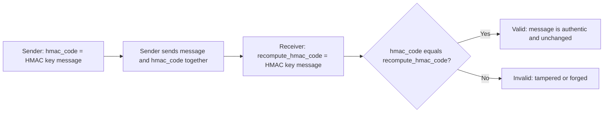

> > **الهدف من الـ Section ده:**  
> هتفهم HMAC إيه، وإزاي بيختلف عن الـ Hashing العادي، وإزاي بيضمن Integrity + Authentication مع بعض، ولسه هتشوف إيه المشكلة اللي HMAC نفسه مش قادر يحلها — وده اللي هيوصلنا للموضوع الجاي.


## Table of Contents
- [Why Hashing Alone Is Not Enough](#why-hashing-alone-is-not-enough)
- [What is HMAC?](#what-is-hmac)
- [How HMAC Solves the Authentication Gap](#how-hmac-solves-the-authentication-gap)
- [HMAC Formula & Verification Flow](#hmac-formula--verification-flow)
- [Which Security Properties Does It Achieve?](#which-security-properties-does-it-achieve)
- [Hashing vs HMAC — Comparison](#hashing-vs-hmac--comparison)
- [What HMAC Does NOT Solve](#what-hmac-does-not-solve)
- [Summary](#summary)
- [SOC Analyst Perspective](#soc-analyst-perspective)

---

## Why Hashing Alone Is Not Enough

زي ما شفنا في موضوع الـ **Hashing**، فيه مشكلة أساسية: لو مهاجم نشط (Active Attacker) قدر يعترض البيانات وهي ماشية، ويعدّل **البيانات نفسها والـ Hash المرفق معاها في نفس الوقت**، الطرف المستقبل مش هيقدر يكتشف التلاعب — لأن الـ Hash الجديد هيتطابق تماماً مع البيانات المعدّلة.

> [!IMPORTANT]
> السبب الجذري: أي حد يقدر يحسب Hash عادي لأي بيانات، لأن الـ Hash Function نفسها **مش سرية ومفيهاش Key**. يعني الـ Hashing بيثبت "اتساق البيانات مع نفسها" بس، مش بيثبت **مين** اللي أنتجها فعلاً.

---

## What is HMAC?

**HMAC (Hash-based Message Authentication Code)** بيحل المشكلة دي عن طريق دمج حاجتين مع بعض:

```
Cryptographic Hash Function + Secret Key
```

الهدف: ضمان **Integrity + Authenticity** مع بعض في نفس الوقت.

> [!NOTE]
> الفرق الجوهري بينه وبين الـ Hashing العادي: HMAC بيستخدم **مفتاح سري (Secret Key)** مشترك بين المرسل والمستقبل، بينما الـ Hashing العادي مالوش أي Key خالص.

---

## How HMAC Solves the Authentication Gap

الـ HMAC بيستخدم Secret Key مشترك بين المرسل والمستقبل. المهاجم في الحالة دي:

| المهاجم | الوضع |
|---|---|
| **1. Does NOT know the key** | مالوش أي وصول للـ Secret Key المشترك بين الطرفين الشرعيين |
| **2. Cannot generate valid HMAC** | حتى لو عدّل البيانات، مش هيقدر يحسب HMAC صحيح يتطابق مع البيانات المعدّلة، لأنه محتاج الـ Key عشان يعمل كده |

> [!IMPORTANT]
> ده بالظبط الفرق عن الـ Hashing العادي: في الـ Hashing، أي حد (حتى المهاجم) يقدر يعيد حساب الـ Hash. في الـ HMAC، بس اللي عنده الـ Secret Key يقدر يحسب HMAC صحيح.

---

## HMAC Formula & Verification Flow

الصيغة الأساسية:

```
HMAC = hash(key, message)
```

عملية الإرسال والتحقق بتمشي كده:



**بالتفصيل:**

- **Sender:** بيحسب `hmac_code = HMAC(key, message)` وبيبعت الرسالة مع الـ HMAC code مع بعض
- **Receiver:** بيعيد حساب `recompute_hmac_code = HMAC(key, message)` باستخدام نفس الـ Key
- **Compare:** لو `hmac_code == recompute_hmac_code` يبقى الرسالة صحيحة ومعتمدة (Valid)، ولو مختلفين يبقى فيه تلاعب أو تزوير حصل (Tampered or Forged)

---

## Which Security Properties Does It Achieve?

نفس الأسلوب اللي مشينا بيه في كل المواضيع اللي فاتت — خلينا نطبق الـ 5 مبادئ على HMAC:

| Security Property | بيحققه؟ | إزاي |
|---|---|---|
| Confidentiality | ❌ | HMAC مش بيخبي محتوى الرسالة، الرسالة تفضل مقروءة لأي حد |
| **Integrity** | ✅ | أي تغيير في الرسالة هيغيّر نتيجة الـ HMAC بالكامل |
| **Authentication** | ✅ | بس اللي عنده الـ Secret Key يقدر يحسب HMAC صحيح — ده الفرق الجوهري عن الـ Hashing العادي |
| Non-repudiation | ❌ | بما إن الـ Key مشترك بين الطرفين الاثنين، مفيش دليل يثبت مين بالظبط اللي بعت الرسالة |
| Key Exchange | ❌ | HMAC مبني على افتراض إن الـ Key اتوصّل بأمان قبل كده (عن طريق Diffie-Hellman أو Asymmetric Encryption) |

> [!IMPORTANT]
> **HMAC → بيحقق Integrity + Authentication مع بعض.** ده بالظبط الفرق الجوهري عن الـ Hashing العادي اللي بيحقق Integrity بس.

---

## Hashing vs HMAC — Comparison

| Feature | Hashing | HMAC |
|---|---|---|
| Key used | ❌ لأ | ✅ نعم |
| Integrity | ✅ نعم | ✅ نعم |
| Authentication | ❌ لأ | ✅ نعم |
| Attacker can recompute | ✅ نعم (مشكلة) | ❌ لأ (لازم يعرف الـ Key) |
| Password storage | ✅ نعم (مع Salting) | ❌ لأ (مش الاستخدام المناسب) |
| Message authentication | ❌ لأ | ✅ نعم |

> [!TIP]
> استخدم **Hashing** لما محتاج تتأكد إن ملف أو بيانات ما اتغيرتش (زي فحص سلامة برنامج بعد تحميله). استخدم **HMAC** لما محتاج تتأكد كمان إن الرسالة جاية من مصدر شرعي معروف (زي الـ API Requests أو الـ Session Tokens).

---

## What HMAC Does NOT Solve

بالرغم من إن HMAC حل مشكلة الـ Authentication، فيه 3 مشاكل جديدة ظهرت بسببه، خصوصاً لما نفكر في مقياس أكبر زي الإنترنت كله:

### Problem 1: No Non-repudiation

> [!IMPORTANT]
> لو أليس وبوب يشاركوا نفس الـ Secret Key: أليس تقدر تدّعي إن بوب هو اللي زوّر الرسالة، وبوب يقدر يدّعي إن أليس هي اللي زوّرتها. **مفيش دليل رياضي قاطع** يثبت مين بالظبط اللي بعتها فعلاً — لأن الاتنين قادرين يحسبوا نفس الـ HMAC.

### Problem 2: No Public Verification

> [!IMPORTANT]
> عشان تتحقق من صحة HMAC، **لازم تعرف الـ Secret Key**. ده معناه إنك مش هتقدر تثبت حاجة لطرف تالت (زي محكمة أو Auditor) من غير ما تكشفله السر نفسه — وده بيلغي فكرة الإثبات المستقل تماماً.

### Problem 3: Poor Scalability

> [!IMPORTANT]
> مشاركة الأسرار بين كل زوج أطراف **مش بتتوسع (Scale)** على مقياس الإنترنت. كل زوج أطراف محتاج قناة آمنة منفصلة لتوصيل الـ Key الخاص بيهم — وده بيرجعنا تاني لمشكلة الـ Key Distribution اللي كنا اتكلمنا عنها في الـ Symmetric Encryption.

**المشكلة الكلية:** كنا محتاجين مكانيزم يحقق 3 حاجات مع بعض:
- **بس طرف واحد** يقدر ينشئ الإثبات (مش الاتنين)
- **أي حد** يقدر يتحقق منه من غير ما يعرف سر
- المرسل **مش يقدر ينكر** إنه بعتها بعد كده

**الحل:** **Digital Signature** — عن طريق استخدام **Asymmetric Cryptography**: التوقيع بيتعمل بالـ **Private Key** (بس صاحبه يقدر يعمله)، والتحقق بيتعمل بالـ **Public Key** (أي حد يقدر يتحقق من غير ما يعرف أي سر).

---

## Summary

- الـ HMAC = Cryptographic Hash Function + Secret Key
- الفرق الجوهري عن الـ Hashing العادي: **الـ Key** — من غيره أي حد يقدر يعيد حساب الـ Hash، ومعاه بس اللي عنده الـ Key يقدر ينتج HMAC صحيح
- بيحقق **Integrity + Authentication** مع بعض
- الصيغة: `HMAC = hash(key, message)`
- **مش بيحقق Non-repudiation** — لأن الـ Key مشترك بين الطرفين، فمحدش يقدر يثبت مين بالظبط اللي بعت الرسالة
- **مش بيسمح بـ Public Verification** — لازم تعرف الـ Secret Key عشان تتحقق، فمش ممكن تثبت حاجة لطرف تالت من غيره
- **مش بيتوسع (Scale)** على مقياس كبير زي الإنترنت — كل زوج أطراف محتاج قناة آمنة منفصلة
- الحل لكل المشاكل دي: **Digital Signature** باستخدام Asymmetric Cryptography

---

## SOC Analyst Perspective

- HMAC بيتستخدم بكثرة في تأمين الـ **API Requests** — لو شفت Header زي `X-Signature` أو `Authorization: HMAC-SHA256`، ده معناه إن الطلب متوقّع يكون معتمد بمفتاح سري مشترك بين الـ Client والـ Server
- لو لاحظت في الـ Logs محاولات متكررة لطلبات API بـ HMAC signatures غلط، ده مؤشر قوي على محاولة **Brute-forcing** الـ Secret Key أو محاولة **Replay Attack** — لازم يترصد ويتصعّد
- MITRE ATT&CK: تقنيات زي **T1552 (Unsecured Credentials)** بتغطي حالات لو الـ Secret Key بتاع HMAC اتسرب أو اتخزن بشكل غير آمن — لو حصل ده، كل ضمانات الـ Authentication بتنهار فوراً
- في بيئات الـ Webhooks (زي GitHub, Stripe)، HMAC هو الآلية الأساسية للتأكد إن الطلب جاي فعلاً من المصدر المعتمد — أي SOC Analyst لازم يعرف يتحقق من صحة التوقيع ده أثناء الـ Incident Investigation
