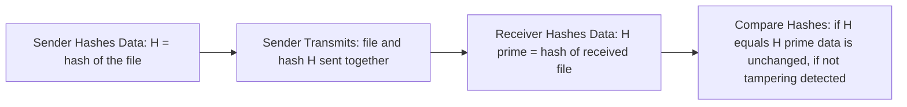
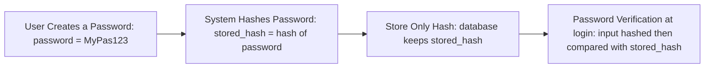

> **الهدف من الـ Section ده:**  
> هتفهم الـ Hashing بيشتغل إزاي، وإيه خصائصه الأساسية (Deterministic, One-way, Fixed length, Avalanche Effect, Collision Resistance)، وإزاي بيتستخدم في تخزين الباسوردات وفحص سلامة الملفات، وليه بالرغم من قوته، لسه محتاج إضافة عشان يثبت هوية المرسل مش بس سلامة البيانات.

## Table of Contents
- [What is a Hash?](#what-is-a-hash)
- [Hash Function Properties](#hash-function-properties)
- [Which Security Properties Does It Achieve?](#which-security-properties-does-it-achieve)
- [File Integrity Verification — Step by Step](#file-integrity-verification--step-by-step)
- [Practical Example: Verifying File Integrity](#practical-example-verifying-file-integrity)
- [Hash vs Encryption](#hash-vs-encryption)
- [Hash Algorithms](#hash-algorithms)
- [How Hashing Is Used to Store Passwords](#how-hashing-is-used-to-store-passwords)
- [Hash Collisions](#hash-collisions)
- [Salting](#salting)
- [What Hashing Alone Does NOT Prevent](#what-hashing-alone-does-not-prevent)
- [Summary](#summary)
- [SOC Analyst Perspective](#soc-analyst-perspective)

---

## What is a Hash?

الـ Hash Function بتاخد أي **Input** (نص، ملف، باسورد، بيانات مهما كان حجمها) وبتنتج **Output ثابت الحجم** اسمه الـ **Hash** أو **Message Digest**.

> [!IMPORTANT]
> الـ Hashing **مش تشفير (Encryption)**. مفيش ليه Key، ومفيش طريقة ترجع بيها من الـ Hash للـ Original Data. هو عملية اتجاه واحد (One-Way) بالكامل. لو نسيت الباسورد، مفيش طريقة "ترجّعه" — لذلك أي سيستم صح بيطلب منك تعمل **Reset** مش **Recovery**.

---

## Hash Function Properties

عشان أي Hash Function تتاعتبر آمنة Cryptographically، لازم تحقق كل الخصائص دي مع بعض:

| الخاصية | الشرح |
|---|---|
| **Deterministic** | نفس الـ Input دايماً بينتج نفس الـ Hash بالظبط — `hash("hello") = X` كل مرة |
| **Fixed Output Size** | مهما كان حجم الـ Input، حجم الـ Output ثابت دايماً (مثلاً SHA-256 دايماً بينتج 256 bit) |
| **One-Way (Preimage Resistance)** | مستحيل (حسابياً) ترجع من الـ Hash للـ Original Data. رياضياً: بيدي Hash معين H، مستحيل نلاقي Input M بحيث `hash(M) = H` |
| **Avalanche Effect** | تغيير بسيط جداً في الـ Input (حرف واحد حتى) بيدي تغيير كامل ومختلف تماماً في الـ Hash — `hash("hello") ≠ hash("Hello")` |
| **Collision Resistance** | مستحيل (حسابياً) نلاقي Inputين مختلفين M1 و M2 بحيث `hash(M1) = hash(M2)` |
| **Fast** | سريع جداً في الحساب مقارنة بعمليات الـ Encryption |

> [!NOTE]
> لاحظ الفرق الدقيق بين **One-Way (Preimage Resistance)** و**Collision Resistance**: الأولى بتقول "مستحيل ترجع من الـ Hash للـ Input الأصلي"، والتانية بتقول "مستحيل تلاقي Inputين مختلفين يديوا نفس الـ Hash". الاتنين مهمين لكن بيحموا من هجمات مختلفة.

---

## Which Security Properties Does It Achieve?

زي ما اتفقنا نعمل مع كل موضوع، خلينا نطبق نفس الـ 5 مبادئ (Confidentiality, Integrity, Authentication, Non-repudiation, Key Exchange) على الـ Hashing:

| Security Property | بيحققه؟ | إزاي |
|---|---|---|
| Confidentiality | ❌ | الـ Hash مش مصمم يخبي المحتوى — لو عرفت الـ Input الأصلي، أي حد يقدر يحسب نفس الـ Hash ويتأكد |
| **Integrity** | ✅ | ده الهدف الأساسي والوحيد اللي الـ Hashing اتصمم عشانه |
| Authentication | ❌ (لوحده) | الـ Hash العادي بيثبت إن البيانات متطابقة، لكن مش بيثبت **مين** اللي أرسلها |
| Non-repudiation | ❌ | مفيش أي ربط بهوية — أي شخص يقدر يحسب نفس الـ Hash لنفس البيانات |
| Key Exchange | ❌ | مالوش علاقة بالموضوع خالص |

> [!IMPORTANT]
> **Hashing → بيحقق Integrity بس.** ده الهدف الأساسي والمباشر، وأي استخدام تاني بيبني عليه (زي تخزين الباسوردات) هو تطبيق فرعي لنفس المبدأ.

---

## File Integrity Verification — Step by Step

تخيل إنك بتبعت ملف مهم عبر الإنترنت، العملية بتمشي كده:



1. **Sender Hashes Data:** المرسل بيحسب Hash فريد (H) للملف الأصلي
2. **Sender Transmits:** الملف والـ Hash بتاعه (H) بيتبعتوا مع بعض للمستقبِل
3. **Receiver Hashes Data:** المستقبِل بيحسب Hash جديد (H') من الملف اللي استلمه
4. **Compare Hashes:** لو `H == H'` يبقى البيانات ما اتغيرتش، ولو `H ≠ H'` يبقى فيه تلاعب حصل

---

## Practical Example: Verifying File Integrity

لو حمّلت برنامج من الإنترنت زي VLC، الموقع الرسمي بيعرض الـ Hash بتاع الـ `.exe`. بعد ما تحمّله، تحسب الـ Hash بنفسك وتقارنه — لو مختلف، يبقى الملف اتعدّل أو اتلاعب فيه.

```bash
# على Windows
certutil -hashfile vlc.exe SHA256

# على Linux
sha256sum vlc.exe
```

> [!TIP]
> الخطوة دي أساسية في أي عملية Threat Hunting أو Malware Analysis — دايماً قارن الـ Hash بتاع أي ملف تحمّله من مصدر خارجي مع الـ Hash المنشور رسمياً قبل ما تشغّله.

---

## Hash vs Encryption

| المعيار | Encryption | Hashing |
|---|---|---|
| المفتاح | لازم Key | مفيش Key |
| الاتجاه | ذهاباً وإياباً (Reversible) | اتجاه واحد فقط (One-Way) |
| الهدف | السرية (Confidentiality) | التحقق من السلامة (Integrity) |
| حجم الـ Output | بيتغير حسب حجم الـ Input | ثابت دايماً بغض النظر عن حجم الـ Input |

**استخدامات الـ Encryption:**
- Disk Encryption
- VPNs
- Web Traffic (HTTPS)
- حماية الملفات

**استخدامات الـ Hashing:**
- تخزين الـ Passwords
- File Integrity Checks
- Digital Signatures

---

## Hash Algorithms

### MDX Family

| Algorithm | الحجم | الحالة |
|---|---|---|
| MD2 | 128-bit | بطيء جداً، متروك (Obsolete) |
| MD4 | 128-bit | أسرع، متروك |
| MD5 | 128-bit | الأشهر تاريخياً، لكن غير موصى به |

> [!WARNING]
> الـ MDX Family كلها مش بتتستخدم في التطبيقات الأمنية الحديثة. الـ MD5 تحديداً فيه Collisions معروفة وموثقة — إياك تستخدمه لأي حاجة أمنية (زي تخزين باسوردات أو توقيعات).

### SHA Family

بتاخد اسمها من **NIST** اللي صممها.

| Algorithm | الحجم | الحالة |
|---|---|---|
| SHA-0 | 160-bit | فيه عيوب، متروك |
| SHA-1 | 160-bit | مكسور (Broken)، لا تستخدمه |
| **SHA-256** | 256-bit | المعيار الحالي (Current Standard) |
| SHA-512 | 512-bit | أقوى، أبطأ نسبياً |
| SHA-3 | متغير | قوي جداً، احتياطي (Backup) لو SHA-2 اتكسر |

> [!NOTE]
> الـ SHA-2 بيشمل مجموعة Algorithms، واسمها بيقولك حجم الـ Hash — يعني SHA-256 بينتج Hash بحجم 256-bit. الـ SHA-3 موجود كـ Backup احتياطي لو حد اكتشف ضعف كبير في الـ SHA-2 مستقبلاً، عشان النظام العالمي مايفضلش معتمد على عائلة واحدة بس.

---

## How Hashing Is Used to Store Passwords

الاستخدام الأشهر للـ Hashing في الأمان هو تخزين كلمات المرور. العملية بتمشي كده:



**عند تسجيل الدخول:**
- `input_password → hash → compare with stored_hash`
- لو تطابقوا → Access Granted
- لو ما تطابقوش → Access Denied

**ليه الطريقة دي بتحمي الباسوردات:**

| السبب | التفصيل |
|---|---|
| Database Leak محدود الضرر | لو الداتابيز اتسرقت، المهاجم بياخد Hashes بس مش الباسوردات الحقيقية |
| Hashes مالهاش رجعة | مستحيل (حسابياً) ترجع من الـ Hash للباسورد الأصلي |
| المهاجم لازم يعمل Brute-force | مفيش طريقة سريعة، المهاجم مضطر يجرب تخمينات كتير |

---

## Hash Collisions

الـ **Collision** هو لما Inputين مختلفين ينتجوا نفس الـ Hash بالظبط.

ده خطر جداً لأن:
- لو عندك File A، وعملت Collision مع File B الخبيث
- الـ Hash هيبان **صح** رغم إن الملف اتغير فعلياً

> [!WARNING]
> الـ SHA-1 والـ MDX Family فيهم Collisions موثقة ومعروفة — ده سبب رئيسي إنهم اتعملوا Deprecated في كل التطبيقات الأمنية الحديثة.

**مثال تبسيطي (Birthday Paradox):**
لو عندك Hash Function بتنتج بس 100 قيمة ممكنة، وعندك 101 ملف مختلف — بالضرورة الرياضية فيه ملفين على الأقل هيعطوا نفس الـ Hash. ده المبدأ المعروف بـ **Birthday Paradox** في الـ Cryptography، وهو الأساس اللي بتتبنى عليه هجمات الـ Collision الحقيقية على خوارزميات ضعيفة.

---

## Salting

**Salting** هو إضافة **قيمة عشوائية (Random Value)** للباسورد قبل عملية الـ Hashing:

```
hash(password || salt)
```

النتيجة: نفس الباسورد لأكتر من مستخدم هينتج **Hash مختلف تماماً لكل واحد فيهم**، لأن كل مستخدم عنده Salt مختلف.

**الـ Salting بيمنع:**
- **Rainbow Table Attacks** — لأن الجداول المحسوبة مسبقاً (Precomputed Tables) بقت مش نافعة، لأن كل Hash دلوقتي مرتبط بـ Salt مختلف
- **Hash Reuse Across Users** — يعني حتى لو مستخدمين استخدموا نفس الباسورد بالظبط، الـ Hash المخزّن هيبقى مختلف

> [!TIP]
> الـ Salt نفسه مش لازم يكون سري — بيتخزن عادةً جنب الـ Hash في نفس الداتابيز. قوته مش في إنه سري، قوته في إنه **فريد لكل مستخدم**، وده بيكسر فكرة الجداول المحسوبة مسبقاً بالكامل.

---

## What Hashing Alone Does NOT Prevent

بالرغم من كل قوة الـ Hashing، فيه حدود مهمة جداً لازم تكون واعي بيها:

| المشكلة | التفصيل |
|---|---|
| **Attacker Modifies Both** | مهاجم نشط (Active Attacker) يقدر يعدّل البيانات **والـ Hash بتاعها مع بعض** أثناء النقل، فالمقارنة العادية (Simple Comparison) مش هتكتشف أي تلاعب |
| **No Authentication** | الـ Hashing مبيثبتش **مين** اللي أرسل البيانات، بس بيثبت إنها ما اتغيرتش من وقت ما اتحسب الـ Hash بتاعها |
| **No Protection Against Active Attackers** | مفيش أي دفاع ضد شخص بيتلاعب بشكل نشط في قناة الاتصال (Man-in-the-Middle) |

> [!IMPORTANT]
> **المشكلة:** لو مهاجم قدر يعترض البيانات وهي ماشية في الشبكة، ويعدّل **البيانات نفسها والـ Hash المرفق معاها في نفس الوقت**، الطرف المستقبل مش هيقدر يكتشف إن فيه تلاعب حصل — لأن الـ Hash الجديد هيتطابق تماماً مع البيانات المعدّلة. الـ Hashing بيثبت "اتساق البيانات مع نفسها" بس، مش بيثبت **مصداقيتها (Authenticity)** ولا **مصدرها**.
>
> **الحل:** **HMAC (Hash-based Message Authentication Code)** — اللي بيربط عملية الـ Hashing بمفتاح سري (Secret Key) معروف بس للطرفين الشرعيين، فمهاجم مالوش الـ Key ده مش هيقدر يزوّر Hash صحيح حتى لو عدّل البيانات بالكامل.

---

## Summary

- الـ Hash Function بتاخد أي Input وبتنتج Output ثابت الحجم (Hash / Message Digest)
- خصائصه الأساسية: **Deterministic, Fixed Output Size, One-Way (Preimage Resistance), Avalanche Effect, Collision Resistance, Fast**
- بيحقق **Integrity بس** من بين الـ 5 Security Properties
- الـ Hashing مختلف تماماً عن الـ Encryption: مفيش Key، ومفيش رجعة (One-Way)
- بيتستخدم في: تخزين الباسوردات، فحص سلامة الملفات (File Integrity)، والـ Digital Signatures
- **MD5 و SHA-1** أصبحوا غير آمنين بسبب Collisions موثقة — استخدم **SHA-256** أو أعلى
- **Salting** بيحمي من Rainbow Table Attacks عن طريق ما يخلي كل Hash فريد لكل مستخدم
- **المشكلة:** الـ Hashing لوحده مش بيحمي من مهاجم نشط يقدر يعدّل البيانات والـ Hash مع بعض — محتاج **HMAC** عشان يضيف طبقة الـ Authentication

---

## SOC Analyst Perspective

- الـ Hash Values بتعتبر من أهم الـ **IOCs (Indicators of Compromise)** — لما تشوف Hash معروف بتاع Malware (زي MD5 أو SHA-256) في Logs أو Files، ده دليل قاطع على وجود تهديد معروف مسبقاً
- MITRE ATT&CK: تقنية **T1553.004 (Install Root Certificate)** وتقنيات تانية مرتبطة بـ Code Signing Bypass بتستغل ضعف بعض آليات التحقق من الـ Hash؛ وكمان **T1027 (Obfuscated Files)** بيستخدمها المهاجمين لتغيير الـ Hash بتاع Malware مع الحفاظ على نفس الوظيفة (Hash Evasion)
- في الـ Digital Forensics، الـ Hashing بيتستخدم لعمل **Chain of Custody** — يعني إثبات إن الدليل الرقمي (Evidence) ما اتلاعبش فيه من وقت الاستيلاء عليه لحد تقديمه في المحكمة
- أدوات عملية: `VirusTotal` بيسمحلك تدوّر بـ Hash بتاع أي ملف مشبوه وتشوف لو معروف كـ Malware من قبل؛ وأدوات زي `HashCalc` و `sha256sum` أساسية في أي Incident Response Workflow
