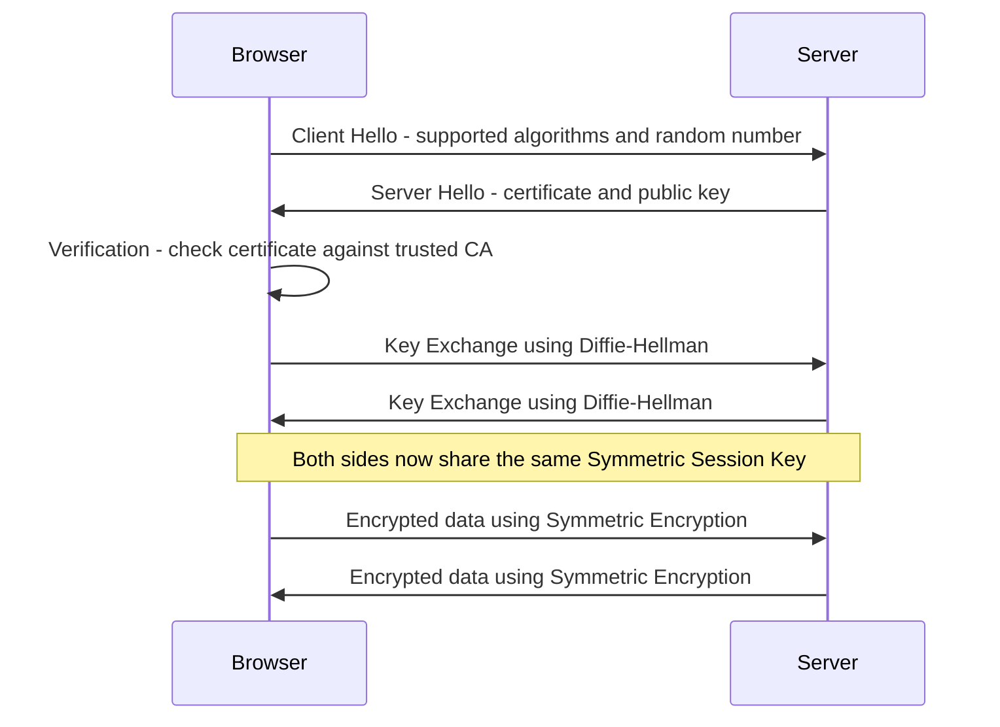

> **الهدف من الـ Section ده:**  
> هتفهم إزاي كل المواضيع اللي درسناها من الأول (Symmetric, Asymmetric, Hashing, HMAC, Digital Signature, Digital Certificate) بتشتغل مع بعضها فعلياً في بروتوكول واحد حقيقي بيشتغل كل ما تفتح أي موقع بـ HTTPS. ده الخاتمة العملية للسلسلة كلها.

## Table of Contents
- [Why Do We Need a Handshake?](#why-do-we-need-a-handshake)
- [The Hybrid Design Principle](#the-hybrid-design-principle)
- [The TLS Handshake — Step by Step](#the-tls-handshake--step-by-step)
- [Mapping Each Step to What You Already Learned](#mapping-each-step-to-what-you-already-learned)
- [Which Security Properties Does the Full Handshake Achieve?](#which-security-properties-does-the-full-handshake-achieve)
- [What Happens After the Handshake](#what-happens-after-the-handshake)
- [What Can Still Go Wrong](#what-can-still-go-wrong)
- [Summary](#summary)
- [SOC Analyst Perspective](#soc-analyst-perspective)

---

## Why Do We Need a Handshake?

كل مرة تفتح فيها موقع بـ **HTTPS** وتشوف علامة القفل (Padlock) جوه المتصفح، فيه عملية اسمها **TLS Handshake** بتحصل في الخلفية، قبل ما أي بيانات فعلية (زي محتوى الصفحة) تتنقل بينك وبين السيرفر.

> [!IMPORTANT]
> السؤال الأساسي اللي الـ Handshake بيجاوب عليه: **إزاي طرفين (المتصفح والسيرفر) يقدروا يتواصلوا بأمان كامل، مع إنهم أول مرة "يتقابلوا" على الإنترنت، وممكن يكون فيه مهاجم بيراقب كل حاجة بينهم؟**

الإجابة مش تقنية واحدة — هي **كل المواضيع اللي درسناها من الأول لحد دلوقتي، شغالة مع بعضها في تناسق كامل.**

---

## The Hybrid Design Principle

قبل ما ندخل في التفاصيل، لازم تفهم المبدأ الأساسي اللي TLS مبني عليه:

| المرحلة | المهمة | نوع التشفير المستخدم |
|---|---|---|
| **البداية (Startup)** | إثبات الهوية + الاتفاق على مفتاح | Asymmetric (بطيء لكن آمن) |
| **النقل الفعلي (Transfer)** | نقل بيانات الصفحة الفعلية | Symmetric (سريع وكفء) |

> [!IMPORTANT]
> ده التصميم الهجين (**Hybrid Design**) اللي اتكلمنا عنه في نهاية موضوع الـ Symmetric Encryption. السبب: الـ Asymmetric Encryption آمن جداً لإثبات الهوية والاتفاق على سر، لكنه بطيء ومكلف حسابياً — فمش منطقي تستخدمه لنقل صفحة كاملة فيها صور وفيديوهات. الحل: استخدمه في اللحظة الحرجة بس (البداية)، وبعدين انتقل للـ Symmetric عشان السرعة.

---

## The TLS Handshake — Step by Step

### 1. Client Hello

المتصفح بيبعت للسيرفر:
- الخوارزميات اللي بيدعمها (Supported Algorithms)
- رقم عشوائي (Random Number) هيتستخدم لاحقاً في حساب الـ Session Key

### 2. Server Hello

السيرفر بيرد بـ:
- **شهادته الرقمية (Digital Certificate)** — عشان يثبت هويته
- **الـ Public Key** بتاعه

### 3. Verification

المتصفح بيتحقق من صحة الشهادة اللي وصلته:
- هل هي موقّعة من **Certificate Authority (CA)** موثوقة وموجودة في الـ Trust Store؟
- هل صلاحيتها لسه سارية؟
- هل اسم الدومين مطابق للي بتصفحه فعلاً؟

> [!WARNING]
> لو أي شرط من دول فشل، المتصفح بيوقف الاتصال فوراً ويطلعلك تحذير زي "Your connection is not private" — ده بالظبط تطبيق عملي لكل اللي اتكلمنا عنه في موضوع الـ Digital Certificate & CA.

### 4. Key Exchange

المتصفح والسيرفر بيستخدموا **Diffie-Hellman** (أو خوارزمية Key Exchange مشابهة) عشان يوصلوا لـ **Symmetric Session Key** مشترك، من غير ما يبعتوه فعلياً عبر الشبكة — حتى لو مهاجم بيراقب كل حاجة، مش هيقدر يحسب نفس المفتاح.

بعد الخطوة دي، الطرفين عندهم نفس الـ Session Key، ومن هنا فصاعداً بيتحولوا للـ **Symmetric Encryption** عشان السرعة.

---

## Mapping Each Step to What You Already Learned

عشان تشوف بوضوح إزاي كل موضوع درسناه بياخد دوره بالظبط:

| خطوة في الـ Handshake | الموضوع اللي درسناه |
|---|---|
| Server يقدّم شهادته | **Digital Certificate & CA** |
| المتصفح بيتحقق من الشهادة والتوقيع عليها | **Digital Signature** (توقيع الـ CA على الشهادة) |
| الاتفاق الآمن على الـ Session Key | **Asymmetric Encryption + Diffie-Hellman (Key Exchange)** |
| نقل بيانات الصفحة الفعلية بسرعة | **Symmetric Encryption** |
| التأكد إن البيانات ما اتغيرتش أثناء الجلسة | **Hashing / HMAC** |

> [!TIP]
> لو رجعت بالذاكرة لكل الـ Sections اللي درسناها، هتلاقي إن كل واحد فيهم كان بيحل مشكلة معينة ظهرت في اللي قبله — والـ TLS Handshake هو المكان اللي كل الحلول دي بتتجمع فيه سوا في نظام واحد متكامل وشغال فعلياً في كل موقع بتزوره يومياً.

---

## Which Security Properties Does the Full Handshake Achieve?

بعكس كل موضوع لوحده اللي كان بيحقق جزء من الـ 5 مبادئ، الـ TLS Handshake ككل (كمنظومة متكاملة) بيحقق كل الخمسة مع بعض:

| Security Property | بيحققه؟ | من فين جاي |
|---|---|---|
| **Confidentiality** | ✅ | Symmetric Encryption (بعد الـ Key Exchange) |
| **Integrity** | ✅ | Hashing / HMAC طول الجلسة |
| **Authentication** | ✅ | Digital Certificate + Digital Signature |
| **Non-repudiation** | ✅ (للسيرفر) | توقيع الـ CA على الشهادة |
| **Key Exchange** | ✅ | Asymmetric Encryption + Diffie-Hellman |

> [!IMPORTANT]
> ده بالظبط سبب قوة الـ TLS كبروتوكول — مفيش تقنية واحدة بتحقق كل حاجة لوحدها، لكن **التركيبة الصحيحة من كل التقنيات اللي درسناها** بتغطي كل الـ 5 مبادئ مع بعضها.

---

## What Happens After the Handshake

بمجرد ما الـ Handshake يخلص:
- كل البيانات (HTML, صور, فيديوهات, طلبات API) بتتشفّر بالـ **Symmetric Session Key** المتفق عليه
- كل رسالة بيتضاف لها **HMAC أو آلية مشابهة** للتأكد من سلامتها
- الجلسة دي بتفضل شغالة لحد ما تقفل المتصفح أو تنتهي صلاحية الجلسة، وبعدين لو فتحت اتصال جديد، الـ Handshake بيتعاد من الأول

---

## What Can Still Go Wrong

حتى مع نظام متكامل زي ده، فيه نقط ضعف حقيقية لازم تكون واعي بيها كـ Defender:

| السيناريو | الخطر |
|---|---|
| **Certificate Errors تتجاهل** | لو المستخدم ضغط "Proceed anyway" على تحذير شهادة، كل ضمانات الـ Authentication بتنهار |
| **Weak/Deprecated Algorithms** | لو السيرفر لسه بيدعم خوارزميات قديمة (زي SSL 3.0 أو TLS 1.0)، المهاجم يقدر يجبر الاتصال ينزل لمستوى أضعف (Downgrade Attack) |
| **Compromised CA** | لو الـ CA نفسها اتخترقت أو أصدرت شهادة غلط، المتصفح هيثق في شهادة مزوّرة بالكامل |
| **Malicious Root CA على الجهاز** | زي ما اتكلمنا في موضوع الشهادات، ده بيسمح بـ MITM كامل من غير أي تحذير |

---

## Summary

- الـ TLS/HTTPS Handshake هو التطبيق العملي الحقيقي لكل مواضيع الـ Cryptography اللي درسناها من الأول للآخر
- بيعتمد على **Hybrid Design**: Asymmetric في البداية للهوية والـ Key Exchange، وSymmetric بعد كده لنقل البيانات بسرعة
- خطواته: **Client Hello → Server Hello (Certificate) → Verification → Key Exchange → Symmetric Communication**
- كل خطوة فيه مرتبطة مباشرة بموضوع درسناه: Digital Certificate, Digital Signature, Asymmetric Encryption, Diffie-Hellman, Symmetric Encryption, Hashing/HMAC
- الـ Handshake ككل بيحقق **كل الـ 5 Security Properties مع بعضها** — حاجة محدش من التقنيات المفردة قدر يحققها لوحده
- برغم قوة النظام، لسه فيه نقط ضعف حقيقية (Downgrade Attacks, Compromised CA, تجاهل تحذيرات الشهادات) لازم أي SOC Analyst يكون واعي بيها

---

## SOC Analyst Perspective

- أي تحليل لـ Network Traffic فيه HTTPS، لازم تفحص تفاصيل الـ **TLS Handshake** نفسه مش بس المحتوى المشفر بعده — إصدار الـ TLS، الخوارزميات المستخدمة، وتفاصيل الشهادة كلها معلومات قيّمة أثناء الـ Incident Investigation
- MITRE ATT&CK: تقنية **T1557 (Adversary-in-the-Middle)** بتغطي هجمات بتستهدف كسر أو تجاوز الـ TLS Handshake، وتقنية **T1600 (Weaken Encryption)** بتوصف محاولات إجبار الاتصال يستخدم خوارزميات أضعف (Downgrade Attacks)
- علامات تحذير مهمة في الـ Logs: شهادات **Self-Signed** غير متوقعة، اتصالات بتستخدم **TLS 1.0/1.1** القديمة، أو محاولات اتصال متكررة بـ Certificate Errors — كل دول مؤشرات يستاهلوا تصعيد
- أدوات عملية: **Wireshark** (لتحليل TLS Handshake بالتفصيل)، **SSL Labs (ssllabs.com)** لفحص قوة إعدادات TLS لأي سيرفر، و**OpenSSL** (`openssl s_client -connect domain:443`) للفحص اليدوي المباشر من الـ Terminal
