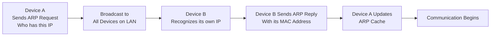
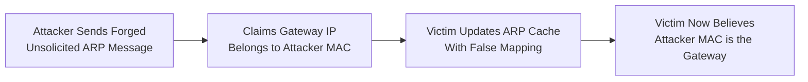
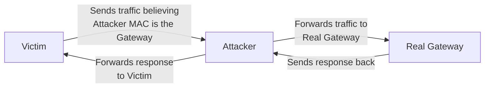

| Topic | Level | Reading Time | Prerequisites |
|---|---|---|---|
| ARP and ARP Cache Poisoning | Intermediate | ~18 min | Basic understanding of IP addressing, MAC addresses, and local network communication |

> **الهدف من الـ Section ده:**  
>  هتفهم إزاي بروتوكول الـ ARP بيشتغل بشكل طبيعي، وإزاي المهاجم يقدر يستغل غياب الـ authentication فيه عشان ينفذ **ARP Cache Poisoning** ويحوّل نفسه لـ Man-in-the-Middle بين الضحية والـ gateway.

## Learning Objectives

By the end of this section, you will be able to:

- Explain how **ARP (Address Resolution Protocol)** works in its normal, legitimate flow.
- Describe what an **unsolicited ARP** message is and why it exists for legitimate purposes.
- Explain why the lack of **authentication** in ARP makes **ARP Cache Poisoning** possible.
- Trace the exact path traffic takes once an attacker poisons the ARP cache and becomes a **Man-in-the-Middle (MITM)**.
- Explain why ARP poisoning alone does not automatically expose encrypted application data.

## Table of Contents

- [What Is ARP](#what-is-arp)
- [The Normal ARP Process](#the-normal-arp-process)
- [Unsolicited ARP: A Legitimate Feature](#unsolicited-arp-a-legitimate-feature)
- [The Root Problem: No Authentication in ARP](#the-root-problem-no-authentication-in-arp)
- [ARP Cache Poisoning](arp-cache-poisoning)
  - [Why the Default Gateway Is the Prime Target](#why-the-default-gateway-is-the-prime-target)
  - [How the Poisoning Happens](#how-the-poisoning-happens)
- [Becoming the Man-in-the-Middle](#becoming-the-man-in-the-middle)
- [Diagram: Normal ARP Flow vs. Poisoned ARP Flow](#diagram-normal-arp-flow-vs-poisoned-arp-flow)
- [Diagram: Traffic Path After Poisoning](#diagram-traffic-path-after-poisoning)
- [Limits of ARP Poisoning](#limits-of-arp-poisoning)
- [Defenses Against ARP Cache Poisoning](#defenses-against-arp-cache-poisoning)
- [Career Connection](#career-connection)
- [Key Terms Glossary](#key-terms-glossary)
- [Summary](#summary)

## What Is ARP

**ARP (Address Resolution Protocol)** هو بروتوكول بيُستخدم عشان يكتشف الـ **MAC Address** المرتبط بعنوان IP معين لجهاز موجود على الشبكة المحلية (**local network**).

المشكلة اللي ARP بيحلها بسيطة: أجهزة الشبكة المحلية بتتواصل مع بعضها فعليًا باستخدام عناوين MAC على مستوى الـ **Data Link Layer**، لكن التطبيقات والبروتوكولات بتتعامل غالبًا بعناوين IP. فـ ARP هو حلقة الوصل اللي بتربط بين العالمين دول.

## The Normal ARP Process

لنفهم العملية بشكل عملي، نتخيل إن **Device A** عايز يتواصل مع **Device B**، لكنه مش عارف عنوان الـ MAC بتاع B.

العملية بتحصل بالخطوات التالية:

1. **Device A** بيبعت **ARP Request** بيسأل فيه: "مين عنده الـ IP Address ده؟"
2. الـ ARP Request بيتبعت كـ **broadcast**، يعني كل جهاز على الشبكة المحلية بيستقبله. عنوان الـ **destination MAC address** في الحالة دي بيكون `FF:FF:FF:FF:FF:FF`.
3. **Device B** بيلاحظ إن عنوان الـ IP ده هو بتاعه فعلًا، فبيرد بـ **ARP Reply** يحتوي على عنوان الـ MAC بتاعه.
4. **Device A** بيخزّن الـ **IP-to-MAC mapping** ده جوه شيء اسمه **ARP Cache**، وبيستخدمه بعد كده للتواصل المباشر مع Device B من غير ما يحتاج يكرر الطلب.

العملية دي ممكن تتلخص في التسلسل التالي:

> **ARP Request → ARP Reply → ARP Cache Update → Communication**

> [!NOTE]
> الـ ARP Cache هو أساسًا جدول بيربط بين عناوين IP وعناوين MAC المقابلة ليها، وبيتم تحديثه بشكل دوري ومؤقت (مش دائم) عشان يعكس التغييرات في الشبكة.

## Unsolicited ARP: A Legitimate Feature

**Unsolicited ARP** هي رسالة ARP بتتبعت من غير ما يكون فيه ARP Request سابق من جهاز تاني.

السلوك ده له استخدامات شرعية ومقبولة، من ضمنها:

- الإعلان عن ربط IP-to-MAC جديد.
- تحديث الـ ARP caches على الشبكة.
- إخطار الأجهزة التانية إن عنوان MAC معين اتغيّر.

مثال عملي: لما **router** يبدأ يشتغل، يقدر يعلن إن عنوان الـ IP بتاعه مرتبط بعنوان MAC معين، عشان الأجهزة التانية على الشبكة تحدّث الـ ARP caches بتاعتها من غير ما تحتاج تعمل ARP Request بنفسها.

## The Root Problem: No Authentication in ARP

المشكلة الجوهرية إن بروتوكول ARP **مبيوفرش أي آلية authentication مدمجة (built-in authentication)**. ده معناه إن أي جهاز على الشبكة يقدر يستقبل ويقبل رسالة ARP حتى لو الرسالة دي مبعوتة من طرف مش المالك الشرعي لعنوان الـ IP المذكور فيها.

> [!IMPORTANT]
> غياب الـ authentication ده مش خطأ برمجي أو bug، ده جزء من التصميم الأصلي لبروتوكول ARP، لأنه اتصمم في وقت كانت فيه افتراضات الثقة داخل الشبكة المحلية مختلفة تمامًا عن بيئات الشبكات الحديثة.

وبالتالي، الميزة الشرعية بتاعة الـ **unsolicited ARP** ممكن **يُساء استخدامها (abused)** من طرف مهاجم عشان يعلن عن **false IP-to-MAC mapping** (ربط مزيف بين IP وMAC)، وده اللي بيفتح الباب قدام هجوم **ARP Cache Poisoning**.

## ARP Cache Poisoning

### Why the Default Gateway Is the Prime Target

في هجوم **ARP Cache Poisoning**، المهاجم بيبعت رسائل ARP مزوّرة (**forged unsolicited ARP messages**) وهو بيتظاهر إنه جهاز تاني على الشبكة.

المهاجم يقدر يستهدف أي جهاز، لكن التظاهر بإنه **الـ Default Gateway** بيكون خطير بشكل خاص، لأن الـ gateway هو المسؤول عن التعامل مع أي حركة مرور خارجة من الشبكة المحلية للإنترنت أو لشبكات تانية.

### How the Poisoning Happens

خطوات الهجوم بتحصل كالتالي:

1. المهاجم بيبعت رسالة ARP مزوّرة، بيدّعي فيها إن عنوان الـ IP الخاص بالـ gateway مرتبط بعنوان الـ MAC بتاعه هو (المهاجم).
2. الضحايا بيستقبلوا الرسالة دي، وبما إن ARP معندهوش authentication، ممكن يحدّثوا الـ ARP caches بتاعتهم بالـ mapping الكاذب ده.
3. الضحايا دلوقتي بيصدّقوا إن عنوان الـ MAC بتاع المهاجم بيمثل الـ gateway الشرعي.
4. نتيجة لده، لما أي ضحية يحاول يبعت حركة مرور برة الشبكة المحلية، هو بيحط عنوان الـ MAC بتاع المهاجم في الـ Ethernet frame بدل عنوان الـ MAC الحقيقي بتاع الـ gateway.

بكده، الـ **ARP cache** بتاع الضحية بقى **مسموم (poisoned)**، وحركة المرور بقت بتتوجه فعليًا لجهاز المهاجم.

> [!WARNING]
> خطأ شائع إن الطلاب يفتكروا إن ARP Poisoning بيغيّر عنوان الـ IP بتاع الضحية أو الـ gateway. الحقيقة إن اللي بيتغيّر هو **الربط بين IP وMAC** جوه الـ ARP cache بتاع الضحية بس، والعناوين الأصلية نفسها مش بتتغيّر.

## Becoming the Man-in-the-Middle

بمجرد ما الـ ARP cache يتسمم، مسار التواصل بيتغيّر من:

**Victim → Gateway**

لـ:

**Victim → Attacker → Real Gateway**

المهاجم يقدر يستخدم أدوات زي **Ettercap** عشان يعترض (**intercept**) حركة المرور دي ويعيد توجيهها (**forward**) للطرف الحقيقي، بحيث الاتصال يستمر بشكل طبيعي من وجهة نظر الضحية.

العملية بتحصل بالتفصيل كالتالي:

- لما الضحية يبعت frame، الـ frame ده بيوصل لجهاز المهاجم، لأن الضحية بيعتقد إن المهاجم هو الـ gateway.
- المهاجم بعد كده بيوجّه (**forward**) حركة المرور دي للـ gateway الحقيقي، بحيث الطلب يكمل مساره لوجهته الأصلية بشكل طبيعي.
- رد الـ gateway بالمثل ممكن يتوجّه هو كمان من خلال المهاجم، اللي بيوجّهه بعد كده للضحية.

المسار النهائي لحركة المرور بيبقى:

**Victim → Attacker → Gateway → Attacker → Victim**

بكده، المهاجم بقى متمركز رسميًا كـ **Man-in-the-Middle (MITM)** بين الضحية والـ gateway.

## Diagram: Normal ARP Flow vs. Poisoned ARP Flow

المخطط التالي بيوضح تسلسل عملية الـ ARP الطبيعية:

والمخطط ده بيوضح إزاي المهاجم بيسمم الـ ARP cache بتاع الضحية:

## Diagram: Traffic Path After Poisoning

المخطط التالي بيوضح مسار حركة المرور الكامل بعد نجاح الهجوم، وإزاي المهاجم بيتمركز كـ Man-in-the-Middle:

## Limits of ARP Poisoning

على الرغم من خطورة ARP Cache Poisoning، **الهجوم ده وحده مش معناه إن المهاجم أوتوماتيكيًا يقدر يقرأ بيانات التطبيق المشفّرة (encrypted application data)**.

بروتوكولات زي **HTTPS** و **VPN** بتوفر طبقة حماية إضافية على مستوى end-to-end، وده بيعني إن حتى لو المهاجم قدر يعترض حركة المرور، محتوى البيانات نفسه ممكن يفضل غير قابل للقراءة بدون كسر التشفير ده بشكل منفصل.

> [!TIP]
> ARP Poisoning بيوفر للمهاجم "الموقع" (**position**) في مسار حركة المرور، لكن ده مش بالضرورة معناه "القدرة على القراءة" (**visibility into content**). الاثنين مفهومين مختلفين ومهم نفرّق بينهم.

## Defenses Against ARP Cache Poisoning

فيه عدة آليات بتُستخدم للحد من مخاطر ARP Cache Poisoning:

| الآلية | الدور في الحماية |
|---|---|
| **Dynamic ARP Inspection (DAI)** | ميزة على السويتشات بتتحقق من صحة رسائل ARP قبل قبولها |
| **Static ARP Entries** | تثبيت ربط IP-to-MAC يدويًا للأجهزة الحساسة زي الـ gateway |
| **Port Security** | تقييد عدد وأنواع عناوين MAC المسموح بيها على كل منفذ في السويتش |
| **Network Monitoring Tools** | اكتشاف تغييرات غير طبيعية أو متكررة في الـ ARP mappings |
| **End-to-End Encryption (HTTPS/VPN)** | حماية محتوى البيانات حتى لو المهاجم نجح في اعتراض حركة المرور |

## Career Connection

فهم ARP وARP Cache Poisoning له تطبيقات مباشرة في مسارات مهنية متعددة:

- في مجال **Pentesting**، تنفيذ ARP Poisoning بأدوات زي Ettercap بيُستخدم في اختبارات الاختراق الأخلاقية لتقييم مدى صمود الشبكة أمام هجمات MITM.
- في مجال **SOC**، مراقبة الشبكة لاكتشاف رسائل ARP مشبوهة أو تغييرات مفاجئة في الـ ARP mappings جزء أساسي من عملية الكشف عن التهديدات.
- في مجال **Network Engineering** المرتبط بالأمان، تفعيل ميزات زي **Dynamic ARP Inspection** على السويتشات جزء من التصميم الآمن للبنية التحتية للشبكة.

## Key Terms Glossary

| Term | Definition |
|---|---|
| **ARP (Address Resolution Protocol)** | بروتوكول بيُستخدم لاكتشاف عنوان الـ MAC المرتبط بعنوان IP معين على الشبكة المحلية. |
| **ARP Request** | رسالة broadcast بيسأل فيها جهاز عن مين صاحب عنوان IP معين. |
| **ARP Reply** | رد بيحتوي على عنوان الـ MAC الخاص بصاحب عنوان الـ IP المطلوب. |
| **ARP Cache** | جدول مؤقت بيربط بين عناوين IP وعناوين MAC المقابلة ليها على جهاز معين. |
| **Unsolicited ARP** | رسالة ARP بتتبعت من غير ما يكون فيه ARP Request سابق، وليها استخدامات شرعية. |
| **ARP Cache Poisoning** | هجوم بيرسل فيه المهاجم رسائل ARP مزوّرة عشان يغيّر الـ ARP mappings عند الضحايا. |
| **Default Gateway** | الجهاز المسؤول عن توجيه حركة المرور الخارجة من الشبكة المحلية لشبكات أخرى. |
| **Man-in-the-Middle (MITM)** | هجوم يضع فيه المهاجم نفسه بين طرفي الاتصال لمراقبته أو التلاعب به. |

## Summary

- **ARP** بيُستخدم لاكتشاف عنوان الـ MAC المرتبط بعنوان IP معين على الشبكة المحلية، من خلال تسلسل: ARP Request → ARP Reply → ARP Cache Update → Communication.
- **Unsolicited ARP** ميزة شرعية بتُستخدم لتحديث الـ ARP caches من غير طلب سابق، لكن غياب الـ **authentication** في ARP بيخليها قابلة للاستغلال.
- في **ARP Cache Poisoning**، المهاجم بيبعت رسائل ARP مزوّرة بيدّعي فيها إنه الـ default gateway، فيقنع الضحايا بربط IP-to-MAC كاذب.
- بمجرد نجاح التسميم، مسار حركة المرور بيتحول من Victim → Gateway إلى Victim → Attacker → Gateway → Attacker → Victim، وبكده المهاجم بيتمركز كـ **Man-in-the-Middle**.
- أدوات زي **Ettercap** بتُستخدم لاعتراض وإعادة توجيه حركة المرور بحيث الاتصال يستمر بشكل طبيعي من وجهة نظر الضحية.
- ARP Poisoning وحده **مش معناه القدرة على قراءة بيانات مشفّرة**؛ بروتوكولات زي HTTPS وVPN بتوفر حماية إضافية على مستوى المحتوى.
- الحماية الفعالة بتعتمد على آليات زي **Dynamic ARP Inspection**، **Static ARP Entries**، و **Port Security** جنبًا إلى جنب مع التشفير end-to-end.
