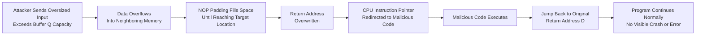
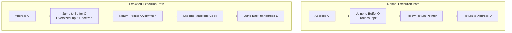

| Topic | Level | Reading Time | Prerequisites |
|---|---|---|---|
| Buffer Overflow Attacks | Intermediate | ~25 min | Basic understanding of memory, variables, and how programs execute instructions |

> **الهدف من الـ Section ده:**  
>  هتفهم إيه هو الـ Buffer، إزاي ممكن يحصل فيه Overflow، وإزاي المهاجم يقدر يستغل المشكلة دي عشان يحوّل مسار تنفيذ البرنامج (execution flow) ويشغّل كود ضار من غير ما حد يلاحظ.


## Learning Objectives

By the end of this section, you will be able to:

- Define a **Buffer** and explain why its fixed size creates a security concern.
- Explain what a **Buffer Overflow** is using a real-world analogy.
- Explain why **C** and **C++** are especially vulnerable to buffer overflows compared to languages like Python or Java.
- Trace the normal execution flow of a program, including the role of the **return pointer**.
- Explain step by step how an attacker hijacks the **return address** to redirect the **instruction pointer** and execute malicious code.
- Explain why buffer overflow exploits are dangerous specifically because they hide inside trusted software.

## Table of Contents

- [What Is a Buffer](#what-is-a-buffer)
- [What Is a Buffer Overflow](#what-is-a-buffer-overflow)
- [Why C and C++ Are Especially Vulnerable](#why-c-and-c-are-especially-vulnerable)
- [Normal Program Execution: The Baseline](#normal-program-execution-the-baseline)
- [Normal Execution Flow: Step by Step](#normal-execution-flow-step-by-step)
- [The Attack Begins: Exploiting Buffer Q](#the-attack-begins-exploiting-buffer-q)
- [Hijacking the Return Address](#hijacking-the-return-address)
- [Why This Is So Dangerous: The Trust Problem](#why-this-is-so-dangerous-the-trust-problem)
- [The Key Question: Why Bother Overwriting the Return Address](#the-key-question-why-bother-overwriting-the-return-address)
- [Attack Flow Diagram](#attack-flow-diagram)
- [Mitigations and Defenses](#mitigations-and-defenses)
- [Career Connection](#career-connection)
- [Key Terms Glossary](#key-terms-glossary)
- [Summary](#summary)

## What Is a Buffer

**Buffer** هو منطقة من الذاكرة (**area of memory**) بيستخدمها البرنامج عشان يخزّن بيانات فيها.

البرامج بتستخدم الـ buffers باستمرار، لأن البيانات غالبًا محتاجة تتخزن بشكل مؤقت قبل ما يتم معالجتها. مثال بسيط: لما تكتب اسمك في فورم على موقع إلكتروني، البرنامج ممكن يخزّن الحروف دي في buffer قبل ما يعالجها ويبعتها.

المشكلة الأساسية إن الـ buffer عنده **حجم ثابت (fixed size)**، وده بيخلق مصدر قلق أمني مهم جدًا: لازم البرنامج يتأكد إن كمية البيانات اللي بتتكتب جوه الـ buffer ميتجاوزش الحجم المخصص ليه. لو البرنامج كتب بيانات أكتر من كده، البيانات الزيادة ممكن تتكتب في مواقع ذاكرة تانية بتخص بيانات أو مكونات برنامج تانية.

الحالة دي بتتسمى **Buffer Overflow**، وممكن تسبب:

- انهيار (**crashes**) في البرنامج.
- تلف في البيانات (**corrupted data**).
- سلوك غير متوقع للبرنامج (**unexpected behavior**).
- في بعض الحالات، ثغرات أمنية خطيرة (**security vulnerabilities**).

> [!IMPORTANT]
> الفكرة الأساسية إن الـ buffer هو منطقة ذاكرة مؤقتة بحجم ثابت، والبرنامج لازم يضمن إنه أبدًا مايخزنش بيانات أكتر من الحجم اللي الـ buffer اتصمم عشانه.

## What Is a Buffer Overflow

**Buffer Overflow** بيحصل لما البرنامج يحاول يحشر بيانات جوه buffer أكتر من الحجم اللي اتصمم عشانه.

تخيل معايا: موقف سيارات (**parking lot**) فيه 10 أماكن بس، لكن 15 عربية جت، والحارس مبيوقفهمش. الـ 5 عربيات الزيادة مش بتختفي، لكن بتفيض (**spill over**) على الطريق، الرصيف، أو حتى موقف جار مش مفروض عربيات تركن فيه.

بترجمة الأمثلة دي لمصطلحات الذاكرة:

- الـ 5 عربيات الزيادة = بايتات إضافية من البيانات (**extra bytes of data**).
- الطريق والرصيف = عناوين ذاكرة مجاورة (**neighboring memory addresses**) بتخص حاجة تانية، ممكن تكون متغيّر تاني، أو حتى بيانات تحكم حرجة (**critical control data**).

> [!WARNING]
> الخطورة الحقيقية إن الذاكرة المجاورة دي ممكن تتحكم في **إزاي البرنامج هيتصرف بعد كده**، مش مجرد تخزين بيانات عشوائية. ده اللي بيخلي الـ Buffer Overflow خطر أمني حقيقي مش مجرد bug عادي.

الـ Buffer Overflow مش مقتصر على نوع واحد من البرامج، ممكن يحصل في أنظمة تشغيل، تطبيقات موبايل، سيرفرات ويب، أجهزة IoT، فعليًا أي حاجة مكتوبة بلغة برمجة عرضة لده. وفيه آلاف الثغرات المعروفة من نوع Buffer Overflow بيتم استغلالها فعليًا من مهاجمين حاليًا.

## Why C and C++ Are Especially Vulnerable

لغتي **C** و **C++** زي إنك تدّي لحد مفاتيح مخزن (**warehouse**) بدون أي حارس أمن. المفروض إنك موثوق فيك تاخد بس اللي محتاجه، ومحدش بيتأكد إنك ماعديتش الحد المسموح.

اللغتين دول **مبيعملوش bounds checking تلقائي** لما تكتب بيانات جوه buffer، يعني مفيش فحص تلقائي بيتأكد إن البيانات المكتوبة مش هتتعدى حدود الـ buffer.

قارن كده بلغات زي **Python** أو **Java**، اللي بتتصرف كأنها مدير مخزن صارم: لو حاولت تحط عدد أصناف أكتر من اللي الرف بيستحمله، المدير بيوقفك فورًا برسالة خطأ.

مثال عملي:

```c
char buffer[10];  // البافر ده يقدر يستحمل 10 بايتات بأمان
```

لو الكود بتاعك حاول يكتب 50 بايت جواه، لغات C وC++ مش هتوقفك أو تحذرك. البرنامج ببساطة هيسيب الـ 40 بايت الزيادة تكتب فوق أي حاجة موجودة في الذاكرة اللي بعده.

> [!NOTE]
> ده trade-off واضح: لغات C وC++ بتدّي المبرمج تحكم مباشر في الذاكرة، وده ممتاز للسرعة والأداء (زي في أنظمة التشغيل)، لكن القوة دي جاية مع مسؤولية إن المبرمج نفسه يتأكد يدويًا إن المدخلات (inputs) أبدًا ما بتتعداش حدود الـ buffer.

## Normal Program Execution: The Baseline

تخيل ذاكرة البرنامج زي شارع طويل مليان بيوت، كل بيت (memory address) عنده عنوان مميز: A, B, C, D, E... (في الأنظمة الحقيقية دي بتكون عناوين hex طويلة زي `0x7ffee23a`، لكن هنبسّطها لحروف).

كل بيت (عنوان ذاكرة) بيخزّن واحد من الاتنين دول:

- تعليمة برنامج (**instruction**) هتتنفذ.
- بيانات (**data**)، زي حاجة المستخدم كتبها.

كل مرة البرنامج بيستقبل إدخال (**input**) من المستخدم، زي اسم، كلمة مرور، أو ملف، البيانات دي بتتحط في واحد من عناوين الذاكرة دول كمان.

> [!IMPORTANT]
> ده بالظبط السبب اللي بيخلي التعامل مع الإدخال (**input handling**) أمر حرج جدًا: بيانات المستخدم وتعليمات البرنامج عايشين في نفس "الحي" (فضاء الذاكرة). لو معندكش تحكم في اللي المستخدم بيحطه، هو ممكن نظريًا يتدخل في التعليمات اللي جنبه.

## Normal Execution Flow: Step by Step

نتخيل الجانب الشمال من "شارع الذاكرة" بتاعنا: التعليمات بتشتغل بالترتيب، الأول في عنوان A، بعدين B.

- عند عنوان **C**، البرنامج بيقول: "أنا محتاج أروح أعالج الـ buffer الموجود في عنوان **Q**، ده المكان اللي هعالج فيه إدخال المستخدم."
- البرنامج بيقفز لـ Q، ويعالج البيانات هناك (مثلًا: يتحقق من كلمة مرور، أو يقرأ اسم ملف).
- لما يخلص، هو بيدوّر على **return pointer**، وهي ملاحظة متسيبة (**note left behind**) بتقول: "لما تخلص هنا، ارجع لعنوان D."
- البرنامج بيتبع الـ pointer ده، بيرجع لـ D، ويكمّل شغله بشكل طبيعي.

> [!TIP]
> فكّر في الموضوع ده زي مدير بيسيب مكتبه (C) عشان يشيك على حاجة بسرعة في غرفة الملفات (Q)، وعنده ورقة صغيرة (sticky note) مكتوب فيها "ارجع لمكتبك (D) لما تخلص." طالما الورقة دي مالهاش أي تلاعب، كل حاجة هتمشي بسلاسة.

## The Attack Begins: Exploiting Buffer Q

دلوقتي نبص على الجانب اليمين، النسخة المُستغَلّة (**exploited**) من نفس البرنامج.

عنوان **Q** هو نفسه المكان اللي البرنامج بيخزّن ويعالج فيه إدخال المستخدم، بالظبط زي قبل كده. لكن المرة دي، المستخدم فعليًا مهاجم (**attacker**)، وبدل ما يكتب اسم أو كلمة مرور عادية، هو عن قصد بيبعت بيانات أكتر بكتير من اللي Q اتصمم يستحملها.

فيضان البيانات الزيادة ده مش بيختفي، هو بيفيض على الذاكرة المجاورة لـ Q مباشرة، بنفس الطريقة اللي مثال الـ 15 عربية فاض بيها من موقف عنده 10 أماكن بس.

كتير من بيانات الفيضان ده بتتملى بحاجة اسمها **NOP (No Operation)**، وهي تعليمة خاصة معناها حرفيًا "متعملش حاجة، بس انتقل للتعليمة اللي بعدها".

> [!NOTE]
> فكّر في الـ NOPs كـ "حشو" (**padding**)، زي الفقاعات البلاستيكية (bubble wrap) اللي المهاجم بيستخدمها عشان يملى المساحة بأمان لحد ما يوصل بالظبط للنقطة اللي عايز يضربها.

## Hijacking the Return Address

فتكر الـ sticky note من قبل كده؟ الـ **return pointer** اللي بيقول للبرنامج "ارجع لعنوان D لما تخلص"؟

فيضان الـ NOP padding بيكون كبير بما فيه الكفاية إنه **يكتب فوق الملاحظة دي بالكامل (overwrites)**. المهاجم بيستبدلها بعنوان من عنده هو، عنوان بيشاور على كود ضار (**malicious code**) هو خبّاه سرًا في الذاكرة، غالبًا جوه نفس الإدخال الفائض ده.

في آخر الكود الضار بتاعه، المهاجم بيضيف تعليمة أخيرة: "ارجع لعنوان D الأصلي."

ليه المهاجم يتعب نفسه ويرجع لـ D؟ عشان البرنامج يبان كإنه خلص شغله بشكل طبيعي تمامًا، من غير أي انهيار (**crash**)، من غير أي رسالة خطأ، مفيش أي حاجة تلفت نظر المستخدم أو النظام.

**النتيجة**: الكود الضار بيتنفذ بالكامل، وبعدين البرنامج بيكمّل شغله كإن مفيش حاجة حصلت.

## Why This Is So Dangerous: The Trust Problem

تخيل برنامج موثوق ومعروف جدًا، زي حاجة صادرة من Microsoft مثلًا، فيه الثغرة دي.

لما الـ exploit يشتغل، نظام التشغيل مبيشوفش "برنامج مهاجم" شغال، هو بيشوف البرنامج الشرعي، الموقّع (**signed**)، والموثوق فيه، بيعمل شغله العادي.

حتى محلل أمان بيراقب النظام ممكن يشوف الموضوع ويقول: "ده بس برنامج Microsoft شغال، مفيش حاجة تقلق."

> [!IMPORTANT]
> ده بالظبط اللي بيخلي هجمات الـ Buffer Overflow خطيرة جدًا، هي بتختبي جوه برامج موثوقة وبتستغل الثقة اللي البرنامج ده أصلًا عنده. ده كمان السبب اللي بيخلي تحديثات البرامج والـ patches مهمة جدًا: كل مرة تشوف "critical security update" في patch note، فيه احتمال كبير إن ده بيصلّح bug زي ده بالظبط، وبيقفل باب كان المهاجمين ممكن يعدوا منه متنكرين كضيف موثوق.

## The Key Question: Why Bother Overwriting the Return Address

سؤال مهم لازم نطرحه: لو المهاجم أصلًا قدر يحط كود ضار (**shellcode**) جوه الذاكرة، ليه هو محتاج الخطوة الإضافية دي بتاعة اختطاف الـ return address؟

**الإجابة**: لأن **memory ≠ execution** (وجود الكود في الذاكرة مش نفس تنفيذه).

الـ CPU مبيمسحش الذاكرة كلها بادوّر على كود يشغّله. هو بينفذ بس التعليمة الموجودة في العنوان اللي بيشاور عليه سجل خاص اسمه **instruction pointer** (بيتسمى IP، EIP، أو RIP على حسب النظام).

> [!TIP]
> فكّر في الذاكرة زي رف كتب ضخم مليان صفحات. مجرد إن صفحة فيها تعليمات خطيرة موجودة على الرف مش معناه إن حد بيقراها. لازم حد يفتح الكتاب فعليًا على الصفحة دي بالظبط عشان الكلام اللي فيها يكون له تأثير. الـ instruction pointer زي علامة الكتاب (**bookmark**) اللي بتقول للـ CPU بالظبط أي صفحة (عنوان) يقرأ بعد كده.

يعني حتى لو الـ shellcode الضار موجود بهدوء في الـ RAM، هو مجرد بيانات خاملة (**inert data**)، غير ضارة تمامًا، لحد ما علامة الكتاب بتاعة الـ CPU (الـ instruction pointer) يتم توجيهها ليه.

وده بالظبط الغرض الكامل من اختطاف الـ return address: هي طريقة المهاجم إنه يجبر الـ CPU على تحريك علامة الكتاب بتاعته لتشاور على الكود الضار بتاعه، وبكده يجبر المعالج (**processor**) أخيرًا يقرأ الصفحة دي وينفذها.

## Attack Flow Diagram

المخطط التالي بيوضح تسلسل هجوم الـ Buffer Overflow، من الإدخال الفائض وحتى تنفيذ الكود الضار والعودة للتنفيذ الطبيعي:



والمخطط التالي بيوضح الفرق بين مسار التنفيذ الطبيعي ومسار التنفيذ بعد الاستغلال:



## Mitigations and Defenses

على الرغم من إن المحتوى الأصلي ركّز على شرح آلية الهجوم، مهم نعرف إن فيه إجراءات دفاعية شائعة بتقلل من خطورة الـ Buffer Overflow، من ضمنها:

| الآلية | الدور في الحماية |
|---|---|
| **Bounds Checking** | التحقق البرمجي من إن البيانات المكتوبة لا تتجاوز حجم الـ buffer المخصص |
| **Stack Canaries** | قيمة يتم وضعها قبل الـ return address، ويتم فحصها للتأكد من عدم العبث بها |
| **ASLR (Address Space Layout Randomization)** | عشوائية توزيع عناوين الذاكرة لصعوبة توقع مكان الكود الضار |
| **DEP / NX Bit (Data Execution Prevention)** | منع تنفيذ الكود من مناطق ذاكرة مخصصة للبيانات فقط |
| **Safe Languages / Managed Memory** | استخدام لغات زي Python وJava التي تفرض bounds checking تلقائيًا |
| **Regular Patching** | تطبيق التحديثات الأمنية بشكل دوري لإغلاق الثغرات المعروفة |

> [!TIP]
> مفيش آلية دفاع واحدة كافية بمفردها؛ الحماية القوية من Buffer Overflow بتعتمد على طبقات متعددة تشتغل مع بعض، من التصميم الآمن للكود لحد الحماية على مستوى نظام التشغيل.

## Career Connection

فهم الـ Buffer Overflow له تطبيقات مباشرة في مسارات مهنية متعددة:

- في مجال **Pentesting** و **Exploit Development**، فهم آلية Buffer Overflow هو أساس تعلّم كتابة وتحليل الـ exploits الحقيقية.
- في مجال **Application Security**، مراجعة الكود المصدري (**code review**) والبحث عن استخدامات غير آمنة للذاكرة جزء أساسي من تأمين البرمجيات.
- في مجال **SOC**، فهم إزاي الهجوم ده بيختبي جوه برامج موثوقة بيساعد في تفسير سلوك غريب من عمليات تبان "شرعية" ظاهريًا.

## Key Terms Glossary

| Term | Definition |
|---|---|
| **Buffer** | منطقة ذاكرة ذات حجم ثابت تُستخدم لتخزين البيانات مؤقتًا. |
| **Buffer Overflow** | كتابة بيانات أكبر من حجم الـ buffer المخصص، ما يؤدي لتجاوزها لمناطق ذاكرة مجاورة. |
| **Bounds Checking** | آلية تتحقق من أن البيانات المكتوبة لا تتجاوز حدود الذاكرة المخصصة لها. |
| **Return Pointer / Return Address** | عنوان ذاكرة يحدد أين يجب أن يعود تنفيذ البرنامج بعد إتمام مهمة معينة. |
| **NOP (No Operation)** | تعليمة لا تقوم بأي فعل، تُستخدم غالبًا كحشو في هجمات Buffer Overflow. |
| **Shellcode** | كود ضار يقوم المهاجم بزرعه في الذاكرة بهدف تنفيذه لاحقًا. |
| **Instruction Pointer (IP / EIP / RIP)** | سجل في المعالج يحدد عنوان التعليمة التالية التي سيتم تنفيذها. |
| **Stack Canary** | قيمة حماية توضع قبل return address للكشف عن أي تلاعب بالذاكرة. |
| **ASLR** | تقنية تُستخدم لعشوائية عناوين الذاكرة لصعوبة التنبؤ بموقع الكود الضار. |

## Summary

- **Buffer** هو منطقة ذاكرة ذات حجم ثابت تُستخدم لتخزين البيانات مؤقتًا، والبرنامج لازم يتأكد إنه ما يكتبش بيانات أكتر من الحجم ده.
- **Buffer Overflow** بيحصل لما البيانات المكتوبة جوه الـ buffer تتجاوز حجمه، وتفيض على ذاكرة مجاورة قد تخص متغيرات أو بيانات تحكم حرجة.
- لغتي **C** و **C++** معندهمش bounds checking تلقائي، وده بيخليهم عرضة للاستغلال بعكس لغات زي Python أو Java.
- في التنفيذ الطبيعي، البرنامج بيستخدم **return pointer** عشان يرجع للمكان الصحيح بعد معالجة بيانات في buffer معين.
- المهاجم بيستغل الثغرة دي عن طريق إغراق الـ buffer ببيانات زيادة، غالبًا محشوة بـ **NOPs**، عشان يكتب فوق الـ return address ويستبدله بعنوان يشاور على **shellcode** ضار.
- الكود الضار في النهاية بيرجع للـ return address الأصلي، عشان البرنامج يكمل بشكل طبيعي من غير أي علامة على الاختراق.
- خطورة الهجوم ده إنه بيختبي جوه برامج موثوقة، وده بيخليه صعب الاكتشاف حتى لمحللين أمان محترفين.
- المفتاح الحقيقي للهجوم مش مجرد وضع الكود في الذاكرة، لكن التحكم في **instruction pointer** بتاع الـ CPU عشان ينفذ الكود ده فعليًا.
- الدفاعات الشائعة بتشمل bounds checking، stack canaries، ASLR، DEP/NX bit، واستخدام لغات برمجة آمنة الذاكرة، بالإضافة للـ patching المستمر.

