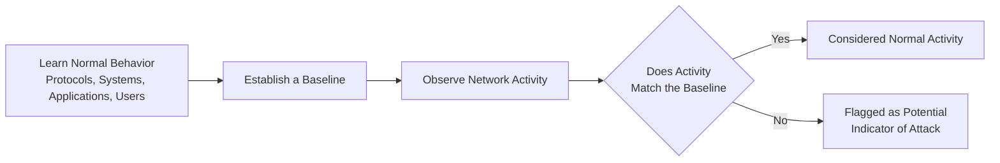

| Topic | Level | Reading Time | Prerequisites |
|---|---|---|---|
| Understanding Network Attacks: An Introduction | Beginner | ~8 min | Basic understanding of networking protocols and general security concepts |

> **الهدف من الـ Section ده:**  
>  هتفهم ليه معرفة الـ "normal behavior" في الشبكة أساس مهم جدًا لاكتشاف أي هجوم، وهتاخد نظرة عامة على طبيعة هجمات الشبكات قبل ما ندخل في تفاصيل كل هجوم لوحده.

## Learning Objectives

By the end of this section, you will be able to:

- Explain why understanding **normal network behavior** is a prerequisite for detecting attacks.
- Describe the role of a **Security Analyst** in learning how protocols, systems, applications, and users typically behave.
- Identify the different layers a network attack can target.
- List the common high-level goals attackers pursue when launching network attacks.

## Table of Contents

- [Why Normal Behavior Matters](#why-normal-behavior-matters)
- [The Analyst's Perspective](#the-analysts-perspective)
- [Layers Targeted by Network Attacks](#layers-targeted-by-network-attacks)
- [Common Goals Behind Network Attacks](#common-goals-behind-network-attacks)
- [Normal vs. Abnormal Activity Diagram](#normal-vs-abnormal-activity-diagram)
- [How to Approach the Attacks in This Series](#how-to-approach-the-attacks-in-this-series)
- [Career Connection](#career-connection)
- [Key Terms Glossary](#key-terms-glossary)
- [Summary](#summary)

## Why Normal Behavior Matters

في مجال أمان الشبكات (**network security**)، جزء أساسي جدًا من الشغل هو فهم **إزاي النشاط الطبيعي للشبكة بيبان (what normal network activity looks like)**، عشان نقدر نميّز أي حاجة غير طبيعية أو مشبوهة.

الفكرة دي بسيطة لكنها جوهرية: من غير ما تعرف الـ "طبيعي" كويس، مش هتقدر تحدد الـ "غير طبيعي" بدقة. لو محلل الأمان معندوش صورة واضحة عن السلوك الاعتيادي للشبكة، هو ممكن يفوّت هجوم حقيقي، أو على العكس، يعتبر نشاط طبيعي إنه تهديد (وده بيتسمى **false positive**).

> [!IMPORTANT]
> الأمان الفعّال مش بس معرفة "إزاي الهجوم بيبان"، لكنه أساسًا معرفة "إزاي السلوك الطبيعي بيبان"، عشان أي انحراف عنه يبقى إشارة (**indicator**) تستحق التحقيق.

## The Analyst's Perspective

محللو الأمان (**security analysts**) بيقضوا وقت كبير في تعلّم إزاي البروتوكولات (**protocols**)، الأنظمة (**systems**)، التطبيقات (**applications**)، والمستخدمين (**users**) بيتصرفوا بشكل طبيعي.

الفهم ده بيتطلب مراقبة مستمرة ومتراكمة، مش مجرد قراءة نظرية، لأن السلوك "الطبيعي" ممكن يختلف من مؤسسة لتانية، ومن قسم لتاني داخل نفس المؤسسة.

بمجرد ما السلوك الطبيعي ده بيتفهم كويس، الأنشطة الغير عادية (**unusual activities**) تقدر تتلاحظ كمؤشرات محتملة (**potential indicators**) على هجوم أو حادثة أمنية (**security incident**).

> [!TIP]
> بناء "خط أساس" (**baseline**) واضح للسلوك الطبيعي في الشبكة هو من أهم الأدوات اللي بتساعد أي محلل أمان يكتشف الانحرافات بسرعة وبدقة أكبر.

## Layers Targeted by Network Attacks

هجمات الشبكات ممكن تستهدف طبقات مختلفة تمامًا من البيئة التقنية، من ضمنها:

| الطبقة المستهدفة | أمثلة |
|---|---|
| **الأجهزة (Devices)** | أجهزة الشبكة، endpoints، أجهزة IoT |
| **بروتوكولات الشبكة (Network Protocols)** | ARP, DNS, TCP/IP |
| **التطبيقات (Applications)** | مواقع الويب، الخدمات، قواعد البيانات |
| **المستخدمين (Users)** | حسابات الموظفين، بيانات الاعتماد، الصلاحيات |

> [!NOTE]
> الهجوم الواحد مش بالضرورة بيستهدف طبقة واحدة بس؛ كتير من الهجمات المتقدمة بتبدأ من طبقة (زي المستخدم عن طريق phishing) وبعدين بتتحرك لطبقة تانية (زي التطبيقات أو الأنظمة الداخلية).

## Common Goals Behind Network Attacks

المهاجمين بيحاولوا يحققوا أهداف متنوعة من خلال هجمات الشبكات، من أشهرها:

- سرقة المعلومات (**steal information**).
- الحصول على وصول غير مصرح به (**gain unauthorized access**).
- تعطيل الخدمات (**disrupt services**).
- استخدام بيانات اعتماد شرعية (**legitimate credentials**) عشان يتجنبوا الاكتشاف.

> [!WARNING]
> استخدام بيانات اعتماد شرعية من أخطر السيناريوهات، لأن نشاط المهاجم في الحالة دي ممكن يبان "طبيعي" ظاهريًا، وده بيرجعنا لأهمية فهم السلوك الطبيعي بدقة عالية، مش الاعتماد بس على البحث عن "أنماط هجوم معروفة".

## Normal vs. Abnormal Activity Diagram

المخطط التالي بيوضح العملية الفكرية اللي بيمر بيها محلل الأمان عشان يوصل لاكتشاف هجوم محتمل:

## How to Approach the Attacks in This Series

في الأقسام الجاية من الكورس، هندرس هجمات شبكات مختلفة (زي اللي درسناها قبل كده زي ARP Cache Poisoning وWatering Hole Attack، وهجمات تانية جاية). الهدف الأساسي من كل هجوم مش بس حفظ تعريفه، لكن فهم:

- **إزاي الهجوم بيبان (what the attack looks like)** من الناحية التقنية.
- **ليه ده يُعتبر سلوك غير طبيعي (why it is abnormal)** مقارنة بالنشاط الطبيعي المتوقع.

> [!TIP]
> وانت بتقرأ أي هجوم جديد في الكورس، حاول دايمًا تسأل نفسك: "لو أنا محلل أمان بشوف الـ traffic ده، إيه اللي كان المفروض يلفت نظري إن فيه حاجة مش طبيعية؟"

## Career Connection

المفهوم اللي شرحناه في القسم ده هو حجر الأساس لكل شغل تحليل الأمان تقريبًا:

- في مجال **SOC**، بناء وفهم الـ baseline الخاص بالشبكة هو أساس عملية الـ monitoring اليومية.
- في مجال **Threat Hunting**، القدرة على تمييز الانحرافات الدقيقة عن السلوك الطبيعي هي المهارة الأساسية للبحث عن تهديدات غير مكتشفة بعد.
- في مجال **Digital Forensics**، فهم السلوك الطبيعي بيساعد في تحديد نقطة بداية الهجوم بدقة أثناء التحقيق بعد وقوع الحادثة.

## Key Terms Glossary

| Term | Definition |
|---|---|
| **Baseline** | نمط السلوك الطبيعي المعتاد لشبكة أو نظام أو مستخدم معين، يُستخدم كمرجع للمقارنة. |
| **Security Analyst** | شخص متخصص في مراقبة وتحليل الأنشطة الأمنية لاكتشاف التهديدات المحتملة. |
| **Indicator of Attack (IoA)** | إشارة أو نمط سلوكي يدل على احتمالية وجود هجوم قيد التنفيذ. |
| **False Positive** | تنبيه أمني يشير إلى وجود تهديد بينما النشاط في الحقيقة طبيعي وغير ضار. |
| **Unauthorized Access** | الوصول لنظام أو بيانات من غير تصريح شرعي بذلك. |

## Summary

- فهم **السلوك الطبيعي (normal behavior)** للشبكة هو الأساس الحقيقي لاكتشاف أي نشاط غير طبيعي أو مشبوه.
- محللو الأمان بيقضوا وقت كبير في دراسة سلوك البروتوكولات، الأنظمة، التطبيقات، والمستخدمين قبل ما يقدروا يميّزوا الانحرافات عنه.
- هجمات الشبكات ممكن تستهدف طبقات متعددة، تشمل الأجهزة، بروتوكولات الشبكة، التطبيقات، والمستخدمين.
- من أشهر أهداف المهاجمين: سرقة المعلومات، الحصول على وصول غير مصرح به، تعطيل الخدمات، أو استخدام بيانات اعتماد شرعية لتجنب الاكتشاف.
- عند دراسة أي هجوم جديد، الهدف الأساسي هو فهم شكل الهجوم تقنيًا، وليه ده يُعتبر سلوك شاذ مقارنة بالنشاط الطبيعي المتوقع.

