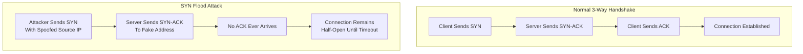

| Topic | Level | Reading Time | Prerequisites |
|---|---|---|---|
| SYN Flood Attacks | Intermediate | ~20 min | Basic understanding of TCP/IP and how network connections are established |

> **الهدف من الـ Section ده:**  
>  هتفهم إزاي الـ TCP 3-Way Handshake بيشتغل بشكل طبيعي، وإزاي المهاجم يقدر يستغل الخطوة دي بالظبط عشان يعمل **SYN Flood** ويحرم المستخدمين الحقيقيين من الوصول للسيرفر.

## Learning Objectives

By the end of this section, you will be able to:

- Explain the normal **3-Way Handshake** process used to establish a TCP connection.
- Describe the resource burden a server carries while waiting for a handshake to complete.
- Explain how a **SYN Flood** attack abuses this burden to cause a **Denial of Service (DoS)**.
- Explain why an attacker does not need millions of real machines to overwhelm a server.
- Explain the role of **spoofed source IP addresses** in guaranteeing the handshake never completes.
- Compare **timeout reduction** and **SYN Proxying** as defenses, and evaluate their limitations.

## Table of Contents

- [Quick Refresher: The 3-Way Handshake](#quick-refresher-the-3-way-handshake)
- [Why This Attack Works: The Server's Burden](#why-this-attack-works-the-servers-burden)
- [The Basic Attack Concept](#the-basic-attack-concept)
- [Common Misconception: Do You Need a Million Computers](#common-misconception-do-you-need-a-million-computers)
- [The Trick: Fake Source IP Addresses](#the-trick-fake-source-ip-addresses)
- [Attack Flow Diagram](#attack-flow-diagram)
- [Defenses and Their Limitations](#defenses-and-their-limitations)
- [Career Connection](#career-connection)
- [Key Terms Glossary](#key-terms-glossary)
- [Summary](#summary)

## Quick Refresher: The 3-Way Handshake

قبل ما أي جهازين يقدروا يتواصلوا عن طريق **TCP** (زي المتصفح بتاعك وهو بيكلم موقع إلكتروني)، لازم يعدّوا على **3-Way Handshake** بالخطوات التالية:

1. **SYN**: الـ Client بيقول: "عايز أبدأ اتصال."
2. **SYN-ACK**: السيرفر بيرد: "تمام، سامعك، يلا نبدأ."
3. **ACK**: الـ Client بيأكّد: "تمام، اتأكد، يلا نبدأ فعليًا."

> [!TIP]
> فكّر في العملية دي زي بداية مكالمة تليفون: إنت بتتصل (SYN)، الطرف التاني بيرفع السماعة ويقول "ألو؟" (SYN-ACK)، وإنت بترد "أهلًا، أنا فلان" (ACK) قبل ما المحادثة الفعلية تبدأ.

بمجرد ما الخطوات التلاتة دي تكتمل، الاتصال بيبقى رسميًا مُنشأ (**established**)، والبيانات الفعلية تقدر تتبادل.

> [!IMPORTANT]
> المشكلة الأساسية إن هجوم **SYN Flood** بيستغل الخطوتين الأولى والتانية بالظبط، ويتأكد إن الخطوة التالتة (ACK) أبدًا ما بتحصلش.

## Why This Attack Works: The Server's Burden

السيرفر مش بيتعامل مع مستخدم واحد بس، هو محتاج يخدم عدد كبير من المستخدمين في نفس الوقت، بشكل متوازي (**in parallel**).

عشان يقدر يعمل كده، لازم السيرفر يتتبع **كل جلسة (session) على حدة**، زي موظف استقبال (**receptionist**) بيمسك دفتر ملاحظات منفصل لكل زائر مستني.

في اللحظة اللي فيها SYN packet بيوصل، السيرفر بيعمل التالي:

1. بيحجز (**reserve**) ذاكرة للاتصال المحتمل ده.
2. بيرد بـ SYN-ACK.
3. بيستنى الـ ACK النهائي عشان يأكّد الـ handshake، عادةً لمدة حوالي **30 ثانية** قبل ما يستسلم ويلغي المحاولة.

السلوك ده، الانتظار وحجز الذاكرة "احتياطًا"، طبيعي وضروري تمامًا لحركة المرور الشرعية، لكنه **بالظبط اللي المهاجم هيستغله**.

> [!NOTE]
> فكّر في موظف استقبال، لما حد يجيله ويقول "أهلًا" بس، هو فورًا بياخد دفتر ملاحظات، بيكتب سطر مبدئي (placeholder)، وبيفضل ماسك الدفتر ده مفتوح لمدة 30 ثانية مستني الزائر يقول اسمه، حتى لو الزائر أبدًا ما قالش كلمة تانية.

## The Basic Attack Concept

المهاجم بيبعت عدد ضخم جدًا من الـ SYN packets، لكنه عن قصد **أبدًا ما بيكمّلش الـ handshake** (أبدًا ما بيبعتش الـ ACK النهائي).

بما إن السيرفر لازم يحجز ذاكرة ويستنى حوالي 30 ثانية لكل SYN بيستقبله، المهاجم فعليًا بيجبر السيرفر إنه يفتح آلاف "الدفاتر" اللي أبدًا مش هتتملى.

في النهاية، السيرفر بيخلّص الذاكرة (**available connection slots**) المخصصة لاستقبال مستخدمين جدد شرعيين.

**النتيجة**: المستخدمين الحقيقيين اللي بيحاولوا يتصلوا (زي عملاء بيحاولوا يحمّلوا موقع إلكتروني) بيترفضوا أو بيواجهوا تأخير شديد جدًا، وده شكل من أشكال **Denial of Service (DoS)**.

> [!WARNING]
> تخيل 10,000 شخص واقفين قدام موظف استقبال، كل واحد بيقول "أهلًا" بس وبيمشي من غير ما يكمّل جملته. الموظف دلوقتي عالق ماسك 10,000 دفتر مفتوح، مفيش وقت أو قدرة له إنه يساعد أي زائر حقيقي فعلًا محتاج مساعدة.

## Common Misconception: Do You Need a Million Computers

سؤال طبيعي ممكن يخطر في بالك: لو السيرفر ممكن ينتهي به الحال ماسك ملايين الجلسات النصف-مفتوحة (**half-open sessions**)، ده معناه إن المهاجم محتاج ملايين الأجهزة المنفصلة (**bots**)، كل واحد بيبعت packet واحد بس؟

**الإجابة: لا، ده مش إزاي الموضوع بيشتغل.**

صحيح إن المهاجم عادةً بيتحكم في عدة أجهزة (**botnet**، مجموعة "zombie machines" تحت سيطرته)، لكن كل zombie machine **مش بيبعت SYN packet واحد بس ويوقف**.

بدل كده، كل zombie بياخد أمر إنه يطلق أكبر عدد ممكن من الـ SYN packets المصممة خصيصًا، بحسب قوة معالجته، ممكن يكون آلاف أو ملايين الـ packets من جهاز واحد بس.

> [!TIP]
> بدل ما تحتاج مليون شخص مختلف كل واحد يدق جرس الباب مرة واحدة، المهاجم محتاج بس عدد صغير من الأشخاص، لكن كل واحد معاه جهاز بيدق الجرس بشكل مستمر، آلاف المرات في الثانية.

يعني الحجم الضخم من الجلسات الوهمية جاي من **سرعة صناعة الـ packets (packet-crafting speed)**، مش من الحاجة لجهاز حقيقي منفصل لكل جلسة.

## The Trick: Fake Source IP Addresses

هنا الحيلة الأساسية اللي بتخلي الهجوم ده يشتغل فعليًا: كل SYN packet المهاجم بيبعته بيحتوي على **عنوان IP مصدر مزيف (fake source IP address)**، تحديدًا عنوان IP مش مخصص لأي جهاز حقيقي موجود في العالم.

> [!NOTE]
> ده زي إنك تطلب آلاف من البيتزا يتوصلك، لكن بدل ما تدّي عنوانك الحقيقي، إنت بتدّي عنوان شارع مش موجود أصلًا. محل البيتزا لسه بيجهّز البيتزا وبيبعت السائق، لكن السائق أبدًا مش هيقدر يوصّلها فعليًا، فهي بس بتضيع وقت وموارد.

لما السيرفر يستقبل الـ SYN المزيف، هو بيعمل بالظبط اللي اتصمم عشانه: بيرد بـ **SYN-ACK** مبعوت للعنوان المزيف ده.

وبما إن الـ IP ده مش بتاع أي جهاز حقيقي، محدش أبدًا هيستقبل الـ SYN-ACK ده، وبالتالي محدش هيقدر يبعت الـ ACK النهائي.

ده بيضمن إن الـ handshake **أبدًا مش هيكتمل**، والاتصال هيفضل عالق بشكل دائم في حالة **half-open**، وده بيشغل موارد السيرفر لمدة الـ timeout الكاملة (~30 ثانية) في كل مرة.

## Attack Flow Diagram

المخطط التالي بيوضح إزاي هجوم الـ SYN Flood بيحصل، من إرسال الـ packets المزيفة وحتى استهلاك موارد السيرفر بالكامل:

```mermaid
flowchart LR
    A["Attacker Controls Botnet<br/>Multiple Zombie Machines"] --> B["Each Zombie Sends<br/>Massive Volume of SYN Packets"]
    B --> C["Each Packet Uses<br/>a Spoofed Source IP"]
    C --> D["Server Reserves Memory<br/>and Replies With SYN-ACK"]
    D --> E["SYN-ACK Sent to<br/>Nonexistent IP Address"]
    E --> F["No ACK Ever Returns<br/>Connection Stuck Half-Open"]
    F --> G["Server Memory Exhausted<br/>by Thousands of Half-Open Sessions"]
    G --> H["Legitimate Users<br/>Rejected or Delayed"]
```

والمخطط التالي بيقارن بين مسار الـ Handshake الطبيعي ومسار الهجوم:

## Defenses and Their Limitations

فيه طريقتين أساسيتين بيتم استخدامهم للدفاع ضد هجمات الـ SYN Flood:

### Option 1: Shorten the Timeout Window

بدل ما السيرفر يستنى 30 ثانية للـ ACK، ممكن يتم ضبطه إنه يستسلم بشكل أسرع بكتير (مثلًا 5-10 ثواني).

ده بيقلل من المدة اللي كل جلسة وهمية بتشغل بيها الذاكرة.

> [!WARNING]
> **الحد من فعالية الحل ده**: لو الهجوم قوي بما فيه الكفاية (معدل packets مرتفع جدًا)، حتى الـ timeout القصير مش هيساعد، لأن المهاجم لسه هيقدر يُغرق السيرفر أسرع من انتهاء صلاحية الجلسات القديمة.

### Option 2: SYN Proxying (Handshake Proxy)

بعض الـ firewalls والـ load balancers المتقدمة تقدر تعترض الـ handshake نيابة عن السيرفر.

الـ firewall نفسه بيكمّل الـ 3-way handshake مع الـ client الأول، وبيتحقق إن الاتصال حقيقي وشرعي. بعد ما الـ handshake يتأكد بس، الـ firewall بيقيم الاتصال الفعلي مع السيرفر الحقيقي.

ده معناه إن الـ SYNs المزيفة بيتم فلترتها **قبل** ما توصل أو تشكّل عبء على السيرفر الحقيقي أصلًا.

> [!TIP]
> فكّر في الحل ده زي تعيين حارس أمن بيوقف كل زائر عند البوابة الرئيسية، بيتأكد من هويته، وبعد كده بس بيسمحله يمشي لموظف الاستقبال الحقيقي، فموظف الاستقبال أبدًا مش هيضطر يتعامل مع أي زائر مزيف من الأساس.

الجدول التالي بيلخّص الفرق بين الحلين:

| الحل | الميزة | القيود |
|---|---|---|
| **Shortening Timeout** | سهل التطبيق ومنخفض التكلفة | فعاليته محدودة ضد هجمات قوية جدًا (معدل packets مرتفع) |
| **SYN Proxying** | فعال جدًا، بيمنع وصول الهجوم للسيرفر الحقيقي أصلًا | يحتاج بنية تحتية متقدمة (firewalls/load balancers) وتكلفة أعلى |

## Career Connection

فهم SYN Flood له تطبيقات مباشرة في مسارات مهنية متعددة:

- في مجال **SOC**، مراقبة معدلات الـ SYN packets والجلسات half-open بتساعد في اكتشاف هجمات DoS مبكرًا.
- في مجال **Network Security Engineering**، ضبط إعدادات الـ firewalls وتفعيل SYN Proxying جزء أساسي من تصميم بنية شبكة مقاومة للهجمات.
- في مجال **Incident Response**، التعامل مع هجوم SYN Flood فعلي بيتطلب فهم دقيق لآلية الهجوم عشان يتم تخفيف تأثيره بسرعة.

## Key Terms Glossary

| Term | Definition |
|---|---|
| **3-Way Handshake** | عملية تأسيس اتصال TCP عبر ثلاث خطوات: SYN، SYN-ACK، وACK. |
| **SYN Flood** | هجوم يستغل الـ handshake عن طريق إرسال كم هائل من طلبات SYN بدون إتمام الاتصال، بهدف استنزاف موارد السيرفر. |
| **Half-Open Session** | جلسة اتصال TCP توقفت عند مرحلة SYN-ACK ولم يصلها ACK نهائي لإتمامها. |
| **Denial of Service (DoS)** | هجوم يهدف إلى منع المستخدمين الشرعيين من الوصول لخدمة معينة. |
| **Botnet** | مجموعة من الأجهزة المخترقة (zombie machines) التي يتحكم بها المهاجم لتنفيذ هجمات بشكل جماعي. |
| **Spoofed Source IP** | عنوان IP مزيف يوضع كمصدر في الحزمة، غالبًا لا يخص أي جهاز حقيقي. |
| **SYN Proxying** | آلية دفاعية يتولى فيها جهاز وسيط (مثل firewall) إتمام الـ handshake نيابة عن السيرفر قبل تمرير الاتصال. |

## Summary

- الـ **3-Way Handshake** هو الطريقة الطبيعية لتأسيس اتصال TCP، عبر خطوات SYN، SYN-ACK، وACK.
- السيرفر بيحجز ذاكرة وبيستنى حوالي 30 ثانية بعد كل SYN عشان يدعم مستخدمين شرعيين متعددين في نفس الوقت، وده السلوك اللي المهاجم بيستغله.
- في **SYN Flood**، المهاجم بيبعت عدد ضخم من SYN packets من غير ما يكمّل الـ handshake أبدًا، وده بيستنزف ذاكرة السيرفر ويمنع المستخدمين الحقيقيين من الوصول (**Denial of Service**).
- المهاجم مش محتاج ملايين الأجهزة الحقيقية؛ **botnet** صغير نسبيًا يقدر يولّد حجم ضخم من الـ SYN packets المزيفة بسرعة عالية.
- كل packet بيحتوي على **spoofed source IP** عشان يضمن إن الـ SYN-ACK رد السيرفر ميوصلش لحد، وبالتالي الـ handshake أبدًا مش هيكتمل.
- الدفاعات بتشمل **تقصير مدة الـ timeout** (فعاليته محدودة ضد الهجمات القوية) و **SYN Proxying** (أكتر فعالية، لكنه أعلى تكلفة).

