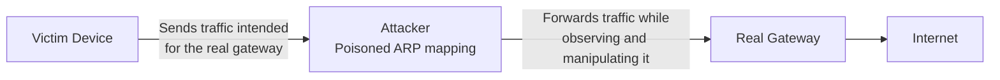
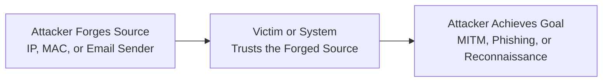

| Topic | Level | Reading Time | Prerequisites |
|---|---|---|---|
| Spoofing | Beginner | ~14 min | Basic understanding of networking concepts (IP addressing, MAC addresses) |

> **الهدف من الـ Section ده:**  
> هتفهم إيه هو الـ Spoofing وإزاي المهاجم يقدر يزوّر مصدر الاتصال على مستويات مختلفة (IP, MAC, Email)، وليه ده بيبقى خطير وبيتستخدم كجزء من هجمات أكبر.

## Learning Objectives

By the end of this section, you will be able to:

- Define **Spoofing** and explain the core idea behind it.
- Describe how **IP Spoofing** works at the network layer.
- Describe how **MAC Spoofing** and **ARP Poisoning** work at the local network level.
- Explain how **Email Spoofing** can make a message appear to come from a trusted sender.
- Identify how spoofing is used as part of larger attacks and list common defenses against it.

## Table of Contents

- [What Is Spoofing](#what-is-spoofing)
- [IP Spoofing](#ip-spoofing)
- [MAC Spoofing and ARP Poisoning](#mac-spoofing-and-arp-poisoning)
- [Email Spoofing](#email-spoofing)
- [Types of Spoofing at a Glance](#types-of-spoofing-at-a-glance)
- [Why Spoofing Is Dangerous](#why-spoofing-is-dangerous)
- [Spoofing as Part of Larger Attacks](#spoofing-as-part-of-larger-attacks)
- [Spoofing Attack Flow Diagram](#spoofing-attack-flow-diagram)
- [Defenses Against Spoofing](#defenses-against-spoofing)
- [Career Connection](#career-connection)
- [Key Terms Glossary](#key-terms-glossary)
- [Summary](#summary)

## What Is Spoofing

**Spoofing** هو استخدام معلومات مزيفة أو مُتلاعب بها (**false or manipulated information**) عشان يخلي الاتصال يبان إنه جاي من مصدر موثوق (**trusted source**).

بالعربي البسيط: المهاجم (**attacker**) بيتظاهر بإنه حد تاني، سواء كان ده جهاز، عنوان شبكة، أو حتى شخص حقيقي، عشان يكسب ثقة الضحية أو يتجاوز آلية تحقق معينة.

> [!NOTE]
> الفكرة الأساسية في أي نوع من أنواع الـ Spoofing واحدة: تزوير **مصدر** الاتصال، مش بالضرورة تزوير المحتوى نفسه. المهاجم بيغيّر "مين اللي باعت الرسالة دي" مش بالضرورة "إيه اللي جوه الرسالة".

## IP Spoofing

على مستوى طبقة الشبكة (**network layer**)، المهاجم يقدر يتلاعب بمعلومات الـ packet عشان يخلي حركة المرور تبان وكأنها جاية من عنوان IP مختلف تمامًا عن المصدر الحقيقي، وده معروف باسم **IP Spoofing**.

يعني المهاجم بيحط أي **IP Address** جوه الـ packet بغض النظر عن المصدر الحقيقي بتاعه، فالجهاز أو النظام المستقبل ممكن ياخد قرارات (زي السماح بالوصول أو الثقة في الحزمة) بناءً على عنوان مزوّر.

> [!WARNING]
> IP Spoofing بيُستخدم كتير في هجمات زي الـ **Denial of Service (DoS/DDoS)**، لأن المهاجم يقدر يخفي هويته الحقيقية أو يوجّه الردود (responses) لضحية تالتة بدل جهازه هو.

## MAC Spoofing and ARP Poisoning

على مستوى الشبكة المحلية (**local network level**)، المهاجمين يقدروا يتلاعبوا بمعلومات الـ **MAC Address** بتاعتهم، وده بيتسمى **MAC Spoofing**.

الهدف الشائع من MAC Spoofing إنه يستخدم عنوان MAC مسموح بيه عشان يتجاوز آلية **MAC Filtering** الموجودة على الشبكة (اللي اتكلمنا عنها في موضوع الـ Wireless Networks).

بالإضافة لكده، فيه تقنية اسمها **ARP Poisoning** (وبتُعرف كمان بـ ARP Spoofing)، وفيها المهاجم بيبعت رسائل ARP مزيفة على الشبكة المحلية عشان يربط عنوان الـ MAC بتاعه بعنوان IP خاص بجهاز تاني (زي الـ default gateway مثلًا). النتيجة إن حركة المرور اللي المفروض تروح للجهاز الحقيقي، بتتحول (تتوجّه) لجهاز المهاجم بدل كده، وده بيسمح له بالتنصت أو التلاعب في الاتصال بين الأجهزة.

> [!IMPORTANT]
> ARP Poisoning من أشهر الطرق اللي بتُستخدم لتنفيذ هجمات **Man-in-the-Middle** داخل الشبكة المحلية نفسها، وده بيوضح إزاي تزوير عنوان بسيط زي MAC ممكن يأدي لمشاكل أمنية كبيرة.

## Email Spoofing

عناوين البريد الإلكتروني ومعلومات المرسل (**sender information**) ممكن كمان يتم تزويرها، وده بيخلي الإيميل يبان وكأنه جاي من شخص أو منظمة تانية غير المرسل الحقيقي.

**Email Spoofing** بيعتمد على تغيير حقل الـ **Sender** في رأس الإيميل (email header)، بحيث الضحية بيشوف اسم أو عنوان مألوف وموثوق، بينما الرسالة فعليًا جاية من مصدر تاني تمامًا.

> [!TIP]
> Email Spoofing غالبًا بيكون الخطوة الأولى في هجمات **Phishing** أو **Spear Phishing**، لأن الرسالة اللي بتبان جاية من مصدر موثوق بتزوّد احتمالية إن الضحية يثق فيها ويتفاعل معاها.

## Types of Spoofing at a Glance

الجدول التالي بيلخّص أهم أنواع الـ Spoofing ومستوى تأثيرها:

| نوع الـ Spoofing | الوصف | المستوى المتأثر |
|---|---|---|
| **IP Spoofing** | وضع أي IP Address في الـ Packet بغض النظر عن المصدر الحقيقي | طبقة الشبكة (Network Layer) |
| **MAC Spoofing** | تغيير الـ MAC Address لتجاوز الـ MAC Filtering | الشبكة المحلية (Local Network) |
| **ARP Poisoning** | ربط MAC Address المهاجم بعنوان IP خاص بجهاز آخر لتحويل حركة المرور | الشبكة المحلية (Local Network) |
| **Email Spoofing** | تغيير الـ Sender في الإيميل عشان يبان كأنه من حد تاني | مستوى التطبيق (Application Layer) |

## Why Spoofing Is Dangerous

الـ Spoofing بيُعتبر خطير لأنه بيقدر **يخلي اتصال ضار يبان شرعي وموثوق (legitimate and trustworthy)**. الضحية أو حتى الأنظمة التقنية نفسها ممكن تاخد قرارات ثقة بناءً على مصدر مزوّر، وده بيفتح الباب قدام المهاجم عشان ينفذ أهداف تانية.

> [!IMPORTANT]
> الخطورة الحقيقية في الـ Spoofing مش في التزوير نفسه بس، لكن في إنه بيُستخدم كـ **مُمكّن (enabler)** لهجمات تانية أكبر وأخطر.

## Spoofing as Part of Larger Attacks

الـ Spoofing غالبًا مش هدف نهائي في حد ذاته، لكنه بيُستخدم كجزء من هجمات أوسع، من أشهرها:

- هجمات **Man-in-the-Middle (MITM)**: زي ما شفنا في ARP Poisoning.
- حملات **Phishing**: زي ما شفنا في Email Spoofing.
- عمليات **Network Reconnaissance**: عشان المهاجم يخفي هويته وهو بيجمع معلومات عن الشبكة المستهدفة.

## Spoofing Attack Flow Diagram

المخطط التالي بيوضح إزاي ARP Poisoning بيُستخدم لتنفيذ هجوم Man-in-the-Middle داخل الشبكة المحلية:

والمخطط التالي بيوضح المسار العام اللي أي نوع من أنواع الـ Spoofing بيمشي فيه، من التزوير للاستغلال:

## Defenses Against Spoofing

للحد من مخاطر الـ Spoofing بأنواعه، بيُستخدم مزيج من الآليات التالية:

| الآلية | الدور في الحماية |
|---|---|
| **Authentication** | التحقق من هوية المرسل الحقيقية بدل الاعتماد على المصدر الظاهري فقط |
| **Digital Signatures** | إثبات إن الرسالة أو البيانات جاية فعلًا من المصدر المُعلن وإنها لم تتغير |
| **Secure Protocols** | استخدام بروتوكولات بتتضمن آليات تحقق مدمجة (زي HTTPS, DNSSEC) |
| **Network Monitoring** | اكتشاف أنماط حركة مرور غير طبيعية قد تدل على spoofing |
| **Anti-Spoofing Controls** | إعدادات على مستوى الشبكة (زي فلترة الحزم ذات العناوين غير المنطقية) لمنع IP Spoofing |

> [!TIP]
> لا يوجد آلية دفاع واحدة تكفي لمنع كل أنواع الـ Spoofing؛ الحماية الفعالة بتعتمد على طبقات متعددة تشتغل مع بعض على مستويات مختلفة من الشبكة والتطبيق.

## Career Connection

فهم الـ Spoofing مرتبط بشكل مباشر بمسارات مهنية متعددة:

- في مجال **SOC**، اكتشاف أنماط IP أو ARP غير طبيعية جزء أساسي من عمل تحليل حركة المرور.
- في مجال **Pentesting**، تنفيذ هجمات ARP Poisoning أو IP Spoofing بشكل أخلاقي بيُستخدم لاختبار مدى صمود الشبكة أمام هجمات Man-in-the-Middle.
- في مجال **Cloud Security**، حماية الأنظمة من IP Spoofing جزء من تصميم قواعد الشبكة (network security groups) في البيئات السحابية.

## Key Terms Glossary

| Term | Definition |
|---|---|
| **Spoofing** | استخدام معلومات مزيفة أو متلاعب بها لجعل الاتصال يبدو من مصدر موثوق. |
| **IP Spoofing** | تزوير عنوان الـ IP المصدر في الـ packet ليبدو جاي من جهاز آخر. |
| **MAC Spoofing** | تغيير عنوان الـ MAC الخاص بالجهاز لتجاوز آليات مثل MAC Filtering. |
| **ARP Poisoning** | تقنية بيتم فيها إرسال رسائل ARP مزيفة لربط عنوان MAC المهاجم بعنوان IP خاص بجهاز آخر. |
| **Email Spoofing** | تزوير حقل المرسل في الإيميل ليبدو الإيميل قادمًا من شخص أو جهة أخرى. |
| **Man-in-the-Middle (MITM)** | هجوم يضع فيه المهاجم نفسه بين طرفي الاتصال لمراقبته أو التلاعب به. |

## Summary

- **Spoofing** هو استخدام معلومات مزيفة عشان يخلي الاتصال يبان جاي من مصدر موثوق.
- **IP Spoofing** بيحصل على مستوى طبقة الشبكة، من خلال تزوير عنوان IP المصدر في الـ packet.
- **MAC Spoofing** و **ARP Poisoning** بيحصلوا على مستوى الشبكة المحلية، وبيُستخدموا لتجاوز MAC Filtering أو تنفيذ هجمات Man-in-the-Middle.
- **Email Spoofing** بيحصل على مستوى التطبيق، من خلال تزوير حقل المرسل في الإيميل، وغالبًا بيكون خطوة أولى في هجمات Phishing.
- الـ Spoofing خطير لأنه بيخلي اتصال ضار يبان شرعي وموثوق، وغالبًا بيُستخدم كجزء من هجمات أكبر زي MITM، Phishing، وNetwork Reconnaissance.
- الحماية الفعالة بتعتمد على طبقات متعددة زي **Authentication**، **Digital Signatures**، **Secure Protocols**، **Network Monitoring**، و **Anti-Spoofing Controls**.

