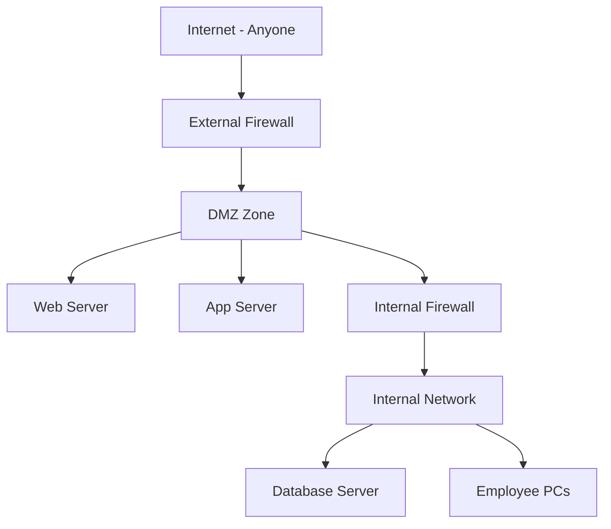
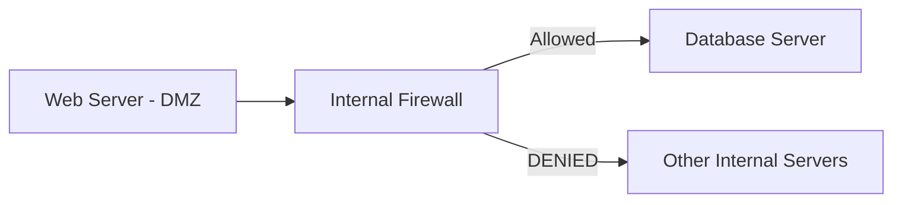
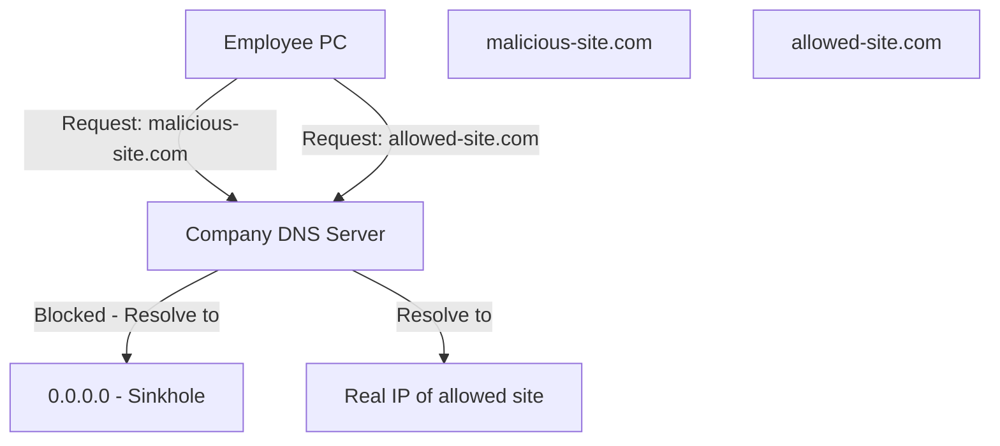

> **الهدف من الـ Section ده:**  
> بيشرح ببساطة إزاي تنظم الشبكة وتتحكم في Traffic باستخدام الـ DMZ لعزل السيرفرات العامة عن الشبكة الداخلية، والـ Sinkhole لمنع المواقع الضارة بشكل سهل وفعال.


## Table of Contents

- [Network Zones & Traffic Control](#network-zones--traffic-control)
  - [1.1 DMZ (Demilitarized Zone)](#21-dmz-demilitarized-zone)
  - [1.2 Sinkhole](#22-sinkhole)
- [Summary](#summary)

## Network Zones & Traffic Control

### 2.1 DMZ (Demilitarized Zone)

#### ما هو الـ DMZ؟

الـ **DMZ** هو منطقة خاصة في الشبكة بتحط فيها الـ Servers اللي المفروض يكون الناس العامة (Customers) قادرين يوصلوا ليها.



**إيه اللي بيتحط في الـ DMZ؟**

- الـ **Web Servers** (موقع الشركة، متجر إلكتروني)
- الـ **Application Servers** (تطبيق بنكي، تطبيق توصيل)
- أي **Service** المفروض يوصله الناس من الـ Internet

**إيه اللي بيفضل في الـ Internal Network؟**

- الـ **Database Servers**
- الـ **Internal File Servers**
- الـ **Employee PCs والـ Printers**

> [!WARNING]
> لا أحد 100% آمن — حتى الـ DMZ ممكن يتاخد. الهدف هو إنك تعملها **صعبة قدر الإمكان** وتكون **مستعد للرد السريع** لما حاجة تحصل.

#### تأمين الـ DMZ

**1. Hardening الـ OS:**

- شغّل بس الـ Services اللي محتاجها.
- اغلق كل الـ Ports اللي مش بتستخدمها.
- اشل أي Application مش ضروري.

**2. Patch Management:**

> [!IMPORTANT]
> لما Vendor كبير زي **F5** يعلن عن Vulnerability — أول حاجة تعملها إنك تـ Patch الـ DMZ Zone **أولاً** قبل أي حاجة تانية، لأن دي المنطقة اللي كل الناس قادرين يوصلوا ليها والـ Attackers هيستغلوها بسرعة.

**3. Firewall Rules للـ DMZ:**

```
ALLOW TCP ANY → 2.2.2.2 PORT 80
```

الـ Rule دي بتقول: اسمح لأي حد يوصل للـ Web Server (IP: 2.2.2.2) من خلال الـ Port 80 بس.

#### الـ DMZ والـ Internal Network

الـ Web Server في الـ DMZ محتاج يوصل للـ Database جوه الـ Internal Network — وده طبيعي ومقبول، لكن لازم يكون **محكوم ومقيّد**:



> [!IMPORTANT]
> لازم تكون **صارم جداً** في الـ Rules اللي بتسمح بيها لـ Server من الـ DMZ يوصل للـ Internal Network. اسمح بس لـ IP بعينه ولـ Port بعينه — مفيش أي تساهل هنا.

---

### 2.2 Sinkhole

#### المشكلة

لو عايز تمنع موظفيك من الوصول لمواقع معينة (مواقع ضارة، سوشيال ميديا، إلخ) باستخدام الـ Firewall — هتعمل Rules كتير جداً، وكل Packet هيعدي عليها كلها، وده بيزود الـ **Latency** على الشبكة كلها.

#### الحل: Sinkhole

الفكرة إنك بدل ما تحط الـ Block في الـ Firewall، بتحطه في الـ **DNS Server** بتاع الشركة.



**كيف يعمل؟**

1. الموظف بيحاول يفتح موقع محجوب.
2. الـ DNS بتاع الشركة شايف إن الموقع ده محجوب.
3. بدل ما يرجع الـ IP الحقيقي، بيرجع **0.0.0.0** (الـ Sinkhole Address).
4. الـ Browser مش هيلاقي Destination يتصل بيه — الموقع مش هيفتح.

> [!TIP]
> الـ Sinkhole أذكى من الـ Firewall Block في الحالة دي لأنه مش بيضيف أي Load على الـ Firewall ومش بيأثر على الـ Latency. الموضوع كله بيتحسم على مستوى الـ DNS.

## Summary

- الـ **DMZ** هو المنطقة اللي بتحط فيها الـ Public Servers — وهي الأكثر عرضة للهجمات وبالتالي الأولى بالـ Patching والتأمين.
- الـ **Sinkhole** حل ذكي وبسيط لحجب المواقع عن طريق الـ DNS بدل الـ Firewall، وده بيحافظ على الـ Performance.
