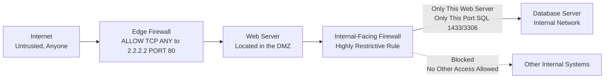

| Topic | Level | Reading Time | Prerequisites |
|---|---|---|---|
| The DMZ (Demilitarized Zone) | Intermediate | ~22 min | Basic understanding of firewalls, firewall rules, and network zones |

> **الهدف من الـ Section ده:**  
> هتفهم إيه هي الـ DMZ وليه المؤسسات بتحطها بين الإنترنت والشبكة الداخلية، وهتشوف إزاي بتتحكم في حركة المرور من وإليها، وليه دايمًا لازم تحدّث سيرفرات الـ DMZ الأول قبل أي حاجة تانية.

## Learning Objectives

By the end of this section, you will be able to:

- Define the **DMZ (Demilitarized Zone)** and explain the two different trust levels it separates.
- Explain why the DMZ requires closer monitoring than the internal network.
- Describe the two-step process of hardening a public-facing server: OS hardening and prioritized patching.
- Explain the golden rule "patch the DMZ first" and why it matters using a real-world vulnerability example.
- Explain how firewalls control traffic both entering the DMZ and moving from the DMZ into the internal network.

## Table of Contents

- [DMZ: The Public Lobby of Your Network](#dmz-the-public-lobby-of-your-network)
- [Two Trust Levels](#two-trust-levels)
- [Where You've Already Used a DMZ Today](#where-youve-already-used-a-dmz-today)
- [Key Mindset: No System Is 100% Secure](#key-mindset-no-system-is-100-secure)
- [Patch the Front Door Before the Back Rooms](#patch-the-front-door-before-the-back-rooms)
  - [Step One: Harden the OS](#step-one-harden-the-os)
  - [Step Two: Patch Fast, But Prioritize](#step-two-patch-fast-but-prioritize)
- [Case Study: Why This Isn't Just Theory](#case-study-why-this-isnt-just-theory)
- [Controlling Traffic In and Out of the DMZ](#controlling-traffic-in-and-out-of-the-dmz)
- [The DMZ Still Needs to Reach Inside: Carefully](#the-dmz-still-needs-to-reach-inside-carefully)
- [DMZ Architecture Diagram](#dmz-architecture-diagram)
- [Career Connection](#career-connection)
- [Key Terms Glossary](#key-terms-glossary)
- [Summary](#summary)

## DMZ: The Public Lobby of Your Network

**DMZ (Demilitarized Zone)** هي منطقة شبكة خاصة بتحط فيها كل الخدمات اللي الجمهور محتاج يوصلها، الموقع الإلكتروني بتاعك، متجرك الأونلاين، الـ backend بتاع تطبيق الموبايل بتاعك، إلخ.

> [!NOTE]
> تخيل مبنى بنك: اللوبي (**lobby**) مفتوح لأي حد ماشي من الشارع (ده الـ DMZ)، لكن غرفة الخزنة في الخلف مش بتتفتح إلا لموظفي البنك اللي عندهم كارنيه (ده شبكتك الداخلية).

## Two Trust Levels

فيه مستويين ثقة أساسيين لازم نفرّق بينهم:

- **الشبكة الداخلية (Internal Network)**: أجهزة الكمبيوتر، السيرفرات الداخلية، الطابعات، بس الموظفين اللي بيسجلوا دخول بحساب الشركة (دول ناس إنت واثق فيهم).
- **DMZ**: مفتوحة حرفيًا لأي حد على الإنترنت، عملاء حقيقيين، لكن كمان محتالين، bots، وهاكرز (إنت مش عارف مين اللي بيدق الباب).

بما إن الـ DMZ بتسمح بدخول ناس إنت مش واثق فيهم، هي بتتراقب عن قرب جدًا، **logging** أكتر، **monitoring** أكتر، وتنبيهات (**alerts**) أكتر من شبكتك الداخلية.

> [!TIP]
> فكّر في بيتك، عندك شرفة أمامية (**front porch**، وده الـ DMZ) أي عامل توصيل أو غريب يقدر يقف فيها، وصالة معيشة (**living room**، وده الشبكة الداخلية) بس العيلة والضيوف المدعوين بيدخلوها. إنت مش هتسيب مفاتيح عربيتك أو صور عيلتك على الشرفة.

## Where You've Already Used a DMZ Today

كل مرة بتطلب أكل، هدوم، أو أي حاجة أونلاين، إنت فعليًا بتكلم **web server**، والسيرفر ده موجود جوه الـ **DMZ** الخاص بالشركة.

أمثلة: السيرفرات اللي ورا تطبيق بنكي، أو تطبيقات زي Noon، Amazon، أو Careem، أي حاجة العميل بيوصلها عبر الإنترنت، عايشة جوه الـ DMZ.

## Key Mindset: No System Is 100% Secure

عقلية أساسية لازم تفتكرها: **مفيش نظام آمن 100%**.

الأمان مش معناه بناء حاجة مستحيل تتكسر، هو معناه إنك تخلي الاختراق **صعب بما فيه الكفاية** إن معظم المهاجمين يستسلموا، مع قبول الحقيقة إن يوم من الأيام، حد **هيلاقي** ثغرة.

> [!IMPORTANT]
> بسبب كده، المهارة الحقيقية مش بس "امنع كل حاجة"، هي **الاستعداد للاستجابة بسرعة** لما حاجة تحصل غلط (اكتشافها، احتوائها، إصلاحها بـ patch، والتواصل بخصوصها).

> [!TIP]
> خزنة البنك مش مستحيل كسرها، هي مصممة عشان تبطّئ اللص لمدة كافية إن الإنذار يوصل الشرطة قبل ما يعدي. الأمان = تأخير + اكتشاف + استجابة سريعة، مش حيطة مستحيلة.

## 5. Patch the Front Door Before the Back Rooms

سؤال شائع جدًا في مقابلات الشغل الحقيقية: "إزاي تخلي سيرفر مواجه للجمهور (**public-facing**) أكتر أمانًا؟"

### Step One: Harden the OS

جرّد السيرفر لحد ما يبقى بس فيه اللي هو محتاجه بالظبط (اقفل البورتات الغير مستخدمة، امسح البرامج الغير مستخدمة، عطّل الحسابات الافتراضية). لو خدمة معينة مش بتُستخدم، هي بس خطر إضافي موجود من غير أي فايدة.

**مثال**: لو سيرفر الويب بتاعك مش محتاج FTP، اقفل FTP بالكامل، متسيبوش "لأي احتمال."

### Step Two: Patch Fast, But Prioritize

لما مزوّد (زي Microsoft، F5، Cisco، إلخ) يعلن عن ثغرة، هو عادةً بيصدر **patch**.

في شركة كبيرة عندها آلاف السيرفرات، مش هتقدر تحدّث كل حاجة بين ليلة وضحاها، لازم **تحدد أولويات**.

> [!IMPORTANT]
> **القاعدة الذهبية**: حدّث سيرفرات الـ DMZ الأول (**Patch the DMZ first**).
>
> ليه؟ لأن سيرفرات الـ DMZ معرضة للإنترنت بالكامل، أي حد في أي مكان يقدر يحاول يستغل الثغرة دي في اللحظة اللي بتبقى فيها معلومة عامة. السيرفرات الداخلية محمية وراء طبقات من التحكم في الوصول (**access control**)، فهي نسبيًا أقل خطورة على المدى القصير.

## Case Study: Why This Isn't Just Theory

**F5** (مزوّد رئيسي لأجهزة الـ load balancers والـ security appliances اللي غالبًا بتتنشر جوه الـ DMZ) أعلن علنًا عن ثغرات خطيرة متعددة في منتجاته.

المرجع: [K000156572](https://my.f5.com/manage/s/article/K000156572)

الإعلانات من النوع ده هي بالظبط اللحظة اللي فيها قاعدة "حدّث الـ DMZ الأول" بتبقى مهمة، من اللحظة اللي الثغرة بتبقى فيها معلومة عامة، المهاجمين حوالين العالم بيبدأوا يمسحوا الإنترنت بادوّرين على سيرفرات مش متحدثة.

> [!TIP]
> **مهمة للمتعلمين**: تابع [The Hacker News](https://thehackernews.com) — مصدر مجاني ممتاز لمتابعة الثغرات والاختراقات الحقيقية أول ما بتحصل، عشان تبني عادة إنك تفضل محدّث بمعلومات زي أي متخصص أمن حقيقي.

**الخلاصة**: الإفصاح عن الثغرات (**vulnerability disclosures**) مش نادر، هو بيحصل باستمرار. شغلك مش إنك تمنع وجودها، لكن إنك **تقفل نافذة التعرض (window of exposure)** بأسرع ما يمكن.

## Controlling Traffic In and Out of the DMZ

```
ALLOW TCP ANY -> 2.2.2.2 PORT 80
```

الفايروول بيقف على حافة (**edge**) الـ DMZ وبيسمح بس بحركة المرور المطلوبة بالظبط، مش أكتر من كده.

الـ rule اللي فوق دي معناها: أي حد على الإنترنت (ANY) مسموحله يكلم سيرفر `2.2.2.2`، لكن بس على بورت 80 (حركة مرور الويب العادية).

أي حاجة تانية لنفس السيرفر ده، بورتات تانية، بروتوكولات تانية، بتتحظر افتراضيًا.

> [!IMPORTANT]
> ليه ده مهم: لو سيرفر الويب محتاج بس بورت 80 (أو 443 لـ HTTPS) مفتوح، حتى لو فيه خدمة تانية غير محدّثة شغالة عليه، الفايروول بيمنع المهاجمين الخارجيين إنهم يوصلولها أصلًا.

> [!TIP]
> ده زي حارس أمن عند مدخل مبنى بيسمح بس لعمال التوصيل يستخدموا باب التوصيل، حتى لو أبواب تانية موجودة، هي مش مهمة لو أبدًا مسموحش باستخدامها.

## The DMZ Still Needs to Reach Inside: Carefully

الـ DMZ مش معزولة بالكامل، هي عادةً محتاجة توصل لجوه شبكتك الداخلية.

**مثال**: سيرفر الويب العام بتاعك محتاج يستعلم من قاعدة البيانات بتاعتك عشان يعرض قوائم المنتجات، يعالج الطلبات، إلخ. لكن سيرفر قاعدة البيانات ده **مش معروض للجمهور مباشرة**، العملاء أبدًا مش بيكلموه مباشرة. بس سيرفر الويب هو اللي بيكلمه، وسيرفر الويب هو اللي بيوصّل الطلب.

بين الـ DMZ والشبكة الداخلية، فيه فايروول تاني (**طبقة دفاع ثانية**)، وده مهم جدًا، ده **مش نفس الفايروول** اللي بيحمي الـ DMZ من الإنترنت.

على الفايروول ده المواجه للداخل (**internal-facing firewall**)، إنت بتكتب rule ضيقة جدًا: بس السيرفر المحدد ده مسموحله يوصل بس لقاعدة البيانات المحددة دي، على بس البورت اللي محتاجه (زي SQL port 1433 أو 3306).

> [!WARNING]
> ده لازم يكون **مقيّد جدًا (extremely restrictive)**، لأنه لو أي وقت هاكر اخترق سيرفر الويب بتاعك جوه الـ DMZ، الـ rule دي هي **خط الدفاع الأخير** اللي بيمنعه من إنه يتحرك أعمق جوه شبكتك الداخلية.

> [!TIP]
> فكّر في فندق: الضيوف (الـ DMZ) يقدروا يطلبوا room service، وموظفي الـ room service يقدروا يدخلوا المطبخ (الشبكة الداخلية) عشان ياخدوا الأكل، لكن الضيوف نفسهم أبدًا مش مسموحلهم يدخلوا المطبخ. بس الموظفين المصرّح لهم، من باب واحد محدد، لغرض واحد محدد.

## DMZ Architecture Diagram

المخطط التالي بيوضح البنية الكاملة لشبكة تحتوي على DMZ، بما في ذلك الفايروولين المنفصلين وطبقات الثقة المختلفة:



## Career Connection

فهم الـ DMZ له تطبيقات مباشرة في مسارات مهنية متعددة:

- في مجال **SOC**، مراقبة سيرفرات الـ DMZ بمستوى تنبيهات ولوجات أعلى من الشبكة الداخلية جزء أساسي من عمل الـ monitoring اليومي.
- في مجال **Network Security Engineering**، تصميم فايروولين منفصلين (edge وinternal-facing) مع قواعد مقيّدة بينهم جوهر تصميم أي بنية DMZ آمنة.
- في مجال **Vulnerability Management**، تطبيق قاعدة "حدّث الـ DMZ الأول" جزء أساسي من إدارة أولويات الـ patching في أي مؤسسة كبيرة.
- في مجال **Pentesting**، اختبار مدى فعالية العزل بين الـ DMZ والشبكة الداخلية (محاولة الـ pivoting) جزء أساسي من تقييم أمان البنية التحتية.

## Key Terms Glossary

| Term | Definition |
|---|---|
| **DMZ (Demilitarized Zone)** | منطقة شبكة معزولة تستضيف الخدمات المواجهة للجمهور، مفصولة عن الشبكة الداخلية الموثوقة. |
| **Public-Facing Server** | سيرفر معروض ومتاح للوصول من الإنترنت العام. |
| **Hardening** | عملية تقليل سطح الهجوم لنظام عن طريق إزالة الخدمات والحسابات غير الضرورية. |
| **Patch** | تحديث برمجي يصلح ثغرة أمنية معروفة. |
| **Window of Exposure** | الفترة الزمنية بين الإفصاح عن ثغرة واكتشافها، وحتى يتم تصحيحها فعليًا. |
| **Edge Firewall** | الفايروول الموجود عند حافة الـ DMZ، يتحكم في الحركة القادمة من الإنترنت. |
| **Internal-Facing Firewall** | فايروول ثانٍ يفصل بين الـ DMZ والشبكة الداخلية، بقواعد مقيدة جدًا. |
| **Pivoting** | تحرك المهاجم من نظام مخترق إلى أنظمة أخرى داخل الشبكة. |

## Summary

- **DMZ (Demilitarized Zone)** هي منطقة شبكة خاصة تستضيف الخدمات المواجهة للجمهور، زي المواقع الإلكترونية والمتاجر الأونلاين، مفصولة عن الشبكة الداخلية الموثوقة.
- الشبكة الداخلية موثوقة (موظفين بس)، بينما الـ DMZ مفتوحة لأي حد على الإنترنت، وبالتالي بتتراقب بشكل أكثر كثافة.
- مفيش نظام آمن 100%، الأمان الحقيقي هو مزيج من التأخير، الاكتشاف، والاستجابة السريعة، مش حماية مستحيلة الاختراق.
- تأمين سيرفر مواجه للجمهور بيتم عن طريق خطوتين: **Hardening** نظام التشغيل (إزالة كل حاجة غير ضرورية) و **تحديد أولويات الـ patching** بحيث سيرفرات الـ DMZ تتحدث أولًا.
- الإفصاح عن الثغرات (زي حالة F5 الحقيقية) بيحصل باستمرار، وشغل المتخصص الأمني هو تقليل نافذة التعرض بأسرع ما يمكن، مش منع الثغرات من الوجود أصلًا.
- فايروول عند حافة الـ DMZ بيسمح بس بحركة المرور المطلوبة بالظبط (زي بورت 80 فقط)، ويحظر أي حاجة تانية افتراضيًا.
- الـ DMZ لسه محتاجة توصل للشبكة الداخلية (زي سيرفر ويب محتاج يكلم قاعدة بيانات)، وده بيتم عن طريق **فايروول ثانٍ منفصل** بقواعد مقيدة جدًا، وده خط الدفاع الأخير ضد أي محاولة **pivoting** لو الـ DMZ اتخترقت.

