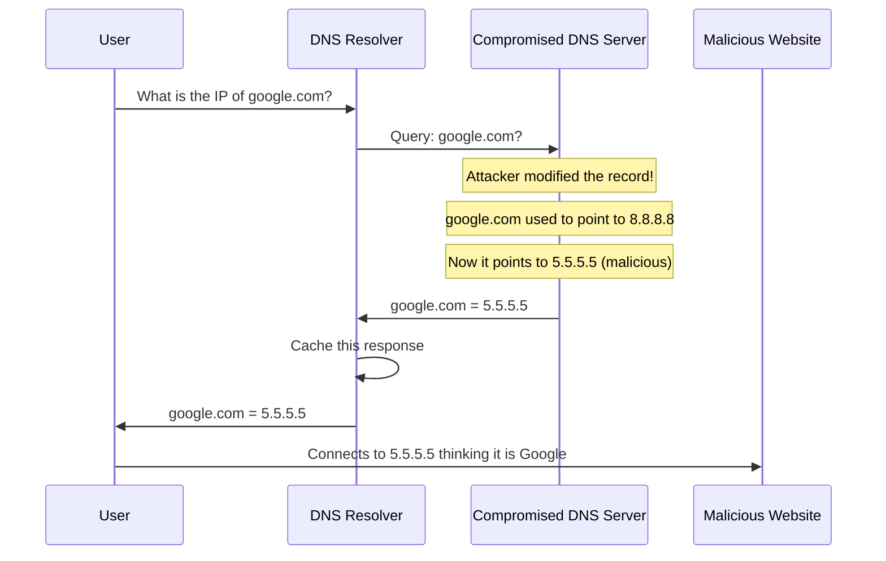
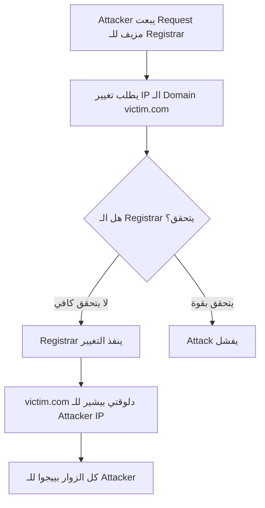

> **الهدف من الـ Section ده:**  
> هنتعرف على أشهر الهجمات اللي بتستهدف DNS (Domain Name System)، واللي بيعتبر من أهم مكونات الإنترنت لكنه في نفس الوقت بيحتوي على نقاط ضعف خطيرة.
---
## Table of Contents
- [DNS Attacks](#dns-attacks)
  - [DNS Cache Poisoning](#dns-cache-poisoning)
  - [DNS Hijacking (Domain Hijacking)](#dns-hijacking-domain-hijacking)
- [Summary](#summary)

---
## DNS Attacks

### DNS Cache Poisoning

#### ليه الـ DNS هدف سهل؟

الـ **DNS (Domain Name System)** هو "دليل تليفون" الإنترنت — بيحول الأسماء زي `google.com` لـ IP Addresses. المشكلة:

- **مفيش Built-in Security** في الـ DNS الأصلي
- **مفيش Authentication** — لا للـ User، ولا للـ DNS Server
- ده بيخليه هدف مثالي للـ Attackers

#### إزاي بيشتغل الـ DNS Cache Poisoning؟

> [!WARNING]
> الضحية مش هتحس بأي حاجة غريبة — هي فعلاً كتبت google.com في الـ Browser. بس بتتبعت لموقع ضار. ممكن الموقع الضار يكون نسخة طبق الأصل من الموقع الحقيقي.

---

### DNS Hijacking (Domain Hijacking)

الـ **DNS Hijacking** مختلف عن الـ DNS Cache Poisoning. هنا الـ Attacker مش بيهاجم الـ DNS Server نفسه — هو بيهاجم **الـ Domain Registrar**.

#### إزاي بيحصل؟

> [!NOTE]
> كتير من الـ Domain Registrars الكبيرة دلوقتي بتستخدم Methods أقوى للـ Authentication زي Mail Header Checking، Passwords، وEncrypted/Signed Mail. بس لسا في registrars بتعمل تقريباً مفيش.

#### الفرق بين DNS Cache Poisoning وDNS Hijacking

| المعيار | DNS Cache Poisoning | DNS Hijacking |
|---|---|---|
| الهدف | DNS Server / Resolver | Domain Registrar |
| الأثر | مؤقت حتى انتهاء الـ Cache | دائم حتى التصحيح |
| الصعوبة | تقنية عالية | Social Engineering غالباً |
| النطاق | محدود بالـ Cache | عالمي |

## Summary
- **DNS Cache Poisoning:** تعديل Record في الـ DNS Server عشان تحول الزوار لموقع ضار
- **DNS Hijacking:** تغيير الـ Domain عند الـ Registrar نفسه

