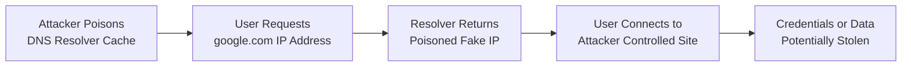
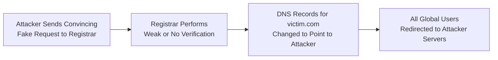

| Topic | Level | Reading Time | Prerequisites |
|---|---|---|---|
| DNS Attacks: Cache Poisoning and Domain Hijacking | Intermediate | ~22 min | Basic understanding of how DNS resolves domain names to IP addresses |

> **الهدف من الـ Section ده:**  
> هتفهم ليه DNS مبني بشكل أساسي على الثقة من غير أي authentication حقيقي، وإزاي المهاجم يقدر يستغل الضعف ده عن طريق **DNS Cache Poisoning** أو **Domain Hijacking**.

## Learning Objectives

By the end of this section, you will be able to:

- Explain what **DNS (Domain Name System)** does and why it is essential to how the Internet works.
- Identify the core security weakness in DNS: the absence of built-in authentication.
- Explain how **DNS Cache Poisoning** works and why it can affect many users at once.
- Explain how **Domain Hijacking** exploits weak identity verification at the registrar level.
- Compare the scope and impact of Cache Poisoning versus Domain Hijacking.
- Describe modern defenses, including registrar-level verification and **DNSSEC**.

## Table of Contents

- [DNS: The Internet's Phonebook](#dns-the-internets-phonebook)
- [The Core Weakness: No Built-in Authentication](#the-core-weakness-no-built-in-authentication)
- [DNS Cache Poisoning: The Concept](#dns-cache-poisoning-the-concept)
- [DNS Cache Poisoning: Step by Step](#dns-cache-poisoning-step-by-step)
- [Why Cache Poisoning Is So Dangerous](#why-cache-poisoning-is-so-dangerous)
- [Domain Hijacking: The Concept](#domain-hijacking-the-concept)
- [Domain Hijacking: How the Attack Works](#domain-hijacking-how-the-attack-works)
- [Cache Poisoning vs. Domain Hijacking](#cache-poisoning-vs-domain-hijacking)
- [Attack Flow Diagrams](#attack-flow-diagrams)
- [Defenses Against DNS Attacks](#defenses-against-dns-attacks)
- [Career Connection](#career-connection)
- [Key Terms Glossary](#key-terms-glossary)
- [Summary](#summary)

## DNS: The Internet's Phonebook

**DNS (Domain Name System)** هو أساسًا "دليل التليفونات" (**phonebook**) الخاص بالإنترنت. هو اللي بيترجم الأسماء المفهومة للبشر (زي `google.com`) لعناوين IP اللي الأجهزة فعليًا بتستخدمها عشان تلاقي بعض (زي `142.250.190.14`).

كل مرة بتزور موقع إلكتروني، تبعت إيميل، أو تفتح تطبيق متصل بالإنترنت، DNS بيشتغل في الخلفية عشان يخلي ده يحصل.

## The Core Weakness: No Built-in Authentication

المشكلة الأساسية إن DNS اتصمم في الأيام الأولى للإنترنت، وقت ما الأمان مكانش هاجس كبير. نتيجة لكده، هو **معندوش آليات أمان قوية مدمجة (no strong built-in security mechanisms)**.

بالتحديد:

- مفيش **authentication** للمستخدم اللي بيسأل السؤال.
- مفيش **authentication** للجهاز اللي بيطلب المعلومة.
- مفيش **authentication** لسيرفر الـ DNS اللي بيدّي الإجابة.

> [!IMPORTANT]
> تخيل إنك بتتصل بعامل دليل تليفونات وبتطلب رقم حد، والعامل بيقولك أي رقم هو حاسس إنه صح، من غير ما يتأكد من هويتك، ومن غير ما تقدر إنت تتأكد إن العامل ده نفسه شرعي ومش محتال.

بما إن الثقة مفترضة في كل مكان تقريبًا في النظام ده، DNS بقى أرض خصبة (**prime hunting ground**) للمهاجمين. في الـ section ده هندرس نوعين رئيسيين من هجمات DNS: **DNS Cache Poisoning** و **Domain Hijacking**.

## DNS Cache Poisoning: The Concept

**DNS Cache Poisoning** بيحصل لما المهاجم يخدع الـ **DNS resolver** إنه يخزّن عنوان IP مزيف مقابل اسم دومين حقيقي.

بالعربي البسيط: المهاجم بيتلاعب بالـ DNS cache ويعدّله، بيستبدل الإجابة الصحيحة بواحدة ضارة.

> [!NOTE]
> تخيل إنك دخلت خلسة على مخزن دليل تليفونات فيزيائي وغيّرت رقم "Pizza Palace" بحيث الرقم المكتوب دلوقتي فعليًا بيرن على تليفون محتال. أي حد يبص على الدليل ده من دلوقتي وبيدور على Pizza Palace هيتصل بالمحتال من غير ما يعرف.

## DNS Cache Poisoning: Step by Step

نتخيل إنك عايز تزور `google.com`:

1. الـ **DNS resolver** بتاع جهازك بيبعت طلب بيسأل: "إيه عنوان الـ IP بتاع `google.com`؟"
2. عادةً، سيرفر الـ DNS كان المفروض يرد بالإجابة الصحيحة، مثلًا `8.8.8.8` (مثال افتراضي لعنوان Google الحقيقي).
3. لكن في السيناريو ده، سيرفر الـ DNS اتلاعب بيه المهاجم مسبقًا.
4. المهاجم غيّر الـ cache بحيث بدل ما يرجّع الـ IP الحقيقي، هو دلوقتي بيرجّع `5.5.5.5`، عنوان الـ IP بتاع الموقع الضار الخاص بالمهاجم.
5. فلما الـ resolver بتاعك يسأل "فين `google.com`؟"، هو بيرجعله الإجابة المسمومة: `5.5.5.5`.
6. متصفحك، ومعندهوش أي سبب إنه يشكك في الإجابة دي، بيوصّلك بسعادة لـ `5.5.5.5`، وهو موقع مزيف خاضع لسيطرة المهاجم، وممكن يكون مصمم بحيث يبان بالظبط زي صفحة تسجيل دخول Google الحقيقية عشان يسرق بيانات الاعتماد بتاعتك.

> [!WARNING]
> الجزء المخيف هو إنك كنت كاتب العنوان الصحيح (`google.com`) طول الوقت. الهجوم حصل بصمت، غير مرئي بالنسبة لك، على مستوى الـ DNS lookup، قبل ما متصفحك يحمّل أي بكسل واحد من الصفحة أصلًا.

## Why Cache Poisoning Is So Dangerous

بما إن الـ DNS resolvers بتخزّن (**cache**) الإجابات مؤقتًا عشان تسرّع الأمور، بمجرد ما سجل مزيف يتسمم جوه الـ cache ده، **كل مستخدم بيستعلم من نفس الـ resolver** بيتحول للموقع الضار، مش ضحية واحدة بس، لكن ممكن آلاف المستخدمين اللي بيعتمدوا على نفس الـ resolver (زي سيرفر DNS مشترك تابع لمزود خدمة إنترنت - ISP).

ده ممكن يُستخدم في:

| الاستخدام | الوصف |
|---|---|
| **Phishing** | إعادة توجيه المستخدمين لصفحات تسجيل دخول مزيفة لسرقة أسماء المستخدمين وكلمات المرور |
| **Malware Distribution** | إعادة توجيه دومين تحديث برامج لسيرفر يستضيف ملفات مصابة |
| **Surveillance** | إعادة توجيه حركة المرور بصمت لمراقبة الوصول |
| **Censorship** | إعادة توجيه حركة المرور بصمت لمنع الوصول |

> [!IMPORTANT]
> بما إن مفيش authentication مدمج في DNS، الـ resolver مالوش أي طريقة يتحقق بيها إن الإجابة اللي استقبلها حقيقية، هو ببساطة بيثق في أي رد بيرجعله ومطابق للشكل المتوقع.

## Domain Hijacking: The Concept

بينما الـ Cache Poisoning بيهاجم الـ DNS resolver، **Domain Hijacking** بيهاجم حلقة ضعف مختلفة تمامًا: **domain registrar** (الشركة اللي رسميًا بتدير مين مالك اسم الدومين، زي GoDaddy أو Namecheap).

المشكلة الجوهرية: كتير من الـ domain registrars بتعمل تحقق قليل جدًا من هوية أي حد بيطلب تعديل في سجلات دومين معين.

> [!NOTE]
> تخيل إن الدومين بتاعك زي بيت مسجل باسمك في السجل العقاري (**city hall**). الـ Domain Hijacking زي حد بيدخل السجل العقاري، وبيبعت خطاب مقنع نسبيًا بيدّعي فيه إنه إنت، وبيقول "من فضلكم غيّروا سند ملكية البيت ده لاسمي أنا"، والسجل العقاري، من غير ما يتحقق من الهويات بعناية، فعليًا... بينفّذ الطلب.

## Domain Hijacking: How the Attack Works

المهاجم بيصمم إيميل يبان مقنع، بيتظاهر فيه إنه المالك الشرعي لـ `victim.com`.

في الطلب المزيف ده، هو بيطلب من الـ registrar إنه يغيّر سجلات الـ DNS الخاصة بـ `victim.com` بحيث تشاور دلوقتي على سيرفرات خاضعة لسيطرة المهاجم (أنظمة `attacker.com` مثلًا).

بما إن كتير من الـ registrars تاريخيًا بتعمل تحقق قليل جدًا أو معدوم من هوية اللي بيبعت طلبات التغيير دي، ممكن يتم معالجة الطلب بشكل أعمى، من غير مكالمة تليفونية للتأكيد، من غير فحص هوية صارم.

بمجرد ما التغيير يتم، أي حد يزور `victim.com` بيتوجّه مباشرة لسيرفرات المهاجم، حتى لو الدومين لسه رسميًا "مملوك" للضحية الأصلية على الورق.

> [!WARNING]
> ده خطير بشكل خاص، لأنه على عكس الـ Cache Poisoning (اللي غالبًا بيكون مؤقت ومحلي على resolver واحد)، الـ **Domain Hijacking** ممكن يأثر على **كل مستخدم في العالم** بيحاول يوصل للدومين ده، لحد ما الاختراق يتم اكتشافه وإرجاعه.

## Cache Poisoning vs. Domain Hijacking

الجدول التالي بيوضح الفرق الجوهري بين النوعين:

| المعيار | DNS Cache Poisoning | Domain Hijacking |
|---|---|---|
| نقطة الاستهداف | الـ DNS resolver | الـ domain registrar |
| نطاق التأثير | محلي، مقتصر على مستخدمي resolver معين | عالمي، يؤثر على كل من يحاول الوصول للدومين |
| مدة التأثير | غالبًا مؤقت، حتى ينتهي الـ cache أو يُصحح | يستمر حتى يتم اكتشاف الاختراق وإرجاعه |
| آلية الاستغلال | التلاعب في بيانات مخزنة مؤقتًا | خداع عملية التحقق من الهوية عند الـ registrar |

## Attack Flow Diagrams

المخطط التالي بيوضح تسلسل هجوم DNS Cache Poisoning:

والمخطط التالي بيوضح تسلسل هجوم Domain Hijacking:

## Defenses Against DNS Attacks

بعض الـ registrars الأكبر والأكثر رسوخًا بدأت تطبّق آليات authentication أكتر صرامة لأي طلب تغيير في DNS، باستخدام طرق زي:

- **Mail Header Checking**: التحقق من إن الطلب فعليًا جاي من مصدر مصرّح به ومتوقع، مش من مرسل مزوّر.
- **Passwords (Account Authentication)**: مطالبة الطالب بإثبات إن عنده فعلًا وصول شرعي للحساب.
- **Encrypted and Signed Mail**: استخدام توقيعات تشفيرية للتأكد إن الطلب فعلًا جاي من المالك الحقيقي للدومين ولم يتم التلاعب فيه.

> [!WARNING]
> ده مش معيار عالمي (**not universal**). لسه فيه عدد مفاجئ من الـ registrars بتعمل تحقق قليل جدًا أو معدوم، وده بيسيب دومينات عملائها عرضة لنفس نوع الهجوم ده.

**أفضل ممارسة لأصحاب الدومينات**: تفعيل ميزات **registrar-lock**، استخدام أمان حساب قوي (**2FA**)، واختيار registrars معروفة بسياسات تحقق صارمة من طلبات التغيير.

بالإضافة لكده، فيه تقنية حديثة معروفة باسم **DNSSEC**، بتضيف توقيع تشفيري (**cryptographic signing**) لردود DNS، وده بيساعد الـ resolvers إنها تتحقق من صحة الإجابة اللي بتستقبلها. بتُعتبر DNSSEC هي الحل المعياري الحديث في الصناعة لمشكلة غياب الـ authentication في DNS.

> [!TIP]
> لاحظ إن الدفاعات ضد Cache Poisoning و Domain Hijacking بتشتغل على مستويين مختلفين تمامًا: DNSSEC بتحمي مستوى الإجابات نفسها، بينما تحقق الهوية عند الـ registrar بيحمي مستوى إدارة الدومين. كلاهما مطلوب للحماية الشاملة.

## Career Connection

فهم هجمات DNS مرتبط بشكل مباشر بمسارات مهنية متعددة:

- في مجال **SOC**، مراقبة استعلامات DNS غير الطبيعية بتساعد في اكتشاف محاولات cache poisoning مبكرًا.
- في مجال **Cloud Security**، تأمين سجلات DNS للتطبيقات والخدمات السحابية عن طريق تفعيل DNSSEC والـ registrar-lock جزء أساسي من حماية البنية التحتية.
- في مجال **GRC**، وضع سياسات لإدارة الوصول لحسابات الـ registrars جزء من إدارة المخاطر المؤسسية المرتبطة بالأصول الرقمية.

## Key Terms Glossary

| Term | Definition |
|---|---|
| **DNS (Domain Name System)** | نظام يترجم أسماء الدومينات المفهومة للبشر لعناوين IP تستخدمها الأجهزة. |
| **DNS Resolver** | الجهة المسؤولة عن استقبال طلبات ترجمة الدومين وإعادة عنوان الـ IP المناسب. |
| **DNS Cache Poisoning** | هجوم يقوم فيه المهاجم بخداع الـ resolver لتخزين عنوان IP مزيف مقابل دومين حقيقي. |
| **Domain Registrar** | الشركة المسؤولة رسميًا عن إدارة ملكية أسماء الدومينات. |
| **Domain Hijacking** | هجوم يستغل ضعف التحقق من الهوية عند الـ registrar لتغيير سجلات دومين شرعي. |
| **DNSSEC** | امتداد أمني لبروتوكول DNS يضيف توقيعًا تشفيريًا للتحقق من صحة الردود. |
| **Registrar-Lock** | ميزة تمنع تغيير سجلات الدومين دون إجراءات تحقق إضافية. |

## Summary

- **DNS** أساسي جدًا لعمل الإنترنت، لكنه اتبنى من غير أي آليات authentication للمستخدمين، الأجهزة، أو السيرفرات، وده بيخليه عرضة للاستغلال بطبيعته.
- **DNS Cache Poisoning**: المهاجم بيفسد السجلات المخزنة في resolver معين، وبيحول بصمت أي حد بيدور على دومين شرعي لعنوان IP ضار.
- **Domain Hijacking**: المهاجم بيستغل ضعف التحقق من الهوية عند الـ registrar، ويخدعه إنه يحوّل سجلات دومين شرعي لسيرفرات خاضعة لسيطرة المهاجم.
- الهجومين خطيرين لأنهم بيستغلوا **الثقة** مش القوة التقنية الغاشمة، وغالبًا الضحايا مفيش عندهم أي علامة تحذير واضحة، لأن اسم الدومين اللي كتبوه لسه بيبان صحيح تمامًا.
- الـ Cache Poisoning تأثيره غالبًا محلي ومؤقت، بينما الـ Domain Hijacking تأثيره عالمي ومستمر لحد ما يتم اكتشافه وإرجاعه.
- الدفاعات بتشمل تحقق أكتر صرامة عند الـ registrar (كلمات مرور، توقيعات، فحص headers) بالإضافة لتقنيات زي **DNSSEC**، اللي بتُعتبر الحل المعياري الحديث في الصناعة.

