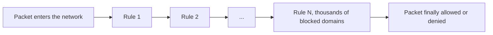
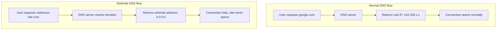
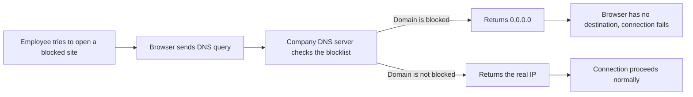
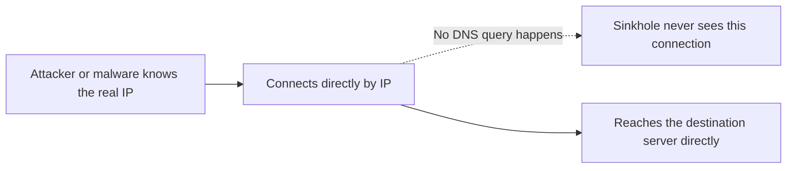
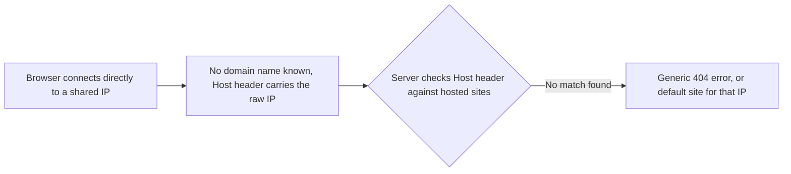
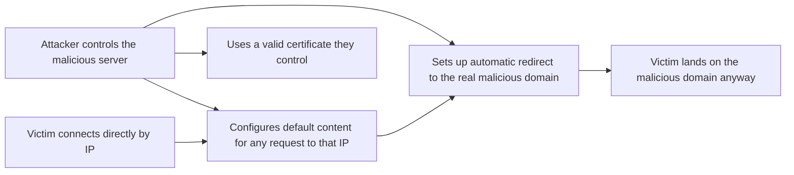
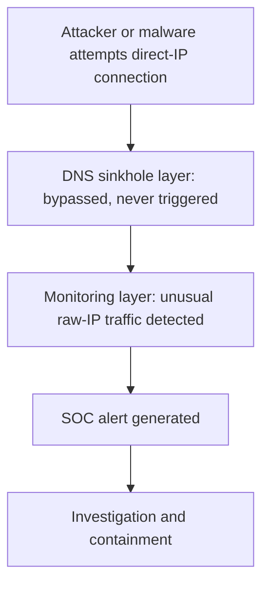

| Topic | Level | Reading Time | Prerequisites |
|---|---|---|---|
| DNS Sinkhole: How It Works and How It Can Be Bypassed | Intermediate | ~20 min | Defense in Depth Model, basic idea of DNS and HTTPS |

> **الهدف من الـ Section ده:**  
> هتفهم ليه الحجب بالـ Firewall لوحده مش Scalable، وإيه هو الـ DNS Sinkhole وإزاي بيشتغل خطوة بخطوة، وإيه الـ Limitations بتاعته، وإيه اللي ممكن يخلي حد يـ bypass التقنية دي.


## Learning Objectives

By the end of this section, you will be able to:

- Explain why blocking thousands of domains at the **firewall** alone does not scale, and how a **DNS sinkhole** solves that problem.
- Describe the step-by-step flow of a DNS sinkhole, from the employee's browser to the blocked connection.
- Explain the theoretical bypass of connecting directly to an IP address instead of a domain name.
- Explain why **Virtual Hosting** and the HTTP **Host header** make a blind IP bypass unreliable in most cases.
- Explain why a **TLS certificate mismatch** creates a second, independent obstacle to the same bypass.
- Explain how a sophisticated attacker could still exploit this gap, and why the attempt itself usually gets caught from a SOC perspective.
- Describe additional controls (DNS RPZ, egress filtering, IOC blocklists) that close this gap more completely.

## Table of Contents

- [Learning Objectives](#learning-objectives)
- [The Problem: Why Not Just Block at the Firewall](#the-problem-why-not-just-block-at-the-firewall)
  - [The Scalability Issue](#the-scalability-issue)
- [The Solution: DNS Sinkhole](#the-solution-dns-sinkhole)
  - [The Core Idea](#the-core-idea)
  - [Normal Flow Versus Sinkhole Flow](#normal-flow-versus-sinkhole-flow)
- [How the Sinkhole Works Step by Step](#how-the-sinkhole-works-step-by-step)
- [Why Sinkholing Is Valuable Beyond Blocking](#why-sinkholing-is-valuable-beyond-blocking)
- [The Sinkhole Issue: Where the Technique Breaks](#the-sinkhole-issue-where-the-technique-breaks)
  - [The Theoretical Bypass](#the-theoretical-bypass)
  - [Why Browsers Skip DNS for Raw IPs](#why-browsers-skip-dns-for-raw-ips)
- [Virtual Hosting and the Host Header](#virtual-hosting-and-the-host-header)
- [The Certificate Problem: SSL/TLS and SNI](#the-certificate-problem-ssltls-and-sni)
- [How a Sophisticated Attacker Could Still Exploit This](#how-a-sophisticated-attacker-could-still-exploit-this)
- [Why This Bypass Still Gets Caught](#why-this-bypass-still-gets-caught)
  - [The SOC Perspective](#the-soc-perspective)
  - [Defense in Depth in Action Again](#defense-in-depth-in-action-again)
- [Strengthening the Defense Further](#strengthening-the-defense-further)
- [Full Bypass Attempt Walk-Through](#full-bypass-attempt-walk-through)
- [Career Path Connections](#career-path-connections)
- [Key Terms Glossary](#key-terms-glossary)
- [Summary](#summary)

## The Problem: Why Not Just Block at the Firewall

### The Scalability Issue

تخيل إنك **Security Admin** في شركة كبيرة، وعايز تمنع الموظفين من الوصول لمواقع معينة، سواء مواقع ضارة، سوشيال ميديا، أو أي حاجة خارج سياسة الشركة.

أول طريقة بتيجي في البال هي عمل **block rules على الـ firewall**. لكن الأبروتش ده فيه مشكلة كبيرة:

- كل **packet** بيعدي على الشبكة لازم يعدي عبر **كل القواعد** الموجودة على الـ firewall.
- لو عندك آلاف الـ **blocked domains**، هتعمل آلاف الـ rules.
- كل rule إضافية بتزود **الـ processing load** على الـ firewall.
- النتيجة: **latency** زيادة على الشبكة كلها، وحتى الـ traffic المشروع بيتأثر.



> [!WARNING]
> Using the firewall alone to block thousands of domains is not a scalable approach. Every additional rule eats into performance. The firewall is not the right place to block domains at that scale.

## The Solution: DNS Sinkhole

### The Core Idea

الفكرة بسيطة جداً وذكية: **بدل ما تحط الـ block في الـ firewall، حطه في الـ DNS server بتاع الشركة**.

الـ **DNS sinkhole** هو تقنية بتعتمد على **تغيير الـ DNS response** للمواقع المحجوبة. بدل ما الـ DNS server يرجع الـ IP الحقيقي للموقع المحجوب، بيرجع عنوان وهمي زي `0.0.0.0`، واللي بيُعرف بـ **sinkhole address**.

### Normal Flow Versus Sinkhole Flow

```text
Normal DNS Flow:
User -> DNS Server -> "IP of google.com is 142.250.x.x" -> Connection Opens

Sinkhole DNS Flow:
User -> DNS Server -> "IP of malicious-site.com is 0.0.0.0" -> Connection Fails
```



> [!TIP]
> The sinkhole is smarter than a firewall block in this scenario because it adds no load to the firewall and does not affect latency. The whole decision happens at the DNS level, before any connection is even attempted.

## How the Sinkhole Works Step by Step

الخطوات بالتفصيل:

- الموظف بيحاول يفتح موقع محجوب في الـ **browser**.
- الـ browser بيبعت **DNS query** للـ DNS server بتاع الشركة.
- الـ company DNS server شايف إن الـ domain ده موجود في قائمة الـ **blocked domains**.
- بدل ما يرجع الـ IP الحقيقي، بيرجع `0.0.0.0` (الـ **sinkhole address**).
- الـ browser مش لاقي **destination** يتصل بيه، فالموقع مش بيفتح خالص.



> [!IMPORTANT]
> The firewall does not get involved at all in the sinkhole flow. The blocking happens at the DNS resolution level, before any packet is even sent on the network. This saves massive resources on the firewall and preserves network performance.

## Why Sinkholing Is Valuable Beyond Blocking

الـ sinkhole مش بس أداة حجب، هو كمان **أداة detection**. لو جهاز على الشبكة بيعمل DNS query لـ domain معروف إنه ضار، ده **إشارة قوية جداً** إن الجهاز ده مصاب، وده بيحصل **قبل** ما أي ضرر فعلي يحصل.

> [!IMPORTANT]
> A DNS sinkhole is not just a blocking tool. It is also a detection tool. The moment a device queries a known-malicious domain, that log entry itself becomes an early indicator of compromise.

## The Sinkhole Issue: Where the Technique Breaks

### The Theoretical Bypass

الـ sinkhole تقنية ممتازة، لكن فيه **bypass** ممكن يحصل في حالة واحدة: **لو المستخدم كتب الـ IP address مباشرة في الـ browser بدل الـ domain name**.

الـ sinkhole بيعتمد على **افتراض** إن المستخدم أو الـ malware هيستخدم **اسم الـ domain**، مش IP address مضبوط مسبقاً، عشان يوصل للـ server.



### Why Browsers Skip DNS for Raw IPs

لما بتكتب `google.com`، الـ browser بيعمل **DNS lookup**. لكن لما بتكتب `142.250.x.x` مباشرة، الـ browser بيعرف إنه IP address وبيـ **skip الـ DNS lookup خالص**. وبكده الـ sinkhole مش هيشتغل، لأنه بيعترض **queries الـ DNS بس**.

> [!NOTE]
> This is a normal, expected behavior of every browser and most network clients. There is nothing malicious about the mechanism itself; it becomes a security concern only when someone deliberately uses it to avoid a DNS-based control.

## Virtual Hosting and the Host Header

هنا بييجي مفهوم مهم جداً اسمه **Virtual Hosting**: **web server واحد بـ IP address واحد ممكن يستضيف أكتر من 1000 موقع مختلف** في نفس الوقت.

إزاي ده ممكن؟ لما بتفتح موقع من خلال الـ domain name، الـ browser بيبعت **Host header** مخفي مع الـ request بيقول للـ web server:

```text
Host: google.com
```

الـ web server بيقرا الـ Host header ده ويخدم المحتوى الصح. لكن لما بتكتب الـ IP مباشرة:

```text
Host: 142.250.x.x
```

الـ server مش عارف إنت عايز أنهي موقع بالظبط، لأن عنده **آلاف المواقع على نفس الـ IP**.

| Scenario | Host Header | Result |
|---|---|---|
| كتبت `google.com` | `Host: google.com` | Server بيرجع محتوى Google |
| كتبت `142.250.x.x` | `Host: 142.250.x.x` | Server مش عارف يرجع إيه، غالباً `404 Not Found` |



> [!NOTE]
> Virtual Hosting saves IP addresses significantly. A company can buy a single IP and host thousands of websites on it. This makes direct IP access harder and far less predictable in its results.

## The Certificate Problem: SSL/TLS and SNI

لو الـ server رجّع محتوى حتى بالـ IP، فيه مشكلة تانية بتظهر: **SSL/TLS certificate**. الشهادة دي بتكون صادرة على **اسم الـ domain name**، **مش على الـ IP address**.

إيه اللي بيحصل بالتفصيل:

- الـ browser بيتصل بالـ IP مباشرة.
- الـ server بيبعت الـ **SSL certificate** بتاعه.
- الـ browser بيشوف إن الشهادة صادرة على `google.com`.
- إنت طلبت `142.250.x.x`، مش `google.com`.
- الـ browser بيشوف إن فيه **mismatch**، وبيمنع الاتصال أو بيرجّع **security warning**.

المفهوم ده مرتبط بحاجة اسمها **SNI (Server Name Indication)**، وفيها الـ browser بيقول للـ server أنهي domain عايزه **قبل** ما الاتصال المشفر يكتمل خالص، بمنطق شبيه بالـ Host header لكن بيحصل أبكر، أثناء الـ **TLS handshake**.

| Obstacle | What Fails | Why |
|---|---|---|
| Virtual Hosting | Application-level routing | The server does not know which of many hosted sites the visitor wants, since there is no domain name in the Host header |
| SSL/TLS Certificate Mismatch | Cryptographic identity check | The certificate's domain name does not match the raw IP address requested, triggering a browser security warning |

> [!IMPORTANT]
> The SSL/TLS certificate is an additional protection layer that compensates for part of the sinkhole bypass. Even if the user types the IP directly, the certificate mismatch prevents the secure connection in most cases. These are two separate and independent failures, not one problem with two names.

## How a Sophisticated Attacker Could Still Exploit This

طب لو الموضوع كله متعلق بالموظفين العاديين، إيه اللي ممكن يعمله **attacker محترف**؟

السيناريو:

- الـ attacker عنده server بـ IP معروف، مثلاً `45.33.x.x`.
- الـ attacker عمل **configuration** على الـ server بحيث إن لما حد يطلب الـ IP مباشرة، الـ server يعمل **redirect** لـ domain ضار.
- بكده الـ attacker حاول يعمل bypass للـ sinkhole عن طريق تجاوز الـ DNS كلياً.



مهاجم بيتحكم في السيرفر بتاعه **مالوش مشكلة الـ Virtual Hosting** أصلاً، لأنه يقدر يظبط السيرفر إنه يخدم المحتوى الضار **افتراضياً** لأي طلب على الـ IP ده، وبشهادة متطابقة مع اللي هو عايزه، لأنه هو نفسه المتحكم في الشهادة.

> [!WARNING]
> This means the theoretical bypass is not purely theoretical. A determined attacker who owns the destination server can eliminate both obstacles, Virtual Hosting and the certificate mismatch, by controlling both sides of the connection.

## Why This Bypass Still Gets Caught

### The SOC Perspective

الأسباب اللي بتخلي الـ bypass ده **محدود عملياً**:

| Reason | Details |
|---|---|
| Virtual Hosting Problem | الـ server مش عارف يخدم المحتوى الصح من غير Host header، غالباً بيرجّع `404 Not Found` |
| SSL/TLS Certificate Mismatch | الـ browser بيرفض الاتصال أو بيدي warning لأن الشهادة مش للـ IP ده |
| SOC Detection | فريق الـ SOC بيشوف الـ DNS logs، ولو حد مش بيعمل DNS query لـ domain معروف، ده نفسه suspicious |

عملياً، البايباس ده **مش شائع الاستخدام الناجح** من المهاجمين، لأن كتابة IP address خام بدل اسم domain هو **سلوك غير طبيعي** بيلفت النظر فوراً. المستخدمين والـ software العاديين **دايماً تقريباً** بيستخدموا أسماء domains.

> [!WARNING]
> If an attacker attempts this bypass, they draw attention to themselves. Who among us types an IP address in the browser to open a website? This is very unusual behavior and it triggers the SOC team immediately.

> [!TIP]
> From a SOC analyst's perspective, the sinkhole is not just a blocker, it is also a detection tool. Seeing a user query a blocked domain is one indicator of a suspicious attempt. Seeing a connection to a raw IP with no preceding DNS query is a second, independent indicator. Together they give excellent context for investigation.

### Defense in Depth in Action Again

ده مثال ممتاز على الـ **Defense in Depth**: طبقة الـ sinkhole اتخطت، لكن طبقة المراقبة **مسكت شكل محاولة البايباس نفسها**.



> [!IMPORTANT]
> This is a security principle worth naming directly: an attacker technically defeating one control, in this case DNS sinkholing, does not mean they defeated the overall defense. The attempt to do so created a new, more obvious signal that a different layer picks up.

## Strengthening the Defense Further

المؤسسات بتقوّي الحماية دي أكتر بطرق زي:

- **DNS RPZ (Response Policy Zones):** نسخة أكتر تقدماً من الـ sinkholing، بتسمح بـ policies دقيقة ومُدارة مركزياً لإزاي الـ domains الضارة بتتعامل معاها عبر بنية الـ DNS بتاعة المؤسسة كلها.
- **Egress filtering:** تقييد الـ IP addresses والـ ports الخارجية اللي الأجهزة الداخلية مسموح لها تتصل بيها أصلاً، وده بيمنع محاولات البايباس المعتمدة على IP مباشر، بغض النظر عن استخدام الـ DNS من عدمه.
- **IOC (Indicator of Compromise) blocklists:** الاحتفاظ بقوائم IP addresses معروفة إنها ضارة (مش domains بس)، والـ firewalls والـ proxies تقدر تمنعها مباشرة، وده بيقفل بالظبط الفجوة اللي الـ DNS sinkhole وحدها بتسيبها مفتوحة.

الجمع بين الـ DNS sinkholing والـ IP-based blocking على مستوى الـ firewall هو **نفسه مثال تاني على الـ Defense in Depth**: استخدام control-ين مستقلين، بحيث تخطي واحد (الـ DNS) **مايخطيش أوتوماتيك** التاني (الـ IP-based egress filtering).

| Control | What It Covers | Independent of |
|---|---|---|
| DNS Sinkhole | Blocks resolution of known-malicious domain names | Relies on the client using DNS at all |
| Egress Filtering | Blocks direct connections to disallowed external IPs and ports | Works regardless of whether DNS was used |
| IOC Blocklists | Blocks known-malicious IPs directly at the firewall | Closes the exact gap a pure DNS-based control leaves open |

> [!TIP]
> If your organization relies only on DNS-based blocking, ask what happens the moment a client bypasses DNS entirely. If the honest answer is "nothing", egress filtering and IP-based IOC blocking are the next investments to make.

## Full Bypass Attempt Walk-Through

جدول يلخص المحاولة الكاملة من أول محاولة البايباس لحد ما بتتكشف:

| Step | What Happens | Layer Involved |
|---|---|---|
| 1 | Malware or attacker attempts to connect directly by IP, skipping DNS | Bypass attempt |
| 2 | DNS sinkhole never sees the query, so it cannot intervene | DNS Sinkhole layer, bypassed |
| 3 | Shared hosting may return a generic error due to a missing Host header | Virtual Hosting obstacle |
| 4 | The browser may show a certificate mismatch warning | SSL/TLS and SNI obstacle |
| 5 | A sophisticated attacker configures their own server to bypass both obstacles | Attacker-controlled evasion |
| 6 | The raw-IP connection itself is an unusual pattern | Monitoring layer, anomaly detected |
| 7 | SOC investigates and contains the incident | Detection and response |

## Career Path Connections

| Career Path | How This Topic Applies |
|---|---|
| SOC Analyst | Monitors DNS logs and direct-IP connection anomalies as early indicators of infection or bypass attempts |
| Penetration Tester | Tests whether egress filtering and DNS-based controls can actually be bypassed in a target environment |
| GRC | DNS filtering and egress controls are often required by security frameworks and vendor risk assessments |
| Cloud Security | Cloud-native DNS firewall services implement the same sinkholing concept for cloud workloads |

## Key Terms Glossary

| Term | Definition |
|---|---|
| DNS Sinkhole | A defensive DNS technique that returns a fake IP address for queries to known-malicious domains |
| Sinkhole Address | The fake, non-routable IP address, commonly 0.0.0.0, returned instead of the real one |
| Blocked Domain List | A list of domains an organization has decided to prevent resolution for |
| Non-Routable IP | An IP address, such as 0.0.0.0, that cannot actually be used to reach a real destination |
| Virtual Hosting | A configuration where one physical server with one IP address hosts many separate websites |
| Host Header | An HTTP header that tells the server which hosted website the client wants |
| SNI | Server Name Indication, a TLS extension where the client states the desired domain before the encrypted connection is fully established |
| SSL/TLS Certificate Mismatch | A security warning triggered when a certificate's domain name does not match the address requested |
| Egress Filtering | Restricting what external destinations internal devices are allowed to connect to |
| IOC | Indicator of Compromise, an artifact such as an IP address or file hash associated with malicious activity |
| DNS RPZ | Response Policy Zones, an advanced, centrally managed form of DNS-based policy enforcement |

## Summary

- **Firewall blocking does not scale:** آلاف الـ rules بتزود الـ processing load وبتأثر على الـ latency للشبكة كلها.
- **DNS sinkholing solves the scale problem:** الحجب بيحصل عند الـ DNS resolution، قبل أي packet يتبعت، من غير أي حمل إضافي على الـ firewall.
- **The mechanism is simple:** الـ DNS server بيرجّع `0.0.0.0` بدل الـ IP الحقيقي للمواقع المحجوبة.
- **Sinkholing is also a detection tool:** أي query لـ domain محجوب هو مؤشر مبكر إن جهاز معين مصاب.
- **The only theoretical bypass:** كتابة IP address مباشرة بيخلي الـ browser يـ skip الـ DNS lookup بالكامل.
- **Virtual Hosting usually breaks the bypass:** من غير Host header، السيرفر مش عارف أي موقع من مواقعه الكتير المقصود.
- **The SSL/TLS certificate adds a second, independent obstacle:** عدم تطابق اسم الـ domain في الشهادة مع الـ IP المطلوب بيطلع تحذير أمني.
- **A sophisticated attacker can eliminate both obstacles:** لو هو المتحكم في السيرفر والشهادة، يقدر يظبط كل حاجة لصالحه.
- **The bypass attempt itself is a red flag:** الـ traffic لـ IP خام أمر غير طبيعي بيلفت نظر الـ SOC بسرعة.
- **This is Defense in Depth in action:** طبقة اتخطت، لكن طبقة تانية مسكت أثر المحاولة.
- **Additional controls close the gap further:** DNS RPZ، egress filtering، وIOC blocklists بتغطي بالظبط اللي الـ DNS sinkholing وحدها بتسيبه مفتوح.

