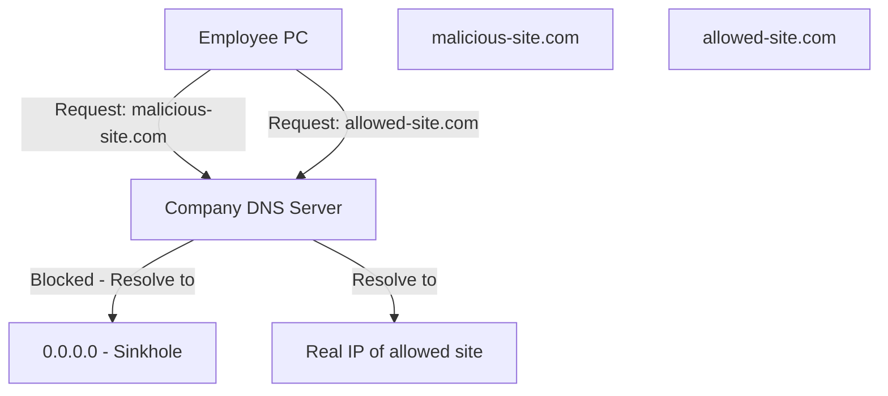

> **الهدف من الـ Section ده:**  
> بيشرح ببساطة الـ Sinkhole لمنع المواقع الضارة بشكل سهل وفعال.
## Sinkhole

#### المشكلة

لو عايز تمنع موظفيك من الوصول لمواقع معينة (مواقع ضارة، سوشيال ميديا، إلخ) باستخدام الـ Firewall — هتعمل Rules كتير جداً، وكل Packet هيعدي عليها كلها، وده بيزود الـ **Latency** على الشبكة كلها.

#### الحل: Sinkhole

الفكرة إنك بدل ما تحط الـ Block في الـ Firewall، بتحطه في الـ **DNS Server** بتاع الشركة.

**كيف يعمل؟**

1. الموظف بيحاول يفتح موقع محجوب.
2. الـ DNS بتاع الشركة شايف إن الموقع ده محجوب.
3. بدل ما يرجع الـ IP الحقيقي، بيرجع **0.0.0.0** (الـ Sinkhole Address).
4. الـ Browser مش هيلاقي Destination يتصل بيه — الموقع مش هيفتح.

> [!TIP]
> الـ Sinkhole أذكى من الـ Firewall Block في الحالة دي لأنه مش بيضيف أي Load على الـ Firewall ومش بيأثر على الـ Latency. الموضوع كله بيتحسم على مستوى الـ DNS.

---

## Summary

- الـ **Sinkhole** حل ذكي وبسيط لحجب المواقع عن طريق الـ DNS بدل الـ Firewall، وده بيحافظ على الـ Performance.
