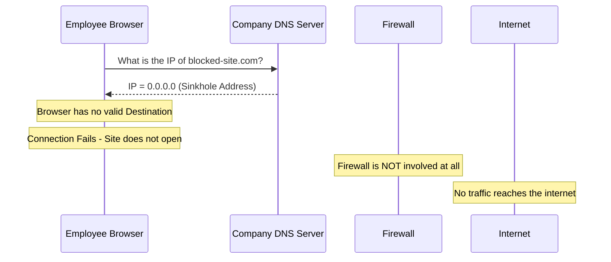
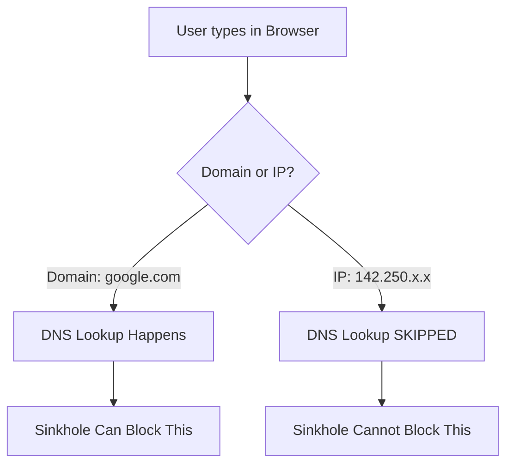
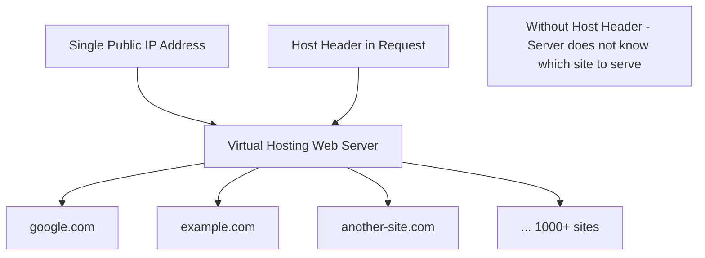
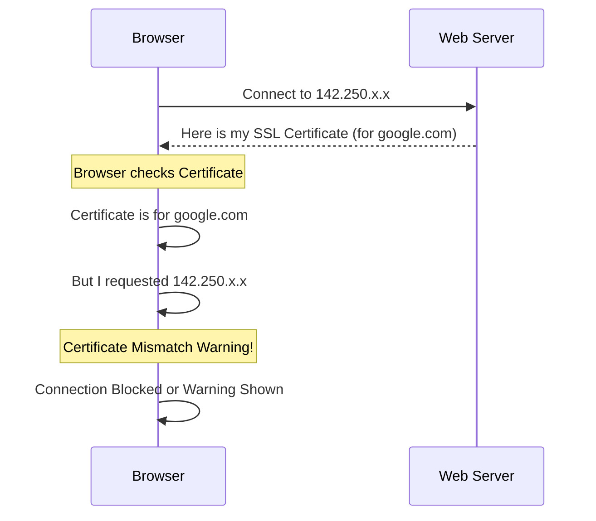
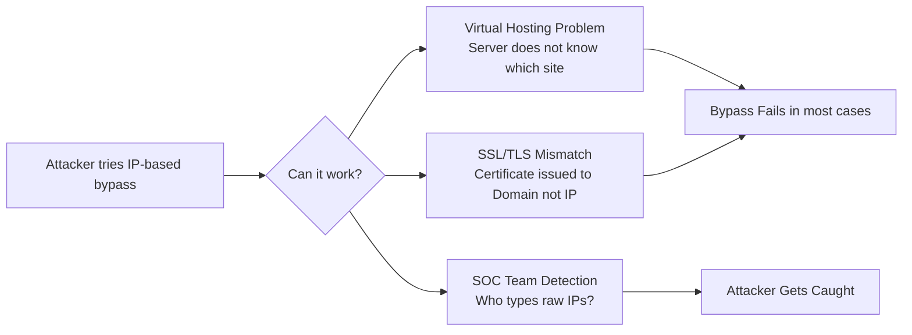

> **الهدف من الـ Section ده:**  
> هتفهم إيه هو الـ DNS Sinkhole، إزاي بيشتغل كـ Technique لحجب المواقع الضارة، وإيه الـ Limitations بتاعته — وإيه اللي ممكن يخلي حد يـ Bypass الـ Technique دي.

---


## Table of Contents

- [المشكلة: ليه مش بنحجب بالـ Firewall بس؟](#المشكلة-ليه-مش-بنحجب-بالـ-firewall-بس)
- [الحل: DNS Sinkhole](#الحل-dns-sinkhole)
- [كيف يشتغل الـ Sinkhole؟](#كيف-يشتغل-الـ-sinkhole)
- [Sinkhole Issue — الثغرة في الـ Technique](#sinkhole-issue--الثغرة-في-الـ-technique)
- [Virtual Hosting وعلاقته بالموضوع](#virtual-hosting-وعلاقته-بالموضوع)
- [SSL/TLS Certificate وليه هو مشكلة هنا](#ssltls-certificate-وليه-هو-مشكلة-هنا)
- [الـ Attacker وفكرة الـ Bypass](#الـ-attacker-وفكرة-الـ-bypass)
- [Summary](#summary)

---

## المشكلة: ليه مش بنحجب بالـ Firewall بس؟

تخيل إنك **Security Admin** في شركة كبيرة، وعايز تمنع الموظفين من الوصول لمواقع معينة — سواء مواقع ضارة، سوشيال ميديا، أو أي حاجة خارج سياسة الشركة.

الطريقة الأولى اللي بتيجي في البال هي إنك تعمل **Block Rules على الـ Firewall**. بس فيه مشكلة كبيرة في الأبروتش ده:

- كل **Packet** بيعدي على الشبكة لازم يـ **Pass عبر كل الـ Rules** الموجودة على الـ Firewall.
- لو عندك آلاف الـ Blocked Domains — هتعمل آلاف الـ Rules.
- كل Rule إضافية بتزود الـ **Processing Load** على الـ Firewall.
- النتيجة: **Latency زيادة على الشبكة كلها** — حتى الـ Traffic المشروع بيتأثر.

> [!WARNING]
> استخدام الـ Firewall لوحده لحجب آلاف الـ Domains هو أبروتش **غير Scalable** — كل Rule إضافية بتأكل من الـ Performance. الـ Firewall مش المكان الصح لحجب Domains بالعدد الكبير ده.

---

## الحل: DNS Sinkhole

الفكرة بسيطة جداً وذكية:

> بدل ما تحط الـ Block في الـ Firewall، **حطه في الـ DNS Server** بتاع الشركة.

الـ **DNS Sinkhole** هو تقنية بتعتمد على تغيير الـ **DNS Response** للمواقع المحجوبة. بدل ما الـ DNS Server يرجع الـ IP الحقيقي للموقع المحجوب، بيرجع عنوان وهمي زي `0.0.0.0` — اللي بيُعرف بـ **Sinkhole Address**.

```
Normal DNS Flow:
User → DNS Server → "IP of google.com is 142.250.x.x" → Connection Opens

Sinkhole DNS Flow:
User → DNS Server → "IP of malicious-site.com is 0.0.0.0" → Connection Fails
```

> [!TIP]
> الـ Sinkhole أذكى من الـ Firewall Block في السيناريو ده لأنه مش بيضيف أي Load على الـ Firewall ومش بيأثر على الـ Latency. الموضوع كله بيتحسم على مستوى الـ DNS قبل ما أي Connection تتعمل أصلاً.

---

## كيف يشتغل الـ Sinkhole؟


```mermaid
sequenceDiagram
    participant User as Employee Browser
    participant DNS as Company DNS Server
    participant FW as Firewall
    participant Internet as Internet

    User->>DNS: What is the IP of blocked-site.com?
    DNS-->>User: IP = 0.0.0.0 (Sinkhole Address)
    Note over User: Browser has no valid Destination
    Note over User: Connection Fails - Site does not open
    Note over FW: Firewall is NOT involved at all
    Note over Internet: No traffic reaches the internet
```

**خطوة بخطوة:**

1. **الموظف** بيحاول يفتح موقع محجوب في الـ Browser.
2. الـ **Browser** بيبعت DNS Query للـ DNS Server بتاع الشركة.
3. الـ **Company DNS Server** شايف إن الـ Domain ده موجود في قائمة الـ Blocked Domains.
4. بدل ما يرجع الـ IP الحقيقي — بيرجع **`0.0.0.0`** (الـ Sinkhole Address).
5. الـ **Browser** مش لاقي Destination يتصل بيه — الموقع مش بيفتح خالص.

> [!IMPORTANT]
> الـ Firewall مش بيتدخل خالص في الـ Sinkhole Flow. الحجب بيحصل على مستوى الـ **DNS Resolution** — قبل ما أي Packet يتبعت على الشبكة. ده بيوفر Resources ضخمة على الـ Firewall ويحافظ على الـ Network Performance.

---

## Sinkhole Issue — الثغرة في الـ Technique

طيب، الـ Sinkhole تكنيك ممتاز — بس فيه **Bypass** ممكن يحصل في حالة واحدة:

> **لو المستخدم كتب الـ IP Address مباشرة في الـ Browser بدل الـ Domain Name.**

لما بتكتب `google.com`، الـ Browser بيعمل DNS Lookup. بس لما بتكتب `142.250.x.x` مباشرة — الـ Browser **بيعرف إنه IP Address** وبيـ **Skip الـ DNS Lookup خالص**. وبكده الـ Sinkhole مش هيشتغل.


```mermaid
flowchart TD
    A[User types in Browser] --> B{Domain or IP?}
    B -->|Domain: google.com| C[DNS Lookup Happens]
    B -->|IP: 142.250.x.x| D[DNS Lookup SKIPPED]
    C --> E[Sinkhole Can Block This]
    D --> F[Sinkhole Cannot Block This]
```

---

## Virtual Hosting وعلاقته بالموضوع

هنا بييجي مفهوم مهم جداً اسمه **Virtual Hosting**:

> **Web Server واحد بـ IP Address واحد ممكن يـ Host أكتر من 1000 موقع مختلف في نفس الوقت.**

إزاي ده ممكن؟

لما بتفتح موقع من خلال الـ Domain Name، الـ Browser بيبعت **Host Header** مخفي مع الـ Request بيقول للـ Web Server:

```
Host: google.com
```

الـ Web Server بيقرأ الـ Host Header ده ويـ Serve المحتوى الصح.

**بس لما بتكتب الـ IP مباشرة:**

```
Host: 142.250.x.x
```

الـ Server مش عارف انت عايز انهي موقع بالظبط — لأن عنده ألف موقع على نفس الـ IP!


```mermaid
graph TD
    IP[Single Public IP Address] --> VH[Virtual Hosting Web Server]
    VH --> Site1[google.com]
    VH --> Site2[example.com]
    VH --> Site3[another-site.com]
    VH --> SiteN[... 1000+ sites]

    HH[Host Header in Request] --> VH
    Note1[Without Host Header - Server does not know which site to serve]
```

| Scenario | Host Header | نتيجة |
|---|---|---|
| كتبت `google.com` | `Host: google.com` | Server بيرجع محتوى Google |
| كتبت `142.250.x.x` | `Host: 142.250.x.x` | Server مش عارف يرجع إيه — غالباً `404 Not Found` |

> [!NOTE]
> الـ Virtual Hosting بيوفر في الـ IP Addresses بشكل كبير — شركة تقدر تشتري IP واحد بس وتـ Host عليه آلاف المواقع. ده بيخلي الـ Direct IP Access أصعب وأكثر Unpredictability في النتايج.

---

## SSL/TLS Certificate وليه هو مشكلة هنا

لو الـ Server رجع محتوى حتى بالـ IP — فيه مشكلة تانية بتظهر: الـ **SSL/TLS Certificate**.

الـ Certificate بيكون صادر على اسم الـ **Domain Name** — مش على الـ IP Address.


```mermaid
sequenceDiagram
    participant User as Browser
    participant Server as Web Server

    User->>Server: Connect to 142.250.x.x
    Server-->>User: Here is my SSL Certificate (for google.com)
    Note over User: Browser checks Certificate
    User->>User: Certificate is for google.com
    User->>User: But I requested 142.250.x.x
    Note over User: Certificate Mismatch Warning!
    User->>User: Connection Blocked or Warning Shown
```

**إيه اللي بيحصل:**

1. الـ Browser بيتصل بالـ IP مباشرة.
2. الـ Server بيبعت الـ SSL Certificate بتاعه.
3. الـ Browser بيشوف إن الـ Certificate صادر على `google.com`.
4. انت طلبت `142.250.x.x` — مش `google.com`.
5. الـ Browser بيشوف إن فيه **Mismatch** — وبيـ Block الـ Connection أو بيرجع **Security Warning**.

> [!IMPORTANT]
> الـ SSL/TLS Certificate هو طبقة حماية إضافية بتعوّض جزء من الـ Sinkhole Bypass. حتى لو الـ User كتب الـ IP مباشرة، الـ Certificate Mismatch بيـ Prevent الـ Secure Connection في معظم الحالات.

---

## الـ Attacker وفكرة الـ Bypass

طب لو الموضوع ده كله متعلق بالـ Employees العاديين — إيه اللي ممكن يعمله **Attacker** محترف؟

### محاولة الـ Bypass باستخدام IP مباشرة

**السيناريو:**

1. الـ Attacker عنده Server بـ IP معروف — مثلاً `45.33.x.x`.
2. الـ Attacker عمل Configuration على الـ Server بحيث إن لما حد يطلب الـ IP مباشرة — يـ Redirect لـ Malicious Domain.
3. بكده الـ Attacker حاول يـ Bypass الـ Sinkhole عن طريق تجاوز الـ DNS كلياً.

### ليه الـ Bypass ده صعب جداً عملياً؟


```mermaid
flowchart LR
    A[Attacker tries IP-based bypass] --> B{Can it work?}
    B --> C[Virtual Hosting Problem\nServer does not know which site]
    B --> D[SSL/TLS Mismatch\nCertificate issued to Domain not IP]
    B --> E[SOC Team Detection\nWho types raw IPs?]
    C --> F[Bypass Fails in most cases]
    D --> F
    E --> G[Attacker Gets Caught]
```

**الأسباب اللي بتخلي الـ Bypass ده محدود:**

| السبب | التفاصيل |
|---|---|
| **Virtual Hosting Problem** | الـ Server مش عارف يـ Serve المحتوى الصح بدون Host Header — غالباً بيرجع `404 Not Found` |
| **SSL/TLS Certificate Mismatch** | الـ Browser بيرفض الـ Connection أو بيديه Warning لأن الـ Certificate مش للـ IP ده |
| **SOC Detection** | الـ SOC Team بتشوف الـ DNS Logs — لو حد مش بيعمل DNS Query لـ Domain معروف ده نفسه Suspicious |

> [!WARNING]
> لو الـ Attacker حاول الـ Bypass ده — هو نفسه بيلفت الانتباه! مين فينا بيكتب IP Address في الـ Browser عشان يفتح موقع؟ ده Behavior غريب جداً وبيـ Trigger الـ SOC Team على طول.

> [!TIP]
> من وجهة نظر الـ SOC Analyst: الـ Sinkhole مش بس بيحجب — هو كمان **Detection Tool**. لو شفت User بيعمل DNS Query لـ Domain محجوب — ده Indicator إن في محاولة Suspicious. ولو شفت Connection لـ IP مباشرة بدون DNS Query — ده Indicator تاني. الاتنين بيديك Context ممتاز للـ Investigation.

---

## Summary

- **الـ DNS Sinkhole** هو تكنيك بيحجب المواقع الضارة على مستوى الـ DNS Server بدل الـ Firewall — وده بيحافظ على الـ Network Performance ومش بيضيف Load على الـ Firewall.

- **آلية العمل**: الـ DNS Server بيرجع `0.0.0.0` بدل الـ IP الحقيقي للمواقع المحجوبة — فالـ Browser مش بيلاقي Destination يتصل بيه.

- **الـ Bypass الوحيد النظري**: إن المستخدم يكتب الـ IP Address مباشرة في الـ Browser — فيـ Skip الـ DNS Lookup خالص.

- **بس الـ Bypass ده صعب عملياً** لأسباب تلاتة:
  1. **Virtual Hosting** — Server واحد بيـ Host آلاف المواقع، ومن غير Host Header مش عارف يرجع إيه.
  2. **SSL/TLS Mismatch** — الـ Certificate صادر على Domain مش IP، فالـ Browser بيرفض الـ Connection.
  3. **SOC Detection** — الـ SOC Team بتعرف على طول إن في Behavior غريب لأن ده مش Normal User Behavior.

- **الخلاصة**: الـ Sinkhole مش بس أداة حجب — هو كمان أداة **Detection** بتكشف المحاولات المشبوهة وبتديك Visibility على الـ Network Traffic.
