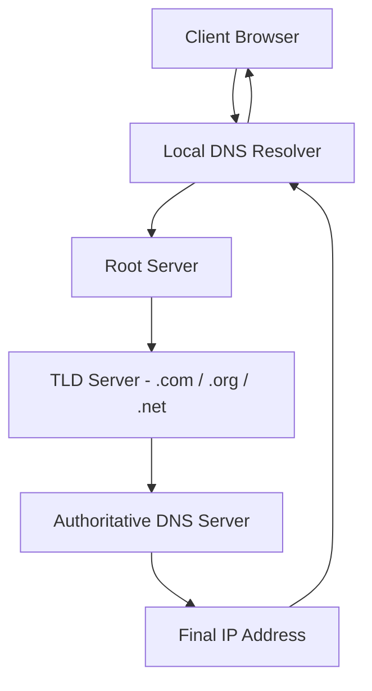
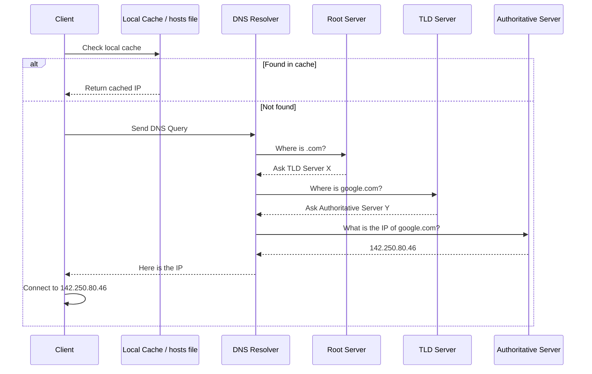
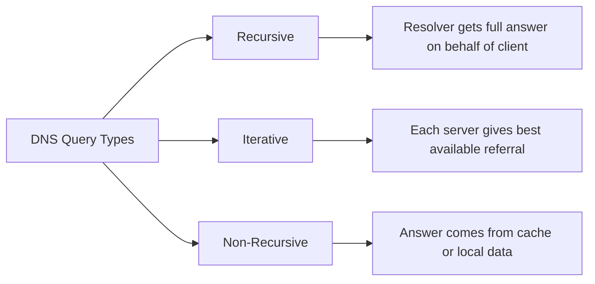
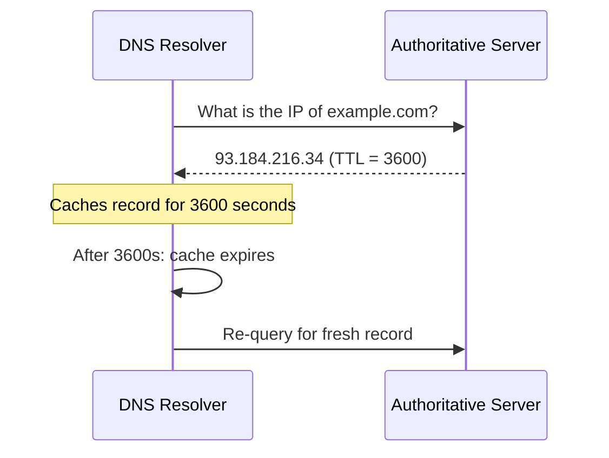
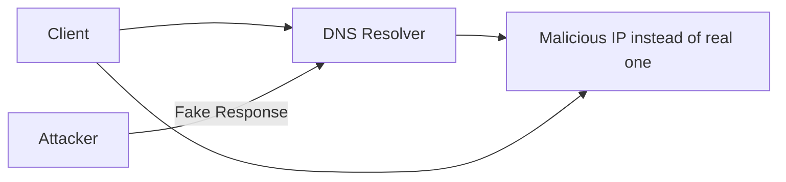
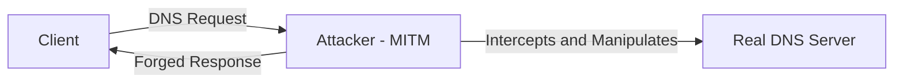
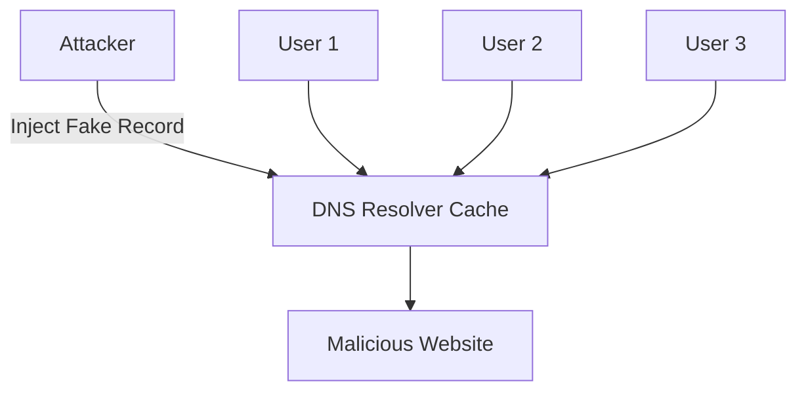
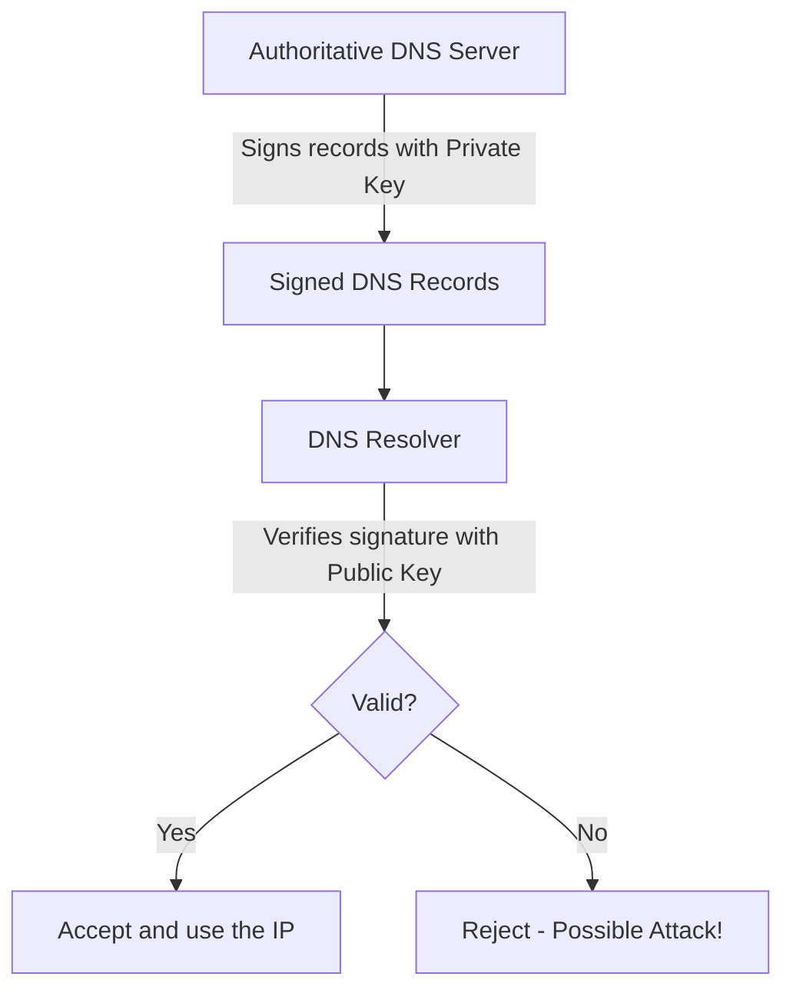

> **الهدف من الـ Section ده:** هتفهم إزاي الـ DNS بيترجم الأسماء اللي إحنا بنكتبها زي `google.com` لـ IP Addresses تقدر الأجهزة تتكلم بيها، وهتعرف إيه المخاطر الأمنية الممكنة وإزاي تتحمى منها.

---

# Domain Name System (DNS) — How the Internet Finds Its Way

## Table of Contents

- [DNS Overview](#dns-overview)
- [DNS Hierarchy](#dns-hierarchy)
- [DNS Resolution Process](#dns-resolution-process)
- [Types of DNS Queries](#types-of-dns-queries)
- [Common DNS Record Types](#common-dns-record-types)
- [DNS Caching and TTL](#dns-caching-and-ttl)
- [Reverse DNS](#reverse-dns)
- [DNS Security Threats](#dns-security-threats)
- [DNS Security — DNSSEC](#dns-security--dnssec)
- [Summary](#summary)

---

## DNS Overview

الـ **DNS (Domain Name System)** هو زي "دليل التليفون" بتاع الإنترنت.

لما بتكتب `www.google.com` في المتصفح، أنت مش بتكتب الـ IP Address الحقيقي بتاع السيرفر. الـ DNS هو اللي بيأخد الاسم ده ويرجعلك الـ IP Address المقابل له عشان جهازك يعرف يتصل بيه.

**مثال بسيط:**

```
User types:    www.google.com
DNS resolves:  142.250.80.46
Browser connects to: 142.250.80.46
```

> [!NOTE]
> الـ DNS بيشتغل على **Port 53** وبيستخدم **UDP** في الغالب، لكن لو الـ Response كبيرة بيتحول لـ **TCP**.

---

## DNS Hierarchy

الـ DNS مش سيرفر واحد — هو نظام **موزَّع وهرمي (Distributed Hierarchical System)**. يعني فيه مستويات كتير بتتعاون مع بعض عشان تجيب الإجابة.



### مستويات الـ DNS Hierarchy

| المستوى | الاسم | الدور |
|--------|-------|-------|
| 1 | **Root Servers** | نقطة البداية — بيوجه الـ Query للـ TLD الصح |
| 2 | **TLD Servers** | بيتحكم في امتدادات زي `.com`, `.org`, `.net` |
| 3 | **Authoritative DNS Servers** | عنده السجلات الفعلية للـ Domain وبيرجع الـ IP |
| 4 | **Local DNS Resolver** | بيعمل الـ Lookup نيابةً عن الـ Client (غالباً بيديه الـ ISP) |

> [!IMPORTANT]
> الـ **Root Servers** مش بتعرف الـ IP بتاع كل موقع — هي بس بتعرف مين المسئول عن كل **TLD**. ده اللي بيخلي النظام موزَّع وسريع.

---

## DNS Resolution Process

لما بتكتب اسم موقع في المتصفح، بيحصل الآتي خطوة خطوة:



### الخطوات بالتفصيل

**الخطوة 1 — Check Local Cache:**

الـ Client بيبص الأول على الـ **hosts file** الموجود على جهازه:
- **Windows:** `C:\Windows\System32\drivers\etc\hosts`
- **Linux/Unix:** `/etc/hosts`

لو لقى الـ IP فيه، بيستخدمه على طول بدون ما يسأل أي DNS Server.

**الخطوة 2 — DNS Resolver:**

لو مش موجود في الـ Cache، الـ Request بيتبعت للـ **DNS Resolver** (اللي غالباً بيديه الـ ISP أو أنت بتحدده زي `8.8.8.8` الخاص بـ Google).

**الخطوة 3 → 5 — Iterative Queries:**

الـ Resolver بيسأل:
1. الـ **Root Server**: مين المسئول عن `.com`؟
2. الـ **TLD Server**: مين عنده سجلات `google.com`؟
3. الـ **Authoritative Server**: إيه الـ IP بتاع `google.com`؟

**الخطوة 6 — Response + Cache:**

الـ Resolver بيرجع الـ IP للـ Client ويحتفظ بيه في الـ **Cache** عشان المرة الجاية يكون أسرع.

**الخطوة 7 — Connect:**

الـ Client بيتصل بالـ IP اللي جاله.

> [!TIP]
> تقدر تعمل **DNS Lookup** يدوي باستخدام الأوامر دي:
> ```bash
> # Windows
> nslookup google.com
>
> # Linux / macOS
> dig google.com
> host google.com
> ```

---

## Types of DNS Queries

فيه 3 أنواع من الـ DNS Queries:



| النوع | الوصف | مين بيستخدمه |
|------|-------|-------------|
| **Recursive** | الـ Resolver بيعمل كل الشغل ويرجع الإجابة الكاملة | الـ Client مع الـ Resolver |
| **Iterative** | كل سيرفر بيرجع أحسن إجابة عنده أو بيوجه لسيرفر تاني | الـ Resolver مع الـ Root/TLD/Auth |
| **Non-Recursive** | الإجابة بتيجي من الـ Cache أو من بيانات محلية مباشرةً | Resolver أو Authoritative Server |

> [!NOTE]
> في الغالب، الـ Client بيبعت **Recursive Query** للـ Resolver، والـ Resolver بيبعت **Iterative Queries** لبقية السيرفرات.

---

## Common DNS Record Types

الـ DNS مش بس بيترجم أسماء لـ IP Addresses — عنده أنواع كتيرة من الـ Records لأغراض مختلفة:

| نوع الـ Record | الوظيفة | مثال |
|--------------|---------|------|
| **A** | بيربط Domain بـ IPv4 Address | `google.com → 142.250.80.46` |
| **AAAA** | بيربط Domain بـ IPv6 Address | `google.com → 2607:f8b0::...` |
| **CNAME** | Alias — بيشير لـ Domain Name تاني | `www.example.com → example.com` |
| **MX** | بيحدد Mail Server للـ Domain | بيستخدمه الـ Email لتوجيه الرسايل |
| **PTR** | Reverse Lookup — من IP لـ Domain Name | `142.250.80.46 → google.com` |
| **NS** | بيحدد Authoritative Name Servers | اللي مسئولة عن الـ Domain |
| **TXT** | بيخزن نصوص تعريفية | بيستخدم في SPF و DKIM للـ Email Security |

> [!TIP]
> لو شغال في الـ Email Security، الـ **MX** و **TXT** Records هم الأهم عشان بيتحكموا في إزاي الـ Emails بتترسل وبتتحقق.

---

## DNS Caching and TTL

### الـ Caching

الـ DNS بيخزن الإجابات في الـ **Cache** عشان:
- يسرّع الـ Resolution في المرات الجاية
- يقلل الـ Load على الـ DNS Servers

### الـ TTL (Time To Live)

الـ **TTL** هو الوقت (بالثواني) اللي الـ DNS Record بيفضل محفوظ في الـ Cache قبل ما يتجدد.

```
TTL = 3600  →  الـ Record بيتخزن في الـ Cache ساعة واحدة
TTL = 86400 →  الـ Record بيتخزن 24 ساعة
TTL = 300   →  الـ Record بيتخزن 5 دقايق بس
```



> [!NOTE]
> لو بتعمل **Migration** لموقع (بتغير الـ IP)، لازم تقلل الـ TTL قبل التغيير بوقت كافي عشان التغيير يتوزع بسرعة على الـ Internet.

---

## Reverse DNS

الـ **Reverse DNS (rDNS)** بيعمل العكس تماماً — بدل ما يترجم اسم لـ IP، بيترجم **IP لاسم**.

```
Forward DNS:  google.com      → 142.250.80.46
Reverse DNS:  142.250.80.46   → google.com
```

### بيُستخدم في:

- **Email Validation:** السيرفرات بتتحقق إن الـ Mail Server عنده Reverse DNS صح قبل ما تقبل الـ Email (لمنع الـ Spam)
- **Network Troubleshooting:** لما تعمل `traceroute` مثلاً بيظهرلك أسماء بدل IPs
- **Security Analysis:** تحليل الـ Logs وتحديد مصدر الـ Traffic

> [!NOTE]
> الـ Reverse DNS بيشتغل باستخدام نوع خاص من الـ Records اسمه **PTR Record**، وبيبقى في نطاق خاص اسمه `.in-addr.arpa`.

---

## DNS Security Threats

الـ DNS من أكتر البروتوكولات اللي بيتهاجَم عليها لأنه أساسي جداً ومش كان متصمم في الأصل عشان يكون Secure.

### 1. DNS Spoofing / Cache Poisoning



**إيه اللي بيحصل؟**

المهاجم بيبعت **Fake DNS Response** للـ Resolver ويحطله IP خاطئ بدل الـ IP الحقيقي. الـ Resolver بيخزن الـ IP الغلط ده في الـ Cache، وكل الـ Users اللي بيسألوه بيتوجهوا لموقع مزيف.

**الخطر:** سرقة بيانات، Phishing، تثبيت Malware.

---

### 2. Man-in-the-Middle (MITM) Attack



**إيه اللي بيحصل؟**

المهاجم بيوضع نفسه **بين الـ Client والـ DNS Server** — غالباً باستخدام **ARP Spoofing** على الشبكة المحلية. بيشوف الـ Requests ويبعت ردود مزيفة.

> [!WARNING]
> الهجوم ده صعب تكتشفه لأن الـ Client مش عارف إن في حد في النص. الـ HTTPS و DNSSEC بيساعدوا في التخفيف من الخطر.

---

### 3. Hosts File Manipulation (Client Cache Poisoning)

**إيه اللي بيحصل؟**

المهاجم (أو **Malware**) بيعدّل الـ **hosts file** على جهاز الضحية مباشرةً:

```
# Windows: C:\Windows\System32\drivers\etc\hosts
# Linux:   /etc/hosts

# Malicious entry:
192.168.1.100   www.bank.com
```

الجهاز دلوقتي لما حد يكتب `www.bank.com` بيتوجه للـ IP الغلط من غير ما يسأل أي DNS Server خالص.

> [!IMPORTANT]
> الـ **hosts file** بياخد Priority على الـ DNS. يعني حتى لو الـ DNS صح، لو الـ hosts file متعدَّل — الجهاز مش هيعرف.

**للحماية:** راجع الـ hosts file بشكل دوري واستخدم Antivirus.

---

### 4. DNS Server Cache Poisoning

**الفرق عن الـ Client Cache Poisoning:**

في الـ Client Cache Poisoning، الهجوم على جهاز واحد بس. أما هنا المهاجم بيتارجت **الـ DNS Resolver نفسه**، فكل الـ Users اللي بيستخدموا نفس الـ Resolver بيتأثروا.



> [!WARNING]
> ده واحد من أخطر الهجمات لأنه بيأثر على **آلاف المستخدمين** في نفس الوقت بهجوم واحد.

---

### مقارنة بين أنواع التهديدات

| نوع الهجوم | الهدف | النطاق | الصعوبة |
|-----------|-------|--------|---------|
| **DNS Spoofing** | DNS Resolver | كل مستخدمي الـ Resolver | متوسطة |
| **MITM** | الشبكة المحلية | محدود للشبكة | عالية |
| **Hosts File Manipulation** | جهاز واحد | جهاز واحد بس | منخفضة (لو عنده Access) |
| **Server Cache Poisoning** | DNS Server | واسع جداً | عالية |

---

## DNS Security — DNSSEC

**DNSSEC (DNS Security Extensions)** هو الحل الرئيسي لمشاكل الـ DNS Spoofing.

### الفكرة الأساسية

الـ DNSSEC بيضيف **توقيع رقمي (Digital Signature)** على كل DNS Record — زي ما بتحط إمضاء على ورقة عشان تثبت إنك أنت اللي كتبتها.



### إزاي بيشتغل؟

**الخطوة 1 — Signing:**
- الـ Authoritative Server بيوقّع كل DNS Record بـ **Private Key** خاصة بيه.

**الخطوة 2 — Verification:**
- الـ Resolver لما يستقبل الـ Response، بيتحقق من التوقيع باستخدام الـ **Public Key** المتاحة.

**الخطوة 3 — Decision:**
- لو التوقيع صح ✅ → الـ Response اتقبلت.
- لو التوقيع غلط ❌ → الـ Response اترفضت وبيظهر Error.

### الـ DNSSEC بيضمن:

| الضمان | المعنى |
|--------|--------|
| **Data Integrity** | الـ DNS Records مش اتعدلت في الطريق |
| **Authentication** | الـ Response جاية من السيرفر الحقيقي |
| **Protection against Spoofing** | المهاجم مش يقدر يحقن Records مزيفة |

> [!IMPORTANT]
> الـ DNSSEC **مش بيشفّر** الـ DNS Traffic — هو بس بيتحقق من الـ Authenticity. لو عايز Privacy كمان، بتستخدم **DNS over HTTPS (DoH)** أو **DNS over TLS (DoT)**.

> [!NOTE]
> مش كل الـ Domains بتدعم DNSSEC. تقدر تتحقق بالأمر ده:
> ```bash
> dig +dnssec google.com
> ```

---

## Summary

### أهم النقاط اللي اتعلمتها في الـ Section ده:

- **الـ DNS** هو نظام موزَّع وهرمي بيترجم **Domain Names** لـ **IP Addresses** — بيشتغل على **Port 53** باستخدام **UDP/TCP**.

- **الـ DNS Hierarchy** بتتكون من 4 مستويات: **Root Servers → TLD Servers → Authoritative Servers → Local Resolver**.

- **عملية الـ Resolution** بتبدأ من الـ **Local Cache** (hosts file)، ولو مش موجودة بتتحول لـ DNS Resolver اللي بيسأل الـ Servers خطوة خطوة.

- فيه 3 أنواع Queries: **Recursive** (الـ Resolver بيجيب الإجابة كاملة)، **Iterative** (كل سيرفر بيحيل للتاني)، **Non-Recursive** (الإجابة من الـ Cache).

- أهم **DNS Record Types**: `A` (IPv4), `AAAA` (IPv6), `CNAME` (Alias), `MX` (Mail), `PTR` (Reverse), `TXT` (Security/Verification).

- الـ **TTL** بيحدد إمتى الـ Cache بيتجدد — مهم جداً في الـ Migration والأداء.

- الـ **Reverse DNS** بيعمل العكس (IP → Domain) وبيُستخدم في Email Validation والـ Security Analysis.

- **أخطر التهديدات الأمنية:** DNS Spoofing، MITM، Hosts File Manipulation، Server Cache Poisoning — وكلها بتهدف إنها توجه الـ User لمواقع مزيفة.

- **DNSSEC** هو الحل عن طريق إضافة **Digital Signatures** على الـ DNS Records للتحقق من صحتها — بيضمن **Integrity** و **Authentication** بس مش **Encryption**.
