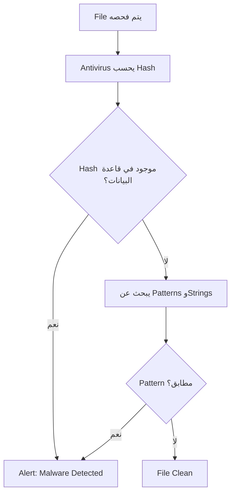
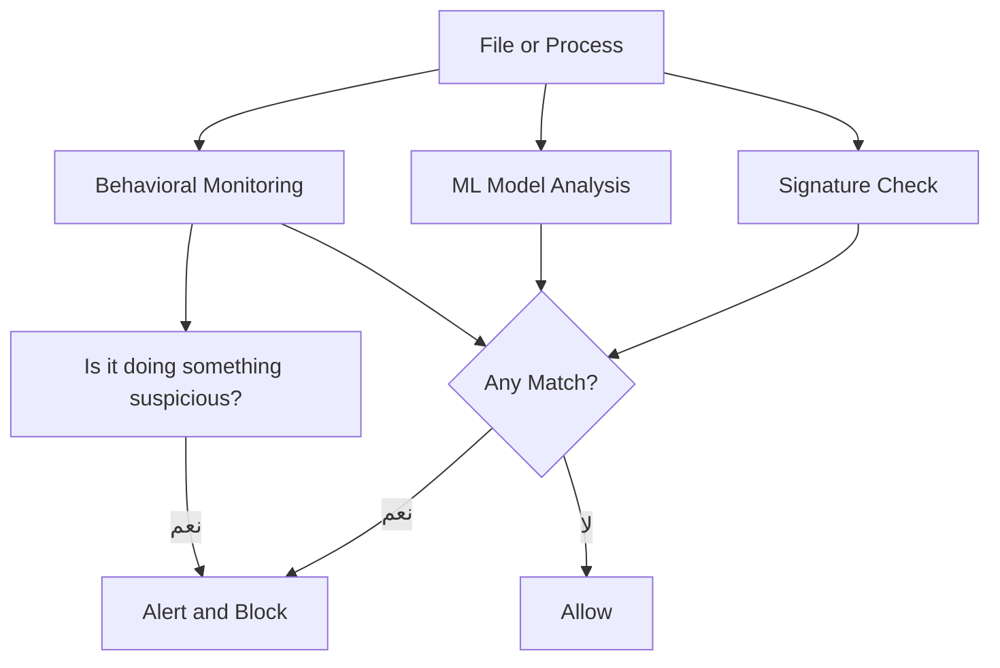

> **الهدف من الـ Section ده:**  
> هنتعرف على أساليب Defense & Detection المستخدمة لاكتشاف ومنع الـ Malware والهجمات.
---

## Defense & Detection

### Antivirus Solutions

#### النوع الأول: Signature-Based Detection

الـ **Signature-Based Antivirus** بيعمل كده:

1. يحسب الـ **Hash** (SHA-256، MD5) للـ File
2. يقارنه بقاعدة بيانات من الـ Hashes المعروفة للـ Malware
3. كمان بيبحث عن **Unique Patterns** و**Strings** مميزة في الكود

> [!WARNING]
> الـ Signature-Based Antivirus عنده عيب كبير: **Zero-Day Malware** — أي Malware جديد لم يضاف بعد لقاعدة البيانات — هيعدي من غير اكتشاف. الـ Antivirus updates كل بضع دقائق، بس الـ Attackers دايماً بيعدلوا على الـ Malware عشان يتجنبوا الـ Signature.

#### النوع الثاني: Modern Behavioral Detection

المنظمات الناضجة مش بتعتمد على الـ Signature-Based بس. الـ **Modern Anti-Malware** بيجمع:

| الطريقة | الوصف |
|---|---|
| **Signature-Based** | مقارنة الـ Hashes والـ Patterns |
| **Machine Learning** | نماذج تعلم آلي لاكتشاف السلوك الغريب |
| **Behavioral Analysis** | مراقبة نشاط البرنامج في الـ Runtime |

> [!IMPORTANT]
> الـ Behavioral Analysis هو الأهم دلوقتي. الـ Antivirus مش بس بيقارن Hashes، هو كمان بيراقب **إيه اللي البرنامج بيعمله**. لو برنامج بدأ يعمل Encrypt لملفات بدون إذن — هيتوقف حتى لو مش في قاعدة البيانات.

---

## Summary

**Defense:**
- Signature-Based لوحده مش كافي — بيفوته الـ Zero-Day
- الحل الحديث: Signature + Machine Learning + Behavioral Analysis
- دايماً راقب الـ Behavior مش بس الـ Hash
