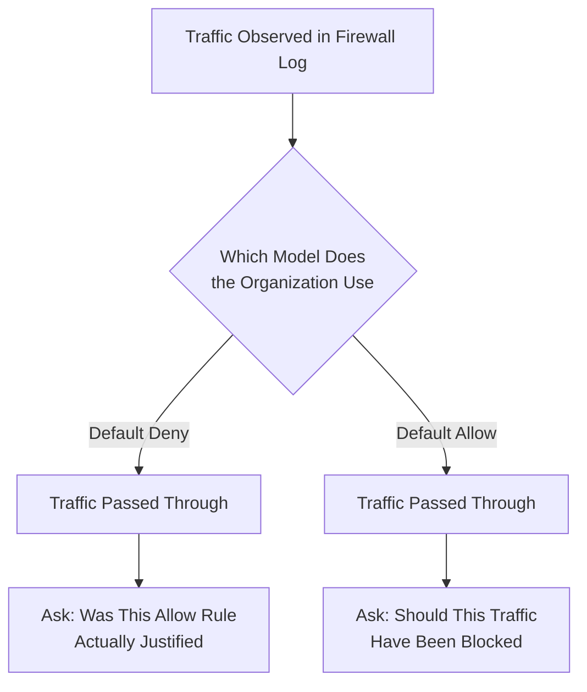

| Topic | Level | Reading Time | Prerequisites |
|---|---|---|---|
| Default Allow vs. Default Deny | Intermediate | ~14 min | Basic understanding of firewalls and firewall rules |

> **الهدف من الـ Section ده:**  
>  هتفهم الفرق الجوهري بين فلسفتين لضبط الفايروول، **Default Deny** و **Default Allow**، وليه اختيار الفلسفة دي بيأثر على الوضع الأمني الكامل للمؤسسة، وإزاي ده بيغيّر طريقة تحليلك لأي firewall logs كمحلل SOC.

# 
## Learning Objectives

By the end of this section, you will be able to:

- Define **Default Deny** and explain why it is considered the safer, more common approach.
- Define **Default Allow** and explain why it is considered the riskier approach.
- Compare the trade-offs between both models in terms of security, configuration effort, and user experience.
- Explain why a **SOC Analyst** must know which model an organization uses before interpreting firewall logs.
- Identify why most security-mature organizations lean toward **Default Deny**.

## Table of Contents

- [Why This Concept Matters](#why-this-concept-matters)
- [Default Deny: The Safer, More Common Approach](#default-deny-the-safer-more-common-approach)
- [Default Allow: The Riskier Approach](#default-allow-the-riskier-approach)
- [Side-by-Side Comparison](#side-by-side-comparison)
- [Why This Matters for a SOC Analyst](#why-this-matters-for-a-soc-analyst)
- [Which Model Do Organizations Actually Use](#which-model-do-organizations-actually-use)
- [Decision Flow Diagram](#decision-flow-diagram)
- [Career Connection](#career-connection)
- [Key Terms Glossary](#key-terms-glossary)
- [Summary](#summary)

## Why This Concept Matters

ده واحد من أهم المفاهيم التأسيسية في إعداد الفايروول، وهو بيأثر على **الوضع الأمني الكامل (entire security posture)** للمؤسسة.

الاختيار بين الفلسفتين مش تفصيلة تقنية بسيطة، هو قرار استراتيجي بيحدد إزاي الشبكة كلها هتتعامل مع أي حركة مرور جديدة أو غير معروفة.

## Default Deny: The Safer, More Common Approach

في فلسفة **Default Deny**: كل حاجة بتتحظر افتراضيًا. بيتم السماح بس بحركة المرور اللي حد صراحة وافق عليها.

> [!NOTE]
> تخيل مبنى حصري (**exclusive building**) خاص بالأعضاء بس. لو اسمك مش موجود على قائمة الموافقين، الأمن مش هيسمحلك تدخل، نقطة على السطر.

**ده أكتر أمانًا**، لأن مفيش حاجة بتعدي بالصدفة.

**السلبية؟** بياخد مجهود أكبر مقدمًا، حد لازم يفكّر في كل نوع من أنواع حركة المرور الشرعية ويكتب لها rule سماح يدويًا. لو نسيت واحدة، المستخدمين هيشتكوا إن حاجة معينة مش شغالة.

## Default Allow: The Riskier Approach

في فلسفة **Default Allow**: كل حاجة مسموح بيها افتراضيًا، وبيتم حظر بس اللي اتحدد صراحةً إنه ضار.

> [!NOTE]
> تخيل حديقة عامة (**public park**) بدخول مفتوح، أي حد يقدر يدخل إلا لو اتحدد تحديدًا إنه ممنوع أو موجود في قائمة "ممنوع الدخول".

**ده أقل أمانًا**، لأن التهديدات الجديدة اللي معتحددتش لسه هتعدي بحرية، بما إنها لسه مش موجودة في قائمة الحظر.

**الميزة؟** مجهود إعداد أولي أقل، وشكاوى أقل بخصوص حظر حركة مرور شرعية.

## Side-by-Side Comparison

الجدول التالي بيلخّص الفرق الجوهري بين الفلسفتين:

| المعيار | Default Deny | Default Allow |
|---|---|---|
| السلوك الافتراضي | حظر كل شيء ما لم يُسمح به صراحة | السماح بكل شيء ما لم يُحظر صراحة |
| مستوى الأمان | أعلى، لأن التهديدات غير المعروفة تُحظر تلقائيًا | أقل، لأن التهديدات غير المعروفة تمر بحرية |
| مجهود الإعداد الأولي | أكبر، يتطلب كتابة قاعدة سماح لكل نوع حركة شرعي | أقل، يتطلب فقط تحديد ما هو ضار ومعروف |
| شكاوى المستخدمين | أكثر احتمالًا عند نسيان قاعدة سماح لحركة شرعية | أقل احتمالًا، لأن معظم الحركة تمر افتراضيًا |
| التعامل مع تهديدات جديدة | تُحظر تلقائيًا حتى تتم الموافقة عليها | تمر بحرية حتى يتم تحديدها كضارة |

> [!IMPORTANT]
> الفرق الجوهري بين الفلسفتين مش في "قوة" الحماية بس، لكن في **اتجاه الافتراض نفسه**: هل الافتراض هو الثقة (Allow) أو عدم الثقة (Deny)؟ الإجابة على السؤال ده بتحدد طبيعة كل قرار أمني تاني في الشبكة.

## Why This Matters for a SOC Analyst

لما تكون بتحقق في حادثة أمنية (**incident**)، معرفتك بإن المؤسسة بتستخدم **Default Allow** أو **Default Deny** بتغيّر تمامًا الطريقة اللي بتفسّر بيها الـ firewall logs.

- في بيئة **Default Deny**: لو شفت حركة مرور عدّت، معناها إن حد صراحة وافق عليها. فالسؤال اللي هتسأله: "هل الـ rule دي كانت مبررة أصلًا؟"
- في بيئة **Default Allow**: بدل كده، هتسأل: "هل الحركة دي المفروض كانت متحظورة ومحظرتش؟"

> [!TIP]
> السؤالين مختلفين تمامًا في طبيعتهم، وفهم الفلسفة اللي المؤسسة بتتبعها هو أول خطوة قبل ما تبدأ تحلل أي firewall log فعليًا، عشان تسأل السؤال الصح من الأول.

## Which Model Do Organizations Actually Use

معظم المؤسسات الناضجة أمنيًا (**security-mature organizations**) بتميل لاستخدام **Default Deny**، لأنه بيقلل المخاطر.

> [!WARNING]
> رغم إن Default Deny هو الأكتر شيوعًا في المؤسسات الناضجة أمنيًا، مهم جدًا إنك تعرف إن الموديلين موجودين فعليًا في الواقع، ولازم **دايمًا تتأكد من المؤسسة بتستخدم أنهي موديل** قبل ما تبدأ تحلل سلوك الفايروول بتاعها.

## Decision Flow Diagram

المخطط التالي بيوضح الفرق في طريقة تفكير محلل الـ SOC عند تحليل حركة مرور تحت كل موديل:

## Career Connection

فهم الفرق بين Default Allow وDefault Deny له تطبيقات مباشرة في مسارات مهنية متعددة:

- في مجال **SOC**، ده أول سؤال لازم يتسأل قبل تحليل أي حادثة مرتبطة بالفايروول، عشان يوجّه طريقة قراءة الـ logs بشكل صحيح.
- في مجال **Network Security Engineering**، اختيار الفلسفة المناسبة (Default Deny غالبًا) جزء أساسي من تصميم بنية الأمان للمؤسسة من البداية.
- في مجال **GRC**، توثيق الفلسفة المتبعة (Default Allow أو Default Deny) جزء من متطلبات الامتثال والتدقيق الأمني.

## Key Terms Glossary

| Term | Definition |
|---|---|
| **Default Deny** | مبدأ إعداد يقضي بحظر كل حركة المرور افتراضيًا، ما لم يوجد rule صريح يسمح بها. |
| **Default Allow** | مبدأ إعداد يقضي بالسماح بكل حركة المرور افتراضيًا، ما لم يوجد rule صريح يحظرها. |
| **Security Posture** | الوضع الأمني العام للمؤسسة، الناتج عن مجموع سياساتها وإعداداتها الأمنية. |
| **Security-Mature Organization** | مؤسسة طبّقت ممارسات وسياسات أمنية متقدمة ومدروسة بعناية. |

## Summary

- **Default Deny** بيحظر كل حركة مرور افتراضيًا، ولا يسمح إلا بما تمت الموافقة عليه صراحةً، وهو الأكثر أمانًا لكنه يتطلب مجهود إعداد أكبر.
- **Default Allow** بيسمح بكل حركة مرور افتراضيًا، ولا يحظر إلا ما تم تحديده كضار، وهو أقل أمانًا لكنه يتطلب مجهود إعداد أقل.
- الفرق الجوهري بين الموديلين هو **اتجاه الافتراض**: الثقة مقابل عدم الثقة.
- كمحلل **SOC**، السؤال اللي بتسأله عند تحليل حركة مرور بيختلف تمامًا حسب الموديل المستخدم: "هل الـ rule دي كانت مبررة؟" في Default Deny، مقابل "هل ده كان المفروض يتحظر؟" في Default Allow.
- معظم المؤسسات الناضجة أمنيًا بتميل لـ **Default Deny** لأنه بيقلل المخاطر، لكن الموديلين موجودين فعليًا، ولازم دايمًا تتأكد من الموديل المستخدم قبل ما تبدأ تحليلك.

