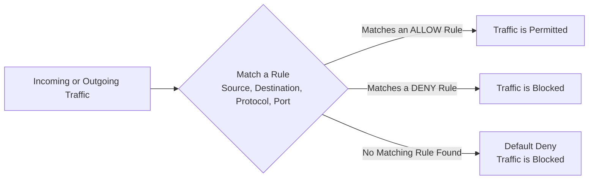

| Topic | Level | Reading Time | Prerequisites |
|---|---|---|---|
| How Firewalls Actually Work: Rules | Intermediate | ~20 min | Basic understanding of firewalls, TCP/IP, and common port numbers |

> **الهدف من الـ Section ده:**  
>   هتفهم إزاي الـ Firewall فعليًا بيشتغل من خلال الـ rules، مين المسؤول عن كتابتها، ومفهوم الـ Default Deny، وهنشرح خمس أمثلة حقيقية لقواعد firewall شائعة عشان تقدر تقرأ أي rule وتفهم منطقها.


## Learning Objectives

By the end of this section, you will be able to:

- Explain why a firewall is not "smart" on its own and depends entirely on rules written by humans.
- Define what a **rule** is in the context of a firewall, and explain the **Default Deny** principle.
- Identify who is typically responsible for writing firewall rules and why a **SOC Analyst** still needs to understand them.
- Read and interpret the logic of real-world firewall rules based on source, destination, protocol, port, and action.
- Explain the security reasoning behind common rules such as blocking FTP, geo-blocking, and forcing DNS through a controlled path.

## Table of Contents

- [Firewalls Are Not Smart on Their Own](#firewalls-are-not-smart-on-their-own)
- [What Is a Rule, Really](#what-is-a-rule-really)
- [Default Deny: The Core Principle](#default-deny-the-core-principle)
- [Who Writes These Rules](#who-writes-these-rules)
- [Why SOC Analysts Must Understand Rules Too](#why-soc-analysts-must-understand-rules-too)
- [How Rules Are Configured](#how-rules-are-configured)
- [Real Examples of Firewall Rules](#real-examples-of-firewall-rules)
  - [Example 1: Allowing Normal Web Browsing](#example-1-allowing-normal-web-browsing)
  - [Example 2: Blocking Unsolicited Inbound Traffic](#example-2-blocking-unsolicited-inbound-traffic)
  - [Example 3: Blocking Insecure FTP](#example-3-blocking-insecure-ftp)
  - [Example 4: Geo-Blocking](#example-4-geo-blocking)
  - [Example 5: Forcing DNS Through a Controlled Path](#example-5-forcing-dns-through-a-controlled-path)
- [Rule Logic Diagram](#rule-logic-diagram)
- [Career Connection](#areer-connection)
- [Key Terms Glossary](#key-terms-glossary)
- [Summary](#summary)

## Firewalls Are Not Smart on Their Own

الـ **Firewall** مش ذكي بطبيعته. هو مش بيقرر لوحده إيه اللي خطير وإيه اللي مش خطير. هو أساسًا آلة "غبية" ومطيعة (**dumb, obedient machine**)، بتعرف بس اللي إنت قلتله عليه، من خلال الـ **rules**.

> [!IMPORTANT]
> الفكرة دي مهمة جدًا نفهمها من البداية: الـ Firewall مش عنده أي "فهم" حقيقي للخطر، هو بس بينفذ التعليمات اللي اتحطتله بالظبط. أي غلط في القواعد دي، سواء بالزيادة أو النقصان، هيتنفذ من غير أي تشكيك.

## What Is a Rule, Really

الـ **Rule** ببساطة هي جملة بتقول:

- النوع ده من حركة المرور (**traffic**)، اسمحله (**allow it**).
- النوع ده من حركة المرور، امنعه (**block it**).

كل حاجة تانية في الموضوع ده بتبني على المفهوم البسيط ده.

## Default Deny: The Core Principle

فيه مفهوم أساسي ومهم جدًا في السلوك الافتراضي (**default behavior**) للفايروول: معظم الفايروولات بتتبع مبدأ اسمه **Default Deny**.

معنى المبدأ ده: لو مفيش rule بتسمح تحديدًا بحاجة معينة، الحاجة دي بتتحظر تلقائيًا.

> [!NOTE]
> الفكرة الأساسية هنا إن الافتراض الأمني هو "الرفض"، مش "القبول". يعني الفايروول بيفترض إن أي حركة مرور مشبوهة أو غير معروفة لحد ما يتأكد إنها مسموح بيها صراحة.

## Who Writes These Rules

**Network Security Team** هي عادةً المسؤولة عن تصميم وكتابة القواعد دي، هي اللي بتقرر السياسة الأمنية الفعلية (**security policy**).

لكن كمحلل **SOC Analyst**، إنت مش برة الموضوع خالص. لازم تقدر تقرأ وتفهم وتفسّر القواعد دي كويس، للأسباب التالية:

- هتحقق في تنبيهات (**alerts**) بتشاور لقواعد معينة.
- هتحتاج تعرف هل حركة المرور اتحظرت ولا اتسمحلها، وليه.
- ممكن تحتاج تلاحظ rule متضبطة بشكل خطأ أو متساهلة (**permissive**) أكتر من اللازم.

## Why SOC Analysts Must Understand Rules Too

النقطة دي بتوضح إن فهم منطق القواعد مش شغل مقصور على فريق الـ Network Security بس. محلل الـ SOC اللي بيقدر يقرأ ويفهم القواعد دي بيقدر يكتشف بسرعة أكبر إذا كان في الموضوع مشكلة فعلية أو مجرد سلوك متوقع.

> [!TIP]
> لو جالك تنبيه بيقول إن حركة مرور اتحظرت، أول سؤال لازم تسأله هو: "أي rule بالظبط اللي حظرت الحركة دي؟" الإجابة دي بتوضحلك السياق الكامل وتساعدك تحكم هل ده تهديد حقيقي أو مجرد تصرف طبيعي متوقع.

## How Rules Are Configured

معظم الفايروولات الحديثة عندها **GUI** (واجهة رسومية)، إنت غالبًا مش بتكتب أوامر سطر أوامر مخيفة. إنت بس بتملى حقول زي: source، destination، port، action (allow/deny).

لكن الجزء الصعب فعليًا مش الواجهة نفسها، الجزء الصعب هو **بناء منطق الـ rule بشكل صحيح**. rule متبنية غلط ممكن إما تحظر حركة مرور شرعية مهمة للبيزنس (وتسبب شكاوى غضب من الموظفين)، أو بالغلط تسمح بمرور حاجة خطيرة.

> [!WARNING]
> قواعد كل مؤسسة مختلفة تمامًا عن التانية. قواعد فايروول بنك مش هتشبه خالص قواعد فايروول مدرسة. **مفيش كتاب قواعد عالمي موحّد**، كل حاجة بتعتمد على احتياجات البيزنس والمخاطر اللي المؤسسة بتحاول تديرها.

## Real Examples of Firewall Rules

دلوقتي هنشوف إزاي القواعد دي فعليًا بتتكتب في الواقع. متقلقش بخصوص الصيغة الدقيقة (بتختلف من مزوّد لآخر)، ركّز على فهم **المنطق (logic)**.

### Example 1: Allowing Normal Web Browsing

```
ALLOW TCP Internal_Network → Internet
PORTS 80, 443
```

**المنطق**: خلّي الموظفين جوه الشركة يقدروا يتصفحوا الإنترنت باستخدام مواقع آمنة عادية. دي rule طبيعية جدًا وموجودة في كل مكان تقريبًا، أساسًا بتسمح للموظفين يستخدموا الإنترنت للتصفح العادي.

### Example 2: Blocking Unsolicited Inbound Traffic

```
DENY ANY Internet → Internal_Network
```

**المنطق**: محدش من الإنترنت الخارجي مسموحله يدخل ببساطة على شبكتنا الداخلية. دي rule دفاعية أساسية جدًا، بتمنع أي حد عشوائي على الإنترنت إنه يوصل مباشرة لأنظمة الشركة الداخلية.

### Example 3: Blocking Insecure FTP

```
DENY TCP ANY → ANY PORT 21 (FTP)
```

**المنطق**: امنع بروتوكول FTP في كل مكان، لأي حد. الـ **FTP** بروتوكول قديم لنقل الملفات وغير آمن، هو بيبعت أسماء المستخدمين وكلمات المرور بنص عادي (غير مشفر). كتير من المؤسسات بتمنعه تمامًا لأنه هدف سهل للمهاجمين إنهم يسرقوا بيانات اعتماد بمجرد مراقبة حركة المرور.

### Example 4: Geo-Blocking

```
DENY IP Country_List → Internal_Network
```

**المنطق**: امنع حركة المرور الجاية من قائمة دول معينة. الممارسة دي بتُسمى **Geo-Blocking**. الشركات غالبًا بتعمل كده لو ماعندهاش تعاملات تجارية في دول معينة، وشايفة حجم كبير من حركة مرور هجومية جاية من هناك، فبتقرر تقطع الاتصال بالكامل عشان تقلل المخاطر.

### Example 5: Forcing DNS Through a Controlled Path

```
DENY UDP Internal_Network → ANY PORT 53
```

**المنطق**: امنع طلبات الـ DNS الخارجة اللي بتحاول تستخدم UDP port 53 عشان توصل لأي مكان. البورت 53 مستخدم للـ **DNS**. ده ممكن يبان في الظاهر كإنه هيعطّل الإنترنت لكل حد، لكن الـ rule دي غالبًا بتُستخدم عشان تجبر كل حركة مرور DNS تمر عبر سيرفر DNS داخلي محدد وتحت المراقبة، بدل ما تسيب الأجهزة تستعلم من سيرفرات DNS خارجية عشوائية مباشرة.

> [!IMPORTANT]
> السبب وراء الـ rule دي؟ الـ **Malware** غالبًا بيستخدم طلبات DNS خارجية بشكل خفي عشان يتواصل مع الهاكرز (وده بيُسمى **DNS Tunneling**)، فحظر الـ DNS الخارج المباشر بيجبر كل حاجة إنها تمر عبر مسار متحكم فيه ومراقب.

## Rule Logic Diagram

المخطط التالي بيوضح المنطق العام اللي أي firewall rule بيتبني عليه، من وصول حركة المرور لحد اتخاذ قرار السماح أو الحظر:



## Career Connection

فهم منطق قواعد الفايروول له تطبيقات مباشرة في مسارات مهنية متعددة:

- في مجال **SOC**، القدرة على قراءة وفهم firewall logs والقواعد المرتبطة بيها أساس التحقيق في معظم التنبيهات الأمنية اليومية.
- في مجال **Network Security Engineering**، تصميم قواعد فايروول دقيقة ومتوازنة (مش متساهلة أكتر من اللازم ومش صارمة لدرجة تعطيل البيزنس) هو جوهر الشغل.
- في مجال **Pentesting**، فحص قواعد الفايروول بحثًا عن إعدادات متساهلة أو مضبوطة بشكل خطأ (**misconfigured**) جزء أساسي من تقييم أمان الشبكة.

## Key Terms Glossary

| Term | Definition |
|---|---|
| **Firewall Rule** | جملة تحدد نوع معين من حركة المرور وتقرر إما السماح لها أو حظرها. |
| **Default Deny** | مبدأ يقضي بحظر أي حركة مرور لا توجد لها rule صريحة تسمح بها. |
| **Source / Destination** | عنوان أو شبكة المنشأ والوجهة الخاصة بحركة المرور المحددة في الـ rule. |
| **FTP (File Transfer Protocol)** | بروتوكول قديم وغير آمن لنقل الملفات، يرسل بيانات الاعتماد بنص غير مشفر. |
| **Geo-Blocking** | حظر حركة المرور القادمة من دول أو مناطق جغرافية محددة. |
| **DNS Tunneling** | تقنية يستخدمها المهاجمون لتمرير بيانات أو أوامر عبر طلبات DNS خارجية للتواصل خفية مع خوادمهم. |

## Summary

- الـ **Firewall** مش ذكي بطبيعته، هو بينفذ بس القواعد (**rules**) اللي المسؤولين كتبوها له.
- كل **rule** أساسًا جملة بسيطة بتقول: النوع ده من الحركة اسمحله أو امنعه.
- مبدأ **Default Deny** بيقول إن أي حركة مرور من غير rule صريحة بتسمح بيها، بتتحظر تلقائيًا.
- **Network Security Team** هي المسؤولة عادةً عن كتابة القواعد، لكن محلل **SOC** لازم يقدر يقرأها ويفهمها ويفسّرها، لأنها أساس التحقيق في التنبيهات اليومية.
- إعداد القواعد بيتم غالبًا من خلال **GUI**، لكن التحدي الحقيقي مش في الواجهة، لكن في **بناء المنطق الصحيح** للقاعدة.
- الأمثلة الحقيقية بتوضح تنوع القواعد: السماح بتصفح الإنترنت العادي، منع الوصول العشوائي من الإنترنت، حظر بروتوكول **FTP** غير الآمن، تطبيق **Geo-Blocking**، وإجبار حركة **DNS** إنها تمر عبر مسار داخلي مراقب لمنع تقنيات زي **DNS Tunneling**.
- كل rule عندها منطق واضح: **source**، **destination**، **protocol**، **port**، و **action**، وفهم المنطق ده بيخليك تقدر تقرأ أي firewall rule في العالم وتفهم هدفها.

****
