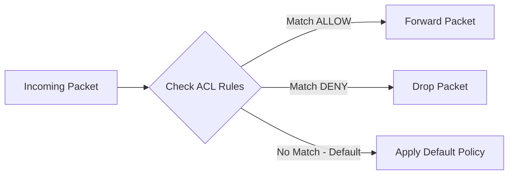
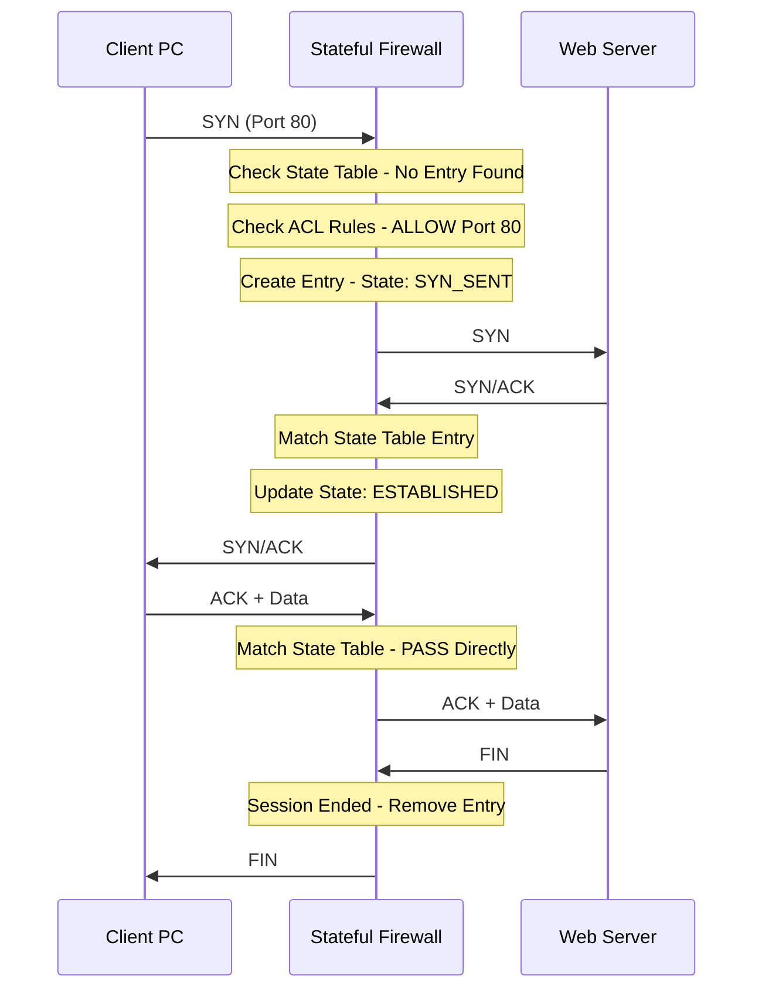
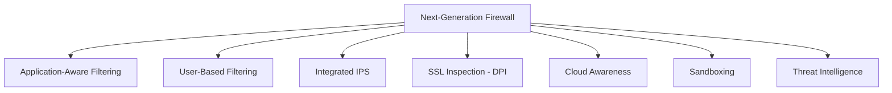

> **الهدف من الـ Section ده:**  
> بيشرح أنواع الـ Firewalls المختلفة (Stateless، Stateful، وNGFW)، ويفهمك الفرق بينهم من حيث طريقة الفحص، مستوى الأمان، وقدرتهم على التعامل مع التهديدات الحديثة.
---

## Table of Contents

- [Stateless Firewall (Packet Filtering)](#stateless-firewall-packet-filtering)
- [Stateful Firewall](#stateful-firewall)
- [Next-Generation Firewall (NGFW)](#next-generation-firewall-ngfw)
- [Comparison: All Firewall Types](#comparison-all-firewall-types)
- [Summary](#summary)

---


## Stateless Firewall (Packet Filtering)

الـ **Stateless Firewall** هو أبسط نوع من الـ Firewalls — وممكن حتى الـ **Router** العادي يعمل دور الـ Stateless Firewall لما نحط عليه Packet Filtering Rules.

**خصائصه:**

- الـ Rules بتُسمى **ACL (Access Control List)**
- بيفلتر على مستوى الـ Layer 3 (IP) والـ Layer 4 (TCP/UDP Ports)
- كل Packet بيتعامل معاه **باستقلالية تامة** — مفيش أي تتبع للـ Session



> [!NOTE]
> الـ Stateless Firewall **مبيحفظش** أي معلومة عن الـ Connections اللي عدت — كل Packet بيتحكم فيه لوحده بشكل مستقل تماماً عن اللي قبله.

**المزايا:**

- سريع جداً في المعالجة
- استهلاك موارد منخفض
- إعداد بسيط

**العيوب:**

- مفيش Session Awareness
- مش قادر يميز الـ Legitimate Traffic من الـ Spoofed Packets
- مستوى أمان أقل مقارنةً بالأنواع الأخرى

---

## Stateful Firewall

الـ **Stateful Firewall** هو الأكثر شيوعاً في الوقت الحالي — وبيتميز بقدرته على **تتبع الـ Sessions** عن طريق جدول اسمه **State Table**.

**الـ State Table:**

الـ Stateful Firewall بيحتفظ بجدول بيتتبع فيه كل Connection:

| Src IP | Src Port | Dst IP | Dst Port | Protocol | State |
|--------|----------|--------|----------|----------|-------|
| 10.0.1.5 | 54236 | 93.184.216.34 | 80 | TCP | SYN_SENT |
| 10.0.1.5 | 54236 | 93.184.216.34 | 80 | TCP | ESTABLISHED |

**إزاي بيشتغل — TCP 3-Way Handshake:**



**خطوات تفصيلية:**

1. الـ PC بيبعت **SYN Packet** للـ Port 80
2. الـ Firewall بيبص على الـ **State Table** — مش لاقي أي Entry (Connection جديد)
3. بيروح يبص على الـ **ACL Rules** — لاقي Rule بيسمح بالـ Port 80
4. بيعمل **Entry جديد** في الـ State Table بـ State = `SYN_SENT`، وبيسمح للـ Packet يعدي
5. الـ Server برد بـ **SYN/ACK** — الـ Firewall بيطابق مع الـ State Table ويحدّث الـ State لـ `ESTABLISHED`
6. من دلوقتي كل الـ Packets بتمشي عن طريق الـ **State Table مباشرة** — مش بتعدي على الـ ACL Rules تاني

> [!IMPORTANT]
> في الـ Stateful Firewall: **أول Packet بس** هو اللي بيتفحص بالـ ACL Rules — باقي الـ Packets بتاعة نفس الـ Session بتتحكم عن طريق الـ State Table مباشرة. ده بيحسّن الـ Performance جداً.

> [!NOTE]
> لما الـ Firewall يشوف **FIN** أو **RST Packet**، هيعرف إن الـ Session خلص وهيمسح الـ Entry من الـ State Table أوتوماتيك.

**حماية من الـ Random Packets:**

فرضاً جه **ACK Packet عشوائي** للشبكة مش متعلق بأي Connection حقيقي:

- **Stateless:** ممكن يسمح له يعدي لأنه مش بيتحقق من الـ Session
- **Stateful:** هيبص في الـ State Table، مش هيلاقي Entry، وهيمسح الـ Packet فوراً ✅

---

## Next-Generation Firewall (NGFW)

الـ **NGFW** هو Firewall من الجيل الجديد — بيجمع كل قدرات الـ Stateful Firewall مع قدرات أمنية متقدمة في جهاز واحد.

**المشكلة مع الـ Traditional Firewall:**

الـ Traditional Firewall بيشتغل على قاعدة بسيطة:

```
IP Address + Port Number → ALLOW or DENY
```

المشكلة: الـ Hackers بيقدروا يتخطوا الـ Rules بسهولة باستخدام الـ Ports المسموح بيها.

**مثال:** Port 443 (HTTPS) مسموح بيه — ممكن أي Application يستخدمه حتى لو ضار.

---

**قدرات الـ NGFW:**



**1. Application-Aware Filtering**

بيعرف الـ Application الحقيقي حتى لو أكتر من Application بيستخدم نفس الـ Port:

```
Port 443:
  ├── Facebook   → BLOCKED
  ├── Gmail      → ALLOWED
  └── TikTok     → BLOCKED
```

**2. User-Based Filtering**

بيتحكم في الوصول بناءً على هوية المستخدم مش بس الـ IP:

```
Ahmed (Marketing Dept)  → Facebook: ALLOWED
Finance Server          → Facebook: BLOCKED
```

بيتكامل مع **Active Directory** لمعرفة هوية المستخدمين.

**3. Integrated IPS**

بيحلل الـ Traffic المشبوه ويوقف الهجمات **في Real-Time** — مش بس بيعمل Alerts زي الـ Traditional IDS.

**4. SSL Inspection**

بيفك تشفير الـ Encrypted Traffic ويفحصه (DPI) — لأن الـ Attackers بيخبّوا الـ Malware جوه الـ HTTPS.

**5. Sandboxing**

بيختبر الـ Suspicious Files في بيئة معزولة قبل ما يسمح لها بالدخول للشبكة.

> [!TIP]
> الـ NGFW قلّل الحاجة لأجهزة أمنية منفصلة — بدل ما يكون عندك Firewall + IDS/IPS + Application Control كلها منفصلة، الـ NGFW بيجمعهم كلهم في جهاز واحد.

---

## Comparison: All Firewall Types

| الميزة | Stateless | Stateful | NGFW |
|--------|-----------|----------|------|
| فلترة بالـ IP/Port | ✅ | ✅ | ✅ |
| تتبع الـ Sessions | ❌ | ✅ | ✅ |
| حماية من Spoofed Packets | ❌ | ✅ | ✅ |
| فلترة بالـ Application | ❌ | ❌ | ✅ |
| فلترة بالـ User Identity | ❌ | ❌ | ✅ |
| Integrated IPS | ❌ | ❌ | ✅ |
| SSL Inspection (DPI) | ❌ | ❌ | ✅ |
| Cloud Awareness | ❌ | ❌ | ✅ |
| الـ Performance | عالي | عالي | متوسط (بسبب المعالجة الإضافية) |
| مستوى الأمان | أساسي | متوسط | متقدم |
| الاستخدام الشائع | Routers بسيطة | بيئات عامة | بيئات Enterprise |

---

## Summary

- الـ **Stateless Firewall** بيعامل كل Packet بشكل مستقل بدون أي تتبع للـ Sessions — ده بيخليه أسرع لكن أقل أماناً لأنه ممكن يتخدع بـ Spoofed Packets.

- الـ **Stateful Firewall** بيتتبع الـ Sessions في الـ **State Table**، وبيسمح بس للـ Traffic اللي عنده Session حقيقي — أول Packet بيتفحص بالـ ACL، والباقي بيعدي عن طريق الـ State Table مباشرة.

- الـ **NGFW** هو الجيل الأحدث — بيضم Firewall + IPS + Application Control + User Identity + SSL Inspection في جهاز واحد، وبيقدر يقول "امنع Facebook لـ Ahmed بس اسمح لـ Gmail" على نفس الـ Port.
