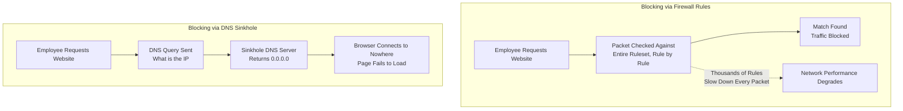

| Topic | Level | Reading Time | Prerequisites |
|---|---|---|---|
| Outbound Traffic Control and DNS Sinkholes | Intermediate | ~18 min | Basic understanding of firewalls, firewall rules, and how DNS resolves domain names |

> **الهدف من الـ Section ده:**  
> هتفهم إن الفايروول مش بس بيمنع هجمات جاية من برة، لكن كمان بيتحكم في حركة المرور الخارجة (outbound)، وهتشوف ليه إضافة آلاف القواعد للفايروول بتبطّئ الشبكة، وإزاي حل أذكى اسمه **DNS Sinkhole** بيحل نفس المشكلة من غير ما يأثر على الأداء.

## Learning Objectives

By the end of this section, you will be able to:

- Explain how firewalls control **outgoing (outbound) traffic**, not just incoming traffic.
- Describe the **whitelist approach** (default deny for outbound) and how it differs from blocking specific sites.
- Explain why adding thousands of firewall rules slows down an entire network.
- Define a **DNS Sinkhole** and explain how it blocks access to a website without adding firewall rules.
- Explain how sinkholes are also used to neutralize malware trying to reach its **command-and-control (C2)** server.

## Table of Contents

- [Firewalls Aren't Just About Keeping Attackers Out](#firewalls-arent-just-about-keeping-attackers-out)
- [Blocking Specific Websites](#blocking-specific-websites)
- [Going Further: The Whitelist Approach](#going-further-the-whitelist-approach)
- [The Catch: Every Rule Slows the Firewall Down](#the-catch-every-rule-slows-the-firewall-down)
- [The Real-World Problem This Creates](#the-real-world-problem-this-creates)
- [The Sinkhole: A Smarter Solution](#the-sinkhole-a-smarter-solution)
- [How a Sinkhole Actually Works](#how-a-sinkhole-actually-works)
- [Why This Is Smarter Than Firewall Rules](#why-this-is-smarter-than-firewall-rules)
- [Sinkholes Against Malware](#sinkholes-against-malware)
- [Firewall Rules vs. Sinkhole Diagram](#firewall-rules-vs-sinkhole-diagram)
- [Career Connection](#career-connection)
- [Key Terms Glossary](#key-terms-glossary)
- [Summary](#summary)

## Firewalls Aren't Just About Keeping Attackers Out

لحد دلوقتي، إحنا اتكلمنا عن الفايروول وهو بيحظر حركة المرور الداخلة (**incoming traffic**)، يعني بيحميك من العالم الخارجي.

لكن الفايروول كمان يقدر يتحكم في حركة المرور **الخارجة (outgoing traffic)**، يعني إيه بالظبط موظفينك مسموحلهم يوصلوله.

## Blocking Specific Websites

الشركة تقدر تستخدم الفايروول عشان تمنع الموظفين من زيارة مواقع معينة، زي السوشيال ميديا، مواقع القمار (**gambling sites**)، أو دومينات معروف عنها إنها ضارة (**known malicious domains**)، إلخ.

## Going Further: The Whitelist Approach

المؤسسة تقدر تروح أبعد من كده: **تحظر الإنترنت بالكامل افتراضيًا**، وتسمح بس بالمواقع المرتبطة بالعمل اللي الموظفين فعليًا محتاجينها.

الأسلوب ده بيتسمى **"default deny"** أو **whitelist approach**.

> [!NOTE]
> ده نفس فكرة الـ **Default Deny** اللي درسناها قبل كده بخصوص حركة المرور الداخلة، لكن هنا بيتم تطبيقه على حركة المرور الخارجة: بدل ما تحدد إيه اللي ممنوع، إنت بتحدد بس إيه اللي مسموح.

## The Catch: Every Rule Slows the Firewall Down

الحيلة (**catch**) هنا: كل rule واحدة إنت بتضيفها للفايروول بتخليه **أبطأ**.

كل packet بيعدي لازم **يتفحص ضد قائمة القواعد بالكامل**، rule واحدة في المرة، لحد ما يلاقي تطابق.

> [!WARNING]
> تخيل أمن مطار (**airport security**) لازم يفحص شنطة كل راكب مقابل قائمة فيها 10,000 rule، واحدة واحدة، حتى لو إنت محتاج بس تعرف 3 حاجات، العملية بتبقى أبطأ وأبطأ كل ما كتاب القواعد بيكبر.

## The Real-World Problem This Creates

لو حاولت تحظر آلاف المواقع باستخدام firewall rules بس، شبكتك كلها هتبقى أبطأ لكل حد.

> [!IMPORTANT]
> دي المشكلة الحقيقية اللي بتوصلنا لحل أذكى: **الـ Sinkhole**.

## The Sinkhole: A Smarter Solution

بدل ما تكوّم آلاف الـ rules من نوع "امنع الموقع ده" على الفايروول الرئيسي بتاعك، تقدر تحل نفس المشكلة باستخدام **سيرفر الـ DNS** بتاع الشركة بدل كده.

فتكر: قبل ما جهازك يقدر يزور أي موقع، هو الأول بيسأل سيرفر DNS "إيه عنوان الـ IP بتاع الموقع ده؟"، ودي بالظبط إزاي تصفح الويب دايمًا بيبدأ.

## How a Sinkhole Actually Works

الـ **Sinkhole** بيشتغل عن طريق ضبط سيرفر الـ DNS بتاع الشركة إنه **يكذب عن قصد**: لأي موقع محظور، بدل ما يرجّع عنوان الـ IP الحقيقي، هو بيرجّع `0.0.0.0` (عنوان طريق مسدود، مايوديش لحته).

فلما موظف يكتب موقع محظور، جهازه بيسأل "إيه الـ IP بتاع الموقع ده؟"، سيرفر الـ DNS بيرد `0.0.0.0`، والمتصفح بيحاول يتصل بمفيش حاجة، الصفحة ببساطة بتفشل تحمل.

> [!NOTE]
> ده زي عامل تليفونات، لما تطلب منه رقم تليفون محتال، هو بس بيقولك "الرقم ده مش موجود"، إنت أصلًا محتطلبش الرقم ده أبدًا.

## Why This Is Smarter Than Firewall Rules

ليه الحل ده أذكى من قواعد الفايروول؟ استعلامات الـ **DNS** هي خطوة واحدة سريعة أصلًا بتحصل لكل زيارة موقع في كل الأحوال، إنت مش بتضيف شغل فحص إضافي لكل packet، إنت بس بتغيّر **إجابة واحدة** في أول العملية.

> [!IMPORTANT]
> الفرق الجوهري إن قواعد الفايروول بتضيف عبء فحص على **كل packet** يعدي عبر الفايروول، بينما الـ Sinkhole بيغيّر بس **إجابة DNS واحدة** في خطوة أصلًا موجودة وسريعة. النتيجة النهائية واحدة (الموقع مش بيفتح)، لكن التكلفة على أداء الشبكة مختلفة تمامًا.

## Sinkholes Against Malware

الـ Sinkholes كمان بتُستخدم على نطاق واسع من طرف فرق الأمان عشان توقف الـ **malware**: لو فيروس بيحاول "يكلم بيته" (**phone home**) لسيرفر الـ **command-and-control (C2)** بتاعه، سجل الـ DNS الخاص بالـ sinkhole بيبعت حركة المرور دي لمكان مالوش وجود، وده بيحيّد (**neutralizes**) الاتصال بالكامل.

> [!TIP]
> استخدام الـ Sinkhole ضد الـ Malware مثال ممتاز على إزاي أداة الأصل مصممة لحاجة (منع دخول موظفين لمواقع معينة) ممكن تتبنى وتُستخدم كأداة دفاعية أوسع بكتير في مجال الأمن السيبراني.

## Firewall Rules vs. Sinkhole Diagram

المخطط التالي بيقارن بين مسار الحظر باستخدام قواعد الفايروول التقليدية، ومسار الحظر باستخدام الـ DNS Sinkhole:

## Career Connection

فهم التحكم في حركة المرور الخارجة والـ DNS Sinkholes له تطبيقات مباشرة في مسارات مهنية متعددة:

- في مجال **SOC**، مراقبة سجلات الـ DNS sinkhole بتساعد في اكتشاف أجهزة مصابة بـ malware بتحاول تتواصل مع سيرفرات C2.
- في مجال **Network Security Engineering**، تصميم استراتيجية متوازنة بين قواعد الفايروول والـ DNS sinkholes جزء أساسي من الحفاظ على أداء الشبكة مع تطبيق سياسات أمنية صارمة.
- في مجال **Threat Intelligence**، تحديث قوائم الدومينات المحظورة في الـ sinkhole بناءً على معلومات تهديدات جديدة جزء أساسي من العمل اليومي.
- في مجال **GRC**، تطبيق سياسة **whitelist** لحركة المرور الخارجة جزء من متطلبات الامتثال في بيئات عالية الحساسية.

## Key Terms Glossary

| Term | Definition |
|---|---|
| **Outbound Traffic** | حركة المرور الخارجة من الشبكة الداخلية إلى الإنترنت أو شبكات أخرى. |
| **Whitelist Approach** | سياسة تحظر كل حركة المرور افتراضيًا ولا تسمح إلا بما تم تحديده صراحةً كمسموح. |
| **DNS Sinkhole** | تقنية تعتمد على تعديل استجابات DNS لتوجيه المواقع المحظورة إلى عنوان لا وجود له. |
| **0.0.0.0** | عنوان IP يُستخدم كـ "طريق مسدود"، لا يشير إلى أي جهاز حقيقي. |
| **Command-and-Control (C2)** | سيرفر يستخدمه المهاجمون للتحكم في الأجهزة المصابة بالـ malware عن بعد. |
| **Phone Home** | مصطلح يشير إلى محاولة برمجية خبيثة التواصل مع سيرفر التحكم الخاص بها. |

## Summary

- الفايروول مش بس بيمنع هجمات جاية من برة، هو كمان يقدر يتحكم في حركة المرور **الخارجة (outbound)**، يعني إيه اللي موظفينك مسموحلهم يوصلوله.
- المؤسسات تقدر تمنع مواقع محددة، أو تروح لأسلوب **whitelist**: حظر كل الإنترنت افتراضيًا والسماح بس بالمواقع المرتبطة بالعمل.
- كل rule إضافية في الفايروول بتبطّئ فحص كل packet، وده بيخلي محاولة حظر آلاف المواقع باستخدام firewall rules بس تبطّئ الشبكة كلها.
- **DNS Sinkhole** هو حل أذكى: بيضبط سيرفر الـ DNS إنه يرجّع `0.0.0.0` (عنوان مايوديش لحته) بدل عنوان الـ IP الحقيقي لأي موقع محظور.
- الـ Sinkhole أذكى من قواعد الفايروول لأن استعلام الـ DNS خطوة سريعة وموجودة أصلًا لكل زيارة موقع، إنت بس بتغيّر إجابة واحدة بدل ما تضيف عبء فحص على كل packet.
- الـ Sinkholes كمان بتُستخدم بشكل واسع لتحييد الـ **malware** اللي بيحاول يتواصل مع سيرفر الـ **command-and-control (C2)** بتاعه.

