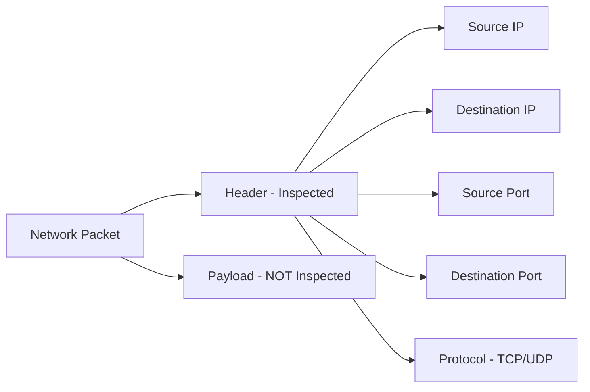

> **الهدف من الـ Section ده:**  
> بيشرح الفرق بين الـ Shallow Packet Inspection والـ Deep Packet Inspection (DPI)، ويفهمك إمتى الفحص السطحي يكفي وإمتى تحتاج تحليل عميق للـ Payload لاكتشاف التهديدات المتقدمة.
---

## Table of Contents

- [Shallow Packet Inspection](#shallow-packet-inspection)
- [Deep Packet Inspection (DPI)](#deep-packet-inspection-dpi)

---

## Shallow Packet Inspection

الـ Firewall في الوضع العادي بيبص بس على الـ **Header** بتاع الـ Packet — يعني:



ده بيحصل على مستوى:

- **Layer 3 (Network):** Source IP، Destination IP
- **Layer 4 (Transport):** Source Port، Destination Port، Protocol

---

## Deep Packet Inspection (DPI)

الـ **DPI** بيعمل كل حاجة الـ Shallow بيعملها + بيفتح الـ Packet ويبص على الـ **Payload** نفسه.

**مثال عملي — مشكلة SMBv1:**

فرضاً عندنا الـ Rule دي:

```
ALLOW TCP 10.0.10.0/24 → 10.0.30.10 PORT 445
```

الـ Port 445 هو بتاع الـ **SMB Protocol** — وفيه نسخة قديمة اسمها **SMBv1** كانت وراء هجوم **WannaCry Ransomware** الشهير.

| الإمكانية | Shallow Inspection | Deep Packet Inspection (DPI) |
|-----------|-------------------|------------------------------|
| فلترة بالـ IP | ✅ | ✅ |
| فلترة بالـ Port | ✅ | ✅ |
| فلترة بالـ Protocol | ✅ | ✅ |
| فلترة بـ Application Version | ❌ | ✅ |
| رؤية محتوى الـ Payload | ❌ | ✅ |

> [!TIP]
> الـ DPI هو اللي بيخليك تقدر تقول مثلاً "اسمح بـ SMBv2 وـ SMBv3 بس، وامنع SMBv1" — حاجة الـ Shallow Inspection مش قادر يعملها لأنه مبيبصش على الـ Payload.

---

## Summary 
- الـ **Shallow Packet Inspection** بيشوف بس الـ Headers (IP, Port, Protocol) — وده كافي في حالات كتير لكنه مش شايف الـ Payload.

- الـ **Deep Packet Inspection (DPI)** بيتعمق في الـ Data نفسه وبيقدر يكتشف أي Application أو Version بيتستخدم — زي التفريق بين SMBv1 الخطير وـ SMBv2.
