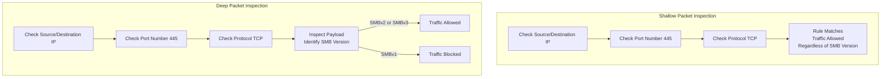

| Topic | Level | Reading Time | Prerequisites |
|---|---|---|---|
| Deep Packet Inspection (DPI) | Intermediate | ~18 min | Basic understanding of firewalls, firewall rules, TCP/IP, and port numbers |

 > **الهدف من الـ Section ده:**  
>  هتفهم الفرق بين الفحص السطحي (Shallow Inspection) اللي الفايروول العادي بيعمله، والفحص العميق (Deep Packet Inspection)، وهتشوف مثال حقيقي بيوضح ليه بروتوكول زي SMB محتاج فحص أعمق من مجرد النظر على رقم البورت.


## Learning Objectives

By the end of this section, you will be able to:

- Explain how a normal firewall performs **Shallow Packet Inspection** by reading only the header of a packet.
- List the three main pieces of information a shallow inspection checks: source/destination IP, port numbers, and protocol.
- Define **Deep Packet Inspection (DPI)** and explain how it goes beyond the header to examine the actual payload.
- Explain, using a real SMB example, why checking a port number alone is not always enough to make a safe security decision.
- Connect this concept to a real-world incident: the **WannaCry** ransomware and the SMBv1 vulnerability.

## Table of Contents

- [Why Start With the Normal Way](#why-start-with-the-normal-way)
- [Shallow Packet Inspection: Reading the Label](#shallow-packet-inspection-reading-the-label)
- [What Exactly Does Shallow Inspection Check](#what-exactly-does-shallow-inspection-check)
- [The Blind Spot in Shallow Inspection](#the-blind-spot-in-shallow-inspection)
- [Deep Packet Inspection: Opening the Box](#deep-packet-inspection-opening-the-box)
- [A Real Example: The SMB Problem](#a-real-example-the-smb-problem)
  - [Understanding the Rule](#understanding-the-rule)
  - [The Hidden Risk Behind Port 445](#the-hidden-risk-behind-port-445)
  - [What Is SMB, Exactly](#what-is-smb-exactly)
- [How DPI Solves the Problem](#how-dpi-solves-the-problem)
- [Shallow vs. Deep Inspection Diagram](#shallow-vs-deep-inspection-diagram)
- [Career Connection](#career-connection)
- [Key Terms Glossary](#key-terms-glossary)
- [Summary](#summary)

## Why Start With the Normal Way

قبل ما نفهم **Deep Packet Inspection (DPI)**، لازم الأول نفهم الفايروول العادي بيعمل إيه بالظبط، لأن DPI فعليًا **مبني فوق (built on top of)** السلوك الأساسي ده.

## Shallow Packet Inspection: Reading the Label

الفايروولات العادية "كسولة" شوية، بس بشكل إيجابي، الكسل ده هو اللي بيخليها سريعة. هي **مبتقراش المحتوى الفعلي (payload)** بتاع اللي بيتبعت. هي بس بتبص على الـ **header**.

> [!NOTE]
> فكّر في الموضوع زي ملصق الشحن (**shipping label**) اللي على الصندوق. الفايروول بيقرأ الملصق (مين المرسل، مين المستقبل، نوع الطرد)، لكن أبدًا مش بيفتح الصندوق يشوف جواه فعليًا إيه.

## What Exactly Does Shallow Inspection Check

الفحص السطحي بيتحقق من:

- **Source and Destination IP**: حركة المرور دي جاية منين، ورايحة فين؟
- **Port Numbers**: الخدمة دي بتحاول توصل لإيه؟ (زي بورت 80 لتصفح الويب، بورت 22 لـ SSH، إلخ).
- **Protocol**: ده حركة مرور TCP ولا UDP؟

> [!TIP]
> تخيل حارس أمن (**security guard**) عند مدخل مبنى بيتحقق بس من كارنيه هويتك (**ID badge**) وأي زرار دور إنت بتضغطه في الأسانسير. هو مش بيفتش الشنطة بتاعتك. ده بالظبط الفحص السطحي، تشيك على العنوان (label)، مش المحتوى الفعلي.

## The Blind Spot in Shallow Inspection

الاسم اللي لازم تفتكره: الشكل الأساسي ده من الفحص بيتسمى **Shallow Packet Inspection**، أو أحيانًا بيتسمى بس **Packet Filtering**.

هو سريع، بسيط، وشغال كويس لمعظم القواعد اليومية العادية، لكنه عنده **نقطة عمياء (blind spot)** واحدة مهمة جدًا، وده اللي بيوصلنا لموضوع **Deep Packet Inspection**.

> [!IMPORTANT]
> النقطة العمياء هي إن الفحص السطحي بيتحقق بس من "الغلاف الخارجي" لحركة المرور، وده معناه إنه مش قادر يميّز بين استخدامات مختلفة تمامًا لنفس البورت أو البروتوكول، حتى لو أحد الاستخدامات دي خطير جدًا.

## Deep Packet Inspection: Opening the Box

**Deep Packet Inspection (DPI)** بيعمل كل حاجة الفحص السطحي بيعملها، بيتحقق من الـ IP، البورت، والبروتوكول، لكن بعد كده بيروح خطوة أبعد.

بمجرد ما الـ header يطابق الـ rule، الـ DPI فعليًا **بيفتح الصندوق** ويشوف جواه إيه المحتوى الفعلي اللي بيتبعت.

## A Real Example: The SMB Problem

### Understanding the Rule

نتخيل الـ rule التالية:

```
ALLOW TCP 10.0.10.0/24 → 10.0.30.10 PORT 445
```

**المعنى**: اسمح لأي جهاز في قطاع الشبكة `10.0.10.0/24` إنه يكلم السيرفر `10.0.30.10` على بورت `445`.

### The Hidden Risk Behind Port 445

المشكلة إن بورت 445 بس بيقولنا إن حركة مرور من نوع **SMB** بتُستخدم، لكنه مش بيقولنا **أي نسخة من SMB** بالظبط بتُستخدم.

> [!WARNING]
> **SMBv1** هي نسخة قديمة وغير آمنة من SMB، وهي فعليًا نفس الثغرة البروتوكولية اللي استغلها الـ **WannaCry ransomware** بشكل عالمي في سنة 2017. فمجرد السماح بـ TCP 445 ممكن نظريًا يسمح كمان بمرور حركة مرور SMBv1.

### What Is SMB, Exactly

**SMB (Server Message Block)** هو بروتوكول شبكة بيُستخدم أساسًا في بيئات Windows لمشاركة الملفات، المجلدات، الطابعات، وموارد تانية عبر الشبكة.

هو عادةً بيستخدم **TCP port 445**، والتطبيقات الأقدم من SMB كانت ممكن تستخدم NetBIOS over TCP على بورت 139.

مثال عملي: لما إنت بتوصل لـ `\\Server\SharedFolder` من جهاز Windows، بروتوكول SMB هو اللي بيتحقق من هويتك (**authenticate**) ويوفرلك الوصول للمورد المشترك ده.

## How DPI Solves the Problem

**Deep Packet Inspection** بيروح أبعد من الـ headers وبيفحص **payload** الحزمة عشان يحدد معلومات عن التطبيق والبروتوكول المستخدم فعليًا.

وبالتالي، الـ DPI يقدر يحدد نسخة الـ SMB بالظبط، ويسمح أو يمنع حركة المرور بناءً على معلومات دقيقة على مستوى التطبيق (**application-level information**).

> [!IMPORTANT]
> ده معناه إن المؤسسة تقدر، مثلًا، تسمح بـ **SMBv2** و **SMBv3** (النسخ الأحدث والأكتر أمانًا)، بينما تمنع **SMBv1** تحديدًا، حتى لو الاتنين بيستخدموا نفس البورت 445 بالظبط. الفحص السطحي مستحيل يقدر يميّز بينهم، لكن الـ DPI يقدر.

## Shallow vs. Deep Inspection Diagram

المخطط التالي بيوضح الفرق بين مسار القرار في الفحص السطحي والفحص العميق لنفس حركة المرور:



## Career Connection

فهم الفرق بين الفحص السطحي والفحص العميق له تطبيقات مباشرة في مسارات مهنية متعددة:

- في مجال **SOC**، فهم إن الفايروول العادي مش بيميّز بين نسخ البروتوكول المختلفة بيساعد في تفسير ليه بعض التهديدات عدّت رغم وجود rules تبدو صحيحة.
- في مجال **Network Security Engineering**، تفعيل واستخدام أجهزة تدعم **DPI** (زي Next-Generation Firewalls) جزء أساسي من تصميم دفاع متعدد الطبقات.
- في مجال **Vulnerability Management**، معرفة ثغرات بروتوكولات معينة (زي SMBv1) بتساعد في تحديد أولوية القواعد اللي محتاجة DPI للتحقق منها.

## Key Terms Glossary

| Term | Definition |
|---|---|
| **Shallow Packet Inspection** | فحص أساسي يعتمد فقط على قراءة رأس الحزمة (header): عنوان المصدر والوجهة، البورت، والبروتوكول. |
| **Deep Packet Inspection (DPI)** | فحص متقدم يذهب إلى ما هو أبعد من الرأس ويفحص محتوى الحزمة (payload) الفعلي. |
| **Header** | الجزء من الحزمة الذي يحتوي على معلومات التوجيه الأساسية مثل عناوين IP والبورتات. |
| **Payload** | المحتوى الفعلي المنقول داخل الحزمة، بخلاف معلومات الرأس. |
| **SMB (Server Message Block)** | بروتوكول شبكة يُستخدم لمشاركة الملفات والموارد، شائع في بيئات Windows. |
| **SMBv1** | نسخة قديمة وغير آمنة من بروتوكول SMB، مرتبطة بثغرة استغلها WannaCry ransomware. |
| **WannaCry** | هجوم ransomware عالمي في عام 2017 استغل ثغرة في بروتوكول SMBv1. |

## Summary

- الفايروول العادي بيعمل **Shallow Packet Inspection**، بيقرأ بس الـ header (عنوان المصدر والوجهة، البورت، والبروتوكول)، من غير ما يشوف محتوى الحزمة الفعلي.
- الفحص السطحي زي حارس أمن بيتحقق من كارنيه الهوية بس من غير ما يفتش الشنطة، سريع وبسيط، لكن عنده نقطة عمياء.
- النقطة العمياء واضحة في مثال **SMB**: بورت 445 بيقولنا إن SMB بيُستخدم، لكن مش بيوضح أي نسخة، وده ممكن يسمح مرور **SMBv1** الضعيفة، نفس الثغرة اللي استغلها **WannaCry** في 2017.
- **Deep Packet Inspection (DPI)** بيعمل كل حاجة الفحص السطحي بيعملها، لكن كمان بيفتح ويفحص محتوى الحزمة (**payload**) عشان يحدد معلومات دقيقة على مستوى التطبيق.
- بفضل DPI، المؤسسة تقدر تسمح بـ **SMBv2** و **SMBv3** الأكتر أمانًا، بينما تمنع **SMBv1** تحديدًا، حتى لو الاتنين بيستخدموا نفس البورت بالظبط.

