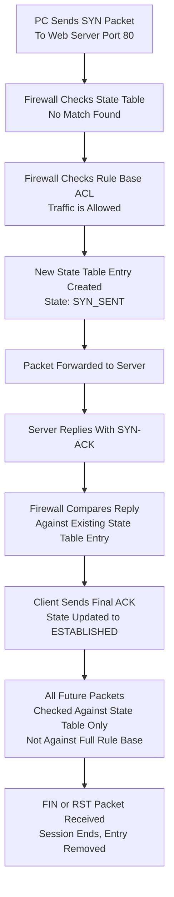

| Topic | Level | Reading Time | Prerequisites |
|---|---|---|---|
| Stateless vs. Stateful Firewalls | Intermediate | ~25 min | Basic understanding of firewalls, firewall rules, and the TCP 3-Way Handshake |

> **الهدف من الـ Section ده:**  
>  هتفهم الفرق الجوهري بين الفايروول اللي معندوش ذاكرة (**Stateless**) واللي بيتتبع الجلسات بالكامل (**Stateful**)، وهنمشي خطوة بخطوة على مثال حقيقي كامل يوضح إزاي الفايروول الـ Stateful بيدير الـ state table من أول SYN لحد نهاية الاتصال.

## Learning Objectives

By the end of this section, you will be able to:

- Define a **Stateless Firewall** and explain why it treats every packet as a stranger.
- Explain what a **Stateful Firewall** is and how it uses a **State Table** to track entire sessions.
- Trace how a state table entry evolves through the stages of a TCP connection: `SYN_SENT → ESTABLISHED`.
- Explain the specific security benefit stateful firewalls provide that stateless firewalls miss.
- Walk through a complete real-world connection step by step, from the initial SYN packet to the shortcut used for all subsequent packets.

## Table of Contents

- [Stateless Firewalls: The Basics](#stateless-firewalls-the-basics)
- [The Key Concept: No Memory](#the-key-concept-no-memory)
- [What a Stateless Firewall Can Actually Check](#what-a-stateless-firewall-can-actually-check)
- [The ACL: Naming the Rule List](#the-acl-naming-the-rule-list)
- [The Limitation of Stateless Firewalls](#the-limitation-of-stateless-firewalls)
- [Stateful Firewalls: Introducing Memory](#stateful-firewalls-introducing-memory)
- [The State Table: How the Firewall Remembers](#the-state-table-how-the-firewall-remembers)
- [Watching the Conversation Evolve](#watching-the-conversation-evolve)
- [Why This Matters: The Security Benefit](#why-this-matters-the-security-benefit)
- [Stateless vs. Stateful: In Short](#stateless-vs-stateful-in-short)
- [Cleaning Up the State Table](#cleaning-up-the-state-table)
- [Full Step-by-Step Walkthrough](#full-step-by-step-walkthrough)
  - [The Request Begins](#the-request-begins)
  - [Checking the State Table First](#checking-the-state-table-first)
  - [Creating the Session](#creating-the-session)
  - [Completing the Handshake](#completing-the-handshake)
  - [The Big Shortcut](#the-big-shortcut)
- [Connection Lifecycle Diagram](#connection-lifecycle-diagram)
- [Career Connection](#career-connection)
- [Key Terms Glossary](#key-terms-glossary)
- [Summary](#16-summary)

## Stateless Firewalls: The Basics

**Stateless Firewall** هو أبسط نوع فايروول موجود، من غير أي رتوش إضافية (**no-frills**). هو بسيط جدًا لدرجة إن حتى **router** عادي يقدر يتصرف كفايروول لو اتظبط بقواعد فلترة.

## The Key Concept: No Memory

المفهوم الأساسي هنا هو **غياب الذاكرة (no memory)**.

كلمة **Stateless** حرفيًا معناها "من غير حالة"، يعني الفايروول ده معندوش ذاكرة لأي حركة مرور سابقة.

كل packet بيوصل بيتحكم عليه بشكل مستقل تمامًا، وكأنه أول packet شافه الفايروول في حياته، حتى لو ده فعليًا الـ packet رقم 500 في محادثة مستمرة بين جهازين.

> [!NOTE]
> تخيل حارس أمن عنده فقدان ذاكرة (**amnesia**)، كل 5 ثواني بينسى كل حاجة حصلت. حد بيدخل لابس كارنيه زائر، هو بيشيك على الكارنيه، بيسمحله يدخل. الشخص ده بيمشي وبيرجع تاني بعد ثانيتين، الحارس بيشيك على الكارنيه من الأول تاني، لأنه مش فاكر إنه شافه قبل كده. مفيش ذاكرة، مفيش سياق، مفيش "استنى، أنا سمحتله يدخل قبل كده وهو بس راجع لعربيته."

## What a Stateless Firewall Can Actually Check

الفايروول الـ Stateless بيبص بس على **Layer 3 (IP layer)** و **Layer 4 (Transport layer)** headers.

ده بيشمل: عنوان IP المصدر، عنوان IP الوجهة، بورت المصدر، بورت الوجهة، والبروتوكول. هي فعليًا نفس قدرة الفلترة اللي شرحناها قبل كده تحت اسم **Shallow Inspection**.

## The ACL: Naming the Rule List

قائمة القواعد المستخدمة في الفلترة دي ليها اسم: **ACL — Access Control List**.

المصطلح ده شائع جدًا، خصوصًا مع الـ routers (زي Cisco routers مثلًا، اللي بتستخدم ACLs بكثرة).

> [!IMPORTANT]
> الفايروولات الـ Stateless سريعة وبسيطة، لكنها بتتعامل مع كل packet كأنه غريب، حتى الـ packets اللي واضح إنها جزء من محادثة اتسمح بيها فعليًا من كام ثانية. القيد ده بالظبط اللي الفايروولات الـ Stateful اتبنت عشان تحله.

## The Limitation of Stateless Firewalls

بما إن كل packet بيتحكم عليه لوحده، الفايروول الـ Stateless مقدرش يميّز إذا كان الـ packet ده فعليًا جزء من محادثة شرعية موافق عليها قبل كده، أو حركة مرور عشوائية مش مرتبطة بأي حاجة.

## Stateful Firewalls: Introducing Memory

على عكس الحارس فاقد الذاكرة اللي شرحناه في الفايروول الـ Stateless، الفايروول الـ **Stateful** فعليًا **بيفتكر**.

عنده كل نفس القدرات الأساسية للفايروول الـ Stateless (يتحقق من IP، بورت، بروتوكول)، بالإضافة لحاجة أذكى بكتير: هو بيتتبع **جلسات كاملة (entire sessions)**، مش بس packets معزولة فردية.

> [!IMPORTANT]
> ده بالظبط السبب اللي بيخلي الفايروولات الـ Stateful هي **النوع الأكثر شيوعًا** المستخدم في المؤسسات الحقيقية النهارده.

## The State Table: How the Firewall Remembers

إزاي الفايروول بيفتكر؟ عن طريق حاجة اسمها **State Table**.

تخيلها زي دفتر يومية (**logbook**) أو قائمة ضيوف بتتبع كل محادثة نشطة بتحصل عبر الفايروول في الوقت الفعلي.

**مثال**: لما الـ client عايز يبدأ اتصال، هو بيبعت **SYN packet** الأول (دي الخطوة الأولى من TCP handshake، أساسًا بيقول "أهلًا، عايز أكلمك"). في اللحظة اللي الفايروول بيشوف فيها الـ SYN packet ده، هو بيعمل سجل (**entry**) جديد في الـ state table عشان يبدأ يتتبع المحادثة دي بالتحديد:

| Src IP | Src Port | Dst IP | Dst Port | State |
|---|---|---|---|---|
| 1.1.1.1 | 54236 | 2.2.2.2 | 80 | SYN_SENT |

## Watching the Conversation Evolve

الـ state table مش ثابت، هو بيتحدث كل ما المحادثة بتتقدم.

اللي بيحصل بعد كده: لما السيرفر يرد بـ **SYN-ACK packet** (الخطوة التانية من الـ handshake)، الفايروول بيحدّث نفس السجل ده عشان يعكس إن الاتصال بيتقدم. بمجرد ما الـ client يبعت الـ **ACK** النهائي ويكتمل الـ TCP 3-way handshake، الفايروول بيغيّر حالة الاتصال لـ **ESTABLISHED**.

دلوقتي الفايروول عارف إن حركة المرور دي بتطابق اتصال TCP اكتمل بنجاح الـ 3-way handshake العادي بتاعه.

## Why This Matters: The Security Benefit

القدرة دي على التتبع بتخلي الفايروولات الـ Stateful تلاحظ حاجة الفايروولات الـ Stateless بتفوّتها تمامًا: **packets عشوائية غير مرغوب فيها من غير جلسة مطابقة (unsolicited packets with no matching session)**.

**مثال**: تخيل شبكتك فجأة استقبلت **ACK packet** عشوائي من العدم، مفيش SYN سابق، مفيش SYN-ACK سابق، مفيش حاجة. ده ممكن يكون مهاجم بيحاول يهرّب حركة مرور، يمسح شبكتك، أو يستغل حاجة.

| نوع الفايروول | رد الفعل تجاه الـ ACK العشوائي |
|---|---|
| **Stateless Firewall** | بيتحقق من الـ header، الـ IP يبان تمام، البورت يبان تمام، البروتوكول يبان تمام، فبيسمح بمروره. مفهوش أي فكرة إن الـ packet ده مش بتاع أي محادثة حقيقية جارية. |
| **Stateful Firewall** | بيتحقق من الـ state table بتاعه الأول، بيلاقي مفيش جلسة نشطة مطابقة لـ ACK packet ده، فبيدرك فورًا إن فيه حاجة غلط ويرفضه (**drops it**). |

> [!IMPORTANT]
> المهاجمين غالبًا بيبعتوا packets غريبة أو خارجة عن التسلسل الطبيعي عشان يفحصوا الشبكات أو يتجاوزوا فلاتر بسيطة، الفايروولات الـ Stateful بتلاحظ ده لأنها عارفة الفرق بين جزء من محادثة حقيقية، وpacket عشوائي بيتظاهر إنه ينتمي ليها.

## Stateless vs. Stateful: In Short

| المعيار | Stateless Firewall | Stateful Firewall |
|---|---|---|
| السلوك الأساسي | يفحص كل packet بشكل مستقل، بدون أي ذاكرة | يتتبع الحالة الكاملة للاتصال ويقرر بناءً على الجلسة كلها |
| القرار مبني على | الـ packet المفرد لوحده | الجلسة (session) بأكملها |
| اكتشاف packets عشوائية | لا يقدر يميزها عن حركة مرور شرعية | يكتشفها فورًا لعدم وجود جلسة مطابقة |

## Cleaning Up the State Table

تفصيلة إضافية مهمة: الفايروولات الـ Stateful كمان بتنضّف نفسها بعد ما تخلص.

لما بيشوف **FIN packet** (طبيعي ومهذب، معناه "أنا خلصت الكلام، سلام")، أو **RST packet** (إعادة ضبط مفاجئة، الاتصال اتنهى بشكل حاد)، الفايروول بيفهم إن الجلسة انتهت وبيشيل السجل ده من الـ state table.

ده بيخلي الجدول نظيف، وبيمنعه من إنه يتملى بمحادثات ميتة ومنتهية.

## Full Step-by-Step Walkthrough

هنتتبع اتصال حقيقي كامل من البداية للنهاية، خطوة بخطوة، وهنوضح بالظبط إيه اللي الفايروول بيعمله في كل مرحلة. ده بالظبط نوع السيناريو اللي محتاج تتخيله في دماغك كـ **SOC Analyst**.

### The Request Begins

**الخطوة 1: الطلب بيبدأ**

جهاز PC عايز يزور موقع إلكتروني، فبيبعت **TCP SYN packet** موجّه لبورت 80 (حركة مرور الويب) على سيرفر ويب خارجي.

**الخطوة 2: الفايروول بيفحص الاتجاه والنية**

الفايروول بيبص على الـ packet ده وبيفهم: "تمام، حركة المرور دي رايحة من **جوه** شبكتنا **لبرة** للإنترنت على بورت 80، ده محاولة تصفح ويب عادية."

### Checking the State Table First

**الخطوة 3: التحقق من الـ state table الأول**

قبل ما يعمل أي حاجة تانية، الفايروول بيتحقق من الـ state table بتاعه: "عندي جلسة نشطة مطابقة لده أصلًا؟" بما إن ده اتصال جديد تمامًا، الإجابة هي "مفيش تطابق موجود"، مفيش حاجة موجودة لسه لمحادثة PC-لسيرفر بالتحديد دي.

**الخطوة 4: الرجوع لقاعدة القواعد الفعلية**

بما إنه مفيش جلسة موجودة، الفايروول دلوقتي بيتحقق من قاعدة القواعد العادية بتاعته (الـ ACL) عشان يشوف: "الـ PC الداخلي ده أصلًا مسموحله يوصل للإنترنت على بورت 80؟" هو بيلاقي rule مطابقة بتقول "أيوه، النوع ده من حركة المرور مسموح بيه."

### Creating the Session

**الخطوة 5: إنشاء الجلسة**

دلوقتي الفايروول بياخد التفاصيل من الـ SYN packet ده (IP المصدر، بورت المصدر، IP الوجهة، بورت الوجهة) وبيعمل سجل جديد تمامًا في الـ state table. الـ packet بعد كده بيتوجّه (**forwarded**) لسيرفر الويب الفعلي.

> [!IMPORTANT]
> لاحظ ترتيب العمليات: الـ state table بيتفحص **الأول**، وبس لو مفيش تطابق، **بعد كده** بيتفحص قاعدة القواعد بالكامل. ده مهم جدًا للأداء، لأن فحص الـ state table أسرع بكتير من تقييم قائمة قواعد كاملة كل مرة.

### Completing the Handshake

**الخطوة 6: السيرفر بيرد**

سيرفر الويب بيرد بـ **SYN-ACK packet**، متوجّه راجع للـ PC الأصلي.

**الخطوة 7: الفايروول بيفحص الرد**

لما الـ SYN-ACK packet ده يوصل للفايروول، هو **مش بس** بيتحقق من قاعدة القواعد تاني، بدل كده، هو بيقارن تفاصيل الـ packet ده بالسجل الموجود أصلًا اللي عمله في الـ state table. هو بيتحقق من حاجات زي: الرد ده جاي من الـ IP الصحيح اللي كان متوقعه؟ رقم البورت صحيح؟ ده بيطابق الجلسة اللي هو بيتتبعها؟

**الخطوة 8: التطابق مؤكد، الجدول بيتحدث**

لو كل حاجة مطابقة صح، الفايروول بيحدّث سجل الـ state table ده بعد ما الاتصال يتأسس ويرد بـ ACK (بيغيّر حالته، زي ما شفنا قبل كده، لـ **ESTABLISHED**).

### The Big Shortcut

**الخطوة 9: الاختصار الكبير، ده جوهر الموضوع كله**

من دلوقتي فصاعدًا، **كل الـ packets المستقبلية** بين الـ PC ده والسيرفر ده **مش هتتفحص ضد قواعد الفايروول (ACL) خالص**. بدل كده، الفايروول بس بيفحصها بسرعة ضد سجل الـ state table، وده أسرع بكتير.

> [!IMPORTANT]
> **أهم جملة في القسم كله**: في الفايروول الـ Stateful، بس **الـ packet الأول** بتاع الاتصال هو اللي بيتقيّم بالكامل ضد قاعدة القواعد. أي packet بعد كده بيعتمد على سجل الـ state table بدل كده. ده بالظبط اللي بيخلي الفايروولات الـ Stateful أذكى **وأكفأ** بكتير من إنها تعيد فحص كل packet فردي ضد قائمة طويلة من القواعد كل مرة.

## Connection Lifecycle Diagram

المخطط التالي بيوضح دورة حياة اتصال كامل بالتفصيل من خلال فايروول Stateful:

## Career Connection

فهم الفرق بين الفايروولات الـ Stateless والـ Stateful له تطبيقات مباشرة في مسارات مهنية متعددة:

- في مجال **SOC**، تخيّل دورة حياة الاتصال كاملة (زي المخطط أعلاه) بيساعد في فهم ليه بعض التنبيهات بتتفعّل، خصوصًا لما packet عشوائي بيتحظر لعدم وجود جلسة مطابقة.
- في مجال **Network Security Engineering**، اختيار نوع الفايروول المناسب (غالبًا Stateful للمؤسسات الحديثة) جزء أساسي من تصميم بنية الشبكة الآمنة.
- في مجال **Pentesting**، فهم إزاي الفايروولات الـ Stateful بتتحقق من الـ state table بيساعد في تصميم اختبارات لمحاولة اكتشاف نقاط ضعف في إعداد الجدول ده نفسه.

## Key Terms Glossary

| Term | Definition |
|---|---|
| **Stateless Firewall** | فايروول بسيط يفحص كل حزمة بشكل مستقل تمامًا، بدون أي ذاكرة لحركة المرور السابقة. |
| **ACL (Access Control List)** | قائمة القواعد المستخدمة لفلترة حركة المرور في الفايروولات الـ stateless والـ routers. |
| **Stateful Firewall** | فايروول يتتبع الحالة الكاملة للاتصال عبر جلسات كاملة، وليس فقط حزم فردية معزولة. |
| **State Table** | جدول يسجل كل الجلسات النشطة التي يديرها الفايروول في الوقت الفعلي. |
| **SYN_SENT** | حالة في الـ state table تشير إلى إرسال حزمة SYN وبدء محاولة اتصال جديدة. |
| **ESTABLISHED** | حالة في الـ state table تشير إلى اكتمال الـ 3-way handshake بنجاح. |
| **FIN Packet** | حزمة تشير إلى الإنهاء الطبيعي والمهذب لاتصال TCP. |
| **RST Packet** | حزمة تشير إلى إنهاء مفاجئ وحاد لاتصال TCP. |

## Summary

- **Stateless Firewall** بيفحص كل packet بشكل مستقل تمامًا، من غير أي ذاكرة لحركة مرور سابقة، وبيعتمد بس على فحص الـ headers (IP، بورت، بروتوكول) اللي بتتحدد من خلال قائمة قواعد اسمها **ACL**.
- **Stateful Firewall** بيتتبع الجلسات الكاملة من خلال **State Table**، بيبدأ بحالة `SYN_SENT` وبيتقدم لـ `ESTABLISHED` بمجرد اكتمال الـ 3-way handshake.
- الميزة الأمنية الأساسية للفايروول الـ Stateful إنه يقدر يكتشف ويرفض packets عشوائية (زي ACK بدون SYN سابق) مالهاش أي جلسة مطابقة، وده حاجة الفايروول الـ Stateless مش قادر يعملها.
- الفايروول الـ Stateful كمان بينضّف نفسه، بيشيل سجلات الـ state table لما يشوف **FIN** أو **RST** packet يدل على انتهاء الجلسة.
- في الاتصال الحقيقي، الفايروول بيتحقق من الـ state table **أولًا**، وبس لو مفيش تطابق، بيرجع لقاعدة القواعد الكاملة (**ACL**).
- **الجوهر الحقيقي للموضوع**: بس الـ packet الأول من أي اتصال بيتقيّم بالكامل ضد قاعدة القواعد، وكل packet بعد كده بيعتمد على سجل الـ state table بدل كده، وده اللي بيخلي الفايروولات الـ Stateful أذكى وأكفأ في نفس الوقت.

