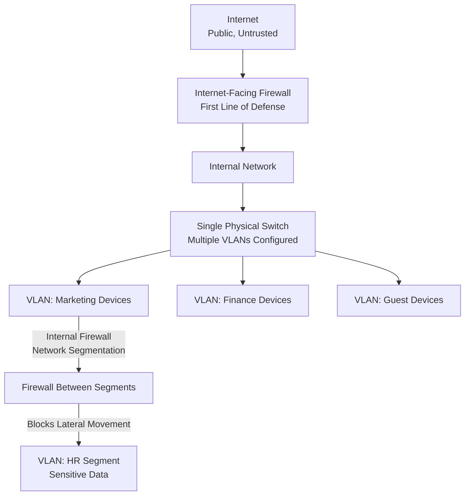

| Topic | Level | Reading Time | Prerequisites |
|---|---|---|---|
| Network Security Fundamentals: VLANs and Firewalls | Beginner | ~18 min | Basic understanding of networks, switches, and IP addressing |

> **الهدف من الـ Section ده:**  
>   هتفهم إزاي الـ VLANs بتقسّم شبكة فيزيائية واحدة لشبكات منطقية متعددة، وإزاي الـ Firewalls بتشتغل كحارس أمن للشبكة، مش بس على حدود الإنترنت، لكن كمان جوه المؤسسة نفسها عن طريق الـ Network Segmentation.

# Network Security Fundamentals: VLANs and Firewalls

## Learning Objectives

By the end of this section, you will be able to:

- Define a **VLAN** and explain how it divides a physical network into logical networks.
- List the four main benefits VLANs provide: security, performance, organization, and flexibility.
- Define a **Firewall** and explain its role as a checkpoint between two network zones.
- Correct the common misconception that a firewall only exists at the internet edge.
- Explain **Network Segmentation** and how internal firewalls help prevent **Lateral Movement**.

## Table of Contents

- [VLANs: What Are They](#vlans-what-are-they)
- [Why Organizations Use VLANs](#why-organizations-use-vlans)
- [How Communication Works Across VLANs](#how-communication-works-across-vlans)
- [Firewalls: What Are They](#firewalls-what-are-they)
- [Where a Firewall Sits](#where-a-firewall-sits)
- [Common Misconception: Is There Only One Firewall](#common-misconception-is-there-only-one-firewall)
- [Internal Firewalls and Network Segmentation](#internal-firewalls-and-network-segmentation)
- [Preventing Lateral Movement](#preventing-lateral-movement)
- [Network Architecture Diagram](#network-architecture-diagram)
- [Career Connection](#career-connection)
- [Key Terms Glossary](#key-terms-glossary)
- [Summary](#summary)

## VLANs: What Are They

**VLAN (Virtual Local Area Network)** هي طريقة لتقسيم شبكة فيزيائية واحدة لعدة شبكات منطقية (**logical networks**) متعددة.

الفكرة الأساسية إن الأجهزة الموجودة في VLANs مختلفة بتتصرف وكأنها متوصلة بسويتشات (**switches**) منفصلة تمامًا، حتى لو فعليًا كلها بتشارك نفس السويتش الفيزيائي الواحد.

> [!NOTE]
> كلمة "Virtual" هنا معناها إن الفصل بين الشبكات بيحصل على المستوى المنطقي (**logical**) بس، مش على مستوى الأسلاك أو الأجهزة الفيزيائية.

## Why Organizations Use VLANs

المؤسسات بتستخدم الـ VLANs عشان توفر أربع فوائد أساسية:

| الفائدة | الوصف |
|---|---|
| **Security (الأمان)** | الحفاظ على فصل الأجهزة الحساسة، مثلًا أجهزة قسم المالية (finance) متقدرش تتواصل مباشرة مع أجهزة الضيوف (guest devices) |
| **Performance (الأداء)** | تقليل حركة المرور الغير ضرورية عن طريق تحديد نطاقات الـ broadcast domains |
| **Organization (التنظيم)** | تجميع الأجهزة حسب القسم، الوظيفة، أو الموقع، بدل الاعتماد على التوصيل الفيزيائي |
| **Flexibility (المرونة)** | نقل الأجهزة من غير الحاجة لتغيير أي أسلاك في الشبكة |

> [!TIP]
> فكّر في VLAN زي إنك بتقسّم مبنى كبير فيه دور واحد مفتوح، لغرف منفصلة عن طريق حواجز افتراضية، حتى لو الأرضية والسقف (البنية الفيزيائية) واحدة، الناس في كل غرفة بيتصرفوا كأنهم في مكان منفصل تمامًا.

## How Communication Works Across VLANs

الأجهزة اللي موجودة في **نفس الـ VLAN** بتتواصل مع بعضها وكأنها على نفس الـ LAN، طبيعي وبسيط تمامًا.

أما الأجهزة الموجودة في **VLANs مختلفة**، فهي بتفضل معزولة (**isolated**) عن بعض، إلا لو تم إعداد الـ **routing** بينهم بشكل صريح ومقصود.

> [!IMPORTANT]
> العزل ده مش عيب أو قيد، هو بالظبط الهدف الأمني الأساسي من استخدام VLANs من الأول: منع التواصل الغير مرغوب فيه بين مجموعات أجهزة مختلفة، إلا لو الإدارة قررت السماح بيه بشكل واضح عن طريق الـ routing.

## Firewalls: What Are They

**Firewall** هو أساسًا حارس أمن واقف على باب الشبكة بتاعتك. أي قطعة من حركة المرور، سواء بيانات داخلة أو بيانات خارجة، لازم تعدي على الحارس ده الأول.

الحارس بيتحقق من: "مسموحلك تدخل؟ مسموحلك تخرج؟" لو الإجابة أيوه، حركة المرور بتعدي. لو الإجابة لأ، بتتحظر.

## Where a Firewall Sits

الـ Firewall دايمًا موجود بين منطقتين (**zones**)، وأشهر مكان بيتواجد فيه هو بين شبكتك الداخلية (الخاصة/private) والإنترنت (العام وغير الموثوق/public, untrusted).

> [!TIP]
> فكّر في الـ Firewall زي الحيطة اللي بين بيتك والشارع.

## Common Misconception: Is There Only One Firewall

فيه سوء فهم شائع جدًا لازم نصححه: معظم الناس بيعتقدوا إن فيه **Firewall واحد بس** موجود في الشركة، الكبير اللي واقف مواجه للإنترنت.

الاعتقاد ده **غلط**، ومهم جدًا نوضحه.

صحيح إن الـ firewall المواجه للإنترنت هو الأكبر والأكثر أهمية، لأنه خط الدفاع الأول ضد العالم الخارجي بالكامل. لكنه **مش الوحيد**.

## Internal Firewalls and Network Segmentation

الجزء اللي الناس غالبًا بتنساه: الـ Firewalls كمان بتُستخدم **جوه** المؤسسة نفسها عشان تفصل بين أجزاء الشبكة المختلفة عن بعض. العملية دي بتتسمى **Network Segmentation**.

### مثال عملي

تخيل إن شركتك عندها فريق **Marketing** وفريق **HR**. قسم الـ HR بيتعامل مع بيانات حساسة جدًا، زي المرتبات، البيانات الشخصية للموظفين، والمعلومات الطبية. قسم الـ Marketing بيتعامل مع منشورات السوشيال ميديا والحملات الإعلانية.

مش عايز حد في شبكة الـ Marketing يقدر يتصفح بشكل عادي على سيرفرات الـ HR، صح؟

عشان كده بتحط **Firewall** بين قطاع شبكة الـ Marketing وقطاع شبكة الـ HR.

> [!IMPORTANT]
> دلوقتي، حتى لو هاكر اخترق لابتوب تابع لقسم الـ Marketing، هو هيصطدم بحيطة (حرفيًا) لما يحاول يتحرك جانبيًا (**move sideways**) لداخل شبكة الـ HR.

## Preventing Lateral Movement

العملية دي بتتسمى **منع الحركة الجانبية (Lateral Movement Prevention)**، وهي موضوع كبير جدًا في مجال الأمن السيبراني، لأن المهاجمين غالبًا بيدخلوا من نقطة ضعف واحدة، وبعدين بيحاولوا يتحركوا ويتنقلوا داخليًا في الشبكة للوصول لأهداف أكتر قيمة.

> [!WARNING]
> نقطة اختراق واحدة ضعيفة (زي لابتوب موظف في قسم مش حساس) ممكن تبقى نقطة انطلاق خطيرة جدًا للمهاجم لو الشبكة كلها مش مقسّمة (**segmented**) بشكل صحيح. الـ segmentation بيحوّل الاختراق من "كارثة شاملة" لـ "حادثة محصورة في منطقة واحدة".

كمحلل **SOC**، فهم الموضوع ده بعمق مهم جدًا، لأن جزء كبير من التنبيهات (**alerts**) والتحقيقات اللي هتشتغل عليها هتشمل **firewall logs**.

## Network Architecture Diagram

المخطط التالي بيوضح إزاي الـ VLANs والـ Firewalls بيتعاونوا مع بعض عشان يعزلوا أقسام مختلفة داخل نفس المؤسسة، بالإضافة للـ firewall المواجه للإنترنت:

## Career Connection

فهم الـ VLANs والـ Firewalls مرتبط بشكل مباشر بمسارات مهنية متعددة:

- في مجال **SOC**، تحليل الـ firewall logs جزء أساسي جدًا من عمل الـ monitoring اليومي واكتشاف محاولات الحركة الجانبية.
- في مجال **Network Security Engineering**، تصميم بنية الـ VLANs والـ segmentation جزء أساسي من التصميم الآمن لشبكة أي مؤسسة.
- في مجال **Pentesting**، اختبار مدى فعالية الـ segmentation عن طريق محاولة الحركة الجانبية بين الشبكات جزء أساسي من تقييم أمان الشبكة الداخلية.
- في مجال **GRC**، التأكد من وجود سياسات واضحة لعزل الأنظمة الحساسة (زي HR والمالية) جزء من متطلبات الامتثال في معايير أمنية متعددة.

## Key Terms Glossary

| Term | Definition |
|---|---|
| **VLAN (Virtual Local Area Network)** | تقسيم منطقي لشبكة فيزيائية واحدة لعدة شبكات منفصلة سلوكيًا. |
| **Broadcast Domain** | مجموعة الأجهزة التي تستقبل رسائل الـ broadcast المرسلة من أي جهاز داخل نفس النطاق. |
| **Firewall** | نظام أمني يتحكم في حركة المرور الداخلة والخارجة بين منطقتين شبكيتين بناءً على قواعد محددة. |
| **Network Segmentation** | تقسيم الشبكة الداخلية لقطاعات منفصلة لتقييد التواصل غير الضروري بينها. |
| **Lateral Movement** | تحرك المهاجم داخل الشبكة بعد نقطة اختراق أولى بحثًا عن أهداف أو صلاحيات أعلى قيمة. |
| **Internet-Facing Firewall** | الجدار الناري المواجه مباشرة للإنترنت، ويُعتبر خط الدفاع الأول ضد العالم الخارجي. |
| **Internal Firewall** | جدار ناري يُستخدم داخل المؤسسة نفسها للفصل بين قطاعات الشبكة المختلفة. |

## Summary

- **VLAN** بيقسّم شبكة فيزيائية واحدة لشبكات منطقية متعددة، بحيث الأجهزة في VLANs مختلفة بتتصرف وكأنها على سويتشات منفصلة تمامًا.
- الـ VLANs بتوفر أربع فوائد أساسية: **Security**، **Performance**، **Organization**، و **Flexibility**.
- الأجهزة في نفس الـ VLAN بتتواصل بشكل طبيعي، بينما الأجهزة في VLANs مختلفة بتفضل معزولة إلا لو تم إعداد الـ routing بشكل صريح.
- **Firewall** هو حارس أمن بيتحكم في كل حركة المرور الداخلة والخارجة بين منطقتين شبكيتين، وأشهر مكان له هو بين الشبكة الداخلية والإنترنت.
- سوء فهم شائع إن فيه firewall واحد بس في الشركة، لكن الحقيقة إن الـ **Internal Firewalls** بتُستخدم كمان داخل المؤسسة نفسها عن طريق **Network Segmentation**.
- تقسيم الشبكة الداخلية لقطاعات (زي فصل Marketing عن HR) بيساعد في منع **Lateral Movement**، بحيث اختراق جهاز واحد ميأديش لاختراق الشبكة بالكامل.
- كمحلل **SOC**، فهم الـ firewall logs وطريقة عمل الـ segmentation جزء أساسي جدًا من عمل تحليل التنبيهات والتحقيقات.

