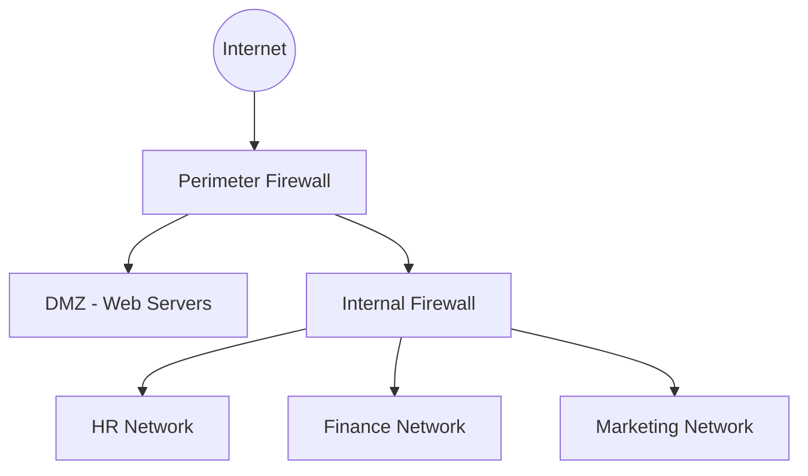

> **الهدف من الـ Section ده:**  
> بيعرّفك يعني إيه Firewall، بيتحط فين داخل الشبكة، وإزاي بياخد قراراته بناءً على الـ Rules لحماية الأنظمة ومنع الوصول غير المصرح بيه.
---


## Table of Contents

- [What is a Firewall?](#what-is-a-firewall)
- [Firewall Placement](#firewall-placement)
- [How Does a Firewall Make Decisions?](#how-does-a-firewall-make-decisions)
- [Summary](#summary)

---

## What is a Firewall?

الـ **Firewall** هو الـ Gatekeeper بتاع الشبكة — تخيله زي **حارس بوابة** بيوقف كل حاجة داخلة وخارجة ويقرر يسمح لها تعدي أو لا.

```
[ Internet ] <───────> [ Firewall ] <───────> [ Internal Network ]
```

وظيفته الأساسية:

- **Monitor** الـ Network Traffic
- **Control** الوصول بين الشبكات
- **Prevent** الـ Unauthorized Connections
- **Protect** الأنظمة والبيانات الحساسة

---

## Firewall Placement

الـ Firewall مش بيكون في مكان واحد بس — ممكن يتحط في أكتر من موضع داخل البنية التحتية للشبكة:



**Perimeter Firewall (الخارجي)**

- بيكون بين الشبكة الداخلية والـ Internet مباشرةً
- هو أول خط دفاع ضد الهجمات الخارجية
- بيتحكم في الـ Inbound والـ Outbound Traffic

**Internal Firewalls (الداخلية)**

- بتُستخدم لفصل الـ Departments عن بعض داخل المؤسسة
- بتطبق مبدأ الـ **Least Privilege** — كل قسم يشوف بس اللي يخصه

> [!NOTE]
> الـ Firewall مش بس للحماية من الـ Internet — ممكن يكون موجود جوه الشبكة عشان يفصل بين الـ Departments. لو جهاز في الـ Marketing اتاختُرق، الـ Attacker مش هيقدر ينتقل بسهولة لشبكة الـ HR أو الـ Finance — وده اللي بنسميه منع الـ **Lateral Movement**.

---

## How Does a Firewall Make Decisions?

الـ Firewall **مبيعملش حاجة لوحده** — هو بيطبق بس الـ Rules اللي أنت بتحددها.

> [!IMPORTANT]
> من غير Rules، الـ Firewall مش عارف يحدد إيه اللي المفروض يتسمح أو يتمنع. الـ Rules هي قلب شغل الـ Firewall.

---
## Summary

- الـ **Firewall** هو الـ Gatekeeper بين الشبكة والـ Internet، وبيشتغل على أساس **Rules** بتحددها أنت. من غير Rules، هو مش قادر يحمي حاجة.
