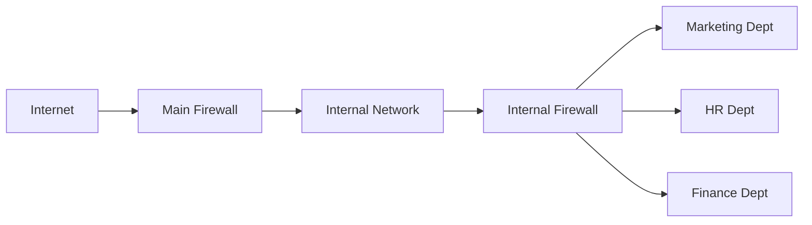
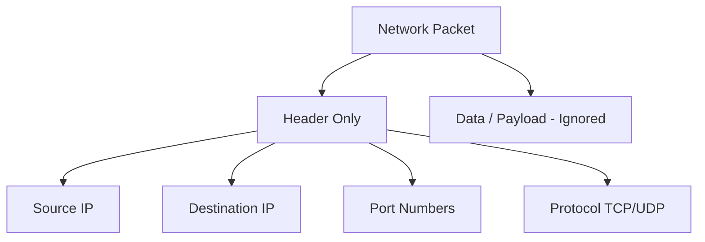
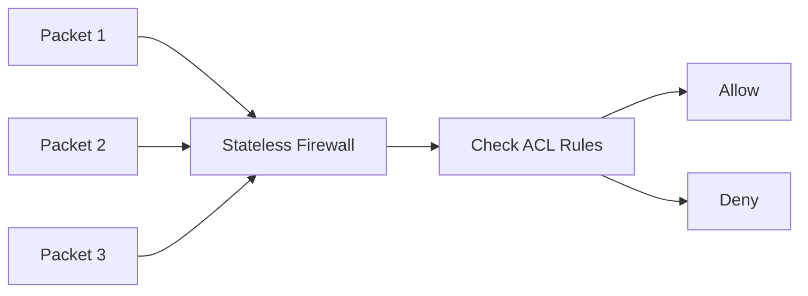
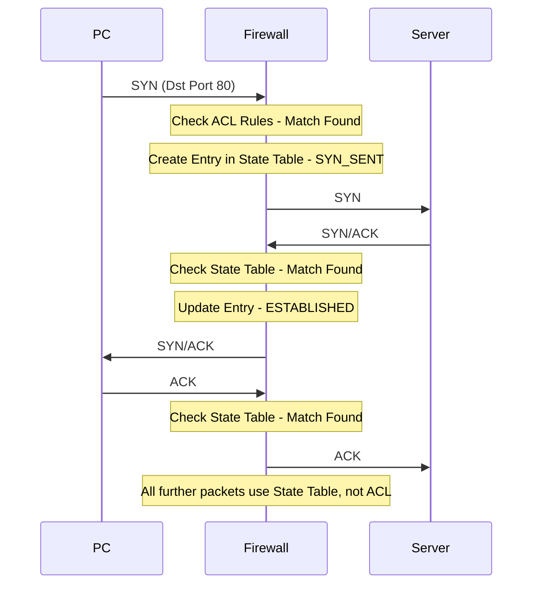

> **الهدف من الـ Section ده:** هتفهم إزاي الـ Firewall بيشتغل وإيه الفرق بين أنواعه المختلفة، وإزاي الـ Network Security بتتبنى من خلال أدوات زي الـ DMZ والـ IDS والـ IPS والـ Sinkhole — وده كله هيخليك كـ SOC Analyst تفهم اللي بيحصل على الشبكة وتتعامل معاه صح.

---

## Table of Contents

- [Firewalls & Packet Inspection](#firewalls--packet-inspection)
  - [1.1 What is a Firewall?](#11-what-is-a-firewall)
  - [1.2 Firewall Rules](#12-firewall-rules)
  - [1.3 Shallow Packet Inspection vs Deep Packet Inspection (DPI)](#13-shallow-packet-inspection-vs-deep-packet-inspection-dpi)
  - [1.4 Stateless Firewalls (Packet Filtering)](#14-stateless-firewalls-packet-filtering)
  - [1.5 Stateful Firewalls](#15-stateful-firewalls)
  - [1.6 Stateless vs Stateful — Head to Head](#16-stateless-vs-stateful--head-to-head)
- [Summary](#summary)

---

## Firewalls & Packet Inspection

### 1.1 What is a Firewall?

الـ **Firewall** هو الـ Gatekeeper بتاع الشبكة — تخيله زي حارس بوابة بيوقف كل حاجة داخلة وخارجة ويقرر يسمح لها تعدي أو لا.

```
[ Internet ] <----> [ Firewall ] <----> [ Internal Network ]
```

**أين يوجد الـ Firewall؟**

- أهم وأكبر Firewall هو اللي بيواجه الـ **Internet** مباشرة.
- لكن مش بس كده — الـ Firewall بيُستخدم **داخل** المؤسسة نفسها عشان يفصل بين الـ Departments المختلفة.

**مثال عملي:**



> [!NOTE]
> الـ Firewall مش بس للحماية من الـ Internet — ممكن يكون موجود جوه الشبكة عشان يفصل بين الـ Departments، زي ما بنفصل بين الـ Marketing والـ HR عشان كل قسم يشوف بس اللي يخصه.

---

### 1.2 Firewall Rules

الـ Firewall مش بيعمل حاجة لوحده — هو بيطبق **Rules** انت بتحددها.

**أساسيات الـ Rules:**

- الـ Firewall **بيدني كل حاجة by default** في بعض الأنواع، وبعضها التاني **بيمنع كل حاجة by default**.
- الـ Rules بتتكتب بواسطة الـ **Network Security Team**.
- لازم تفهم الـ Rules كويس كـ **SOC Analyst** حتى لو مش انت اللي بتكتبها.

**شكل الـ Rule بيكون كالتالي:**

```
ACTION   PROTOCOL   SOURCE          DESTINATION      PORT(S)
------   --------   ------          -----------      -------
ALLOW    TCP        Internal_Net    Internet         80, 443
DENY     ANY        Internet        Internal_Net     ANY
DENY     TCP        ANY             ANY              21 (FTP)
DENY     IP         Country_List    Internal_Net     ANY
DENY     UDP        Internal_Net    ANY              53
```

**تفسير كل Rule:**

| Rule | المعنى |
|------|--------|
| `ALLOW TCP Internal_Network → Internet PORTS 80, 443` | اسمح للشبكة الداخلية تتصفح الـ Web (HTTP/HTTPS) |
| `DENY ANY Internet → Internal_Network` | امنع أي حاجة جاية من الـ Internet للشبكة الداخلية |
| `DENY TCP ANY → ANY PORT 21` | امنع الـ FTP على طول (Port 21) |
| `DENY IP Country_List → Internal_Network` | امنع دول معينة من الوصول للشبكة |
| `DENY UDP Internal_Network → ANY PORT 53` | امنع الـ DNS Queries الداخلية (ممكن يتعمل لأسباب أمنية) |

> [!IMPORTANT]
> في بعض الـ Firewalls الـ Default هو **Deny All** وبتسمح بس باللي تحتاجه ← وده الأكثر أماناً.
> وفي نوع تاني الـ Default هو **Allow All** وبتمنع اللي مش محتاجه ← وده بيعتمد على سياسة المؤسسة.

> [!WARNING]
> كلما زادت عدد الـ Rules على الـ Firewall، كلما زاد الـ **Latency** لأن كل Packet لازم يعدي على كل الـ Rules واحدة واحدة لحد ما يلاقي Match.

---

### 1.3 Shallow Packet Inspection vs Deep Packet Inspection (DPI)

#### Shallow Packet Inspection

الـ Firewall في الوضع العادي بيشوف بس الـ **Header** بتاع الـ Packet — يعني:

- الـ **Source IP** والـ **Destination IP**
- الـ **Source Port** والـ **Destination Port**
- الـ **Protocol** (TCP أو UDP)



#### Deep Packet Inspection (DPI)

الـ **DPI** بيعمل كل حاجة الـ Shallow بيعملها + بيفتح الـ Packet ويبص على الـ **Data نفسه** (الـ Payload).

**مثال عملي:**

فرضاً عندنا الـ Rule دي:

```
ALLOW TCP 10.0.10.0/24 → 10.0.30.10 PORT 445
```

الـ Port 445 هو بتاع الـ **SMB Protocol** — ومشكلته إن فيه نسخة قديمة اسمها **SMBv1** وهي غير آمنة وكانت وراء هجوم **WannaCry Ransomware** الشهير.

| الإمكانية | Shallow Inspection | Deep Packet Inspection |
|-----------|-------------------|----------------------|
| فلترة بالـ IP | ✅ | ✅ |
| فلترة بالـ Port | ✅ | ✅ |
| فلترة بالـ Protocol | ✅ | ✅ |
| فلترة بالـ Application Version | ❌ | ✅ |
| رؤية محتوى الـ Data | ❌ | ✅ |

> [!TIP]
> الـ DPI هو اللي بيخليك تقدر تقول مثلاً "اسمح بـ SMBv2 وـ SMBv3 بس، وامنع SMBv1" — حاجة الـ Shallow Inspection مش قادر يعملها.

---

### 1.4 Stateless Firewalls (Packet Filtering)

الـ **Stateless Firewall** هو أبسط نوع من الـ Firewalls — وممكن حتى الـ **Router** العادي يعمل دور الـ Stateless Firewall.

**خصائصه:**

- الـ Rules بتُسمى **ACL (Access Control List)**.
- بيفلتر على مستوى الـ **Layer 3** (IP) والـ **Layer 4** (TCP/UDP Ports).
- كل Packet بيتعامل معاه **باستقلالية تامة** — مفيش أي تتبع للـ Session.



> [!NOTE]
> الـ Stateless Firewall مبيحفظش أي معلومة عن الـ Connections اللي عدت قبل كده — كل Packet بيتحكم فيه لوحده بشكل مستقل.

---

### 1.5 Stateful Firewalls

الـ **Stateful Firewall** هو الأكثر شيوعاً في الوقت الحالي — وبيتميز بقدرته على **تتبع الـ Sessions**.

#### الـ State Table

الـ Stateful Firewall بيحتفظ بجدول اسمه **State Table** بيتتبع فيه كل Connection:

| Src IP | Src Port | Dst IP | Dst Port | State |
|--------|----------|--------|----------|-------|
| 1.1.1.1 | 54236 | 2.2.2.2 | 80 | SYN_SENT |
| 1.1.1.1 | 54236 | 2.2.2.2 | 80 | ESTABLISHED |

#### خطوات الـ TCP 3-Way Handshake مع الـ Stateful Firewall



**خطوات تفصيلية:**

1. الـ **PC** بيبعت **SYN Packet** للـ Port 80.
2. الـ Firewall بيبص على الـ **State Table** — مش لاقي أي Entry موجود (Connection جديد).
3. بيروح يبص على الـ **ACL Rules** — لاقي Rule بيسمح بالـ Port 80.
4. بيعمل **Entry جديد** في الـ State Table وبيسمح للـ Packet يعدي.
5. الـ **Server** برد بـ **SYN/ACK**.
6. الـ Firewall بيبص في الـ **State Table** — لاقي Entry مطابق ← بيسمح وبيحدث الـ State لـ `ESTABLISHED`.
7. من دلوقتي كل الـ Packets بتمشي عن طريق الـ **State Table مباشرة** — مش بتعدي على الـ ACL Rules تاني.

> [!IMPORTANT]
> في الـ Stateful Firewall: **أول Packet بس** هو اللي بيتفحص بالـ ACL Rules — باقي الـ Packets بتاعة نفس الـ Session بتتحكم عن طريق الـ State Table مباشرة. ده بيحسّن الـ Performance جداً.

> [!NOTE]
> لما الـ Firewall يشوف **FIN** أو **RST Packet**، هيعرف إن الـ Session خلص وهيمسح الـ Entry من الـ State Table أوتوماتيك.

---

### 1.6 Stateless vs Stateful — Head to Head

| المقارنة | Stateless Firewall | Stateful Firewall |
|----------|-------------------|------------------|
| **تتبع الـ Session** | ❌ لا | ✅ نعم (State Table) |
| **فحص كل Packet** | ✅ كل Packet بشكل مستقل | أول Packet بالـ ACL، الباقي بالـ State Table |
| **الأمان** | أقل | أعلى |
| **الـ Performance** | أبطأ لو Rules كتير | أسرع (بعد أول Packet) |
| **منع Random Packets** | ❌ ممكن يسمح بـ ACK عشوائي | ✅ بيمنعه لأن مفيش Entry في الـ State Table |
| **الاستخدام** | Routers بسيطة | الـ Firewalls الاحترافية الحديثة |

**مثال توضيحي — Random ACK Packet:**

> فرضاً جه **ACK Packet** عشوائي للشبكة مش متعلق بأي Connection حقيقي:
> - **Stateless**: ممكن يسمح له يعدي لأنه مش بيتحقق من الـ Session.
> - **Stateful**: هيبص في الـ State Table، مش هيلاقي Entry، وهيمسح الـ Packet فوراً.

---


## Summary

### الـ Firewalls & Packet Inspection

- الـ **Firewall** هو الـ Gatekeeper بين الشبكة والـ Internet، وبيشتغل على أساس **Rules** بتحددها أنت.
- الـ **Shallow Packet Inspection** بيشوف بس الـ Headers (IP, Port, Protocol) — وده كافي في حالات كتير.
- الـ **Deep Packet Inspection** بيتعمق في الـ Data نفسه وبيقدر يكتشف أي Version من الـ Application بيتستخدم.
- الـ **Stateless Firewall** بيعامل كل Packet بشكل مستقل بدون أي تتبع للـ Sessions — وده ضعف أمني.
- الـ **Stateful Firewall** بيتتبع الـ Sessions في الـ State Table، وبيسمح بس للـ Traffic اللي عنده Session حقيقي — وده الأكثر أماناً والأكثر شيوعاً.


