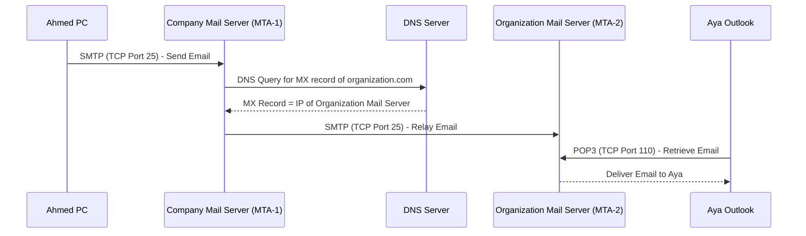
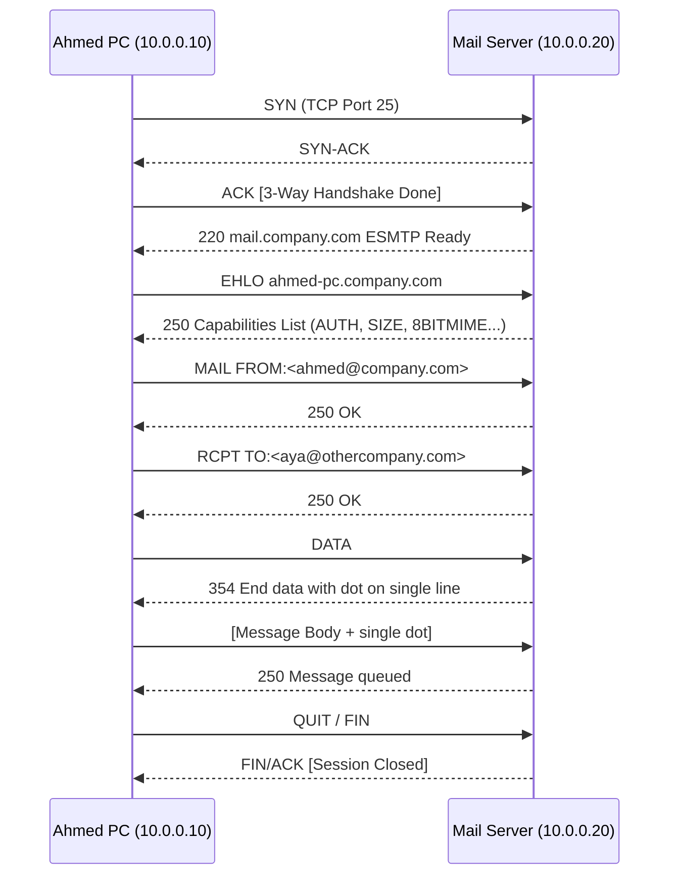
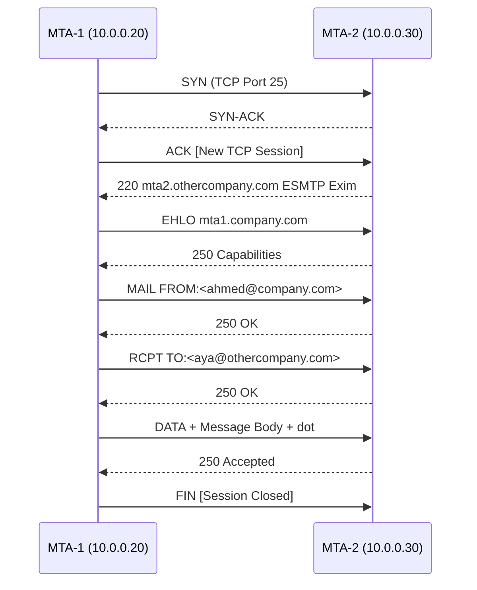

> **الهدف من الـ Section ده:**  
> هتفهم إزاي الـ Email بيتبعت من شخص لشخص تاني خطوة بخطوة، وإيه دور الـ Mail Server والـ DNS في العملية دي، وهتشوف الـ SMTP من جوه على Wireshark.

---

## Table of Contents
- [How Email Works](#how-email-works)
  - [المفهوم الأساسي](#المفهوم-الأساسي)
  - [خطوات إرسال الـ Email بالتفصيل](#خطوات-إرسال-الـ-email-بالتفصيل)
  - [البروتوكولات المستخدمة](#البروتوكولات-المستخدمة)
- [Important Lab — Email PCAP Analysis (Wireshark)](#important-lab--email-pcap-analysis-wireshark)
  - [Client to Mail Server (Ahmed's PC → MTA-1)](#client-to-mail-server-ahmeds-pc--mta-1)
  - [Server to Server Relaying (MTA-1 → MTA-2)](#server-to-server-relaying-mta-1--mta-2)

---

## How Email Works

### المفهوم الأساسي

تخيل إنك بعتلت حد رسالة في الزمن القديم — إنت مش بتوصلها بنفسك، بتديها لـ **البريد** اللي بيوصلها. نفس الفكرة بالظبط بتحصل في الـ Email.

لما Ahmed بيكتب إيميل ويضغط Send، الكمبيوتر بتاعه **مش هو** اللي بيبعت الإيميل مباشرةً. في حاجة اسمها **Mail Server** بتعمل دور الـ Postman.

```
Ahmed@company.com  ──→  يبعت إيميل لـ  ──→  Aya@organization.com
```

كل شركة عندها **Mail Server** خاص بيها:
- **Company.com Mail Server** — بيخدم Ahmed
- **Organization.com Mail Server** — بيخدم Aya

---

### خطوات إرسال الـ Email بالتفصيل



**الخطوات واحدة واحدة:**

**1. Ahmed يكتب الإيميل ويضغط Send**
- الـ Email Client (زي Outlook) بيتصل بـ Company Mail Server على **TCP Port 25** باستخدام بروتوكول **SMTP**.

**2. Mail Server بتاع Ahmed بيشتغل**
- بيبص على الـ Recipient: `Aya@organization.com`
- بيلاقي إن المفروض يبعت لـ `organization.com`
- المشكلة: مش عارف عنوان الـ IP بتاع Mail Server بتاع Organization

**3. DNS Query عشان يعرف الـ MX Record**

> [!IMPORTANT]
> الـ DNS Query هنا مش بتسأل عن الـ Website بتاع organization.com، لكن بتسأل عن الـ **MX Record** (Mail Exchange Record). الـ MX Record ده هو اللي بيدي الـ IP بتاع الـ Mail Server مش الـ Web Server.

**4. الـ Server-to-Server Transfer (Relaying)**
- بعد ما MTA-1 جاب الـ MX Record، فتح connection على **TCP Port 25** مع MTA-2
- بعتله الإيميل — العملية دي اسمها **Relaying**

**5. Aya بتفتح الإيميل**
- Aya بتفتح Outlook، هو بيتصل بـ Organization Mail Server على **TCP Port 110**
- بيجيب الإيميل باستخدام بروتوكول **POP3**

---

### البروتوكولات المستخدمة

| Protocol | Full Name | Port | الوظيفة |
|----------|-----------|------|---------|
| **SMTP** | Simple Mail Transfer Protocol | TCP 25 | إرسال الإيميل (Client→Server & Server→Server) |
| **POP3** | Post Office Protocol v3 | TCP 110 | استلام الإيميل من الـ Mail Server |
| **DNS MX** | Mail Exchange Record | UDP/TCP 53 | معرفة عنوان الـ Mail Server المقصود |

> [!NOTE]
> في بروتوكول تاني بيُستخدم لاسترجاع الإيميل اسمه **IMAP (TCP Port 143)**، وهو أحدث من POP3 ومش بيمسح الرسائل من الـ Server. لكن اللي اتشرح في المحاضرة دي هو POP3.

---

## Important Lab — Email PCAP Analysis (Wireshark)

### إعداد الـ Lab

| الجهاز | IP Address | الدور |
|--------|-----------|-------|
| Ahmed's PC | 10.0.0.10 | المُرسِل (Sender) |
| Company Mail Server (MTA-1) | 10.0.0.20 | Mail Server بتاع Ahmed |
| Organization Mail Server (MTA-2) | 10.0.0.30 | Mail Server بتاع Aya |
| Sender Email | ahmed@company.com | — |
| Recipient Email | aya@othercompany.com | — |

> [!TIP]
> في الـ Lab ده هنفترض إن كل Server عارف الـ IP بتاع التاني، عشان نتجنب خطوة الـ DNS ونركز على تفاصيل الـ SMTP.

---

### Client to Mail Server (Ahmed's PC → MTA-1)



**شرح كل خطوة:**

**الـ 3-Way Handshake**
- أول 3 Packets هي الـ TCP Handshake المعتادة على **Port 25**
- بعد ما الـ Connection اتفتح، الـ Server يعلن عن نفسه

**`220` — Server Greeting**
- `220 mail.company.com ESMTP Ready`
- الـ `220` ده Response Code يعني "الـ Server جاهز"

**`EHLO` — Client Identity**
- `EHLO ahmed-pc.company.com`
- الـ Client بيعرّف بنفسه وبيطلب قائمة الـ Capabilities بتاعة الـ Server

**`250` — Server Capabilities**
- الـ Server بيرد بقائمة من الـ Capabilities زي: حجم أقصى للإيميل، هل بيدعم Authentication، هل بيدعم Encryption...

**`MAIL FROM`**
- بيحدد المُرسِل: `MAIL FROM:<ahmed@company.com>`
- ده اسمه **Envelope Sender** — يعني زي ما بتكتب اسمك على الظرف

**`RCPT TO`**
- بيحدد المستلم: `RCPT TO:<aya@othercompany.com>`
- الـ Server بيرد بـ `250 OK` لو الـ Recipient مقبول

**`DATA` و الرسالة**
- الـ Client بيبعت أمر `DATA`
- الـ Server بيرد بـ `354` يعني "ابعت الرسالة وخلّيها تنتهي بنقطة منفردة على سطر لوحدها"
- الرسالة المبعوتة:

```
Subject: Hello Aya
From: ahmed@company.com
To: aya@othercompany.com

Hello Aya,
This is a test mail.
Regards,
Ahmed
.
```

> [!IMPORTANT]
> الـ `.` (نقطة منفردة على سطر) دي هي العلامة اللي بتقول للـ Server إن الرسالة خلصت. ده Standard في SMTP.

**إنهاء الـ Session**
- الـ Server بيرد `250 Message queued` يعني الرسالة اتقبلت وفي الـ Queue
- Ahmed بيبدأ الـ FIN Sequence لإنهاء الـ TCP Connection

> [!NOTE]
> الـ Server بعت الـ `FIN/ACK` في Packet واحدة بدل اتنين — ده اسمه **Piggybacking** وبيحصل لما الـ Server يقرر يعمل ACK وFIN في نفس الوقت.

---

### Server to Server Relaying (MTA-1 → MTA-2)



**مفاهيم مهمة في الـ Relaying:**

**ما هو الـ MTA؟**
- **MTA = Mail Transfer Agent**
- ده الـ Server-side Software المسؤول عن إرسال، استقبال، وتوجيه الإيميلات بين الـ Mail Servers
- أمثلة شهيرة: **Postfix، Sendmail، Exim، Microsoft Exchange**

**ليه في Handshake تاني؟**
- الـ TCP Connection الأولانية كانت بين **Ahmed's PC** و**MTA-1**
- دلوقتي MTA-1 بيفتح **Connection جديد خالص** مع MTA-2 — عشان كده في Handshake تاني
- نفس بروتوكول SMTP، نفس Port 25

**`220 mta2.othercompany.com ESMTP Exim`**
- Exim ده اسم الـ MTA Software اللي شغّال على MTA-2
- `ESMTP` = Extended SMTP (نسخة موسّعة بتدعم Capabilities إضافية)

**`EHLO` و `250` Capabilities**
- نفس العملية — الـ Servers بيتفاوضوا على الـ Capabilities قبل ما يبدأوا
- مهم عشان بيحددوا هل هيعملوا Authentication ولا لأ، وإيه الـ Features المتاحة

> [!WARNING]
> الـ SMTP في المثال ده **مش مُشفَّر** — كل حاجة بتتبعت بـ Cleartext. في الـ Real World لازم تُستخدم **SMTPS (Port 465)** أو **STARTTLS (Port 587)** لحماية الإيميلات أثناء النقل.

---


## Summary

#### How Email Works
- الإيميل مش بيتبعت من جهاز لجهاز مباشرة — بيمر عبر **Mail Servers** تعمل دور الـ Postman
- بروتوكول الإرسال هو **SMTP على TCP Port 25**
- الـ Mail Server بيستخدم **DNS MX Record** عشان يعرف عنوان Mail Server الطرف التاني
- عملية نقل الإيميل بين سيرفرين اسمها **Relaying** والـ Software المسؤول اسمه **MTA**
- Aya بتستلم إيميلها عبر **POP3 على TCP Port 110**

#### Lab Highlights (Wireshark)
- أول 3 Packets دايماً هي الـ **3-Way Handshake** على Port 25
- تسلسل SMTP: `EHLO` → `MAIL FROM` → `RCPT TO` → `DATA` → `250 OK` → `QUIT`
- الرسالة بتنتهي بـ **نقطة منفردة على سطر** (`.`)
- الـ Server Codes المهمة: `220` (Ready)، `250` (OK)، `354` (Start Data)


