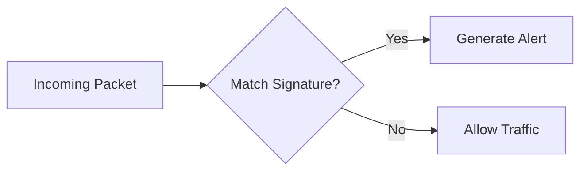
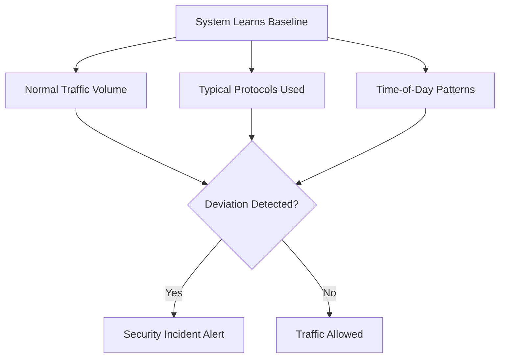
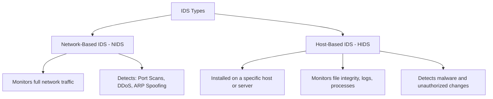
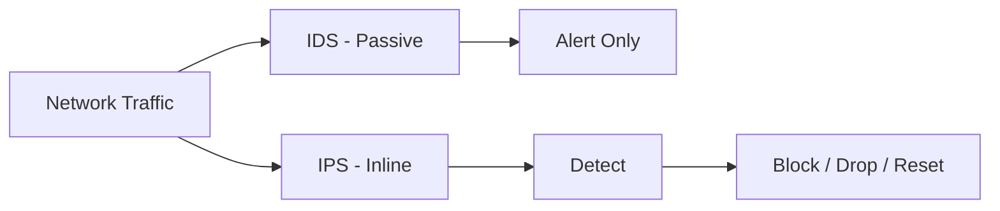
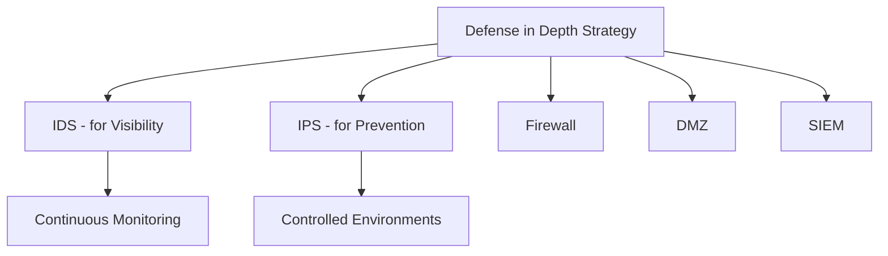
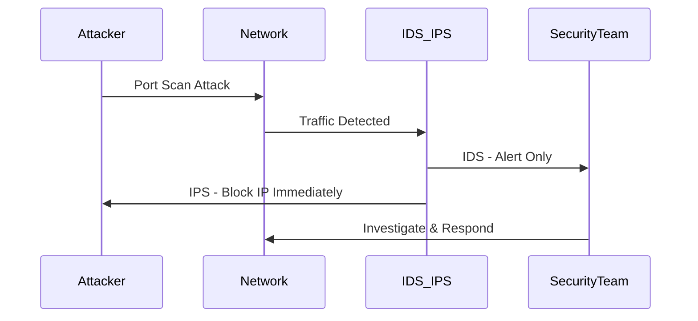

> **الهدف من الـ Section ده:**  
> هتفهم إزاي الـ IDS والـ IPS بيشتغلوا، وإيه الفرق بينهم، وإزاي بيكتشفوا الهجمات — وهتقدر تفرق بين الـ Detection والـ Prevention وتعرف متى تستخدم كل واحد فيهم.


---

# Intrusion Detection & Prevention Systems (IDS & IPS)

## Table of Contents

- [What is IDS?](#what-is-ids)
- [Detection Techniques](#detection-techniques)
  - [Signature-Based Detection](#signature-based-detection)
  - [Behavioral / Anomaly-Based Detection](#behavioral--anomaly-based-detection)
  - [Key Differences Between the Two Approaches](#key-differences-between-the-two-approaches)
- [Types of IDS](#types-of-ids)
- [What is IPS?](#what-is-ips)
- [IDS vs IPS — Full Comparison](#ids-vs-ips--full-comparison)
- [IDS/IPS Rules](#idsips-rules)
- [Deployment Best Practices](#deployment-best-practices)
- [Real-World Example](#real-world-example)
- [Summary](#summary)

---

## What is IDS?

الـ **IDS (Intrusion Detection System)** هو نظام متخصص في **الكشف فقط** عن الهجمات — مش بيوقف حاجة، بس بيقولك "في هجوم بيحصل هنا" ويبعتلك Alert.

```
IDS = Security Camera
بيشوف الهجوم ويبلّغ عنه — بس مش بيوقفه
```

**آلية عمل الـ IDS:**

- بيراقب كل الـ Packets اللي بتعدي على الشبكة.
- بيكتشف الهجمات عن طريق مقارنة الـ Traffic بـ Signatures معروفة أو تحليل السلوك.
- بيولّد: **Logs** و **Alerts** وبيبعت إشعارات للـ Security Team.

> [!NOTE]
> الـ IDS بيكتشف ويبلّغ بس — مش بياخد أي Action تلقائي. لو عايز حاجة توقف الهجوم، محتاج **IPS**.

---

## Detection Techniques

### Signature-Based Detection

الـ **Signature-Based Detection** بتعتمد على قاعدة بيانات من الـ Signatures — يعني Patterns معروفة لهجمات اتسُجّلت قبل كده.

**آلية العمل:**



**أهم النقاط:**

- لو أي Traffic عنده تشابه مع Signature معروفة → النظام يولّد Incident.
- قاعدة الـ Signatures لازم تتحدث بانتظام عشان تغطي التهديدات الجديدة.
- التحديثات عادةً بتيجي عن طريق **Paid Subscriptions**.
- التحديثات لازم تيجي من مصادر موثوقة عبر **HTTPS** لضمان سلامتها.

**مثال عملي:**
| الخطوة | التفاصيل |
|--------|----------|
| هجوم معروف | SQL Injection |
| الـ Signature | Pattern محدد للـ SQL المستخدم في الهجوم |
| النتيجة | لو الـ Traffic اتطابق مع الـ Pattern → Alert فوري |

> [!WARNING]
> لو قاعدة الـ Signatures قديمة، الـ IDS مش هيكتشف أي هجمات جديدة (Zero-Day Attacks). التحديث المستمر ضروري!

---

### Behavioral / Anomaly-Based Detection

الـ **Behavioral-Based Detection** مش بتعتمد على Signatures. بدل كده، بتدرس الـ Normal Behavior للشبكة، وأي حاجة تخرج عن الطبيعي بتعتبرها Incident.

**آلية العمل:**



**الـ Baseline بيشمل:**
- الحجم الطبيعي للـ Data المتنقلة.
- الـ Protocols المعتادة على الشبكة.
- أنماط الـ Traffic في أوقات مختلفة من اليوم.

**المزايا:**
- بيكتشف **Zero-Day Attacks** — هجمات جديدة مفيش ليها Signature.
- بيكتشف **Insider Threats** — تهديدات من داخل الشبكة.

**العيوب:**
- محتاج وقت عشان يتعلم الـ Baseline.
- في الأول ممكن يعمل:
  - **False Positives:** Traffic شرعي بيعتبره هجوم.
  - **False Negatives:** هجوم حقيقي بيفوته ومش بيكتشفه.

**مثال عملي:**

| الحالة | التفاصيل |
|--------|----------|
| Normal Behavior | Traffic عالي النهار وخفيف بالليل |
| Anomaly | تحويل كميات ضخمة من الداتا في منتصف الليل |
| النتيجة | النظام يولّد Alert فوري |

---

### Key Differences Between the Two Approaches

| المعيار | Signature-Based | Behavioral-Based |
|---------|----------------|-----------------|
| أساس الكشف | هجمات معروفة ومُسجَّلة | السلوك الطبيعي للشبكة |
| كشف Zero-Day | لا | نعم |
| كشف Insider Threats | محدود | نعم |
| الدقة الأولية | عالية | منخفضة في البداية |
| الحاجة للتحديث | مستمرة | تعلم ذاتي مع الوقت |
| False Positives | منخفضة | أعلى في المرحلة الأولى |

> [!TIP]
> الأنظمة الاحترافية بتجمع الاتنين مع بعض — Signature-Based للهجمات المعروفة، وBehavioral-Based للتهديدات الجديدة والداخلية.

---

## Types of IDS



| النوع | الوصف | بيكتشف إيه |
|-------|-------|------------|
| **Network-based IDS (NIDS)** | بيراقب كل الـ Network Traffic | Port Scans, DDoS, Brute-Force, ARP Spoofing |
| **Host-based IDS (HIDS)** | بيتنصب على Endpoint أو Server بعينه | Malware, File Changes, Unauthorized Process |

---

## What is IPS?

الـ **IPS (Intrusion Prevention System)** هو تطور للـ IDS — بيكتشف الهجوم **ويوقفه** في نفس الوقت.

```
IPS = Armed Guard
بيشوف الهجوم ويوقفه فوراً
```

**الـ IPS بياخد الـ Actions دي:**

- **Drops Packets** — بيحذف الـ Packets المشبوهة.
- **Blocks IP Addresses** — بيحجب الـ IP اللي بيهاجم.
- **Resets Connections** — بيقطع الـ Connection الخطر.
- **Rate-Limits Traffic** — بيحدد سرعة الـ Traffic المشبوه.

> [!IMPORTANT]
> الـ IPS لازم يكتشف الهجوم الأول قبل ما يوقفه — يعني هو في الأساس بيشتغل كـ IDS ثم بياخد Action. عشان كده موقعه في الشبكة **Inline** (في المسار الفعلي للـ Traffic).

---

## IDS vs IPS — Full Comparison



| المقارنة | IDS | IPS |
|----------|-----|-----|
| الكشف عن الهجمات | نعم | نعم |
| إيقاف الهجمات | لا | نعم |
| الموقع في الشبكة | Passive (بيراقب) | Inline (في المسار الفعلي) |
| خطر الـ False Positive | منخفض الأثر | عالي الخطورة |
| التأثير على الـ Performance | منخفض | أعلى نسبياً |

### False Positives — المشكلة الأخطر في الـ IPS

> [!WARNING]
> أخطر مشكلة في الـ IPS هي الـ **False Positives** — لو الـ IPS اعتقد إن Traffic شرعي هو هجوم وبلوكه، ممكن يوقف Business بأكمله! عشان كده لازم تكون الـ Rules مضبوطة بدقة عالية.

**Best Practices للتعامل مع الـ False Positives:**
- ضبط الـ IPS Rules بدقة قبل التطبيق الفعلي.
- اختبار الـ Rules في بيئة Staging قبل Production.
- مراقبة الـ Logs بشكل مستمر بعد التطبيق.

---

## IDS/IPS Rules

الـ Rules في الـ IDS/IPS بتتكتب باستخدام أدوات زي **Snort** و **Suricata**.

**مثال على Rule:**

```
alert tcp any any -> any 80 (msg:"Suspicious HTTP Traffic"; content:"malicious"; sid:1001;)
```

**شرح الـ Rule:**

| الجزء | المعنى |
|-------|--------|
| `alert` | نوع الـ Action (تنبيه) |
| `tcp` | الـ Protocol |
| `any any` | أي Source IP وأي Port |
| `-> any 80` | الـ Destination على Port 80 |
| `msg:` | رسالة الـ Alert |
| `content:` | الـ Pattern اللي بيدور عليه |
| `sid:` | رقم تعريفي للـ Rule |

**الفرق في الـ Action:**

| النظام | الـ Action |
|--------|-----------|
| IDS | Alert فقط — بيكتشف ويبلّغ |
| IPS | Alert + Block — بيكتشف ويوقف |

---

## Deployment Best Practices



- استخدم **IDS** لو هدفك المراقبة والـ Visibility.
- استخدم **IPS** لو عايز Prevention في بيئات محكومة ومضبوطة.
- دايماً ادمج الـ IDS/IPS مع: **Firewall** و **DMZ** و **SIEM**.
- اتبع استراتيجية **Defense in Depth** — طبقات حماية متعددة.

> [!TIP]
> ابدأ دايماً بـ IDS في Detection Mode الأول عشان تفهم الـ Traffic الطبيعي، وبعدين انقل لـ IPS لما تكون الـ Rules مضبوطة كويس.

---

## Real-World Example

**السيناريو: هجوم Port Scanning**



| النظام | الاستجابة |
|--------|-----------|
| **IDS** | اكتشف الـ Port Scan → بعت Alert للـ Security Team |
| **IPS** | اكتشف الـ Port Scan → حجب الـ IP فوراً |

---

## Summary

**أهم ما تعلمناه في الـ Section ده:**

- الـ **IDS** نظام كشف فقط — بيراقب الـ Traffic وبيولّد Alerts بدون ما يوقف حاجة، وموقعه في الشبكة **Passive**.
- الـ **IPS** نظام كشف ووقاية — بيكتشف الهجوم ويوقفه فوراً، وموقعه **Inline** في مسار الـ Traffic الفعلي.
- في طريقتين لكشف الهجمات: **Signature-Based** (للهجمات المعروفة) و**Behavioral-Based** (للهجمات الجديدة والـ Insider Threats).
- في نوعين من الـ IDS: **NIDS** (بيراقب الشبكة كلها) و**HIDS** (بيراقب Endpoint بعينه).
- أخطر مشكلة في الـ IPS هي الـ **False Positives** — ضبط الـ Rules بدقة ضروري عشان متبلوكش Traffic شرعي.
- الأدوات الشهيرة لكتابة الـ Rules هي **Snort** و **Suricata**.
- الممارسة الصح هي دمج الـ IDS/IPS مع Firewall وDMZ وSIEM ضمن استراتيجية **Defense in Depth**.
