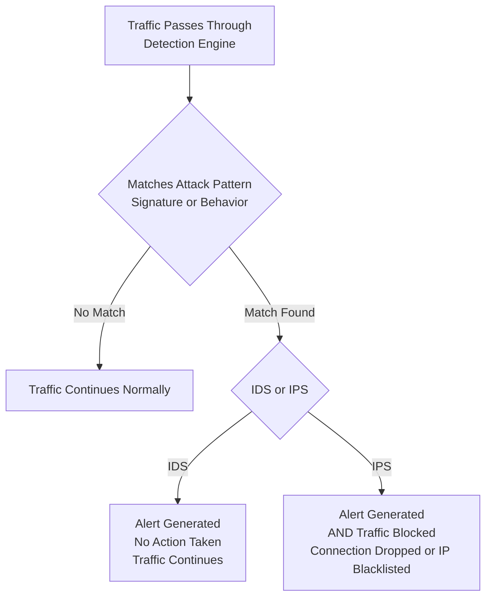

| Topic | Level | Reading Time | Prerequisites |
|---|---|---|---|
| Detection vs. Prevention: IDS and IPS | Intermediate | ~22 min | Basic understanding of firewalls, TCP/IP, and the SSH protocol |

> **الهدف من الـ Section ده:**  
>  هتفهم الفرق بين نظام بس بيكتشف ويبلّغ (**IDS**) ونظام بيتخذ إجراء فعلي (**IPS**)، وهنكسّر rule حقيقية بصيغة Suricata/Snort سطر بسطر عشان تفهم إزاي فعليًا بتتكتشف محاولة SSH brute-force.


## Learning Objectives

By the end of this section, you will be able to:

- Define an **IDS (Intrusion Detection System)** and explain why its only job is detection, not blocking.
- Distinguish between **signature-based** and **behavior-based (anomaly)** detection methods.
- Distinguish between **NIDS** and **HIDS** based on where each one monitors.
- Define an **IPS (Intrusion Prevention System)** and explain how it differs from an IDS in terms of action.
- Explain the risk of **False Positives** in an IPS and why its rules must be carefully tuned.
- Read and interpret a real **Suricata/Snort** rule line by line to detect an SSH brute-force attempt.

## Table of Contents

- [IDS: The Security Camera of Your Network](#ids-the-security-camera-of-your-network)
- [How an IDS Identifies Attacks](#how-an-ids-identifies-attacks)
- [Why an IDS Can Afford to Be Thorough](#why-an-ids-can-afford-to-be-thorough)
- [Two Types of IDS: NIDS and HIDS](#two-types-of-ids-nids-and-hids)
- [IPS: The Security Guard Who Actually Steps In](#ips-the-security-guard-who-actually-steps-in)
- [The Big Risk: False Positives](#the-big-risk-false-positives)
- [Why IPS Rules Must Be Carefully Tuned](#why-ips-rules-must-be-carefully-tuned)
- [Breaking Down a Suricata/Snort Rule](#breaking-down-a-suricatasnort-rule)
- [IDS vs. IPS at a Glance](#ids-vs-ips-at-a-glance)
- [Detection and Response Flow Diagram](#detection-and-response-flow-diagram)
- [Career Connection](#career-connection)
- [Key Terms Glossary](#key-terms-glossary)
- [Summary](#13-summary)

## IDS: The Security Camera of Your Network

**IDS (Intrusion Detection System)** بيقعد **inline** جوه شبكتك وبيراقب كل packet بيعدي من خلاله، زي كاميرا مراقبة أمنية بتسجّل وتحلل حركة المرور باستمرار.

شغله الوحيد هو **الاكتشاف (detection)**، هو مش بيحظر أي حاجة، هو بس بيتعرف على الحاجة المشبوهة وبيبلّغ عنها (**alerts**).

## How an IDS Identifies Attacks

الـ IDS بيتعرف على الهجمات بطريقتين أساسيتين:

- **Signature-Based**: مطابقة حركة المرور مع قاعدة بيانات معروفة من أنماط الهجمات (زي برامج الـ antivirus وهي بتطابق مع signatures معروفة للفيروسات).
- **Behavior-Based (Anomaly Detection)**: ملاحظة إن حاجة معينة بتبان غير طبيعية مقارنة بأنماط حركة المرور العادية، حتى لو مبتطابقش أي signature معروفة.

## Why an IDS Can Afford to Be Thorough

بما إن الاكتشاف هو شغله الوحيد، الـ IDS يقدر "يتحمل" (**afford**) إن يكون عنده قائمة قواعد كبيرة ومفصّلة وقدرة فحص عميقة.

> [!NOTE]
> السبب في كده إنه معندوش أي قلق من إنه يحظر حركة مرور شرعية بالغلط، لأنه أصلًا مش بيحظر أي حاجة خالص. الحرية دي في التصميم بتخليه يقدر يبقى دقيق وشامل جدًا من غير أي تكلفة تشغيلية على البيزنس.

## Two Types of IDS: NIDS and HIDS

فيه نوعين أساسيين من الـ IDS:

| النوع | مكان المراقبة | ماذا يراقب |
|---|---|---|
| **NIDS (Network-Based IDS)** | حركة المرور على مستوى الشبكة ككل | هجمات زي port scans، محاولات استغلال ثغرات (exploit attempts)، أو ارتفاعات غير طبيعية في حركة المرور |
| **HIDS (Host-Based IDS)** | جهاز أو سيرفر فردي محدد | نشاط مشبوه على الجهاز نفسه (زي تغييرات غير متوقعة في الملفات أو محاولات دخول غريبة) |

> [!TIP]
> فكّر في حارس أمن قاعد في غرفة مراقبة بيتابع كاميرات. هو بيلاحظ حاجة مشبوهة وفورًا بيبلّغ عنها، لكنه مش بيجري ويوقف الدخيل بنفسه فيزيائيًا. ده بالظبط الـ IDS: اكتشف وبلّغ.

## IPS: The Security Guard Who Actually Steps In

**IPS (Intrusion Prevention System)** بيبدأ بنفس شغل الـ IDS بالظبط، لازم يكتشف الهجوم الأول قبل ما يقدر يعمل أي حاجة بخصوصه.

الفرق: بمجرد ما الـ IPS يكتشف حاجة ضارة، هو **مش بس بيبلّغ**، هو **فعليًا بياخد إجراء (takes action)**، زي حظر حركة المرور تلقائيًا، إسقاط الاتصال (**dropping the connection**)، أو وضع الـ IP المصدر في القائمة السوداء (**blacklisting**).

> [!TIP]
> رجوعًا لتشبيه حارس الأمن: الـ IPS هو حارس، لما يشوف حد مشبوه على الكاميرا، مش بس بيبلّغ. هو بيجري ويوقفه فيزيائيًا. ده قوي جدًا، لكن لو مسك الشخص الغلط بالخطأ (**false positive**)، دي مشكلة حقيقية كمان.

## The Big Risk: False Positives

الخطر الكبير هنا هو الـ **False Positives**.

لو الـ IPS شخّص حركة مرور شرعية بالغلط على إنها هجوم وحظرها، هو ممكن **بالغلط يوقف حركة مرور بيزنس حقيقية**، مثلًا، يحظر عملاء حقيقيين من الوصول لموقعك الإلكتروني لأنه غلط وحسب حركة مرورهم العادية كإنها هجوم.

> [!WARNING]
> ده ممكن يسبب **ضرر مالي حقيقي**. الـ IPS مش بس أداة أمان، هو نظام قادر يأثر مباشرة على استمرارية البيزنس لو اتضبط بشكل خاطئ.

## Why IPS Rules Must Be Carefully Tuned

بسبب الخطر ده، قواعد الـ IPS لازم تتكتب، تتختبر، وتتضبط (**tuned**) بعناية شديدة، إنت فعليًا بتدّي النظام ده صلاحية إنه ياخد قرارات تلقائية بتأثر على البيزنس بتاعك.

> [!IMPORTANT]
> قواعد الـ IPS عادةً بتتكتب باستخدام صيغة **Suricata** أو **Snort**، اتنين من أكتر محركات الـ IDS/IPS مفتوحة المصدر (**open-source**) استخدامًا في الصناعة.

## Breaking Down a Suricata/Snort Rule

هنكسّر الـ rule دي قطعة قطعة:

```
alert tcp any any -> any 22 (
    msg:"Possible SSH brute force attempt";
    flags:S;
    threshold:type both, track by_src, count 5, seconds 60;
    sid:100100;
    rev:1;
)
```

| الجزء | المعنى |
|---|---|
| `alert tcp any any -> any 22` | راقب أي حركة مرور TCP، من أي IP مصدر وأي بورت مصدر، متوجهة لأي IP وجهة على بورت 22 (البورت القياسي لـ **SSH**، تسجيل الدخول للسيرفرات عن بعد). |
| `msg:"Possible SSH brute force attempt"` | العنوان المقروء (**human-readable label**) اللي بيظهر في التنبيه، بيصف اللي اتكتشف. |
| `flags:S` | بص بس على الـ packets اللي فيها الـ **SYN flag** مضبوط، يعني بيدوّر بالتحديد على محاولات اتصال جديدة (الخطوة الأولى من TCP handshake). |
| `threshold:type both, track by_src, count 5, seconds 60` | لو نفس الـ IP المصدر حاول يبدأ 5 اتصالات SSH جديدة أو أكتر خلال 60 ثانية، فعّل التنبيه. |
| `sid:100100` | رقم تعريف فريد (**unique ID**) للـ rule دي بالتحديد، بيُستخدم عشان يتحدد في الـ logs. |
| `rev:1` | رقم مراجعة الـ rule، مفيد لتتبع التحديثات وقت ما الـ rule تتحسّن مع الوقت. |

> [!IMPORTANT]
> النمط ده، محاولات دخول متعددة وسريعة في وقت قصير، هو علامة كلاسيكية على إن حد بيحاول يخمّن كلمات مرور (**brute-force attack**).

**بالعربي البسيط**: لو أي عنوان IP واحد حاول يبدأ 5 اتصالات SSH أو أكتر خلال دقيقة واحدة، اعتبر ده محاولة دخول بـ brute-force محتملة وفعّل التنبيه.

## IDS vs. IPS at a Glance

الجدول التالي بيلخّص الفرق الجوهري بين النظامين:

| المعيار | IDS | IPS |
|---|---|---|
| الوظيفة الأساسية | الاكتشاف والتنبيه فقط | الاكتشاف واتخاذ إجراء فعلي |
| موقع التشغيل | غالبًا خارج مسار حركة المرور المباشر (**out-of-band** أو مراقبة) | داخل مسار حركة المرور مباشرة (**inline**) |
| الخطر الرئيسي | تنبيهات كاذبة قد تُهمل (لا تؤثر على حركة المرور نفسها) | حظر خاطئ لحركة مرور شرعية (**false positive** يؤثر فعليًا على البيزنس) |
| حساسية ضبط القواعد | أقل حساسية، لأن التنبيه الخاطئ لا يوقف أي شيء | أعلى حساسية جدًا، لأن الحظر الخاطئ قد يعطل خدمات حقيقية |

## Detection and Response Flow Diagram

المخطط التالي بيوضح الفرق بين مسار الاستجابة في الـ IDS ومسار الاستجابة في الـ IPS لنفس التهديد المكتشف:


```mermaid
flowchart TB
    A["Traffic Passes Through<br/>Detection Engine"] --> B{"Matches Attack Pattern<br/>Signature or Behavior"}
    B -->|"No Match"| C["Traffic Continues Normally"]
    B -->|"Match Found"| D{"IDS or IPS"}
    D -->|"IDS"| E["Alert Generated<br/>No Action Taken<br/>Traffic Continues"]
    D -->|"IPS"| F["Alert Generated<br/>AND Traffic Blocked<br/>Connection Dropped or IP Blacklisted"]
```

## Career Connection

فهم الفرق بين IDS وIPS له تطبيقات مباشرة في مسارات مهنية متعددة:

- في مجال **SOC**، تحليل تنبيهات IDS/IPS وفهم الفرق بينهم أساس عمل التحقيق اليومي في الحوادث الأمنية.
- في مجال **Detection Engineering**، كتابة وضبط قواعد Suricata أو Snort جزء أساسي من بناء قدرات الكشف والاستجابة داخل المؤسسة.
- في مجال **Network Security Engineering**، اتخاذ قرار وضع IPS بدل IDS (أو العكس) في نقاط معينة من الشبكة قرار استراتيجي بيوازن بين الأمان واستمرارية البيزنس.
- في مجال **Incident Response**، فهم إذا كانت حركة المرور اتحظرت تلقائيًا (IPS) أو بس اتبلّغ عنها (IDS) بيوجّه خطوات الاستجابة التالية.

## Key Terms Glossary

| Term | Definition |
|---|---|
| **IDS (Intrusion Detection System)** | نظام يراقب حركة المرور ويكتشف الأنشطة المشبوهة، ويقوم بالتنبيه فقط دون حظر. |
| **IPS (Intrusion Prevention System)** | نظام يكتشف الأنشطة المشبوهة ويتخذ إجراءً فعليًا لحظرها أو إيقافها. |
| **Signature-Based Detection** | طريقة كشف تعتمد على مطابقة حركة المرور مع أنماط هجمات معروفة مسبقًا. |
| **Behavior-Based Detection (Anomaly Detection)** | طريقة كشف تعتمد على ملاحظة انحراف حركة المرور عن الأنماط الطبيعية المعتادة. |
| **NIDS (Network-Based IDS)** | نظام كشف يراقب حركة المرور على مستوى الشبكة بأكملها. |
| **HIDS (Host-Based IDS)** | نظام كشف يُثبت على جهاز أو سيرفر فردي لمراقبة النشاط عليه تحديدًا. |
| **False Positive** | تنبيه أو إجراء أمني يُتخذ ضد نشاط طبيعي وغير ضار في الحقيقة. |
| **Suricata / Snort** | محركات مفتوحة المصدر شائعة الاستخدام لكتابة وتشغيل قواعد IDS/IPS. |
| **Brute-Force Attack** | هجوم يعتمد على تجربة عدد كبير من محاولات تسجيل الدخول لتخمين بيانات الاعتماد الصحيحة. |

## Summary

- **IDS** بيراقب حركة المرور ويكتشف الأنشطة المشبوهة، لكن شغله الوحيد هو التنبيه، هو مبيحظرش أي حاجة.
- الاكتشاف بيتم بطريقتين: **signature-based** (مطابقة مع أنماط معروفة) و **behavior-based** (ملاحظة انحراف عن الطبيعي).
- فيه نوعين من الـ IDS: **NIDS** بيراقب الشبكة ككل، و **HIDS** بيراقب جهاز فردي محدد.
- **IPS** بيبدأ بنفس اكتشاف الـ IDS، لكنه بعد كده **بياخد إجراء فعلي** زي الحظر التلقائي أو إسقاط الاتصال.
- الخطر الأكبر في الـ IPS هو **False Positives**، اللي ممكن تسبب حظر حركة مرور بيزنس شرعية وضرر مالي حقيقي.
- قواعد الـ IPS لازم تتضبط بعناية شديدة، وعادةً بتتكتب بصيغة **Suricata** أو **Snort**.
- مثال rule حقيقي بيوضح إزاي محاولات دخول SSH متكررة (5 محاولات أو أكتر خلال 60 ثانية من نفس الـ IP) بتُكتشف كـ **brute-force attack** محتملة.

