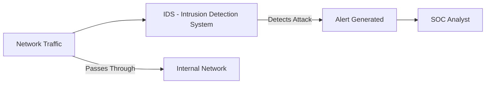
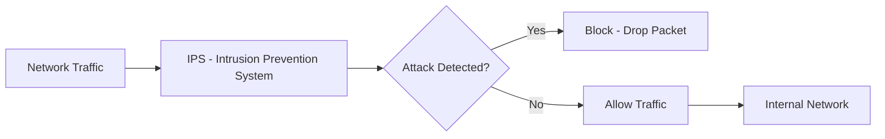
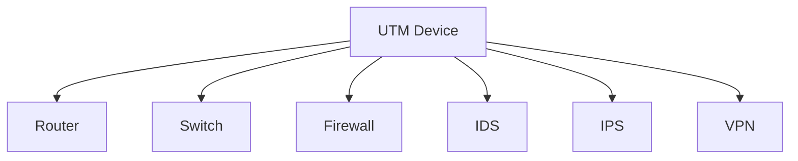

> **الهدف من الـ Section ده:**  
> هنتعرف على أنظمة كشف ومنع الاختراق زي IDS وIPS، ونفهم الفرق بينهم وإزاي بيتم استخدامهم لحماية الشبكة من الهجمات.

## Table of Contents

- [Intrusion Detection & Prevention](#intrusion-detection--prevention)
  - [1.1 IDS (Intrusion Detection System)](#31-ids-intrusion-detection-system)
  - [1.2 IPS (Intrusion Prevention System)](#32-ips-intrusion-prevention-system)
  - [1.3 UTM (Unified Threat Management)](#33-utm-unified-threat-management)
- [Summary](#summary)

## Intrusion Detection & Prevention

### 3.1 IDS (Intrusion Detection System)

الـ **IDS** هو نظام متخصص في **الكشف فقط** عن الهجمات — هو مش بيوقف حاجة، بس بيقولك "في هجوم بيحصل هنا".

**خصائص الـ IDS:**

- بيشوف كل الـ Packets اللي بتعدي على الشبكة.
- بيكتشف الهجمات عن طريق:
  - **Signatures**: مقارنة الـ Packets بـ Patterns معروفة لهجمات سابقة.
  - **Behavior Analysis**: لو الـ Traffic بيتصرف بشكل غريب — حتى لو مفيش Signature معروفة.
- عنده **قدرة كشف أعلى** من الـ Firewall العادي.

**نوعين من الـ IDS:**

| النوع | الوصف |
|-------|--------|
| **Network-based IDS (NIDS)** | بيراقب الـ Network Traffic كلها وبيدور على Network Attacks |
| **Host-based IDS (HIDS)** | بيتنصب على Endpoint بعينه وبيراقب الأنشطة عليه |

> [!NOTE]
> الـ IDS **بيكتشف ويبلّغ بس** — مش بياخد أي Action. لو عايز حاجة توقف الهجوم، محتاج IPS.

---

### 3.2 IPS (Intrusion Prevention System)

الـ **IPS** هو IDS + القدرة على **اتخاذ الإجراء**.

**الفرق بين IDS و IPS:**

| المقارنة | IDS | IPS |
|----------|-----|-----|
| **الكشف عن الهجمات** | ✅ | ✅ |
| **إيقاف الهجمات** | ❌ | ✅ |
| **الموقع في الشبكة** | Passive (بيراقب) | Inline (في المسار الفعلي) |
| **خطر الـ False Positive** | منخفض الأثر | عالي الخطورة |

**الـ False Positive Problem:**

> [!WARNING]
> أخطر مشكلة في الـ IPS هي الـ **False Positives** — لو الـ IPS اعتقد إن Traffic شرعي هو هجوم وبلوكه، ممكن يوقف Business بأكمله! عشان كده لازم تكون الـ Rules مضبوطة بدقة عالية.

**كتابة الـ Rules:**

الـ Rules في الـ IDS/IPS بتتكتب باستخدام أدوات زي:
- **Snort**
- **Suricata**

---

### 3.3 UTM (Unified Threat Management)

الـ **UTM** هو جهاز واحد جوّاه كل حاجة — زي الـ Router الـ Home بتاعك بالظبط.

**مقارنة الـ UTM مع الـ Enterprise Setup:**

| المعيار | UTM | Enterprise Setup |
|---------|-----|-----------------|
| **التكلفة** | منخفضة | عالية جداً |
| **الإدارة** | بسيطة (واجهة واحدة) | معقدة (أجهزة منفصلة) |
| **الأداء** | مناسب للشبكات الصغيرة | أفضل بكثير للشبكات الكبيرة |
| **التخصص** | محدود | كل جهاز متخصص 100% |
| **الاستخدام المثالي** | Home Network / SMB | Enterprise / Data Centers |

> [!NOTE]
> الـ UTM مناسب جداً للـ **Home Networks** والشركات الصغيرة — لكن الـ Enterprise الكبيرة محتاجة أجهزة منفصلة ومتخصصة عشان تتحمل الـ Load وتدي أداء أحسن.

## Summary

- الـ **IDS** هو نظام كشف فقط — بيكتشف الهجمات ويبلّغ.
- الـ **IPS** هو IDS + Action — بيكتشف ويوقف، لكن **الـ False Positives** خطيرة جداً.
- الـ **UTM** جهاز All-in-One مناسب للشبكات الصغيرة، لكن مش كافي للـ Enterprise.

> [!TIP]
> كـ SOC Analyst، فهمك لكيفية عمل الـ Firewall Rules والـ State Table والـ IDS/IPS هيخليك تقدر تحلل الـ Alerts وتعرف تميز بين الـ False Positive والهجوم الحقيقي — وده من أهم المهارات في الـ SOC.
