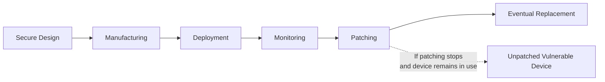

| Topic | Level | Reading Time | Prerequisites |
|---|---|---|---|
| IoT Devices and Their Security Challenges | Beginner | ~15 min | Basic understanding of networking and general security concepts |

> **الهدف من الـ Section ده:**  
>  هتفهم إيه هي الـ IoT devices وليه بتشكّل تحدي أمني كبير، وهتعرف إزاي حاجات زي محدودية الموارد وغياب الـ updates بتخلي الأجهزة دي عرضة للاختراق مع الوقت.

## Learning Objectives

By the end of this section, you will be able to:

- Define **IoT (Internet of Things)** and identify common examples of IoT devices.
- Explain why the scale of IoT devices creates a large **attack surface**.
- Describe how limited hardware resources affect security implementation in IoT devices.
- Explain how a vulnerability like **Shellshock** can affect Linux-based IoT devices.
- Evaluate why IoT security must be considered across the entire **device lifecycle**, not just at the point of purchase.

## Table of Contents

- [1. What Is IoT](#1-what-is-iot)
- [2. The Scale Problem: IoT and the Attack Surface](#2-the-scale-problem-iot-and-the-attack-surface)
- [3. Resource Constraints in IoT Devices](#3-resource-constraints-in-iot-devices)
- [4. The Absence of a Universal Security Standard](#4-the-absence-of-a-universal-security-standard)
- [5. Linux in IoT Devices and the Shellshock Example](#5-linux-in-iot-devices-and-the-shellshock-example)
  - [5.1 Understanding Shellshock](#51-understanding-shellshock)
  - [5.2 Linux Does Not Equal Vulnerable](#52-linux-does-not-equal-vulnerable)
- [6. Why Manufacturers Fall Short on Security](#6-why-manufacturers-fall-short-on-security)
- [7. IoT Security Across the Device Lifecycle](#7-iot-security-across-the-device-lifecycle)
- [8. Device Lifecycle Diagram](#8-device-lifecycle-diagram)
- [9. Career Connection](#9-career-connection)
- [10. Key Terms Glossary](#10-key-terms-glossary)
- [11. Summary](#11-summary)

## 1. What Is IoT

**IoT (Internet of Things)** بيشير للأجهزة الفيزيائية (physical devices) اللي بتتصل بشبكات أو بالإنترنت عشان تجمع (**collect**)، تعالج (**process**)، وتتبادل (**exchange**) البيانات.

الأجهزة دي موجودة في كل مكان تقريبًا في حياتنا اليومية، ومن أشهر الأمثلة عليها:

- السماعات الذكية (**smart speakers**).
- التلفزيونات الذكية (**smart TVs**).
- كاميرات المراقبة (**security cameras**).
- الساعات الذكية (**smart watches**).
- الحساسات (**sensors**).
- الأجهزة المنزلية الذكية (**smart appliances**).
- أنظمة الجراجات الأوتوماتيكية (**automated garage systems**).

> [!NOTE]
> الفكرة الأساسية في IoT مش بس إن الجهاز "متصل بالإنترنت"، لكن إنه بيقدر يجمع بيانات من البيئة المحيطة بيه (زي حرارة، حركة، صوت) ويستخدمها أو يبعتها لجهة تانية لمعالجتها.

## 2. The Scale Problem: IoT and the Attack Surface

عدد أجهزة الـ IoT المتصلة حول العالم ضخم جدًا، وده بيخلق **attack surface** (سطح هجوم) كبير للمهاجمين. كل جهاز متصل بالشبكة بيمثل نقطة دخول محتملة (**potential entry point**)، وكل ما زاد عدد الأجهزة، زادت الفرص المتاحة للمهاجم إنه يلاقي جهاز ضعيف يقدر يستغله.

> [!IMPORTANT]
> الحجم الهائل لأجهزة الـ IoT مش مجرد رقم إحصائي، ده عامل أمني جوهري، لأنه بيعني إن حتى نسبة صغيرة من الأجهزة الضعيفة يقدر تمثل عدد مطلق ضخم من الأهداف القابلة للاختراق.

## 3. Resource Constraints in IoT Devices

على عكس أجهزة الكمبيوتر التقليدية، كتير من أجهزة الـ IoT بتيجي بموارد محدودة جدًا، زي:

- معالج (**CPU**) ضعيف نسبيًا.
- ذاكرة (**memory**) محدودة.
- مساحة تخزين (**storage**) صغيرة.
- طاقة (**power**) محدودة، خصوصًا في الأجهزة اللي بتشتغل بالبطارية.

القيود دي بتخلي تطبيق آليات أمان متقدمة (زي التشفير القوي أو أنظمة الكشف عن التسلل) أمر أصعب من الناحية التقنية، لأن الجهاز نفسه ممكن ميكونش قادر يتحمل العبء الحسابي المطلوب لتشغيل الحماية دي بكفاءة.

> [!WARNING]
> محدودية الموارد مش عذر لتجاهل الأمان، لكنها تحدي هندسي حقيقي بيحتاج تصميم أمني ذكي من البداية، مش مجرد إضافة طبقة حماية تقليدية بشكل عشوائي.

## 4. The Absence of a Universal Security Standard

مفيش **معيار أمان عالمي واحد (universal security standard)** بيضمن نفس مستوى الحماية لكل أجهزة الـ IoT. مستوى الأمان بيعتمد بشكل كبير على:

- الشركة المصنّعة (**manufacturer**).
- تصميم الجهاز نفسه (**device design**).
- نظام التشغيل المستخدم (**operating system**).
- سياسة التحديثات (**update policy**) اللي الشركة بتلتزم بيها.

بعض الأجهزة بتستقبل تحديثات أمان بشكل منتظم، بينما أجهزة تانية بتستقبل تحديثات لفترة قصيرة بس، أو بيتم إيقاف دعمها (**discontinued**) وتُترك من غير أي patches.

> [!IMPORTANT]
> جهاز كان آمن وقت الشراء ممكن **يبقى عرضة للاختراق (vulnerable) بعد سنين**، لما تتكشف ثغرات جديدة والشركة المصنّعة ماعدش بتوفر تحديثات أمنية ليه. الأمان مش حالة ثابتة، ده عملية مستمرة طول عمر الجهاز.

## 5. Linux in IoT Devices and the Shellshock Example

### 5.1 Understanding Shellshock

كتير من أجهزة الـ IoT بتستخدم أنظمة تشغيل مبنية على **Linux**، وده معناه إن أي ثغرة بتأثر على مكونات Linux ممكن تأثر على عدد ضخم من الأجهزة المختلفة في نفس الوقت.

مثال حقيقي على كده هو ثغرة **Shellshock**، وهي ثغرة خطيرة اتكشفت في الـ **Bash shell** وأثّرت على عدد كبير من أنظمة Unix وLinux. أجهزة الـ IoT اللي كانت بتستخدم نسخ ضعيفة من Bash كانت هي كمان معرّضة للاستغلال، لو المكوّن الضعيف ده كان موجود وقابل للوصول (**reachable**) من المهاجم.

### 5.2 Linux Does Not Equal Vulnerable

> [!NOTE]
> الدرس المهم هنا إن استخدام Linux في حد ذاته **مبيخليش الجهاز ضعيف تلقائيًا**. عشان الجهاز يكون فعلًا معرّض للاستغلال، لازم يتحقق شرطين مع بعض: الجهاز يحتوي على النسخة المتأثرة من البرنامج الضعيف، وكمان يكون فيه مسار هجوم (**attack path**) فعلي يسمح باستغلال الثغرة دي.

النقطة دي مهمة جدًا في التفكير الأمني الصحيح: وجود مكوّن معروف بضعفه مش كافي وحده لاعتبار النظام مخترق، لازم نفهم إمكانية الوصول والاستغلال الفعلي.

## 6. Why Manufacturers Fall Short on Security

الأجهزة اللي بيتم تصنيعها ونشرها من غير أي تحديث بعد كده ممكن تفضل عرضة لثغرات أمنية معروفة للعامة (**publicly known security issues**) لسنين طويلة.

السبب في كتير من الأحيان بيرجع لأولويات الشركات المصنّعة، اللي غالبًا بتركز على:

- التكلفة المنخفضة (**low cost**).
- حجم هاردوير صغير (**small hardware**).
- سرعة التطوير (**fast development**).
- سرعة الوصول للسوق (**time-to-market**).

الأولويات دي ممكن تؤدي لقدرات أمنية أضعف أو دعم طويل المدى محدود. من أشيع المشاكل اللي بتظهر نتيجة كده:

| المشكلة | الوصف |
|---|---|
| تشفير قديم | استخدام خوارزميات تشفير ضعيفة أو متجاوزة (outdated encryption) |
| مصادقة ضعيفة | آليات authentication غير كافية لحماية الوصول للجهاز |
| كلمات مرور افتراضية غير آمنة | استخدام default passwords معروفة ومتاحة للعامة |
| بروتوكولات اتصال قديمة | نسخ قديمة من بروتوكولات زي Bluetooth بها ثغرات معروفة |

> [!WARNING]
> لو الشركة المصنّعة مش موفّرة آلية تحديث عملية (**practical update mechanism**)، المستخدم ممكن ميكونش عنده أي وسيلة فعلية لإصلاح الثغرات اللي بتتكشف بعد الشراء، حتى لو كان عايز يحدّث الجهاز بنفسه.

## 7. IoT Security Across the Device Lifecycle

بناءً على كل النقاط السابقة، أمان أجهزة الـ IoT لازم يتم النظر ليه على مدار **دورة حياة الجهاز بالكامل (device lifecycle)**، مش بس لحظة الشراء أو الاستخدام الأول. ده بيشمل:

- التصميم الآمن (**secure design**) من مرحلة التصنيع.
- عملية التصنيع نفسها (**manufacturing**).
- النشر والتركيب (**deployment**).
- المراقبة المستمرة (**monitoring**).
- تحديث الثغرات (**patching**).
- الاستبدال في النهاية (**eventual replacement**) لما الجهاز يبقى قديم أو غير مدعوم.

## 8. Device Lifecycle Diagram

المخطط التالي بيوضح مراحل دورة حياة أمان جهاز الـ IoT من التصميم للاستبدال:

## 9. Career Connection

فهم تحديات أمان الـ IoT مرتبط بشكل مباشر بمسارات مهنية متعددة:

- في مجال **Pentesting**، اختبار أمان أجهزة الـ IoT بيشمل فحص الـ firmware، البروتوكولات المستخدمة، والبحث عن ثغرات زي default credentials.
- في مجال **SOC**، مراقبة سلوك أجهزة الـ IoT على الشبكة بتساعد في اكتشاف نشاط غير طبيعي ناتج عن جهاز مخترق.
- في مجال **GRC**، وضع سياسات لإدارة دورة حياة أجهزة الـ IoT (زي تحديد وقت الاستبدال أو التحديث) جزء أساسي من إدارة المخاطر في المؤسسات.

## 10. Key Terms Glossary

| Term | Definition |
|---|---|
| **IoT (Internet of Things)** | الأجهزة الفيزيائية اللي بتتصل بشبكات أو بالإنترنت لجمع ومعالجة وتبادل البيانات. |
| **Attack Surface** | مجموع النقاط أو الطرق المحتملة اللي يقدر مهاجم يستغلها للوصول لنظام أو شبكة. |
| **Shellshock** | ثغرة أمنية خطيرة اتكشفت في Bash shell، أثّرت على عدد كبير من أنظمة Unix/Linux. |
| **Attack Path** | المسار الفعلي اللي المهاجم يقدر يستخدمه للوصول لمكوّن ضعيف واستغلاله. |
| **Default Password** | كلمة مرور مضبوطة مسبقًا من المصنّع، وغالبًا معروفة أو سهلة التخمين إذا لم يتم تغييرها. |
| **Device Lifecycle** | جميع المراحل اللي جهاز الـ IoT بيمر بيها، من التصميم إلى الاستبدال النهائي. |
| **Patch / Patching** | تحديث برمجي بيتم إصداره لإصلاح ثغرة أمنية معروفة. |

## 11. Summary

- **IoT** بيشمل أي جهاز فيزيائي بيتصل بشبكة أو بالإنترنت عشان يجمع ويعالج ويتبادل بيانات، زي smart speakers وsecurity cameras وsensors.
- الحجم الضخم لأجهزة الـ IoT حول العالم بيخلق **attack surface** كبير جدًا، وده بيزوّد فرص المهاجمين.
- محدودية الموارد (CPU, memory, storage, power) في أجهزة الـ IoT بتخلي تطبيق آليات أمان متقدمة أصعب من الناحية الهندسية.
- مفيش **معيار أمان موحّد** يضمن نفس مستوى الحماية لكل الأجهزة، والأمان بيعتمد على المصنّع، التصميم، ونظام التشغيل، وسياسة التحديثات.
- جهاز آمن وقت الشراء ممكن **يبقى ضعيف بعد سنين** لو التحديثات الأمنية توقفت.
- ثغرات زي **Shellshock** بتوضح إزاي مشكلة في مكوّن Linux واحد يقدر تأثر على أجهزة IoT كتير، لكن استخدام Linux وحده مبيعنيش إن الجهاز ضعيف تلقائيًا، لازم يكون فيه attack path فعلي.
- أولويات المصنّعين (تكلفة منخفضة، سرعة الوصول للسوق) ممكن تؤدي لممارسات أمنية ضعيفة زي تشفير قديم أو كلمات مرور افتراضية غير آمنة.
- أمان الـ IoT لازم يُنظر ليه كعملية مستمرة على مدار **دورة حياة الجهاز بالكامل**، مش قرار يُتخذ مرة واحدة وقت الشراء.

