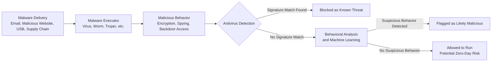

| Topic | Level | Reading Time | Prerequisites |
|---|---|---|---|
| Malware and Antivirus | Beginner | ~30 min | Basic understanding of operating systems and general security concepts |

> **الهدف من الـ Section ده:**  
> هتفهم أشهر أنواع البرمجيات الخبيثة (Malware) وإزاي كل نوع بيتصرف ويتنشر، وإزاي طرق الحماية (Antivirus) اتطورت من الاعتماد على الـ signatures بس، لحد استخدام الـ behavioral analysis والـ machine learning.

## Learning Objectives

By the end of this section, you will be able to:

- Describe how **Keyloggers** operate and distinguish between hardware and software forms.
- Explain the main factors behind the explosive growth of malware over the decades.
- List the common delivery methods attackers use to get malware onto a victim's system.
- Distinguish between different malware families — **Virus**, **Worm**, **Trojan**, **Ransomware**, **Spyware**, **Adware**, **Rootkit**, **Backdoor**, **Fileless Malware**, and **Botnet** — based on how each one spreads and behaves.
- Explain how **signature-based detection** works and why it fails against zero-day malware.
- Explain how modern antivirus combines signatures, **behavioral analysis**, and **machine learning** to detect new threats.

## Table of Contents

- [Keyloggers: Recording Every Keystroke](#keyloggers-recording-every-keystroke)
- [The Explosive Growth of Malware](#the-explosive-growth-of-malware)
- [How Malware Gets Delivered](#how-malware-gets-delivered)
- [Virus: Malware That Needs a Host](#virus-malware-that-needs-a-host)
- [Worm: Malware That Spreads Itself](#worm-malware-that-spreads-itself)
- [Trojan: The Disguise Attack](#trojan-the-disguise-attack)
- [Ransomware: Holding Data Hostage](#ransomware-holding-data-hostage)
- [Spyware: The Silent Watcher](#spyware-the-silent-watcher)
- [Adware: The Annoying (But Less Dangerous) One](#adware-the-annoying-but-less-dangerous-one)
- [Rootkits: The Master of Hiding](#rootkits-the-master-of-hiding)
- [Backdoor: The Secret Entrance](#backdoor-the-secret-entrance)
- [Fileless Malware: Attacks That Leave No Trace](#ileless-malware-attacks-that-leave-no-trace)
- [Botnet: An Army of Hijacked Devices](#botnet-an-army-of-hijacked-devices)
- [Antivirus Method 1: Signature-Based Detection](#antivirus-method-1-signature-based-detection)
- [Antivirus Method 2: Behavior-Based Detection](#antivirus-method-2-behavior-based-detection)
- [Malware Families at a Glance](#malware-families-at-a-glance)
- [Malware Delivery and Detection Diagram](#malware-delivery-and-detection-diagram)
- [Career Connection](#career-connection)
- [Key Terms Glossary](#key-terms-glossary)
- [Summary](#summary)

## Keyloggers: Recording Every Keystroke

**Keylogger** هو أداة (هاردوير أو سوفتوير) بتسجّل بصمت كل ضغطة زر (**key**) إنت بتعملها على الكيبورد بتاعك.

تخيله زي "تيب ريكوردر" مخفي تحت مكتبك، بس بدل ما بيسجّل صوت، هو بيسجّل كل حرف، رقم، ورمز إنت بتكتبه، بالترتيب بالظبط اللي كتبته بيه.

ده معناه إنه يقدر يلتقط:

- أسماء المستخدمين وكلمات المرور وانت بتسجّل دخول للحسابات.
- أرقام الكروت الائتمانية اللي بتتكتب في فورمات الشراء.
- الرسائل الخاصة، الإيميلات، عمليات البحث، حرفيًا أي حاجة إنت بتكتبها.

فيه شكلين أساسيين للـ Keyloggers:

- **Hardware Keyloggers**: جهاز فيزيائي صغير بيتوصل بين الكيبورد والكمبيوتر (زي USB dongle صغير). النوع ده كان أكتر انتشارًا قديمًا لأنه غير مرئي لبرامج الـ antivirus، بما إنه أصلًا مش بيشتغل ككود على الكمبيوتر.
- **Software Keyloggers**: ده الشكل الأكتر شيوعًا حاليًا. هو قطعة كود صغيرة ضارة بتشتغل في الخلفية جوه نظام التشغيل، بتسجّل ضغطات الأزرار بصمت وبتبعتها للمهاجم.

## The Explosive Growth of Malware

لو بصينا على حجم الـ Malware عبر العقود، هنلاحظ نمو انفجاري حقيقي:

| السنة | عدد عينات الـ Malware المعروفة تقريبًا |
|---|---|
| 1990 | حوالي 1,300 عينة |
| 2000 | حوالي 50,000 عينة |
| 2010 | حوالي 200 مليون عينة |
| اليوم | مليارات العينات، مع مئات الآلاف من العينات الجديدة تُكتشف يوميًا |

> [!NOTE]
> النمو الانفجاري ده مش صدفة، وراه أسباب واضحة سنستعرضها بالتفصيل.

ليه الرقم ده انفجر بالشكل ده؟

- الإنترنت بقى منتشر بشكل واسع، وده دّى للمهاجمين شبكة توزيع عالمية.
- الـ Malware بقى مربح ماديًا (مدفوعات الـ ransomware، بيع بيانات مسروقة في أسواق الـ dark web، تأجير botnets كخدمة).
- أدوات صناعة الـ Malware بقت أسهل استخدامًا، المهاجمين ماعادش محتاجين مهارات برمجة عميقة، بقى فيه "malware-building kits" بتتباع في منتديات سرية، بيتم تسميتها أحيانًا **malware-as-a-service**.
- التنويع الآلي للـ Malware (**automated malware variation**): المهاجمين بيستخدموا أدوات بتولّد آليًا ملايين النسخ المعدّلة قليلًا من نفس الـ malware (بتغيير بصمته شوية في كل مرة)، تحديدًا عشان يتفادوا الكشف القائم على الـ signatures، اللي هنشرحه بالتفصيل بعدين.

## How Malware Gets Delivered

فيه عدة طرق أساسية بيصل بيها الـ Malware للضحية فعليًا:

### Email — أشهر وسيلة توصيل

الإيميل هو **الوسيلة رقم واحد** لتوصيل الـ Malware:

- مرفقات ضارة متنكرة كفواتير، سير ذاتية، إشعارات شحن، أو مستندات عاجلة.
- روابط تصيد (**phishing links**) جوه الإيميلات بتوصّل لصفحات تسجيل دخول مزيفة أو بتشغّل تنزيلات تلقائيًا.

> [!IMPORTANT]
> ده بالظبط السبب اللي بيخلي المؤسسات تستثمر بشكل كبير في فلترة ومراقبة الإيميلات، لأنه أكبر باب واحد بيستخدمه المهاجمين.

### Malicious Websites (Domains)

مجرد زيارة موقع مخترق أو مزيف يقدر يشغّل **drive-by download**: الـ Malware بينزّل ويثبّت نفسه فقط بتحميل الصفحة، أحيانًا بيستغل ثغرة في المتصفح من غير ما تضغط على أي حاجة أصلًا.

المهاجمين كمان بيسجّلوا دومينات شبه مطابقة تمامًا للأصلية (مثلًا `micros0ft.com` بصفر بدل حرف o) عشان يخدعوا المستخدمين إنهم يزوروها.

### طرق توصيل تانية

- **USB Drives**: ملفات malware بتشتغل تلقائيًا لما جهاز USB يتوصل (استُخدمت بشكل شهير في هجوم **Stuxnet**).
- **Software Bundling**: ملفات ضارة مخبأة جوه تنزيلات مجانية زي برامج مكركة أو ألعاب مقرصنة.
- **Supply Chain Attacks**: المهاجم بيخترق نظام تحديث تابع لمزوّد برامج شرعي، فالضحايا بيثبّتوا الـ malware متنكر في شكل تحديث رسمي وموثوق.

> [!TIP]
> فكّر في توصيل الـ Malware زي طرق مختلفة يقدر بيها لص يدخل بيتك: من الباب الأمامي (الإيميل)، من شباك مفتوح (موقع ضعيف)، أو بالتنكر كعامل توصيل (تحديث برنامج مزيف).

## Virus: Malware That Needs a Host

**Virus** بيلزّق نفسه بملف شرعي، وبينتشر لما الملف المصاب ده يتنفذ من طرف المستخدم.

مثال: لو ضغطت مرتين على `notepad.exe` وكانت النسخة دي بالتحديد مصابة، إنت بتنفذ الكود الضار الملتصق بيها من غير ما تعرف.

خصائصه الأساسية:

- محتاج **فعل من المستخدم** عشان ينتشر، حد لازم يفتح الملف المصاب أو يشغّل البرنامج المصاب. مش قادر ينتشر لوحده.
- بينتشر بنفس منطق الفيروس البيولوجي: بيصيب مضيف (**host**)، بيتكاثر، وبيدوّر على مضيفين جدد يصيبهم.
- بمجرد ما يبقى نشط، بيفضل مقيم في الذاكرة (**resident in memory**)، يعني حتى بعد ما تقفل البرنامج المصاب، الفيروس ممكن يفضل شغال في الخلفية بيدوّر على ملفات executable تانية على نظامك عشان يصيبها بعد كده.
- تأثيراته: تلف بيانات، ضرر بالملفات، وتدهور ملحوظ في الأداء بسبب استهلاكه لموارد النظام.

> [!NOTE]
> زي الأنفلونزا، محتاج حامل (الملف المصاب) عشان ينتقل فعليًا من شخص لشخص، مش قادر "يتليبورت" لوحده عبر الغرفة.

## Worm: Malware That Spreads Itself

**Worm** بيتكاثر ذاتيًا بالكامل وبينتشر آليًا عبر الشبكات من غير أي تفاعل من المستخدم.

على عكس الـ Virus، الـ Worm هو برنامج مستقل قائم بذاته (**standalone**)، مش محتاج يلتصق بملف تاني عشان ينتقل.

فكّر في الـ Worm أساسًا زي "ماسح ثغرات وله رجلين"، بيمسح الشبكة بشكل نشط بادوّر على أجهزة عندها ثغرة معينة غير مصححة (**unpatched**)، وفي اللحظة اللي بيلاقي فيها واحدة، بيستغلها وينسخ نفسه على الجهاز ده، وبعدين بيكرر العملية من هناك.

خصائصه الأساسية:

- بيستغل الثغرات مباشرة (مفيش phishing، مفيش خداع مستخدم عشان يضغط).
- بيستهلك عرض نطاق ترددي (**bandwidth**) ضخم وهو بيمسح وينتشر، وده ممكن يعطّل الشبكات حتى من غير ما يضر الملفات مباشرة.
- ممكن ينتشر بسرعة شديدة، مثال تاريخي شهير: دودة **SQL Slammer** (2003) أصابت حوالي 75,000 سيرفر عرضة للاستغلال في أقل من 10 دقايق.
- مش محتاج أي تفاعل بشري على الإطلاق، ممكن ينتشر وكل الناس نايمة، من غير أي ضغطة زر من أي إنسان.

> [!TIP]
> لو الـ Virus زي الأنفلونزا (محتاج تلامس بين الأشخاص)، الـ Worm زي نظام رشاشات مياه أوتوماتيكي بيتعطل وبيرش نفسه في كل شباك مفتوح في المبنى، بالكامل لوحده، من غير ما حد يفتح باب له.

## Trojan: The Disguise Attack

سُمّي على اسم حصان طروادة الأسطوري، الـ **Trojan** هو malware متنكر في شكل حاجة شرعية ومرغوبة، زي لعبة مجانية، برنامج تثبيت مكرك، أو مرفق إيميل موسوم بأنه فاتورة.

الفارق الحاسم: الـ Trojan محتاج **المستخدم يوافق ويثبته بنفسه**، وهو مصدّق إنه حاجة آمنة أو مفيدة. بمجرد التثبيت، الـ payload الضار بيتفعّل جنب (أو بدل) اللي كان بيتظاهر إنه هو.

اللي الـ Trojans عادةً بتعمله بمجرد التثبيت:

- بيشتغل كـ **backdoor** (بيدّي المهاجمين وصول عن بعد).
- بيشتغل كـ **downloader**، بيسحب بصمت malware إضافي أخطر بعد التثبيت الأولي.
- بيشتغل كأداة تجسس، بيراقب الضحية بصمت.

> [!IMPORTANT]
> معظم الهجمات الإلكترونية الحديثة بتبدأ بـ **Trojan**. ده عادةً طريقة المهاجم للحصول على "الموطئ الأول" (**first foothold**) جوه النظام، وبعدها بيصعّد لأدوات أخطر زي الـ ransomware أو الـ spyware.

## Ransomware: Holding Data Hostage

**Ransomware** بيشفّر ملفات الضحية باستخدام تشفير قوي جدًا، شبه مستحيل كسره، وبعدين بيطلب دفعة (**ransom**)، غالبًا بعملة رقمية، مقابل مفتاح فك التشفير.

خصائصه الأساسية:

- بيستخدم خوارزميات تشفير قوية، بدون المفتاح الخاص بالمهاجم، الملفات فعليًا مش ممكن تسترجع، حتى من طرف خبراء أمن.
- نقاط الدخول الشائعة: إيميلات تصيد (مرفقات وروابط ضارة) أو اتصالات **RDP (Remote Desktop Protocol)** مخترقة، المهاجمين غالبًا بيعملوا brute-force على كلمات مرور RDP ضعيفة عشان يوصلوا مباشرة للجهاز.
- التأثير ممكن يكون كارثي، الـ ransomware عرف عنه إنه جمّد شركات كاملة، مستشفيات، وحتى حكومات مدن، وأوقف كل العمليات لحد ما الأنظمة تُستعاد.
- الـ ransomware الحديث غالبًا بيضيف **Double Extortion**: المهاجمين مش بس بيشفروا ملفاتك، لكن كمان بيسرقوا نسخة منها أولًا، ويهددوا بتسريب البيانات الحساسة علنًا لو الفدية معتدفعش، حتى لو عندك backups.

> [!TIP]
> أأمن دفاع هو النسخ الاحتياطي الدوري المنتظم (**regular backups**)، يفضّل يكون مخزّن أوفلاين أو في نظام منفصل ومعزول (بحيث الـ ransomware ميقدرش يوصله ويشفره كمان). لو ملفاتك متأمّنة ببكاب في مكان تاني، هجوم الـ ransomware بيبقى مجرد إزعاج بسيط بدل ما يكون كارثة.

> [!NOTE]
> تخيل حد بيخترق بيتك، مبيسرقش أي حاجة، لكن بيلحّم صندوق حديد مقفول حوالين كل أثاثك، ويسيب ورقة مكتوب فيها: "ادفعلي، أو مش هترجع تاخد حاجتك تاني."

## Spyware: The Silent Watcher

**Spyware** هو malware مصمم تحديدًا عشان يراقب نشاط المستخدم بصمت من غير علمه.

قدرات الـ Spyware الشائعة:

- **Keyloggers** (تسجيل كل ضغطة زر، زي ما شرحنا في البداية).
- تسجيل الشاشة والقطات الشاشة (**screenshots**).
- تتبع المتصفح: مراقبة المواقع اللي بتزورها، تاريخ البحث، كلمات المرور المحفوظة.
- سارقات بيانات الاعتماد (**credential stealers**): بيدوّروا تحديدًا على أسماء مستخدمين وكلمات مرور مخزّنة في المتصفحات أو التطبيقات.

الهدف الأساسي: **سرقة الحسابات**، سرقة معلومات شخصية كافية عشان يتم اختطاف حسابات الإيميل، تسجيلات دخول البنوك، السوشيال ميديا، إلخ.

> [!WARNING]
> نقطة مهمة وغالبًا بتتنسى: حلول الـ antivirus التقليدية غالبًا بتكون سيئة في اكتشاف الـ Spyware، ولما تكتشفه، الاكتشاف غالبًا بيكون ضعيف أو غير ثابت، لأن الـ Spyware مصمم تحديدًا عشان يندمج ويقلّد سلوك النظام الطبيعي بدل ما يتصرف بصخب زي الـ virus أو الـ worm.

فيه أدوات متخصصة موجودة تحديدًا عشان تحارب الفئة دي، مثال: **Spybot** أداة مبنية تحديدًا عشان تصطاد الـ spyware والـ adware، لأن الـ antivirus العام غالبًا مش كافي لوحده.

## Adware: The Annoying (But Less Dangerous) One

**Adware** هو malware بيقصف المستخدم بإعلانات مش مرغوب فيها، popups، إعادة توجيه المتصفح، إعلانات محقونة في صفحات ويب مفروض متكونش فيها.

غالبًا بيتم دمجه بصمت جوه برامج مجانية، إنت بتنزّل أداة مجانية، والـ adware بيتثبت بصمت جنبها، أحيانًا من غير أي خيار واضح لرفض التثبيت.

مقارنة بأنواع الـ malware التانية، الـ Adware عمومًا أقل تدميرًا، هو مش عادةً بيسرق بيانات البنك بتاعتك أو بيشفر ملفاتك.

لكن ميستهناش بيه تمامًا:

- ممكن يبطّئ نظامك ومتصفحك بشكل ملحوظ.
- بعض أنواع الـ Adware كمان بتتبع عادات تصفحك عشان تقدّم إعلانات أكتر استهدافًا (وتدخلًا)، وده بيخلط الخط الفاصل بين الـ Adware والـ Spyware.
- بعض عائلات الـ Adware عرف عنها إنها بتشتغل كبوابة (**gateway**)، بتنزّل بصمت malware أخطر لاحقًا.

## Rootkits: The Master of Hiding

**Rootkit** هو malware مصمم تحديدًا عشان يخبّي نفسه، وأي malware تاني مثبت جنبه، من الاكتشاف.

اللي بيخلي الـ Rootkits خطيرة بشكل خاص هو **المكان** اللي بتشتغل فيه:

- بتتضمن نفسها في مستويات منخفضة جدًا من النظام، الـ **kernel** (نواة نظام التشغيل) أو حتى الـ **boot sector** (الكود اللي بيشتغل قبل ما نظام التشغيل يكتمل تحميله أصلًا).
- الشغل على المستوى ده معناه إن الـ rootkit يقدر حرفيًا يعترض ويتلاعب في اللي نظام التشغيل نفسه بيبلّغ عنه، مثلًا، يقدر يخبّي ملفاته من قائمة الملفات، أو يخبّي عمليته الشغالة من الـ task manager، فعليًا بيكدب مباشرة على الأدوات اللي إنت عادةً بتستخدمها عشان تكتشفه.

بسبب كده، الـ Rootkits بتوفر وصول مستمر (**persistent**) وشديد الخفاء للمهاجمين، غالبًا بتُستخدم عشان يحافظوا على تحكم طويل المدى في نظام مخترق من غير ما يتلاحظوا.

هي معروفة بصعوبة إزالتها الشديدة، في كتير من الحالات الخطيرة، متخصصي الأمن بينصحوا بمسح نظام التشغيل بالكامل وإعادة تثبيته من الصفر، لأنك فعليًا مش تقدر تثق في أي حاجة النظام المصاب بيبلّغها عن نفسه بعد كده.

> [!WARNING]
> لو باقي أنواع الـ Malware زي لص مختبي في دولابك، الـ Rootkit زي لص أعاد برمجة كاميرات مراقبة بيتك تظهر غرفة فاضية، حتى لو بصيت مباشرة على التسجيل، مش هتشوفه.

## Backdoor: The Secret Entrance

**Backdoor** هو طريقة مخفية بتسمح للمهاجم بالوصول عن بعد لنظام معين، متجاوزًا آلية التحقق العادية بالكامل (من غير الحاجة لاسم مستخدم وكلمة مرور صحيحة).

الـ Backdoors غالبًا بيتم تثبيتها من طرف الـ **Trojans** كـ payload أساسي، بمجرد ما الـ Trojan يخدعك ويخليك تثبته، من أول أفعاله غالبًا إنه يفتح بصمت المدخل المخفي ده للمهاجم.

بمجرد ما الـ Backdoor يبقى موجود، المهاجم عادةً يقدر:

- ينفذ أوامر عن بعد على جهاز الضحية، وكأنه قاعد قدام الكيبورد بنفسه.
- يسرق بيانات مباشرة من النظام.
- ينشر malware إضافي وقت ما هو عايز.

> [!NOTE]
> تخيل لص، في أول زيارة له، مش بيسرق حاجة، هو بس بيركّب بصمت باب إضافي مخفي في مؤخرة بيتك، محدش عارف عنه غيره، عشان يدخل ويخرج بحرية، أي وقت، من غير ما يحتاج مفتاح أو يشغّل إنذار.

## Fileless Malware: Attacks That Leave No Trace

**Fileless Malware** هي تقنية حديثة ومتقدمة مبتعتمدش على حفظ ملفات تقليدية على القرص أصلًا.

بدل كده، هي بتشتغل مباشرة في الذاكرة (**RAM**)، وغالبًا بتستغل أدوات نظام موثوقة وشرعية موجودة أصلًا جوه نظام التشغيل، أشهرها **PowerShell** (أداة السكربتة والأتمتة المدمجة في Windows) أو أدوات إدارية أصلية تانية.

ليه ده فعّال جدًا للمهاجمين:

- الـ antivirus التقليدي غالبًا بيشتغل عن طريق مسح الملفات على القرص، لو مفيش ملف ضار اتكتب على القرض أصلًا، غالبًا مفيش حاجة للـ antivirus يمسحها أو يعلّم عليها.
- بما إنه عايش في الذاكرة، هو ممكن يسيب أثر جنائي (**forensic trace**) شبه معدوم، لو عملت restart للجهاز (وده بيمسح الـ RAM) قبل ما التحقيق يبدأ، الدليل ممكن فعليًا يختفي.

التقنية دي علامة مميزة (**hallmark**) لهجمات الـ **APT (Advanced Persistent Threat)**، المصطلح المستخدم لمجموعات مهاجمين متطورة، غالبًا مدعومة من دول أو عالية المهارة، بتُعطي أولوية للبقاء مخفية لفترات طويلة على حساب الضرر السريع والصاخب.

> [!TIP]
> بدل ما يسيب بصمة على غرض مسروق (ملف على القرص)، المهاجم زي شبح بيهمس تعليمات مباشرة في نظام الإنتركم الخاص بالبيت (PowerShell)، مستخدمًا معدات البيت الموثوقة نفسها عشان تعمل الشغل القذر، وبعدين بيختفي من غير ما يسيب أي حاجة مادية وراه.

## Botnet: An Army of Hijacked Devices

**Botnet** هو مجموعة ضخمة من الأجهزة المخترقة (**bots** أو **zombies**)، كلها بيتحكم فيها بصمت عن بعد مهاجم واحد، معروف باسم **botmaster**.

الأجهزة المصابة دي ممكن تشمل أجهزة كمبيوتر عادية، لكن بشكل متزايد كمان بتشمل أجهزة **IoT**، كاميرات مراقبة، routers، أجهزة منزلية ذكية، لأن دي غالبًا بتكون ضعيفة الحماية ونادرًا ما بيتم مراقبتها من طرف أصحابها.

> [!IMPORTANT]
> ده بيرجعنا مباشرة لموضوع **SYN Flood** اللي درسناه قبل كده، الـ Botnet هي بالظبط نوع البنية التحتية اللي المهاجم بيستخدمها عشان يشن هجمات واسعة النطاق زي دي.

استخدامات شائعة للـ Botnet:

- هجمات **DDoS**: بيأمر آلاف الـ bots إنهم يغرقوا هدف معين في نفس الوقت (زي هجوم الـ SYN flood اللي درسناه).
- إرسال **Spam**: توزيع جماعي لإيميلات تصيد أو إعلانات من آلاف الأجهزة المصابة المختلفة في نفس الوقت، وده بيصعّب حظرها بمجرد وضع مصدر واحد في القائمة السوداء.
- نشر **Ransomware**: استخدام الـ botnet كآلية توزيع لنشر ransomware لعدد كبير من الأهداف في نفس الوقت.

> [!TIP]
> الـ botmaster زي محرك عرائس بيتحكم في آلاف العرائس في نفس الوقت من طاقم خيوط واحد، كل عروسة فردية (جهاز مصاب) ممكن تبان غير ضارة لوحدها، لكن القوة المجتمعة المنسقة ممكن تكون مدمرة.

## Antivirus Method 1: Signature-Based Detection

الطريقة دي مرتبطة مباشرة بمفهوم شرحناه قبل كده: حساب **hash** الملف (زي SHA-256 أو MD5).

آلية عمل الـ signature-based antivirus:

1. الـ antivirus بيحسب الـ hash بتاع الملف اللي بتحاول تفتحه أو تشغّله.
2. بيقارن الـ hash ده بقاعدة بيانات ضخمة من hashes الـ malware المعروف.
3. لو فيه تطابق، بيتعلّم عليه فورًا كضار، وبيتحظر أو بيتم التنبيه عليه.
4. لو مفيش تطابق، الملف بيتعلّم عليه كنظيف، وبيُسمح له بالتشغيل.

بعيدًا عن الـ hashes بس، الكشف القائم على الـ signatures كمان بيدوّر على:

- أنماط كود فريدة (**unique code patterns**): تسلسلات كود محددة استخرجها محللو الـ malware من عينات معروفة.
- نصوص فريدة (**unique strings**): قطع نص محددة مضمّنة جوه الكود الضار نفسه (زي رسالة خطأ مميزة أو أمر معين الـ malware بيستخدمه).

> [!WARNING]
> بما إن malware جديد بيتصنع باستمرار (فتكر النمو الانفجاري اللي شرحناه)، شركات الـ antivirus لازم تحدّث قواعد بيانات الـ signatures بتاعتها بتردد عالي جدًا، غالبًا كل بضع دقايق، بس عشان يواكبوا الوتيرة دي.

الضعف الأساسي في الطريقة دي: هي بس تقدر تمسك malware **اتشاف وتحلل وأُضيف قبل كده** لقاعدة البيانات في مكان ما في العالم. أي malware جديد تمامًا معتصفش أبدًا قبل كده (غالبًا بيتسمى **zero-day malware**) هيعدي تمامًا من غير ما يتلاحظ من الكشف القائم على الـ signatures، لأنه ببساطة مفيش سجل مطابق موجود يتقارن بيه لحد دلوقتي.

## Antivirus Method 2: Behavior-Based Detection

بما إن الكشف القائم على الـ signatures بس ماعدش كافي ضد حجم وتطور الـ malware النهارده، المؤسسات الناضجة **مش بتعتمد على الـ signature-based detection بس**.

حلول مكافحة الـ malware الحديثة بتجمع بين ثلاث طبقات دفاع:

1. **Signature-Based Detection**: الطريقة التقليدية القائمة على الـ hash ومطابقة الأنماط، لسه مفيدة جدًا للكشف السريع والفعّال عن تهديدات معروفة اتحللت قبل كده.
2. **Behavioral Analysis**: بدل ما نتحقق بس من "شكل" الملف، الطريقة دي بتراقب "إيه اللي الملف فعليًا بيعمله" وهو شغال. مثلًا: هل البرنامج ده فجأة بيحاول يشفر مئات الملفات بسرعة؟ هل بيحاول يعدّل إعدادات نظام حرجة؟ هل بيحاول يعطّل الـ antivirus نفسه؟ دي إشارات خطر سلوكية كبيرة (**behavioral red flags**)، بغض النظر عن كون الملف مطابق لأي signature معروف ولا لأ.
3. **Machine Learning**: مدرّب على مجموعات بيانات ضخمة من برمجيات معروفة إنها ضارة وأخرى معروفة إنها آمنة، نماذج الـ machine learning تقدر تحدد خصائص وأنماط مشبوهة في ملفات جديدة تمامًا، معتشافش قبل كده، وده أساسًا بيعمل تنبؤ إحصائي مبني على معلومات إن الحاجة دي محتمل تكون ضارة، حتى من غير تطابق دقيق مع signature معينة.

> [!IMPORTANT]
> الميزة الرئيسية للنهج المتعدد الطبقات ده: إنه يقدر يكتشف malware جديد تمامًا معتشافش قبل كده (**zero-days**) عن طريق التركيز على السلوك والخصائص المشبوهة، بدل ما يتطلب إن الـ malware يكون أصلًا مسجّل في مكان ما.

> [!TIP]
> بدل ما نتحقق بس من دفتر صور المطلوبين (signature-based)، الأمان الحديث كمان عنده حارس بيراقب إزاي الناس فعليًا بيتصرفوا في المبنى (behavioral analysis)، زي حد بيحاول يفتح كل مقابض الأبواب في الممر بشكل مريب، بالإضافة لمحلل نفسي مدرّب (machine learning) يقدر يعلّم على حد إنه مريب بناءً على أنماط دقيقة، حتى لو الشخص ده أبدًا معتقبضش عليه قبل كده.

## Malware Families at a Glance

الجدول التالي بيلخّص أهم الفروق بين أنواع الـ Malware المختلفة:

| النوع | يحتاج ملف مضيف | يحتاج فعل من المستخدم | السلوك الأساسي |
|---|---|---|---|
| **Virus** | نعم | نعم | يلتصق بملف وينتشر عند تنفيذه |
| **Worm** | لا | لا | يتكاثر ذاتيًا وينتشر عبر استغلال الثغرات |
| **Trojan** | لا | نعم | يتنكر كبرنامج شرعي ليخدع المستخدم للتثبيت |
| **Ransomware** | يعتمد على وسيلة الدخول | يعتمد على وسيلة الدخول | يشفر الملفات ويطلب فدية |
| **Spyware** | يعتمد على وسيلة الدخول | يعتمد على وسيلة الدخول | يراقب نشاط المستخدم بصمت |
| **Adware** | لا، غالبًا مُجمّع مع برامج | يعتمد على وسيلة الدخول | يعرض إعلانات غير مرغوبة |
| **Rootkit** | لا | يعتمد على وسيلة الدخول | يخفي نفسه وملفات أخرى من الاكتشاف |
| **Backdoor** | لا، غالبًا payload لـ Trojan | يعتمد على وسيلة الدخول | يوفر وصول عن بعد يتجاوز التحقق |
| **Fileless Malware** | لا | يعتمد على وسيلة الدخول | يعمل في الذاكرة فقط، يستغل أدوات النظام |
| **Botnet** | لا | لا (بعد الإصابة الأولية) | شبكة أجهزة مخترقة تُستخدم لهجمات جماعية |

## Malware Delivery and Detection Diagram

المخطط التالي بيوضح رحلة الـ Malware من التوصيل وحتى الكشف عنه:

## Career Connection

فهم عائلات الـ Malware وطرق الكشف عنها أساسي جدًا في مسارات مهنية متعددة:

- في مجال **SOC**، التمييز بين أنواع الـ malware المختلفة بيساعد في تحديد أولوية التنبيهات وسرعة الاستجابة.
- في مجال **Malware Analysis** و **Reverse Engineering**، فهم آلية عمل كل نوع أساسي لتحليل عينات جديدة واستخراج الـ signatures منها.
- في مجال **Digital Forensics**، التعامل مع تهديدات زي الـ **Fileless Malware** بيتطلب مهارات متخصصة لجمع الأدلة من الذاكرة قبل ما تختفي.
- في مجال **Incident Response**، التعرف السريع على نوع الـ malware (زي ransomware مقابل rootkit) بيحدد استراتيجية الاحتواء والاستجابة المناسبة.

## Key Terms Glossary

| Term | Definition |
|---|---|
| **Keylogger** | أداة تسجّل كل ضغطة زر على الكيبورد بصمت. |
| **Virus** | برمجية خبيثة تلتصق بملف شرعي وتنتشر عند تنفيذه من طرف المستخدم. |
| **Worm** | برمجية خبيثة تتكاثر ذاتيًا وتنتشر عبر الشبكات دون تفاعل بشري. |
| **Trojan** | برمجية خبيثة متنكرة كبرنامج شرعي لخداع المستخدم لتثبيتها طوعًا. |
| **Ransomware** | برمجية خبيثة تشفر ملفات الضحية وتطلب فدية مقابل فك التشفير. |
| **Spyware** | برمجية خبيثة مصممة لمراقبة نشاط المستخدم سرًا. |
| **Adware** | برمجية خبيثة تعرض إعلانات غير مرغوب فيها بشكل مزعج. |
| **Rootkit** | برمجية خبيثة تخفي نفسها وأي برمجيات أخرى من الاكتشاف بالعمل على مستويات منخفضة من النظام. |
| **Backdoor** | طريقة مخفية تتيح للمهاجم وصولًا عن بعد متجاوزًا آليات التحقق العادية. |
| **Fileless Malware** | برمجية خبيثة تعمل بالكامل في الذاكرة دون كتابة ملفات على القرص. |
| **Botnet** | مجموعة من الأجهزة المخترقة يتحكم بها مهاجم واحد لتنفيذ هجمات جماعية. |
| **Signature-Based Detection** | طريقة كشف تعتمد على مطابقة الملف مع قاعدة بيانات من التوقيعات (hashes وأنماط) المعروفة. |
| **Zero-Day Malware** | برمجية خبيثة جديدة تمامًا لم يتم تحليلها أو تسجيلها بعد في أي قاعدة بيانات. |
| **Behavioral Analysis** | طريقة كشف تراقب سلوك البرنامج أثناء التشغيل بدلًا من الاعتماد على شكله فقط. |
| **Machine Learning (in Antivirus)** | نماذج مدربة على بيانات ضخمة للتنبؤ باحتمالية كون ملف جديد ضارًا بناءً على أنماطه. |

## Summary

- **Keyloggers** بتسجّل كل ضغطة زر، بتوجد كهاردوير (نادر النهارده) أو سوفتوير (الأكثر شيوعًا)، وبتُستخدم لسرقة بيانات اعتماد أو مراقبة موظفين بشكل مصرّح به.
- الـ **Malware** نما بشكل انفجاري من حوالي 1,300 عينة في 1990 لمئات الملايين والمليارات النهارده، بسبب الربحية وسهولة أدوات الصناعة.
- بيتم توصيل الـ Malware أساسًا عن طريق الإيميل والمواقع الضارة، بالإضافة لأجهزة USB وتحديثات البرامج المخترقة.
- كل نوع من الـ Malware له سلوك مميز: **Virus** (محتاج ملف مضيف وفعل مستخدم)، **Worm** (ينتشر ذاتيًا بدون مستخدم)، **Trojan** (متنكر، يخدع المستخدم للتثبيت)، **Ransomware** (يشفر ويبتز)، **Spyware** (يراقب سرًا)، **Adware** (إعلانات غير مرغوبة)، **Rootkit** (يخفي كل حاجة)، **Backdoor** (وصول سري عن بعد)، **Fileless Malware** (ذاكرة فقط، صعب التتبع)، و **Botnet** (جيش من الأجهزة المخترقة لهجمات واسعة النطاق).
- الـ Antivirus تطوّر من الاعتماد على **signature-based detection** بس (سريع، لكن أعمى تجاه التهديدات الجديدة/المجهولة) لنهج حديث مدمج يستخدم signatures + behavioral analysis + machine learning، وده بيسمح باكتشاف malware جديد تمامًا بناءً على سلوكه، مش بس شكله.

