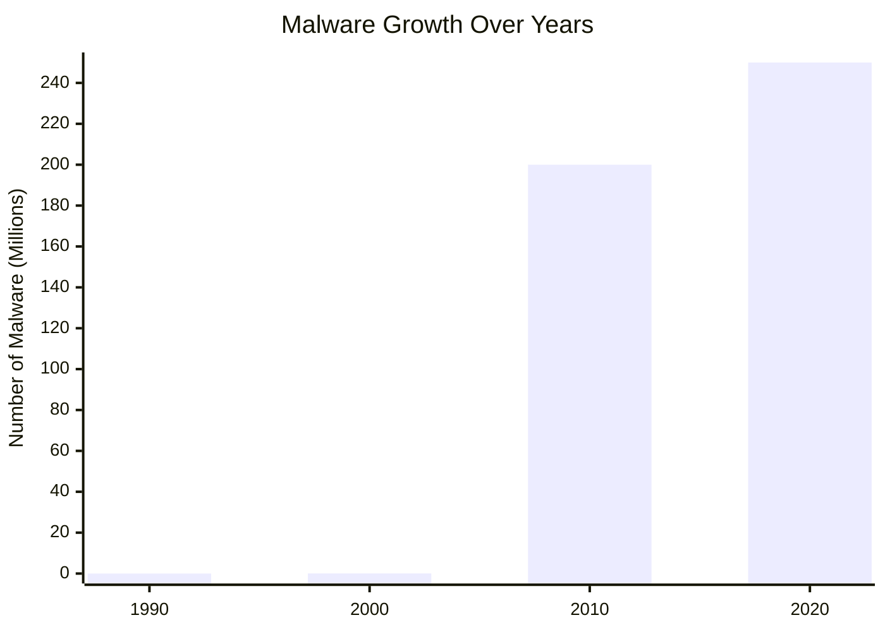
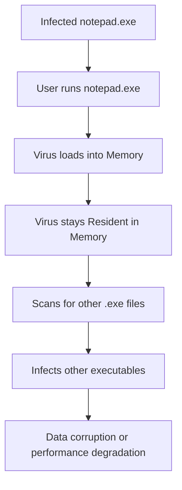
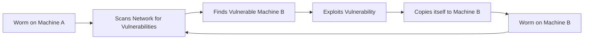
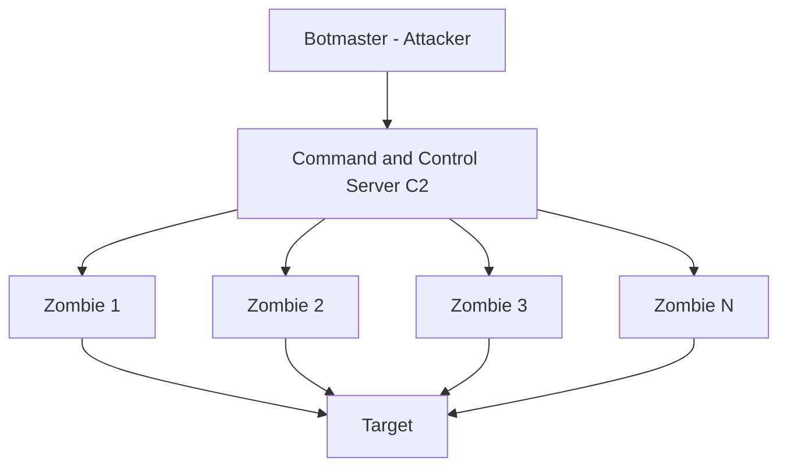

> **الهدف من الـ Section ده:**  
>هنتعرف على عالم Malware & Threats وأنواع البرمجيات الخبيثة المختلفة اللي بتستهدف الأجهزة والأنظمة.

---

## Table of Contents

- [Malware \& Threats](#malware--threats)
  - [Keyloggers](#keyloggers)
  - [Types of Malware](#types-of-malware)
- [Summary](#summary)

---

## Malware & Threats

### Keyloggers

الـ **Keylogger** هو Tool بيسجل كل ضغطة كيبورد الـ User يعملها.

#### أنواعه

| النوع | الوصف |
|---|---|
| **Hardware Keylogger** | Device صغير بيتوصل بين الكيبورد والكمبيوتر |
| **Software Keylogger** | برنامج بيتثبت على الجهاز ويسجل كل الضغطات |

#### الاستخدامات

- **ضارة:** سرقة Usernames والـ Passwords والبيانات الحساسة
- **شرعية:** المنظمات ممكن تستخدمه لمراقبة نشاط الموظفين

---

### Types of Malware

#### نمو الـ Malware عبر السنين

#### طرق التوصيل

الـ **Email** هو أكثر طريقة شائعة لتوصيل الـ Malware. بعدها:
- الـ Malicious Domains/Websites
- الـ Removable Media
- الـ Vulnerable Software

#### أنواع الـ Malware بالتفصيل

---

##### Virus

**الـ Virus** هو Malware بيلصق نفسه بـ Files شرعية وبيتنشر لما الـ File المصاب يتفتح.

**الخصائص:**
- محتاج User Action عشان يتنشر (فتح File أو تشغيل برنامج)
- بيفضل في الـ Memory حتى بعد إغلاق الـ File المصاب
- بيسبب Data Corruption وبطء في الأداء

---

##### Worm

**الـ Worm** بيتنشر تلقائياً على الشبكات **من غير أي تدخل من المستخدم**.

**الفرق الأساسي عن الـ Virus:**
- الـ Virus بيحتاج File عشان يلصق بيه
- الـ Worm هو **Executable مستقل** بيتنشر بنفسه

**الخصائص:**
- بياكل الـ Bandwidth وممكن يـ Crash Systems
- بيتنشر بسرعة كبيرة جداً
- مش محتاج User Interaction

---

##### Trojan

**الـ Trojan** هو Malware بيتظاهر إنه Software شرعي (لعبة، Installer، Attachment).

**الخصائص:**
- محتاج User يثبته (Requires User Interaction)
- بيعمل كـ Backdoor أو Downloader أو Spying Tool
- معظم الـ Modern Attacks بتستخدم Trojans عشان تكسب **Initial Access**

---

##### Ransomware

**الـ Ransomware** بيشفر ملفاتك ويطلب فدية عشان يفكها.

**الخصائص:**
- بيستخدم **Strong Encryption** مش ممكن يتكسر بدون الـ Key
- غالباً بييجي عن طريق Phishing Emails أو RDP Compromise
- ممكن يوقف شركات كاملة

> [!TIP]
> أأمن حل ضد الـ Ransomware هو **عمل Backup دوري** لملفاتك على Storage منفصل ومنقطع عن الشبكة (Offline Backup).

---

##### Spyware

**الـ Spyware** مصمم لمراقبة نشاط الـ User سراً.

**أنواعه:**
- Keyloggers (تسجيل ضغطات الكيبورد)
- Screen Recording
- Browser Tracking
- Credential Stealers

> [!WARNING]
> الـ Antivirus العادي غالباً مش بيكتشف الـ Spyware بشكل كافي. الـ Tools المتخصصة زي **Spybot** و**Anti-Adware** Tools أكتر فعالية ضده.

---

##### Adware

**الـ Adware** بيعرض إعلانات مزعجة (Popups, Redirects).

**الخصائص:**
- غالباً بييجي مع Free Applications
- مزعج بس أقل تدميراً من باقي الـ Malware

---

##### Rootkit

**الـ Rootkit** هو Malware بيخبي نفسه والـ Malwares التانية على الـ System.

**الخصائص:**
- بيشتغل على مستويات منخفضة جداً: **Kernel** أو **Boot Sector**
- بيوفر Persistent وغير قابل للاكتشاف Access
- صعب جداً إزالته

> [!IMPORTANT]
> الـ Rootkit بيخبي نفسه من الـ Operating System نفسه. يعني حتى الـ Antivirus ممكن ميشوفوش لأنه بيشتغل على Level أعمق. الـ Removal غالباً بيحتاج Boot من External Media.

---

##### Backdoor

**الـ Backdoor** هو طريقة مخفية للوصول للـ System عن بعد بدون Authentication.

**الخصائص:**
- غالباً بيتثبت عن طريق Trojans
- بيخلي الـ Attacker يشغل Commands ويسرق Data وينشر المزيد من الـ Malware

---

##### Fileless Malware

**الـ Fileless Malware** مش بيعتمد على Files — بدلاً من كده بيستخدم الـ Memory وأدوات شرعية زي **PowerShell**.

**الخصائص:**
- صعب جداً الاكتشاف بالـ Antivirus التقليدي
- بيسيب أثر ضئيل جداً على الـ Disk
- غالباً جزء من **APT (Advanced Persistent Threat) Attacks**

---

##### Botnet

**الـ Botnet** هو مجموعة Devices متأثرة بـ Malware تحت سيطرة Attacker واحد (الـ Botmaster).

**الاستخدامات:**
- **DDoS Attacks**
- إرسال **Spam Emails**
- نشر **Ransomware**
- تنفيذ **SYN Flood Attacks**

#### مقارنة شاملة بين أنواع الـ Malware

| النوع | التنشر | يحتاج User | الهدف الأساسي | صعوبة الاكتشاف |
|---|---|---|---|---|
| Virus | عبر ملفات | نعم | إتلاف البيانات | متوسطة |
| Worm | ذاتي عبر الشبكة | لا | الانتشار السريع | متوسطة |
| Trojan | المستخدم يثبته | نعم | Initial Access | متوسطة |
| Ransomware | Phishing / RDP | غالباً | الفدية المالية | متوسطة |
| Spyware | مخفي مع Apps | غالباً | سرقة المعلومات | عالية |
| Adware | مع Free Apps | نعم | الإزعاج / الإعلانات | منخفضة |
| Rootkit | عبر Exploits | لا | إخفاء نفسه | عالية جداً |
| Backdoor | عبر Trojans | لا | Remote Access | عالية |
| Fileless | في الذاكرة | لا | APT Attacks | عالية جداً |
| Botnet | Malware | لا | DDoS / Spam | متوسطة |

---

## Summary

**Malware:**
- 10 أنواع رئيسية من الـ Malware لكل منها طريقة عمل وهدف مختلف
- Email هو أكتر طريقة شائعة لتوصيل الـ Malware
- Fileless Malware والـ Rootkits هم الأصعب في الاكتشاف
