> **الهدف من الـ Section دي:** هتفهم إزاي الـ Attackers بيهاجموا الـ Networks والـ Systems من كل الاتجاهات — سواء عن طريق الـ Wireless، أو الـ Social Engineering، أو الـ Malware، أو حتى بيستغلوا Protocols أساسية زي ARP وDNS. وهتعرف كـ Defender تتعامل مع الـ Threats دي وتفهم ازاي تشتغل عشان تقدر تكتشفها.

---


## Table of Contents

- [VPN \& Secure Tunneling](#vpn--secure-tunneling)
  - [VPN — Virtual Private Network](#vpn--virtual-private-network)
- [Wireless Security](#wireless-security)
  - [Wireless Attacks](#wireless-attacks)
  - [Rogue Access Points](#rogue-access-points)
- [IoT Security](#iot-security)
  - [IoT Devices and Their Security](#iot-devices-and-their-security)
- [Social Engineering \& Deception Attacks](#social-engineering--deception-attacks)
  - [Social Engineering](#social-engineering)
  - [Phishing \& Spear Phishing](#phishing--spear-phishing)
  - [Watering Hole Attack](#watering-hole-attack)
- [Malware \& Threats](#malware--threats)
  - [Keyloggers](#keyloggers)
  - [Types of Malware](#types-of-malware)
- [Defense \& Detection](#defense--detection)
  - [Antivirus Solutions](#antivirus-solutions)
- [Summary](#summary)

---

## VPN & Secure Tunneling

### VPN — Virtual Private Network

الـ VPN هو من أهم الـ Tools اللي بتُستخدم في الـ Cybersecurity عشان تأمن الاتصال بين شبكتين عبر الـ Internet.

#### ما هو الـ VPN؟

الـ **VPN (Virtual Private Network)** هو تقنية بتخلي جهازين أو شبكتين منفصلتين يتواصلوا مع بعض كأنهم على نفس الـ Private Network — حتى لو الاتصال بينهم بيعدي على الـ Internet العام.

```
[Office A] ──── Encrypted Tunnel (IPSec) ──── [Office B]
               over Public Internet
```

#### ليه الـ VPN مهم؟

قبل الـ VPN، الشركات كانت بتستخدم **Leased Lines** — يعني خطوط مخصصة بتربط الفروع ببعض مباشرةً. المشكلة إن:

- الـ Leased Lines كانت **بتاخد شهور عشان تتركب**
- وكانت **تكلف آلاف الدولارات شهرياً**

الـ VPN حل المشكلة دي بتكلفة أقل بكتير باستخدام الـ Internet الموجود أصلاً.

> [!IMPORTANT]
> الـ VPN مش بس للاتصال بشبكة خارجية. كتير من المنظمات بتستخدمه **داخل شبكتها الداخلية نفسها** عشان تضمن الـ Confidentiality والـ Integrity للمعلومات الحساسة جداً بين أجزاء الشبكة المختلفة.

#### إزاي بيشتغل الـ VPN؟

الـ VPN بيستخدم بروتوكول **IPSec** عشان يعمل تشفير للـ Traffic. الـ IPSec بيشتغل على الـ **Layer 3 (Network Layer)**، يعني كل الـ Traffic اللي بيعدي من خلاله بيتشفر بالكامل.

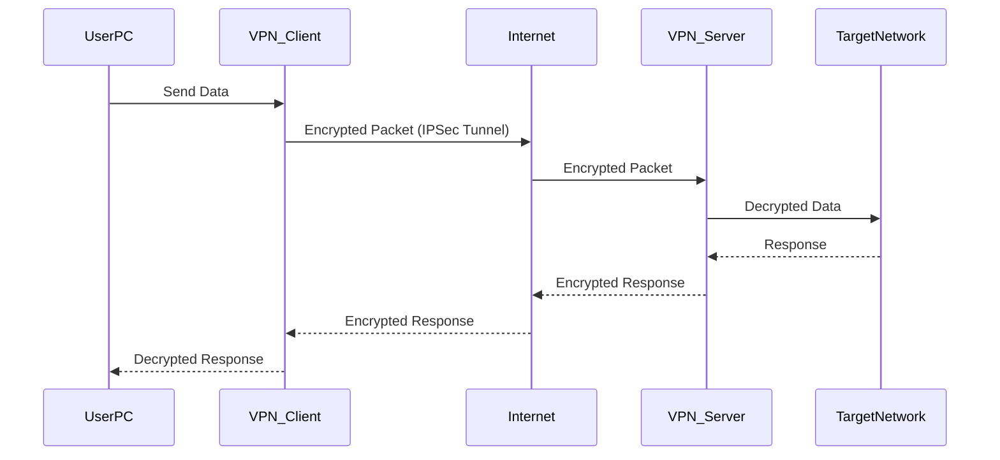

#### الـ VPN Tunnel

بعد ما الـ VPN Connection بتتأسس، **أي Application** زي الـ Email أو الـ Web Browser أو الـ FTP ممكن يستخدم الـ Tunnel دا كأن الكمبيوتر متوصل مباشرةً بالـ Local Network.

> [!TIP]
> لما تيجي تاخد الـ Sniffing على الـ Network وحد مستخدم VPN، مش هتقدر تشوف أي Data حقيقية — كل اللي هتشوفه Encrypted Traffic مش مفيد.

#### الـ VPN في الـ Wireless Networks

> [!NOTE]
> لما البيانات توصل للـ Access Point، بتتفك تشفيرها وبتتبعت على الـ Wire بـ **Plaintext**. عشان كده، الحل الأمثل هو استخدام VPN Tunnel بين الـ Access Point والشبكة المقصودة عشان يضمن **End-to-End Encryption**.

#### مقارنة: Leased Line vs VPN

| المعيار | Leased Line | VPN |
|---|---|---|
| التكلفة | آلاف الدولارات شهرياً | أقل بكتير |
| وقت الإعداد | شهور | دقائق |
| الأمان | عالي (مخصص) | عالي (مشفر) |
| المرونة | محدودة | مرنة جداً |
| الاعتماد على الإنترنت | لا | نعم |

---

## Wireless Security

### Wireless Attacks

الـ Wireless Networks بطبيعتها أصعب في التأمين من الـ Wired Networks — لأن الـ Air مش ممكن تتحكم فيه.

#### معايير الـ WiFi

| الاسم القديم | الاسم الجديد |
|---|---|
| 802.11n | Wi-Fi 4 |
| 802.11ac | Wi-Fi 5 |
| 802.11ax | Wi-Fi 6 |

#### مشكلة التشفير في الـ Wireless

الـ WiFi بيستخدم Encryption عشان الـ Packets بتطير في الهوا وكلها ممكن يشوفها أي حد. المعايير الأمنية الموجودة:

| المعيار | الحالة | السبب |
|---|---|---|
| **WEP** | Deprecated / مكسور | الـ 40-bit Key قابل للتوقع بسبب ضعف الـ Randomness |
| **WPA** | Deprecated / مكسور | نفس مشكلة WEP بس بـ 128-bit (بياخد وقت أكثر بس نفس المشكلة) |
| **WPA2** | مقبول | تشفير أقوى، بيحتاج Processing أعلى |
| **WPA3** | الأفضل حالياً | الأحدث والأكثر أماناً |

> [!WARNING]
> للأسف لحد دلوقتي في بيوتنا كتير من الـ Routers بتيجي بـ WEP أو WPA ضعيف! السبب إن الـ Hardware الرخيص اللي بتبعته الـ ISPs مش بيقدر يتحمل تكلفة الـ Processing للـ WPA2/WPA3. وده خطر حقيقي.

#### المشاكل الأساسية في الـ Wireless

**1. الـ Management Frames مش ممكن تتشفر**

في الـ Wireless، في معلومات معينة لازم تبقى Unencrypted عشان الـ WiFi يشتغل — زي الـ Management Frames.

> [!IMPORTANT]
> الـ MAC Address مش ممكن يتشفر. لو اتشفر، الـ WiFi هيبطل يشتغل. كل Device بيحتاج يشوف الـ Destination MAC Address عشان يعرف هل الـ Packet ده ليه أم لا.

**2. الـ Broadcast Nature**

في الـ Wireless، **كل الأجهزة بتشوف كل الـ Packets**. كل Device بيعمل كده:

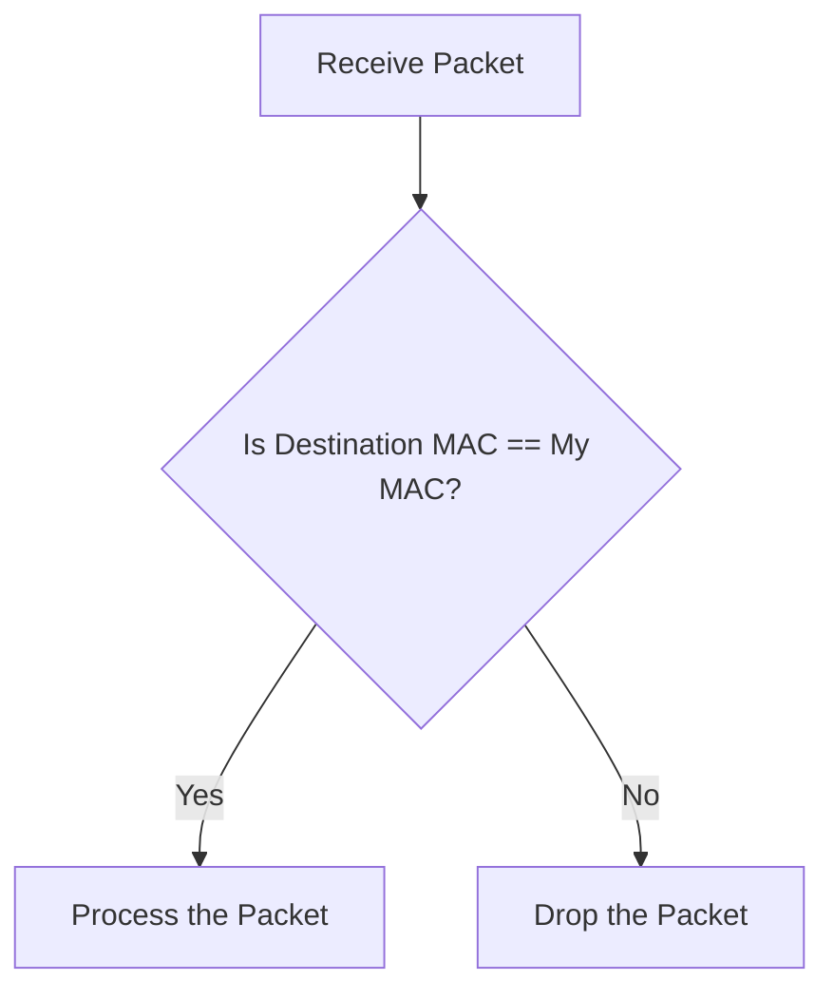

**3. الـ Beaconing Frames والـ SSID**

الـ Access Point بيبعت **Beaconing Frames** كل بضع ثواني. الـ Frame دي بتحتوي على الـ **SSID (Service Set Identifier)** — اسم الـ WiFi Network — وهي مش ممكن تتشفر لأنها بتُستخدم لتأسيس الاتصال.

> [!NOTE]
> زمان كان المستشار يقول "اعمل Hide للـ SSID عشان الـ Attackers ميشوفوكش." دلوقتي ده فكرة غلط. لأن لما حد بيحاول يكونيكت بالـ Network، الـ SSID بيتبعت في الـ Connection Process. يعني الـ Attacker بيستنى حد يتكونيكت وبيشوفه. إنت بس بتعمل الموضوع أصعب شوية على حسابك انت كمان — مش أصعب على الـ Attacker.

**4. الـ MAC Filtering**

ممكن تعمل Whitelist للـ MAC Addresses المسموح ليها تتكونيكت — بس:

> [!WARNING]
> الـ MAC Addresses مش متشفرة، يعني أي Attacker يقدر **يشوف** MAC Address مسموح ليه وبعدين **يـ Spoof** نفس الـ MAC عشان يدخل. الحل ده بيوفر حماية وهمية.

#### الـ Flow الكامل للـ Wireless Attack

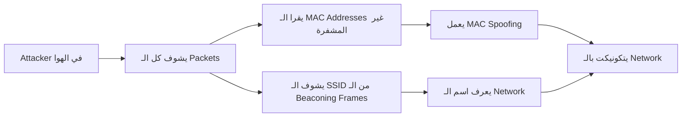

---

### Rogue Access Points

**الـ Rogue Access Point** هو الـ Attacker نفسه بيعمل نفسه WiFi مجاني عشان يخلي الناس يتكونيكتوا بيه.

#### إزاي بيشتغل الـ Attack؟

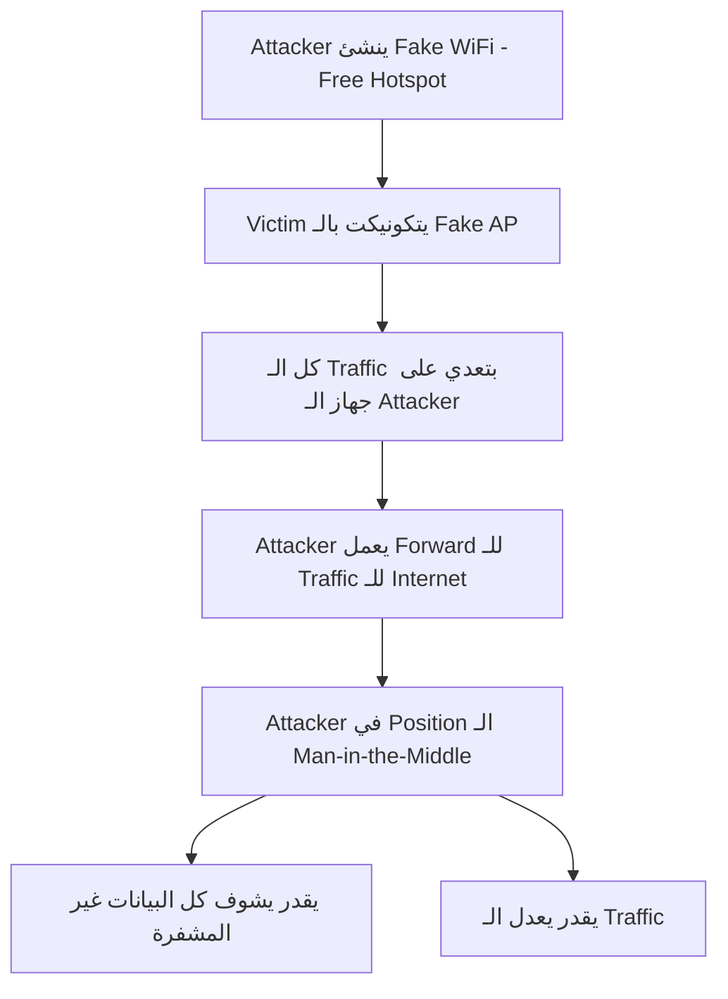

> [!WARNING]
> أي WiFi "مجاني" في أماكن عامة ممكن يكون Rogue AP. دايماً تأكد من الـ Network اللي بتتكونيكت بيه قبل ما تدخل أي Data حساسة.

---

## IoT Security

### IoT Devices and Their Security

#### حجم المشكلة

- في أكتر من **75 Billion IoT Device** حول العالم
- أمثلة: Smart Speakers، Smart TVs، Garage Sensors، Security Cameras، وغيرهم

#### ليه الـ IoT Devices خطيرة؟

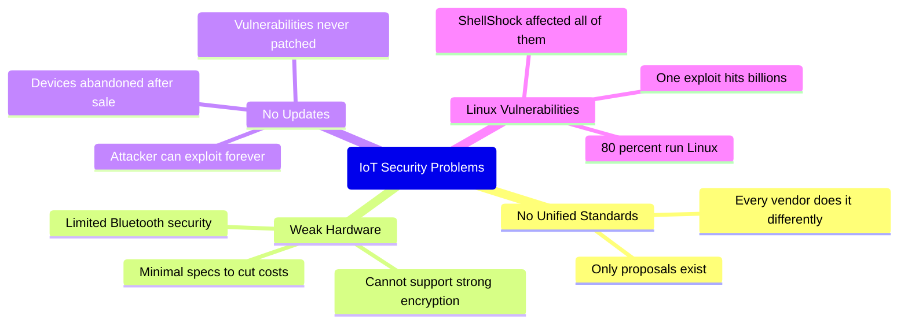

> [!IMPORTANT]
> في ثغرة اسمها **ShellShock** أثرت على الـ Bash Shell في الـ Linux. المشكلة إن **80% من الـ 75 Billion IoT Device بتشغل Linux** — يعني كلهم كانوا Vulnerable لهجوم واحد.

#### ليه الشركات مش بتصلح المشكلة؟

الأولوية عند الشركات هي **البيع بأعلى ربح** — مش الأمان. ومحدش بيجبرهم على معايير أمنية محددة. يعني:

- بيستخدموا أضعف Hardware بتكلفة أقل
- مش بيخططوا لأي Future Updates
- الـ Device لما بيتباع، الشركة خلصت مسؤوليتها

> [!TIP]
> كـ Defender، لازم تعامل أي IoT Device على الشبكة كـ **Untrusted Device**. ضيفها على Network منفصلة (IoT VLAN) وقيّد وصولها للـ Network الأساسية.

---

## Social Engineering & Deception Attacks

### Social Engineering

#### ما هو الـ Social Engineering؟

الـ **Social Engineering** هو استغلال الطبيعة البشرية بدل الثغرات التقنية. الـ Attacker بيقنع الضحية إنها هي نفسها تسلمه المعلومات أو الوصول.

> [!IMPORTANT]
> ده أخطر نوع من الـ Attacks. لأن لو نجح، كل الـ Security Devices اللي اتصرف فيها ملايين هتبقى بلا فايدة — الضحية بنفسها سلمت الـ Attacker كل معلومة عشان يدخل النظام بصورة شرعية.

#### ليه بنقع فيه؟

الـ Attackers بيستغلوا الطبيعة البشرية:
- الثقة والمساعدة
- الخوف والضغط
- الفضول
- الطمع

#### إزاي تتحمى؟

مفيش Technology تحميك من الـ Social Engineering. الحل الوحيد هو:

> [!TIP]
> **Training + Awareness**. لازم تدرب موظفيك بشكل مستمر وترفع الـ Security Awareness. Simulation Phishing Attacks بتساعد جداً عشان الناس تاخد بالها من الـ Tricks دي.

---

### Phishing & Spear Phishing

#### الفرق بين Phishing و Spear Phishing

| المعيار | Phishing | Spear Phishing |
|---|---|---|
| الهدف | الجميع (Broadcast) | شخص محدد أو مؤسسة |
| مستوى التخصيص | منخفض | عالي جداً |
| مستوى البحث | لا يوجد | بحث مكثف عن الهدف |
| معدل النجاح | أقل | أعلى بكتير |
| الخطورة | متوسطة | عالية جداً |

#### طرق الـ Phishing Attack

**1. Fake Login Page**
صفحة بتتظاهر إنها موقع حقيقي (بنك، Gmail، Facebook) عشان تسرق الـ Username والـ Password.

**2. Malicious Link**
لينك لما تضغط عليه بينزل Malware على جهازك.

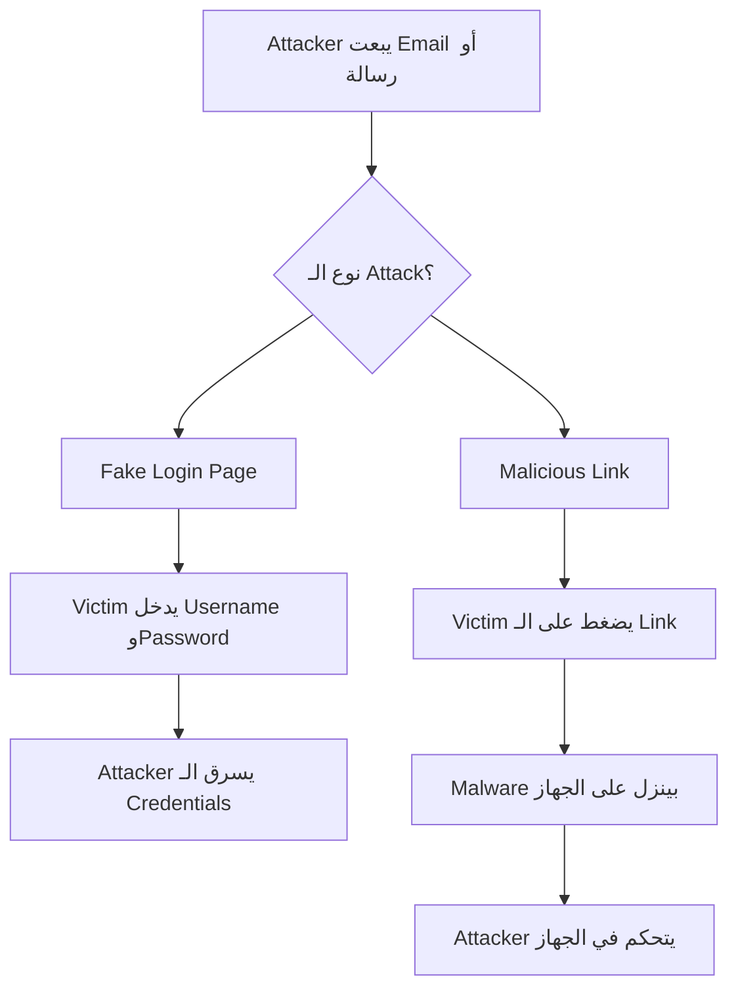

> [!WARNING]
> في Tools مجانية على الإنترنت بتعمل Phishing Pages جاهزة في دقائق. الـ Attacker مش محتاج خبرة كبيرة عشان ينفذ الـ Attack.

---

### Watering Hole Attack

#### ما هي الـ Watering Hole Attack؟

اسمها مأخوذ من طريقة الصيد في الطبيعة — الأسد مش بيجري ورا الفريسة، هو بيستنى عند حفرة الماء اللي الفريسة هتيجي ليها حتماً.

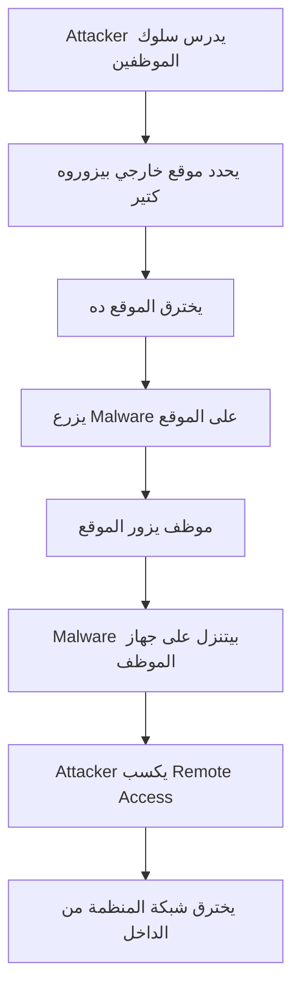

> [!NOTE]
> الـ Attack دي صعبة الاكتشاف لأن الموظف بيزور موقع شرعي معروف وموثوق — الموقع نفسه اتاخد. كـ SOC Analyst، لازم تراقب الـ Web Requests وتاخد بالك من أي Malicious Downloads حتى من مواقع موثوقة.

---

## Malware & Threats

### Keyloggers

الـ **Keylogger** هو Tool بيسجل كل ضغطة كيبورد الـ User يعملها.

#### أنواعه

| النوع | الوصف |
|---|---|
| **Hardware Keylogger** | Device صغير بيتوصل بين الكيبورد والكمبيوتر |
| **Software Keylogger** | برنامج بيتثبت على الجهاز ويسجل كل الضغطات |

#### الاستخدامات

- **ضارة:** سرقة Usernames والـ Passwords والبيانات الحساسة
- **شرعية:** المنظمات ممكن تستخدمه لمراقبة نشاط الموظفين

---

### Types of Malware

#### نمو الـ Malware عبر السنين

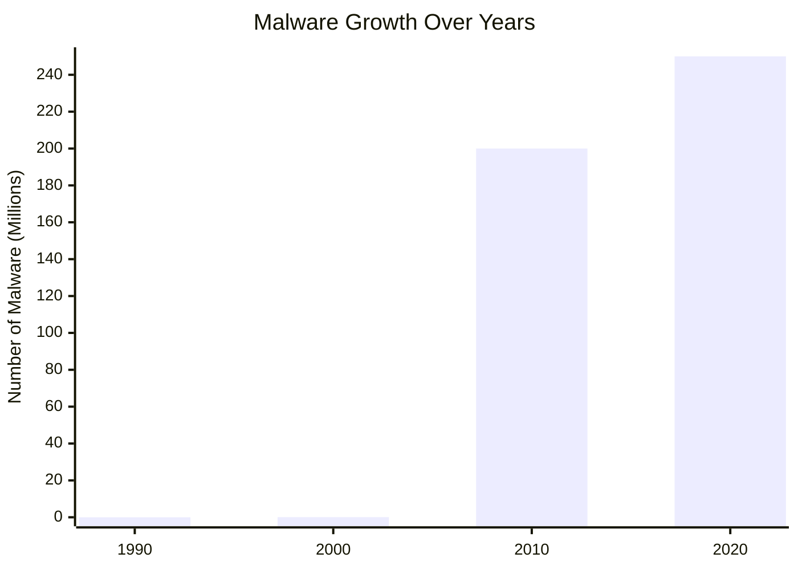

#### طرق التوصيل

الـ **Email** هو أكثر طريقة شائعة لتوصيل الـ Malware. بعدها:
- الـ Malicious Domains/Websites
- الـ Removable Media
- الـ Vulnerable Software

#### أنواع الـ Malware بالتفصيل

---

##### Virus

**الـ Virus** هو Malware بيلصق نفسه بـ Files شرعية وبيتنشر لما الـ File المصاب يتفتح.

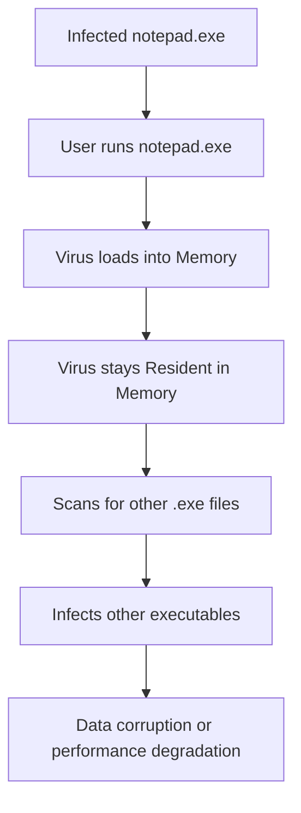

**الخصائص:**
- محتاج User Action عشان يتنشر (فتح File أو تشغيل برنامج)
- بيفضل في الـ Memory حتى بعد إغلاق الـ File المصاب
- بيسبب Data Corruption وبطء في الأداء

---

##### Worm

**الـ Worm** بيتنشر تلقائياً على الشبكات **من غير أي تدخل من المستخدم**.

**الفرق الأساسي عن الـ Virus:**
- الـ Virus بيحتاج File عشان يلصق بيه
- الـ Worm هو **Executable مستقل** بيتنشر بنفسه

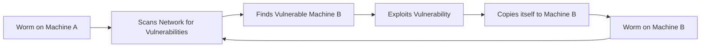

**الخصائص:**
- بياكل الـ Bandwidth وممكن يـ Crash Systems
- بيتنشر بسرعة كبيرة جداً
- مش محتاج User Interaction

---

##### Trojan

**الـ Trojan** هو Malware بيتظاهر إنه Software شرعي (لعبة، Installer، Attachment).

**الخصائص:**
- محتاج User يثبته (Requires User Interaction)
- بيعمل كـ Backdoor أو Downloader أو Spying Tool
- معظم الـ Modern Attacks بتستخدم Trojans عشان تكسب **Initial Access**

---

##### Ransomware

**الـ Ransomware** بيشفر ملفاتك ويطلب فدية عشان يفكها.

**الخصائص:**
- بيستخدم **Strong Encryption** مش ممكن يتكسر بدون الـ Key
- غالباً بييجي عن طريق Phishing Emails أو RDP Compromise
- ممكن يوقف شركات كاملة

> [!TIP]
> أأمن حل ضد الـ Ransomware هو **عمل Backup دوري** لملفاتك على Storage منفصل ومنقطع عن الشبكة (Offline Backup).

---

##### Spyware

**الـ Spyware** مصمم لمراقبة نشاط الـ User سراً.

**أنواعه:**
- Keyloggers (تسجيل ضغطات الكيبورد)
- Screen Recording
- Browser Tracking
- Credential Stealers

> [!WARNING]
> الـ Antivirus العادي غالباً مش بيكتشف الـ Spyware بشكل كافي. الـ Tools المتخصصة زي **Spybot** و**Anti-Adware** Tools أكتر فعالية ضده.

---

##### Adware

**الـ Adware** بيعرض إعلانات مزعجة (Popups, Redirects).

**الخصائص:**
- غالباً بييجي مع Free Applications
- مزعج بس أقل تدميراً من باقي الـ Malware

---

##### Rootkit

**الـ Rootkit** هو Malware بيخبي نفسه والـ Malwares التانية على الـ System.

**الخصائص:**
- بيشتغل على مستويات منخفضة جداً: **Kernel** أو **Boot Sector**
- بيوفر Persistent وغير قابل للاكتشاف Access
- صعب جداً إزالته

> [!IMPORTANT]
> الـ Rootkit بيخبي نفسه من الـ Operating System نفسه. يعني حتى الـ Antivirus ممكن ميشوفوش لأنه بيشتغل على Level أعمق. الـ Removal غالباً بيحتاج Boot من External Media.

---

##### Backdoor

**الـ Backdoor** هو طريقة مخفية للوصول للـ System عن بعد بدون Authentication.

**الخصائص:**
- غالباً بيتثبت عن طريق Trojans
- بيخلي الـ Attacker يشغل Commands ويسرق Data وينشر المزيد من الـ Malware

---

##### Fileless Malware

**الـ Fileless Malware** مش بيعتمد على Files — بدلاً من كده بيستخدم الـ Memory وأدوات شرعية زي **PowerShell**.

**الخصائص:**
- صعب جداً الاكتشاف بالـ Antivirus التقليدي
- بيسيب أثر ضئيل جداً على الـ Disk
- غالباً جزء من **APT (Advanced Persistent Threat) Attacks**

---

##### Botnet

**الـ Botnet** هو مجموعة Devices متأثرة بـ Malware تحت سيطرة Attacker واحد (الـ Botmaster).

**الاستخدامات:**
- **DDoS Attacks**
- إرسال **Spam Emails**
- نشر **Ransomware**
- تنفيذ **SYN Flood Attacks**

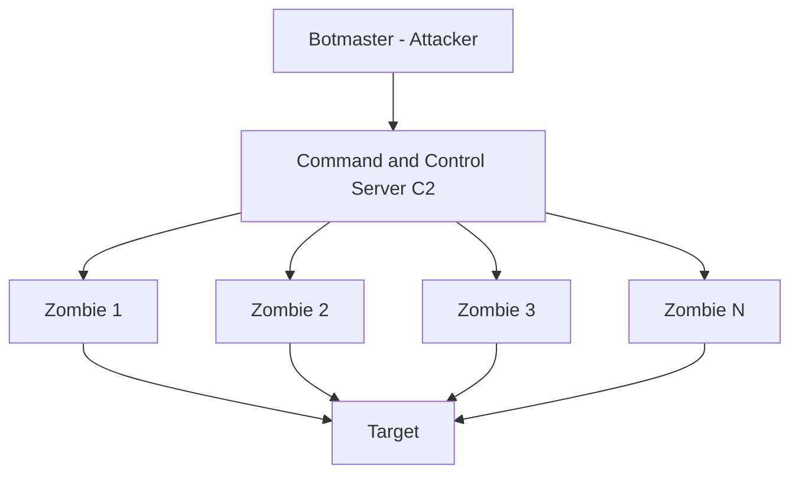

#### مقارنة شاملة بين أنواع الـ Malware

| النوع | التنشر | يحتاج User | الهدف الأساسي | صعوبة الاكتشاف |
|---|---|---|---|---|
| Virus | عبر ملفات | نعم | إتلاف البيانات | متوسطة |
| Worm | ذاتي عبر الشبكة | لا | الانتشار السريع | متوسطة |
| Trojan | المستخدم يثبته | نعم | Initial Access | متوسطة |
| Ransomware | Phishing / RDP | غالباً | الفدية المالية | متوسطة |
| Spyware | مخفي مع Apps | غالباً | سرقة المعلومات | عالية |
| Adware | مع Free Apps | نعم | الإزعاج / الإعلانات | منخفضة |
| Rootkit | عبر Exploits | لا | إخفاء نفسه | عالية جداً |
| Backdoor | عبر Trojans | لا | Remote Access | عالية |
| Fileless | في الذاكرة | لا | APT Attacks | عالية جداً |
| Botnet | Malware | لا | DDoS / Spam | متوسطة |

---

## Defense & Detection

### Antivirus Solutions

#### النوع الأول: Signature-Based Detection

الـ **Signature-Based Antivirus** بيعمل كده:

1. يحسب الـ **Hash** (SHA-256، MD5) للـ File
2. يقارنه بقاعدة بيانات من الـ Hashes المعروفة للـ Malware
3. كمان بيبحث عن **Unique Patterns** و**Strings** مميزة في الكود

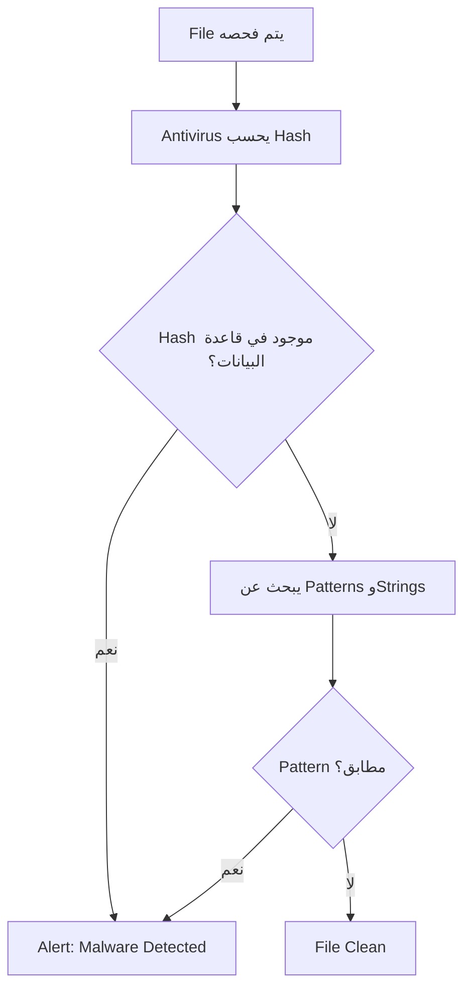

> [!WARNING]
> الـ Signature-Based Antivirus عنده عيب كبير: **Zero-Day Malware** — أي Malware جديد لم يضاف بعد لقاعدة البيانات — هيعدي من غير اكتشاف. الـ Antivirus updates كل بضع دقائق، بس الـ Attackers دايماً بيعدلوا على الـ Malware عشان يتجنبوا الـ Signature.

#### النوع الثاني: Modern Behavioral Detection

المنظمات الناضجة مش بتعتمد على الـ Signature-Based بس. الـ **Modern Anti-Malware** بيجمع:

| الطريقة | الوصف |
|---|---|
| **Signature-Based** | مقارنة الـ Hashes والـ Patterns |
| **Machine Learning** | نماذج تعلم آلي لاكتشاف السلوك الغريب |
| **Behavioral Analysis** | مراقبة نشاط البرنامج في الـ Runtime |

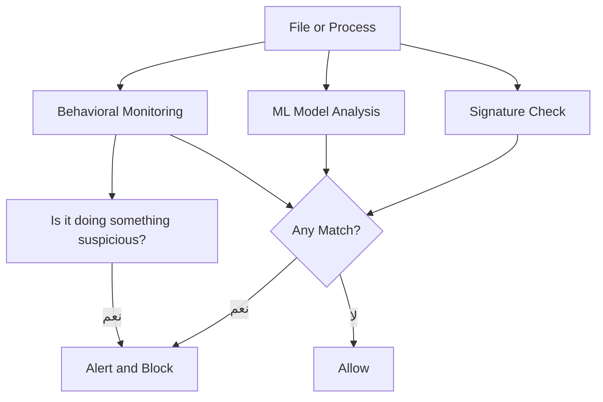

> [!IMPORTANT]
> الـ Behavioral Analysis هو الأهم دلوقتي. الـ Antivirus مش بس بيقارن Hashes، هو كمان بيراقب **إيه اللي البرنامج بيعمله**. لو برنامج بدأ يعمل Encrypt لملفات بدون إذن — هيتوقف حتى لو مش في قاعدة البيانات.

---

## Summary

### ملخص الـ Lectures 9 و 10

---

**VPN & Secure Tunneling:**
- الـ VPN بيوفر Encrypted Tunnel فوق الـ Public Internet باستخدام IPSec على الـ Layer 3
- بيحل مشكلة الـ Leased Lines الغالية والبطيئة
- حتى على الـ Wireless، الـ Data بتتفك تشفيرها عند الـ Access Point — الحل هو VPN End-to-End

---

**Wireless Security:**
- WEP وWPA Broken بسبب ضعف الـ Randomness — WPA2/WPA3 هو الصح
- الـ MAC Addresses والـ Management Frames مش ممكن يتشفروا — خطر أساسي
- الـ Rogue Access Point هو MITM Attack بسيط وفعال جداً

---

**IoT Security:**
- 75 Billion Device بدون معايير أمنية موحدة
- 80% بيشغلوا Linux — ثغرة واحدة زي ShellShock تأثر على الكل
- الشركات مش بتعمل Updates لأن مفيش قوانين تلزمهم

---

**Social Engineering:**
- أخطر نوع هجوم — بيتجاوز كل التقنية
- Phishing للكل، Spear Phishing لهدف محدد
- Watering Hole: اخترق موقع بيزوره الموظفين وانتظرهم
- الحل الوحيد: Training وAwareness

---

**Malware:**
- 10 أنواع رئيسية من الـ Malware لكل منها طريقة عمل وهدف مختلف
- Email هو أكتر طريقة شائعة لتوصيل الـ Malware
- Fileless Malware والـ Rootkits هم الأصعب في الاكتشاف

---

**Defense:**
- Signature-Based لوحده مش كافي — بيفوته الـ Zero-Day
- الحل الحديث: Signature + Machine Learning + Behavioral Analysis
- دايماً راقب الـ Behavior مش بس الـ Hash
