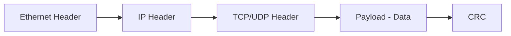
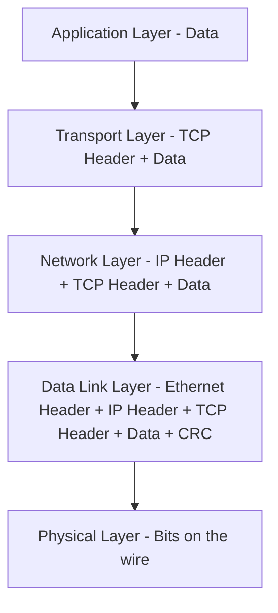

> **الهدف من الـ Section ده:**  
> فهم إزاي الداتا بتتنقل في شكل Packets، وتركيبها، وإزاي بتتلف وتتفتح (Encapsulation / De-encapsulation) أثناء انتقالها بين الأجهزة.
---

## Table of Contents

  - [Packets and Packet Structure](#packets-and-packet-structure)
  - [Encapsulation and De-encapsulation](#encapsulation-and-de-encapsulation)
  - [Summary](#summary)

--- 

## Data Transmission — Packets and Encapsulation

### Packets and Packet Structure

#### ما هو الـ Packet؟

الداتا على الشبكة مش بتتبعت كـ Block واحد كبير — هي بتتقسم لـ **Packets** صغيرة. تخيّل إنك بتبعت رسالة طويلة بالبريد، بدل ما تبعتها في ظرف واحد كبير، بتقسّمها على أظرف أصغر وكل ظرف فيه جزء من الرسالة.

كل **Packet** عنده جزئين أساسيين:

| Part | Description |
|---|---|
| **Header** | معلومات عن الـ Packet: جاي منين، رايح فين، وإيه نوع الداتا فيه |
| **Payload (Data)** | الداتا الحقيقية اللي الـ Packet بيحملها |

> [!NOTE]
> في معظم الحالات، لما بتبعت إيميل أو ملف أو صفحة ويب، الداتا دي مش بتسافر في Packet واحد — ممكن تحتاج آلاف أو حتى ملايين الـ Packets.

#### Packet Structure على الـ Ethernet

- **Ethernet Header:** أول حاجة في الـ Packet، بيحتوي على MAC Addresses
- **IP Header:** بيحتوي على IP Addresses والمعلومات الخاصة بالـ Routing
- **TCP/UDP Header:** بيحتوي على Port Numbers ومعلومات الـ Transport Layer
- **Payload:** الداتا الفعلية
- **CRC (Cyclical Redundancy Check):** رقم ناتج عن معادلة رياضية. المستقبل بيعمل نفس الحسبة — لو النتيجة اتطابقت، الـ Packet وصل سليم ومفيش حد عبث فيه

> [!TIP]
> الـ CRC هو أول مستوى من مستويات الـ Integrity Checking في الشبكة. كـ Security Analyst لازم تعرف الفرق بين الـ Packet اللي وصل سليم والـ Packet اللي اتعبث فيه.

---

### Encapsulation and De-encapsulation

#### ما هو الـ Encapsulation؟

الـ **Encapsulation** هو عملية لف الداتا بالمعلومات البروتوكولية الضرورية قبل ما تتبعت على الشبكة. تخيّلها زي ما بتحط رسالة في ظرف، الظرف ده في ظرف تاني أكبر، والظرف التاني في كرتونة — كل غلاف بيضيف معلومات أكتر.

في نموذج الـ OSI، كل Layer بتضيف **Header** خاص بيها (وأحياناً **Trailer**) على الداتا الجاية من اللاير اللي فوقيها.

#### عملية الـ Encapsulation خطوة بخطوة:

1. الداتا بتبدأ عند الـ **Application Layer** (مثلاً إرسال إيميل)
2. بتنزل على الـ Stack، وكل Layer بتضيف Header خاص بيها
3. عند المستقبل، الداتا بتصعد على الـ Stack مرة تانية (**De-encapsulation**)
4. كل Layer بتشيل الـ Header الخاص بيها وتعالج المعلومات

> [!WARNING]
> **IP Spoofing:** لما الـ Computer بيتبعت Packet ورد عليه، بيستخدم الـ Source IP الموجودة في الـ Header. الـ Attacker ممكن يحط IP Address كداب كـ Source — وجهازك هيرد على الـ IP الكداب ده بدون ما يعرف إن المصدر الحقيقي كان تاني. ده اللي بيسمى **IP Spoofing**.

---
## Summary

- الداتا بتتنقل في Packets — كل Packet عنده Header وPayload
- الـ Encapsulation = كل Layer بتضيف Header وانت نازل الـ Stack
- الـ De-encapsulation = كل Layer بتشيل الـ Header وانت صاعد
