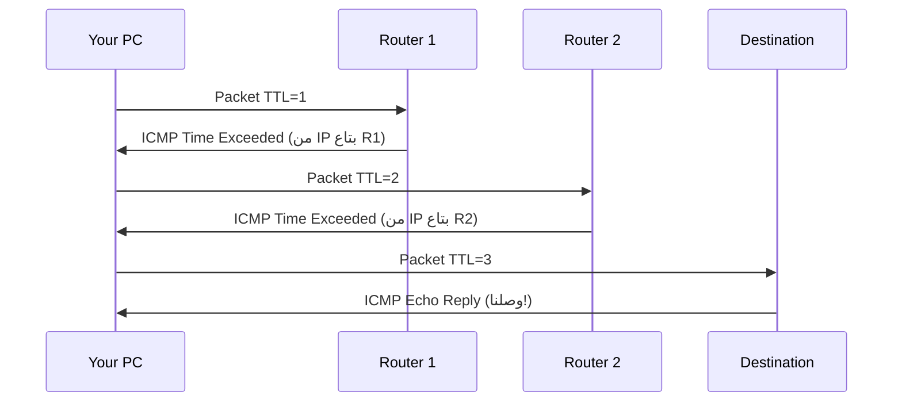

> **الهدف من الـ Section ده:**  
> شرح أدوات التشخيص الأساسية زي ping وtraceroute وloopback اللي بتساعدك تفهم حالة الشبكة، تختبر الاتصال، وتحدد مكان المشكلة بسرعة.

---

## Table of Contents
  - [Ping](#ping)
  - [Traceroute / Tracert](#traceroute--tracert)
  - [Loopback Address](#loopback-address)
  - [Summary](#summary)

---

## Diagnostic Tools

### Ping

الـ **Ping** هو أبسط Tool لاختبار الاتصال بين جهازين أو للتأكد إن جهاز معين متاح.

**بيشتغل إزاي؟**
1. بيعمل **ICMP Echo Request** Packet ويبعته للـ Target
2. الـ Target بيرد بـ **ICMP Echo Reply**
3. الـ Tool بيحسب الـ Round-Trip Time (RTT)

```bash
# مثال
ping google.com
ping 8.8.8.8
```

**الاستخدامات:**
- اختبار إن الجهاز متاح
- قياس الـ Latency (التأخير)
- Troubleshooting مشاكل الشبكة

---

### Traceroute / Tracert

الـ **Traceroute** (Linux/Mac) أو **Tracert** (Windows) بيساعدك تكتشف **المسار الفعلي** اللي الـ Packets بتأخده بين جهازين.

**إزاي بيشتغل؟**

بيعبث بالـ **TTL Field** في الـ IP Header:



1. بيبعت Packet بـ TTL=1 → الأول Router يحذفه ويبعت ICMP Time Exceeded مع IP بتاعه
2. بيبعت Packet بـ TTL=2 → التاني Router يحذفه ويبعت ICMP Time Exceeded مع IP بتاعه
3. وهكذا لحد ما يوصل للـ Destination

```bash
# Windows
tracert google.com

# Linux / Mac
traceroute google.com
```

> [!TIP]
> الـ Traceroute مفيد جداً كـ Security Analyst عشان تشوف لو في Hop غريب في المسار أو لو الـ Traffic بيعدي على شبكة مش المفروض تعدي عليها.

---

### Loopback Address

الـ **Loopback Address** هو `127.0.0.1` — أي Packet بتبعته لده بيتبعت لنفس جهازك.

**الاستخدامات:**
- الـ Services الداخلية في جهازك بتتكلم مع بعض باستخدامه
- Testing التطبيقات محلياً من غير ما تحتاج شبكة

```bash
ping 127.0.0.1
# لو رجعت رد = الـ Network Stack على جهازك شغّال صح
```

> [!NOTE]
> الـ Loopback Address هو **أكتر IP Address استخداماً في العالم** لأن أي كومبيوتر شغّال بيستخدمه داخلياً.

---

## Summary


**Category 7 — Diagnostic Tools:**
- `ping` لاختبار الاتصال
- `traceroute` / `tracert` لمعرفة مسار الـ Packets
- `127.0.0.1` هو الـ Loopback Address لجهازك

