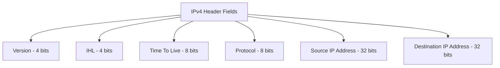
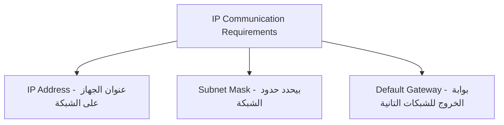
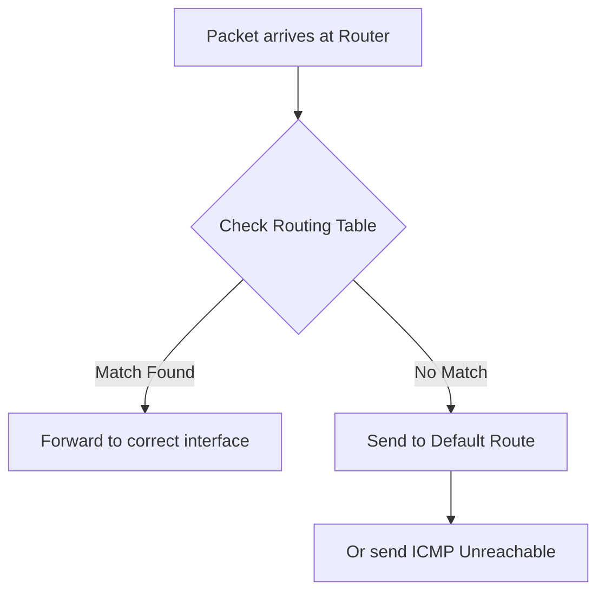
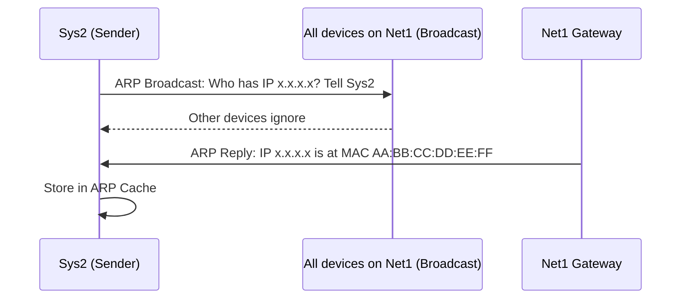
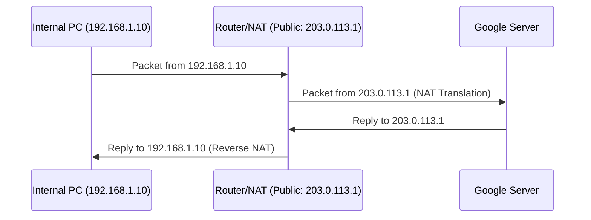

> **الهدف من الـ Section ده:**  
> فهم أساسيات الـ IP Addressing والـ Routing، وإزاي الـ Packets بتتوجه داخل الشبكة، ودور بروتوكولات زي ARP وNAT في توصيل الأجهزة ببعض.

---

## Table of Contents

- [IP Addressing and Routing](#ip-addressing-and-routing)
  - [IPv4 Header](#9-ipv4-header)
  - [IP Protocol Requirements](#10-ip-protocol-requirements)
  - [Routing and Routing Table](#11-routing-and-routing-table)
  - [ARP Protocol](#12-arp-protocol)
  - [Private and Public IPs — NAT](#13-private-and-public-ips--nat)
  - [Summary](#summary)

---

## IP Addressing and Routing

### 9. IPv4 Header

الـ **IPv4 Header** هو الـ Header الموجود في الـ Network Layer (Layer 3). كل صف فيه بيمثل **32 Bit (4 Bytes)**، والحد الأدنى لحجم الـ Header هو **20 Bytes**.



#### أهم Fields في الـ IPv4 Header:

**Version**
بيحدد إصدار الـ IP المستخدم.
- القيم المسموح بيها بس: `4` لـ IPv4 أو `6` لـ IPv6
- أي قيمة تانية = **Malformed Packet** ولازم يتشال بالـ Router

**Time-To-Live (TTL)**
الـ TTL بيحدد **الحد الأقصى من الـ Hops (Routers)** اللي الـ Packet ممكن يعدي عليها.

- كل ما الـ Packet يعدي على Router، الـ TTL بينزل بـ 1
- لو وصل لـ 0، الـ Packet بيتحذف
- الحد الأقصى للـ TTL هو **255**
- الهدف: منع الـ Packets من التهيّم على الشبكة للأبد

> [!TIP]
> الـ TTL مفيد جداً في الـ Network Forensics — ممكن تعرف من قيمة الـ TTL تقريباً جاي من نظام تشغيل إيه (Windows بيبدأ بـ 128، Linux بيبدأ بـ 64).

**Protocol**
بيحدد **البروتوكول اللي موجود في الـ Payload** وهيتبعتله في الـ Transport Layer.

| Protocol Number | Protocol |
|---|---|
| 6 | TCP |
| 17 | UDP |
| 1 | ICMP |

**Source & Destination IP Address**
- **Source Address:** عنوان الجهاز اللي بعت الـ Packet — بنقول "المفروض" لأن ممكن يتعمل **IP Spoofing**
- **Destination Address:** عنوان الجهاز اللي الـ Packet رايحله

> [!WARNING]
> لما بتشوف الـ Source IP في الـ Packet، متثقش فيه 100%. الـ Attacker ممكن يحط أي IP Address كـ Source. ده الأساس في هجمة الـ IP Spoofing.

---

### 10. IP Protocol Requirements

عشان الكومبيوتر يقدر يتواصل على الشبكة، لازم يكون عنده 3 حاجات أساسية:



| Requirement | Purpose |
|---|---|
| **IP Address** | عنوان الجهاز على الشبكة |
| **Subnet Mask** | بيحدد إيه الجزء من الـ IP اللي بيمثل الشبكة وإيه اللي بيمثل الجهاز |
| **Default Gateway** | الـ Router اللي الجهاز بيبعت عليه كل الـ Traffic الخارج من الشبكة |

> [!IMPORTANT]
> الـ PC نفسه عنده **Routing Table** فيها على الأقل Entry واحدة وهي الـ **Default Gateway**. أي Packet رايح لشبكة تانية بيتبعت للـ Default Gateway الأول.

---

### 11. Routing and Routing Table

الـ **Routing Table** هي جدول موجود في كل Router (وحتى في الـ PC الخاص بك) بيوضح إزاي الـ Packets بتتوجه لوجهتها.

**إزاي الـ Routing بيشتغل:**
1. الـ Packet وصل للـ Router
2. الـ Router بيبص على الـ Destination IP
3. بيفتش في الـ Routing Table على أنسب طريق
4. بيبعت الـ Packet على الـ Interface المناسب



---

### 12. ARP Protocol

#### ما هو الـ ARP؟

الـ **ARP (Address Resolution Protocol)** هو البروتوكول اللي بيربط الـ **IP Address بالـ MAC Address** داخل الـ LAN. هو الحلقة الوصل بين الـ Layer 2 والـ Layer 3.

**ليه محتاجينه؟**
الداتا بتتوجه باستخدام الـ IP Address، لكن فعلياً على الشبكة المحلية بتتنقل باستخدام الـ **MAC Address**.

#### إزاي الـ ARP بيشتغل؟



1. الجهاز بيبعت **ARP Broadcast** على الشبكة: "مين عنده الـ IP ده؟ قولي الـ MAC بتاعه"
2. كل الأجهزة بتشوف الـ Broadcast، بس اللي IP مختلف بيتجاهله
3. الجهاز اللي عنده الـ IP بيرد: "أنا! وده الـ MAC Address بتاعي"
4. الجهاز الأول بيحط المعلومات دي في الـ **ARP Cache** في الـ RAM

#### ARP Cache

الـ **ARP Cache** (أو ARP Table) هو جدول مؤقت بيتخزن في الـ RAM بيخلي الجهاز يتذكر الإجابات ومش يسأل كل شوية.

```bash
# عشان تشوف الـ ARP Cache على Windows:
arp -a
```

> [!TIP]
> الـ ARP Cache مفيد في الـ Incident Response — لو شفت MAC Address غريب معاه IP address مهم (زي الـ Gateway) ممكن يكون في هجوم ARP Spoofing/Poisoning.

---

### 13. Private and Public IPs — NAT

#### Private vs Public IP Addresses

| Type | Description | Example |
|---|---|---|
| **Public IP** | بتسافر على الإنترنت، فريدة عالمياً | 8.8.8.8 |
| **Private IP** | بتُستخدم داخل الشبكة المحلية فقط | 192.168.1.1 |

#### نطاقات الـ Private IP Addresses

| Class | Range | Number of Addresses |
|---|---|---|
| Class A | 10.0.0.0 – 10.255.255.255 | 16,777,216 |
| Class B | 172.16.0.0 – 172.31.255.255 | 1,048,576 |
| Class C | 192.168.0.0 – 192.168.255.255 | 65,536 |

> [!IMPORTANT]
> الـ Routers على الإنترنت **مش بتوجّه** الـ Packets اللي عنوانها Private IP. الـ Private IPs موجودة بس على الـ Internal Networks.

#### NAT — Network Address Translation

**ليه بنستخدم NAT؟**
الـ IPv4 عنده حوالي **3.4 مليار** عنوان IP، لكن في أكتر من 4 مليار مستخدم للإنترنت — يعني في مشكلة نقص في الـ IP Addresses. الحل هو الـ **NAT**.

**إزاي الـ NAT بيشتغل؟**



- الـ Traffic الخارج من الشبكة الداخلية، الـ Router بيغيّر الـ Source IP من Private لـ Public IP بتاعته
- الـ Replies الراجعة بترجع للـ Router، وهو بيعرف يرجّعها للجهاز الداخلي الصح

#### PAT — Port Address Translation

الـ **PAT** هو النوع الأكتر استخداماً من الـ NAT، وبيخلي أجهزة كتير داخل الشبكة تشارك نفس الـ Public IP باستخدام **Port Numbers** مختلفة.

> [!NOTE]
> الـ PAT بيشتغل بس للـ Traffic الخارج من الشبكة الداخلية للإنترنت — مش بيشتغل للـ Incoming Traffic من الإنترنت.

---
## Summary

- الـ IPv4 Header بيحتوي على TTL، Protocol، Source/Destination IP
- كل جهاز محتاج IP + Subnet Mask + Gateway
- الـ ARP بيربط IP بـ MAC داخل الـ LAN
- الـ NAT بيحل مشكلة نقص الـ IP Addresses
