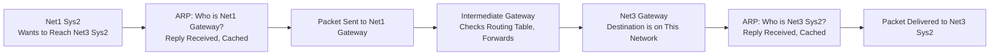
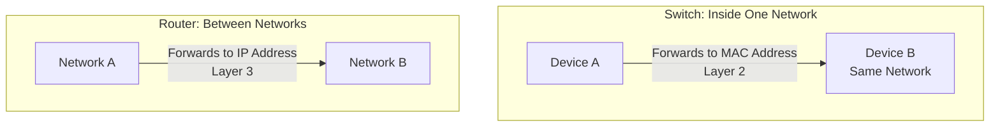

| Topic | Level | Reading Time | Prerequisites |
|---|---|---|---|
| Networking: LAN, WAN, Routers, Switches, and ARP | Beginner | ~28 min | Basic understanding of IP addresses and MAC addresses |

> **الهدف من الـ Section ده:**  
> هتفهم الفرق بين LAN وWAN، الفرق الجوهري بين الراوتر والسويتش، وهتتتبع رحلة حزمة بيانات حقيقية بالكامل عبر شبكات متعددة لحد ما توصل لوجهتها، وهتفهم بالتفصيل إزاي بروتوكول ARP بيخلي الحزمة دي تلاقي طريقها لجهاز مقابلتوش قبل كده.


## Learning Objectives

By the end of this section, you will be able to:

- Distinguish between **LAN (Local Area Network)** and **WAN (Wide Area Network)**, and explain the role of subnets.
- Compare a **Switch** and a **Router** in terms of what they forward to, what they connect, and which layer they operate at.
- Trace the complete journey of a single packet across multiple networks, hop by hop.
- Define **ARP (Address Resolution Protocol)** and explain how it maps an IP address to a MAC address.
- Read a real ARP request/reply exchange at the packet level.
- Explain why ARP has no built-in authentication, and how to inspect your own ARP cache.

## Table of Contents

- [LAN and WAN](#lan-and-wan)
- [Routers vs. Switches](#routers-vs-switches)
- [The Journey of One Packet](#the-journey-of-one-packet)
- [ARP: The Address Resolution Protocol](#arp-the-address-resolution-protocol)
- [Hop 1: Getting Out of Net1](#hop-1-getting-out-of-net1)
- [The Middle Hops: The Same Question, Again](#the-middle-hops-the-same-question-again)
- [Final Hop: Arriving at Net3](#final-hop-arriving-at-net3)
- [What ARP Actually Looks Like on the Wire](#what-arp-actually-looks-like-on-the-wire)
- [Exercise: Look Inside Your Own ARP Cache](#exercise-look-inside-your-own-arp-cache)
- [Packet Journey Diagram](#packet-journey-diagram)
- [Career Connection](#career-connection)
- [Key Terms Glossary](#key-terms-glossary)
- [Summary](#summary)


## LAN and WAN

**LAN — Local Area Network**

موقع واحد: مكتب، دور، مبنى.

الـ LAN ممكن يتبني من عدة شبكات أصغر متوصلة مع بعض، وده بيخليه أكفأ وأسهل بكتير في الإدارة. القطع الأصغر دي بتُسمى **subnets**، عدة subnets بتتصل مع بعض عشان تكوّن الـ LAN.

> [!NOTE]
> تقريبًا كل حاجة في الكورس ده بتحصل جوه LAN.

**WAN — Wide Area Network**

مواقع كتير: مدينة، دولة، قارة.

الـ WAN بيغطي منطقة جغرافية واسعة. الشركة عادةً بتستخدمه عشان توصل الـ LANs بتاعتها في مواقع مختلفة، زي مكتب القاهرة بيوصل مكتب دبي، أو الاتنين بيوصلوا منطقة كلاود معينة.

> [!IMPORTANT]
> **الإنترنت هو أكبر WAN موجود.**
>
> الـ Subnets موجودة لسببين: الأداء (**performance**)، والاحتواء (**containment**).

## Routers vs. Switches

| المعيار | **Switch** | **Router** |
|---|---|---|
| **النطاق** | جوه شبكة واحدة | بين شبكات مختلفة |
| **بيوجّه لـ** | عنوان هاردوير (**MAC address**) | عنوان IP الوجهة |
| **بيوصل** | أجهزة الكمبيوتر، السيرفرات، والطابعات ببعض | السويتشات، وبالتالي شبكات كاملة ببعض |
| **بيشتغل على** | **Layer 2** — طبقة ربط البيانات (**data link layer**) | **Layer 3** — طبقة الشبكة (**network layer**) |
| **بيفهم** | عناوين MAC | عناوين IP |

> [!TIP]
> نفس السلك، لكن سؤالين مختلفين: "أي جهاز هنا؟" (السويتش) مقابل "أي شبكة بعد كده؟" (الراوتر).

## The Journey of One Packet

**السيناريو**: **Net1 Sys2** عايز يبعت بيانات لـ **Net3 Sys2**، جهاز على شبكة مختلفة تمامًا، بينه وبينه ثلاث بوابات (**gateways**).

بنية الشبكة:

- **Net1**: فيها Sys1، Sys2، Sys3، متصلين بسويتش، وبعده Net1 Gateway.
- **Intermediate**: gateway وسيط بين الشبكتين.
- **Net3**: فيها Net3 Gateway، متصل بسويتش، وبعده Sys1، Sys2، Sys3.

> [!IMPORTANT]
> الحزمة (**packet**) بتعرف عنوان IP الوجهة. **هي مش عارفة ولا عنوان MAC واحد على طول الطريق.**
>
> كل قفزة (**hop**) لازم تتحل (**resolved**) لوحدها، وده بالظبط اللي بروتوكول **ARP** بيعمله.

## ARP: The Address Resolution Protocol

**ARP** بيعمل إيه بالظبط: **"بيربط عنوان IP بعنوان MAC على الشبكة المحلية."**

**الرابط (The Link)**: بين Layer 3 وLayer 2

البيانات بتتوجّه لعنوان IP، لكنها فيزيائيًا بتتبعت لعنوان MAC. الـ ARP هو الترجمة بين العالمين دول.

**الطريقة (The Method)**: اسأل الكل، مرة واحدة

المرسل بيبث سؤال (**broadcasts a question**) لكل الشبكة المحلية. كل جهاز بيسمعه، لكن بس صاحب الـ IP ده هو اللي بيرد.

**الذاكرة (The Memory)**: الـ ARP Cache

الإجابة بتتخزن في الذاكرة لفترة زمنية معينة، بحيث السؤال معتحتاجش يتسأل تاني لكل حزمة.

> [!WARNING]
> **مفيش حاجة في ARP بتتحقق من الإجابة، أي جهاز يقدر يرد، وهيتم تصديقه.**

## Hop 1: Getting Out of Net1

الخطوات اللي بتحصل لما **Net1 Sys2** يبدأ رحلته:

1. **الوجهة موجودة على الشبكة دي؟** → لأ. يبقى استخدم Net1 Gateway.
2. **"مين اللي هو Net1 Gateway؟"** (بث لكل حد على Net1).
3. الـ gateway بيرد: "أنا Net1 Gateway، ده الـ MAC بتاعي."
4. اتفتكر الإجابة دي لفترة، خزّنها في الـ ARP cache.
5. ابعت الحزمة لعنوان MAC بتاع Net1 Gateway.

## The Middle Hops: The Same Question, Again

عند **كل gateway**، نفس السؤال بيتسأل: "أنا عارف فين الوجهة دي؟" لو لأ، وجّه للـ gateway اللي بعده، واعمل ARP لعنوان MAC بتاع القفزة الجاية.

**قرار التوجيه (The Routing Decision)**: كل gateway بيقرر يبعت الحزمة فين بناءً على إعداده، جدول التوجيه (**routing table**) بتاعه. لو مش عارف الوجهة، هو بيستخدم مسار افتراضي (**default route**).

> [!NOTE]
> **التكرار ده مش غلطة.**
>
> دي عملية متكررة جدًا، سؤال، إجابة، تفكّر، توجيه، بتحصل بسرعة قريبة من سرعة الضوء، عند كل قفزة على حدة.
>
> **الحزمة أبدًا ما بتاخدش المسار كامل، هي بس بتتعلم الخطوة الجاية.**

## Final Hop: Arriving at Net3

1. **أقدر أوصل Net3 Sys2 مباشرة؟** → أيوه، هو على الشبكة دي.
2. **"مين اللي هو Net3 Sys2؟"** (بث على Net3).
3. السيرفر بيرد: "أنا Net3 Sys2."
4. اتفتكر الإجابة لفترة.
5. ابعت الحزمة لـ Net3 Sys2. **تم التسليم.**

## What ARP Actually Looks Like on the Wire

المخطط التالي بيوضح شكل حزم ARP الحقيقية اللي بتتبادل، كمية بسيطة جدًا من البيانات:

**Address Resolution Protocol (Request)**

| الحقل | القيمة |
|---|---|
| Opcode | request (0x0001) |
| Sender MAC | 00:50:da:ca:0f:33 |
| Sender IP | 10.64.0.164 |
| Target MAC | ff:ff:ff:ff:ff:ff |
| Target IP | 10.64.0.1 |

**بمعنى**: "مين عنده 10.64.0.1؟ قول لـ 00:50:da:ca:0f:33." الـ Target MAC كله Fs، وده بالظبط السؤال اللي بيتسأل.

**Address Resolution Protocol (Reply)**

| الحقل | القيمة |
|---|---|
| Opcode | reply (0x0002) |
| Sender MAC | 00:80:3e:4b:3e:ce |
| Sender IP | 10.64.0.1 |
| Target MAC | 00:50:da:ca:0f:33 |
| Target IP | 10.64.0.164 |

**بمعنى**: "10.64.0.1 موجود عند 00:80:3e:4b:3e:ce." الإجابة دي بتروح مباشرة لـ ARP cache الجهاز اللي طلبها.

> [!WARNING]
> **حزمتين بس، من غير أي مصادقة (authentication) من أي نوع، ده كل البروتوكول.**

## Exercise: Look Inside Your Own ARP Cache

**المهمة**: دوّر على الإنترنت عن "how to see my ARP cache"، وبعدين شغّل الأمر على جهازك بنفسك.

```
> arp -a

Interface: 10.64.0.164 --- 0x5
  Internet Address    Physical Address    Type
  10.64.0.1           00-80-3e-4b-3e-ce   dynamic
  10.64.0.7           00-1c-42-9a-11-04   dynamic
  10.64.0.255         ff-ff-ff-ff-ff-ff   static
```

**بعد كده جاوب**:

- أي سجل ده الـ gateway بتاعك، وإزاي عرفت؟
- ليه بعض السجلات "dynamic" وواحد "static"؟

> [!TIP]
> فكّر في الفرق كده: السجلات الـ **dynamic** اتعلمت من ARP requests/replies حقيقية وبتنتهي صلاحيتها بعد فترة، بينما السجل الـ **static** (زي عنوان البث `ff-ff-ff-ff-ff-ff`) ثابت ومعرّف مسبقًا، مش محتاج ARP يتحل أصلًا.

## Packet Journey Diagram

المخطط التالي بيلخّص رحلة الحزمة الكاملة من Net1 Sys2 لحد Net3 Sys2، بما فيها عمليات الـ ARP اللي بتحصل عند كل قفزة:



والمخطط التالي بيوضح الفرق بين مسار السويتش (داخل شبكة واحدة) ومسار الراوتر (بين شبكات):



## Career Connection

فهم LAN، WAN، والـ ARP له تطبيقات مباشرة في مسارات مهنية متعددة:

- في مجال **SOC**، تحليل حركة مرور ARP غير الطبيعية أساسي لاكتشاف هجمات زي **ARP Poisoning** اللي درسناها بالتفصيل قبل كده.
- في مجال **Network Engineering**، فهم الفرق الدقيق بين دور الراوتر (Layer 3) والسويتش (Layer 2) أساس تصميم أي بنية شبكة.
- في مجال **Digital Forensics**، فحص الـ ARP cache على جهاز معين يقدر يكشف أجهزة تواصلت معه مؤخرًا، وده مفيد في التحقيقات.
- في مجال **Pentesting**، استغلال غياب المصادقة في ARP هو أساس تقنيات زي الـ Man-in-the-Middle داخل الشبكة المحلية.

## Key Terms Glossary

| Term | Definition |
|---|---|
| **LAN (Local Area Network)** | شبكة محلية تغطي موقعًا واحدًا، كمكتب أو مبنى. |
| **WAN (Wide Area Network)** | شبكة تغطي منطقة جغرافية واسعة، تربط بين مواقع متعددة. |
| **Subnet** | قطعة أصغر من الشبكة تُستخدم لتحسين الأداء والاحتواء. |
| **Switch** | جهاز يوجّه حركة المرور داخل شبكة واحدة بناءً على عنوان MAC. |
| **Router** | جهاز يوجّه حركة المرور بين شبكات مختلفة بناءً على عنوان IP. |
| **Gateway** | نقطة الخروج من شبكة معينة نحو شبكة أخرى. |
| **Routing Table** | جدول يستخدمه الراوتر لتحديد أين يوجّه حركة المرور. |
| **ARP (Address Resolution Protocol)** | بروتوكول يربط عنوان IP بعنوان MAC على الشبكة المحلية. |
| **ARP Cache** | ذاكرة مؤقتة تخزن إجابات ARP السابقة لتجنب تكرار السؤال. |

## Summary

- **LAN** يغطي موقعًا واحدًا وممكن يتكون من عدة **subnets**، بينما **WAN** يغطي مناطق جغرافية واسعة، والإنترنت هو أكبر WAN موجود.
- **Switch** بيوجّه لعنوان MAC داخل شبكة واحدة (Layer 2)، بينما **Router** بيوجّه لعنوان IP بين شبكات مختلفة (Layer 3).
- الحزمة بتعرف عنوان IP الوجهة النهائية بس، لكنها مش عارفة أي عنوان MAC على طول الطريق، كل قفزة لازم تتحل لوحدها.
- **ARP** بيربط عنوان IP بعنوان MAC عن طريق بث سؤال لكل الشبكة المحلية، والإجابة بتتخزن مؤقتًا في **ARP Cache**.
- في كل hop على طول رحلة الحزمة، نفس العملية بتتكرر: هل الوجهة هنا؟ لو لأ، وجّه للـ gateway التالي واعمل ARP لعنوانه.
- بروتوكول ARP **معندوش أي مصادقة مدمجة**، أي جهاز يقدر يرد على سؤال ARP وهيتم تصديقه، وده الأساس اللي هجمات زي ARP Poisoning بتستغله.
- تقدر تفحص الـ ARP cache بتاعك بنفسك باستخدام أمر `arp -a`.

