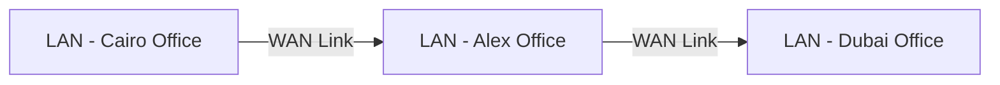
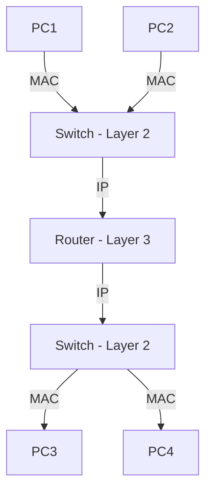
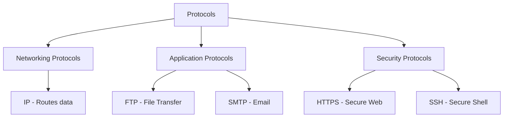

> **الهدف من الـ Section ده:**  
> تقديم أساسيات الشبكات بشكل بسيط، وفهم الفرق بين LAN وWAN، ودور الـ Switch والـ Router، وإزاي الـ Protocols بتنظم التواصل بين الأجهزة.

## Table of Contents


- [Network Fundamentals](#network-fundamentals)
  - [LAN and WAN](#1-lan-and-wan)
  - [Network Devices — Switches vs Routers](#2-network-devices--switches-vs-routers)
  - [Protocols](#3-protocols)
  - [Summary](#summary)
---
## Network Fundamentals

### 1. LAN and WAN

الشبكات بتتقسم بشكل أساسي على حسب **الحجم الجغرافي** اللي بتغطيه.

#### LAN — Local Area Network

الـ **LAN** هي شبكة محلية موجودة في مكان واحد زي مبنى أو طابق أو شركة. الـ LAN ممكن تتكون من شبكة صغيرة واحدة أو عدة شبكات أصغر متوصلة ببعض — وفي الحالة دي الشبكات الأصغر بتتسمى **Subnets**.

```
[Subnet A] ──┐
              ├──► [LAN Core Switch] ──► LAN
[Subnet B] ──┘
```

- الـ Subnets بتتوصل مع بعض عشان تكوّن الـ LAN الأكبر
- معظم النقاش في الكورس ده هيبقى عن الـ LAN

#### WAN — Wide Area Network

الـ **WAN** بتغطي مسافة جغرافية أكبر بكتير — ممكن تكون دولة كاملة أو أكثر. الشركات بتستخدم الـ WAN عشان توصّل بين LANs موجودة في أماكن جغرافية مختلفة.



| Feature | LAN | WAN |
|---|---|---|
| Coverage Area | Building / Campus | Country / Global |
| Speed | High (1Gbps+) | Lower / Variable |
| Ownership | Private (Company) | Leased / ISP |
| Example | Office Network | The Internet |

---

### 2. Network Devices — Switches vs Routers

في أي شبكة، في جهازين أساسيين بيتحكموا في الـ Traffic:

#### Switch

الـ **Switch** جهاز بيشتغل على **Layer 2 (Data Link)** من الـ OSI Model. شغلته الأساسية إنه يوصّل الأجهزة ببعض داخل نفس الشبكة.

- بيفهم الـ **MAC Addresses** ويوجّه الـ Traffic بناءً عليها
- بيوصّل PCs، Servers، وكل الأجهزة ببعض داخل الـ LAN

#### Router

الـ **Router** جهاز بيشتغل على **Layer 3 (Network)** من الـ OSI Model. شغلته إنه يوصّل **شبكات مختلفة** ببعض.

- بيفهم الـ **IP Addresses** ويوجّه الـ Traffic بناءً عليها
- بيوصّل Switches ببعض — وبالتالي بيوصّل Networks ببعض



> [!IMPORTANT]
> الـ Switch بيفهم MAC وبيشتغل جوّا الشبكة الواحدة، والـ Router بيفهم IP وبيوصّل بين شبكات مختلفة. الفرق ده مهم جداً في الـ Cybersecurity لأنه بيحدد إزاي الـ Traffic بيتحرك.

| Feature | Switch | Router |
|---|---|---|
| OSI Layer | Layer 2 (Data Link) | Layer 3 (Network) |
| Understands | MAC Addresses | IP Addresses |
| Connects | Devices within LAN | Different Networks |

---

### 3. Protocols

الـ **Protocol** هو مجموعة من القواعد اللي بتحدد إزاي الأجهزة بتتكلم مع بعض. من غير Protocols، الأجهزة مش هتفهم بعض أبداً.

في 3 أنواع رئيسية من الـ Protocols:

#### Networking Protocols
دي البروتوكولات اللي بتتحكم في إزاي الداتا بتتنقل عبر الشبكة.
- **مثال:** IP Protocol

#### Application Protocols
دي البروتوكولات اللي بتتحكم في إزاي الداتا بتتنقل بين التطبيقات.
- **مثال:** FTP (File Transfer Protocol) — بيحدد إزاي الملفات بتتنقل بين الكومبيوترات

#### Security Protocols
دي البروتوكولات اللي بتضمن إن الداتا بتتنقل بشكل آمن ومشفر.
- **مثال:** HTTPS, SSH



---
## Summary

- الـ LAN شبكة محلية، الـ WAN شبكة واسعة
- الـ Switch (Layer 2) بيفهم MAC، الـ Router (Layer 3) بيفهم IP
- الـ Protocols هي القواعد اللي الأجهزة بتتكلم بيها

